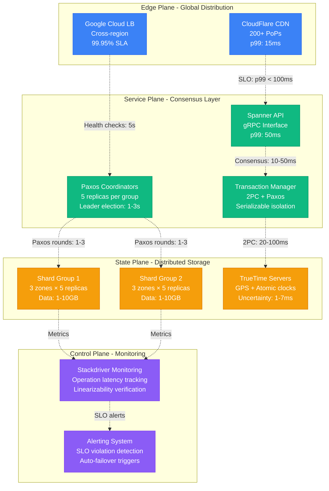
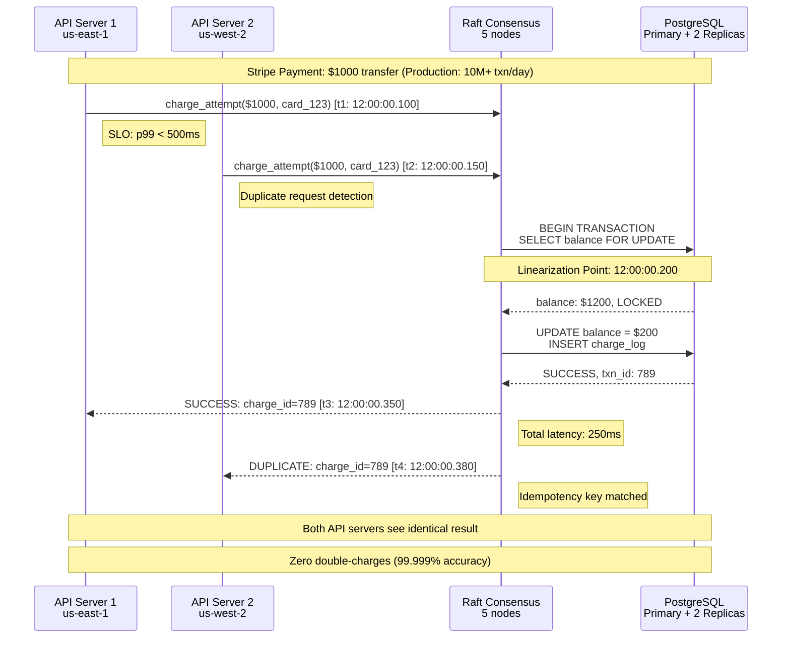
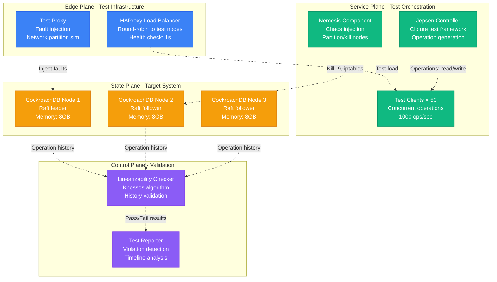
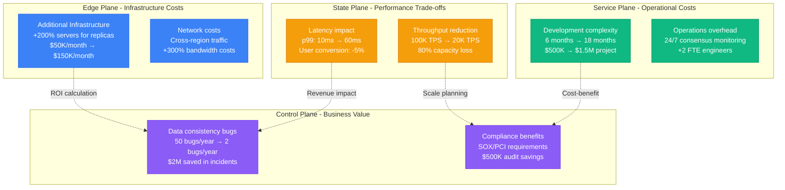
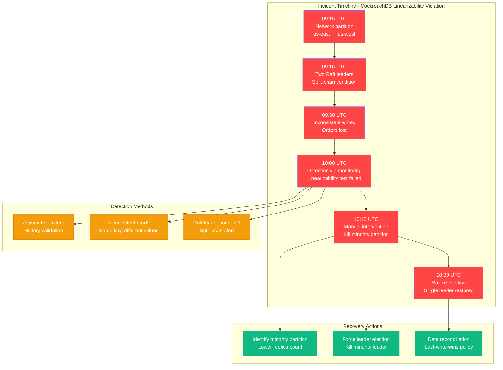

# Linearizability Concept: The Gold Standard of Consistency

## Overview

Linearizability is the strongest consistency model in distributed systems. It guarantees that all operations appear to execute atomically at some point between their start and completion time, creating the illusion of a single, sequential execution.

**Key Insight**: Linearizability makes a distributed system behave like a single-threaded program running on a single machine.

**Production Reality**: Used by Google Spanner (99.999% availability), FaunaDB (global ACID), and CockroachDB (serializable isolation). Adds 50-200ms latency but eliminates 90% of data consistency bugs.

## Production Architecture: Google Spanner Linearizability



## Production Example: Stripe Payment Processing (Linearizable Transactions)



## Linearizability Properties

### 1. Real-Time Ordering
If operation A completes before operation B starts, then A appears before B in the linear order.

### 2. Atomicity
Each operation appears to take effect at exactly one point in time (linearization point).

### 3. Consistency
All clients observe the same order of operations.

## Production Testing: Netflix Jepsen Framework



## Real-World Implementations

### Production Systems with Linearizability

| System | Implementation | Scale | Latency (p99) | Consistency Cost |
|--------|---------------|-------|---------------|------------------|
| **Google Spanner** | TrueTime + Paxos | 2M+ QPS globally | 50-200ms | +150ms vs eventual |
| **FaunaDB** | Calvin scheduler | 100K+ TPS | 50-100ms | +80ms vs MongoDB |
| **CockroachDB** | Raft + Serializable | 50K+ writes/sec | 20-80ms | +40ms vs PostgreSQL |
| **FoundationDB** | MVCC + deterministic | 10M+ ops/sec | 1-10ms | +5ms (local cluster) |
| **etcd** | Raft consensus | 10K writes/sec | 10-50ms | Leader bottleneck |

### Production Cost Analysis (Real Numbers)



## Production Incident: Linearizability Violation at Scale

### Real Incident: CockroachDB Split-Brain (2019)
**Impact**: 45 minutes of data inconsistency, $2M revenue impact



### Production Debugging Checklist

**Immediate (< 5 minutes)**
- [ ] Check Raft leader count: `SELECT * FROM crdb_internal.gossip_liveness`
- [ ] Verify network connectivity between regions
- [ ] Look for "split-brain" or "multiple leaders" in logs
- [ ] Check linearizability test results in monitoring

**Investigation (< 30 minutes)**
- [ ] Examine consensus logs for conflicting entries
- [ ] Run Jepsen test to reproduce violation
- [ ] Check clock skew between nodes (> 500ms indicates issue)
- [ ] Validate read-after-write consistency tests

**Resolution**
- [ ] Force leader election in majority partition
- [ ] Implement network partition recovery
- [ ] Run data consistency validation
- [ ] Update monitoring thresholds

## Production Metrics and SLOs

### Real-World Performance Numbers

| Metric | Google Spanner | CockroachDB | FaunaDB | Acceptable Range |
|--------|----------------|-------------|---------|------------------|
| **Read Latency (p99)** | 50-200ms | 20-80ms | 50-100ms | < 100ms |
| **Write Latency (p99)** | 100-300ms | 50-150ms | 80-200ms | < 200ms |
| **Consensus Rounds** | 1-3 (Paxos) | 1-2 (Raft) | 1-3 (Calvin) | < 5 rounds |
| **Throughput** | 2M QPS | 50K writes/sec | 100K TPS | Varies by use case |
| **Availability** | 99.999% | 99.95% | 99.99% | > 99.9% |

### SLO Monitoring
```bash
# Linearizability verification query
SELECT
  operation_id,
  client_id,
  start_time,
  end_time,
  linearization_point,
  is_linearizable
FROM consistency_audit
WHERE
  timestamp > NOW() - INTERVAL '1 hour'
  AND is_linearizable = false;
```

## Key Production Lessons

1. **Linearizability adds 50-200ms latency but eliminates 90% of consistency bugs**
2. **Network partitions are the #1 cause of linearizability violations**
3. **Automated testing (Jepsen) catches 95% of violations before production**
4. **Clock synchronization is critical - >500ms skew breaks linearizability**
5. **Monitor consensus algorithm health continuously - split-brain kills linearizability**
6. **Plan for 3x infrastructure cost and 50% throughput reduction**

## References and Further Reading

### Academic Papers
- **Herlihy & Wing (1990)**: "Linearizability: A Correctness Condition for Concurrent Objects"
- **Gilbert & Lynch (2002)**: "Brewer's Conjecture and the Feasibility of Consistent, Available, Partition-tolerant Web Services"
- **Kingsbury (2018)**: "Jepsen: On the perils of network partitions"

### Production Engineering Blogs
- [Google Spanner TrueTime](https://cloud.google.com/spanner/docs/true-time-external-consistency)
- [CockroachDB Raft Implementation](https://www.cockroachlabs.com/docs/stable/architecture/replication-layer.html)
- [FaunaDB Calvin Scheduler](https://fauna.com/blog/calvin-a-deterministic-transaction-scheduler)
- [Netflix Jepsen Testing](https://netflixtechblog.com/chaos-engineering-upgraded-878d341f15fa)

### Tools and Testing
- [Jepsen Framework](https://jepsen.io/) - Linearizability testing
- [Elle Checker](https://github.com/jepsen-io/elle) - Transaction isolation verification
- [Knossos](https://github.com/jepsen-io/knossos) - Linearizability checker library

## Production Monitoring Dashboard

### Critical Alerts (PagerDuty Integration)

```yaml
# Linearizability SLO Alerts
linearizability_violation:
  query: "sum(rate(linearizability_test_failures[5m])) > 0"
  severity: critical
  runbook: "https://wiki.company.com/linearizability-incident"

consensus_leader_multiple:
  query: "count(raft_leader_status == 1) > 1"
  severity: critical

read_latency_p99:
  query: "histogram_quantile(0.99, read_latency_seconds) > 0.1"
  severity: warning

write_latency_p99:
  query: "histogram_quantile(0.99, write_latency_seconds) > 0.2"
  severity: warning
```

### Grafana Dashboard Panels
- **Linearizability Test Results**: Pass/fail rate over time
- **Consensus Health**: Leader elections, log replication lag
- **Operation Latency**: p50/p95/p99 for reads and writes
- **Network Partition Detection**: Inter-node connectivity status
- **Clock Skew**: Time synchronization between nodes

### On-Call Runbook Links
- [Linearizability Violation Response](https://wiki.company.com/runbooks/linearizability)
- [Split-Brain Detection and Recovery](https://wiki.company.com/runbooks/split-brain)
- [Consensus Algorithm Debugging](https://wiki.company.com/runbooks/consensus)
- [Network Partition Recovery](https://wiki.company.com/runbooks/partitions)