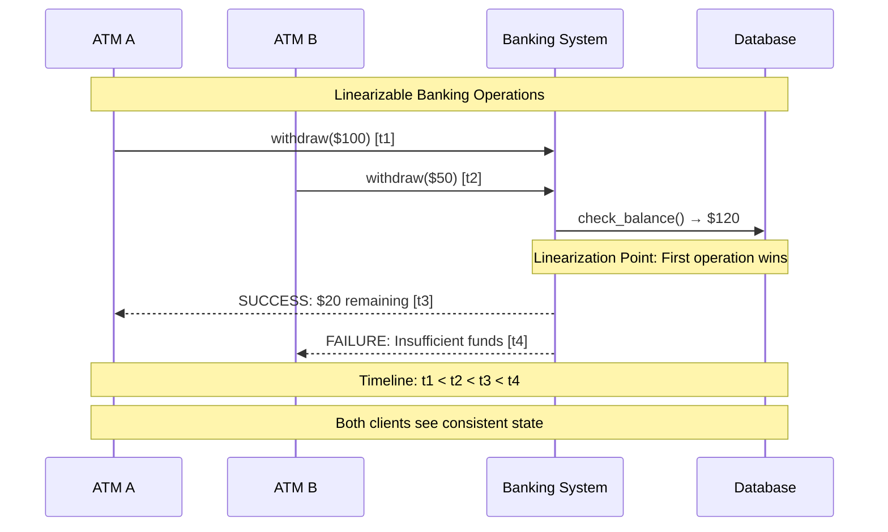
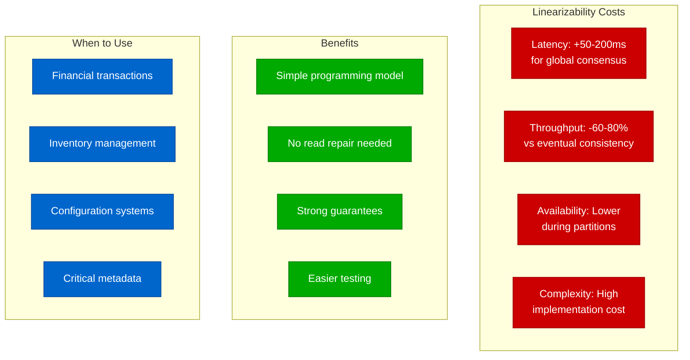

# Linearizability Concept: The Gold Standard of Consistency

## Overview

Linearizability is the strongest consistency model in distributed systems. It guarantees that all operations appear to execute atomically at some point between their start and completion time, creating the illusion of a single, sequential execution.

**Key Insight**: Linearizability makes a distributed system behave like a single-threaded program running on a single machine.

## The Timeline Model

```mermaid
graph TB
    subgraph Timeline[Real Time Timeline]
        T1[t1: Start] --> T2[t2: Op Begins] --> T3[t3: Linearization Point] --> T4[t4: Op Completes] --> T5[t5: End]
    end

    subgraph ClientView[Client Operations View]
        C1[Client A: read(x)]
        C2[Client B: write(x,5)]
        C3[Client C: read(x)]
    end

    subgraph LinearOrder[Linear Order Requirements]
        L1[All ops must appear atomic]
        L2[Order matches real-time]
        L3[Concurrent ops can be ordered arbitrarily]
    end

    subgraph Violations[Common Violations]
        V1[Read returns stale value]
        V2[Operations appear out of order]
        V3[Concurrent ops conflict]
    end

    %% Apply colors for clarity
    classDef timeStyle fill:#0066CC,stroke:#004499,color:#fff
    classDef clientStyle fill:#00AA00,stroke:#007700,color:#fff
    classDef orderStyle fill:#FF8800,stroke:#CC6600,color:#fff
    classDef violationStyle fill:#CC0000,stroke:#990000,color:#fff

    class T1,T2,T3,T4,T5 timeStyle
    class C1,C2,C3 clientStyle
    class L1,L2,L3 orderStyle
    class V1,V2,V3 violationStyle
```

## Production Example: Banking System



## Linearizability Properties

### 1. Real-Time Ordering
If operation A completes before operation B starts, then A appears before B in the linear order.

### 2. Atomicity
Each operation appears to take effect at exactly one point in time (linearization point).

### 3. Consistency
All clients observe the same order of operations.

## Testing Linearizability in Production

```mermaid
graph LR
    subgraph TestSetup[Linearizability Test Setup]
        G[Operation Generator] --> H[History Recorder]
        H --> V[Validator]
    end

    subgraph Operations[Concurrent Operations]
        R1[read(x) → 5]
        W1[write(x, 10)]
        R2[read(x) → 10]
        W2[write(x, 15)]
    end

    subgraph Validation[Validation Process]
        C[Check all possible<br/>linear orders]
        M[Match observed results<br/>with linear execution]
        P[Pass if match found<br/>Fail otherwise]
    end

    %% Apply 4-plane colors
    classDef testStyle fill:#0066CC,stroke:#004499,color:#fff
    classDef operationStyle fill:#00AA00,stroke:#007700,color:#fff
    classDef validateStyle fill:#FF8800,stroke:#CC6600,color:#fff

    class G,H,V testStyle
    class R1,W1,R2,W2 operationStyle
    class C,M,P validateStyle

    G --> R1
    G --> W1
    G --> R2
    G --> W2

    H --> C
    C --> M
    M --> P
```

## Real-World Implementations

### Strongly Consistent Systems
- **Google Spanner**: Uses TrueTime for global linearizability
- **FaunaDB**: Calvin transaction scheduler ensures linearizability
- **FoundationDB**: ACID transactions with linearizable reads
- **CockroachDB**: Serializable isolation provides linearizability

### Cost Analysis


## Debugging Linearizability Violations

### Common Symptoms
1. **Dirty Reads**: Client reads uncommitted data
2. **Lost Updates**: Concurrent writes overwrite each other
3. **Read Skew**: Different reads see inconsistent snapshots
4. **Write Skew**: Concurrent transactions violate constraints

### Investigation Checklist
- [ ] Check operation logs for overlapping timestamps
- [ ] Verify consensus algorithm is working correctly
- [ ] Look for network partitions during violations
- [ ] Examine client retry logic for duplicate operations
- [ ] Validate linearization points in the code

## Key Takeaways

1. **Linearizability = Sequential Consistency + Real-Time Ordering**
2. **Every operation has a linearization point where it "takes effect"**
3. **Strong consistency comes at significant performance cost**
4. **Essential for systems where consistency matters more than performance**
5. **Use automated testing tools like Jepsen to verify linearizability**

## Academic References

- **Herlihy & Wing (1990)**: "Linearizability: A Correctness Condition for Concurrent Objects"
- **Gilbert & Lynch (2002)**: "Brewer's Conjecture and the Feasibility of Consistent, Available, Partition-tolerant Web Services"
- **Kingsbury (2018)**: "Jepsen: On the perils of network partitions"

## Production Monitoring

Monitor these metrics to detect linearizability violations:
- **Operation latency percentiles** (p50, p95, p99)
- **Consensus rounds per operation**
- **Network partition detection time**
- **Failed linearizability tests count**
- **Client retry rates**