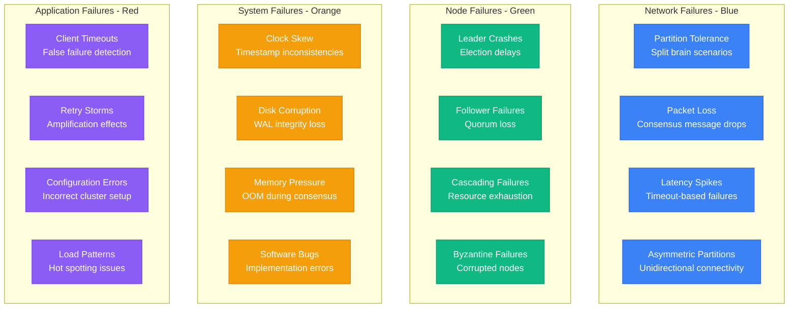
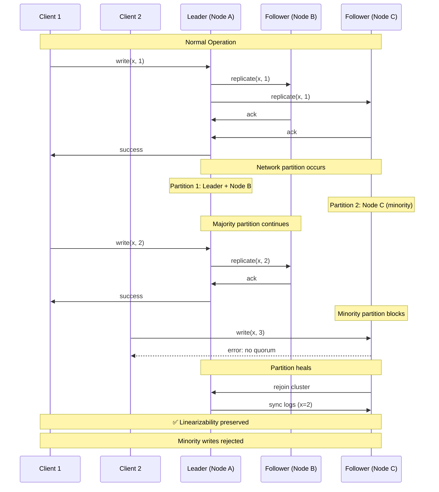
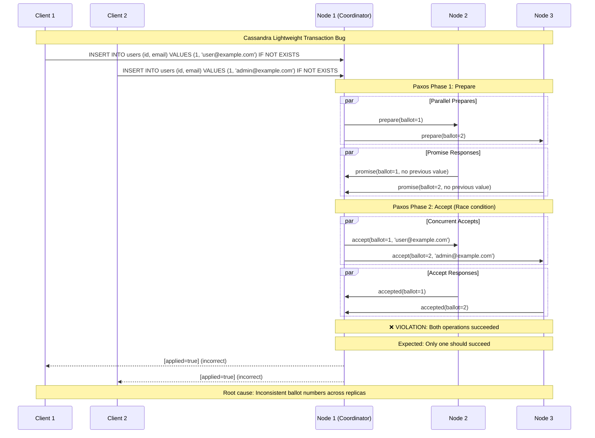
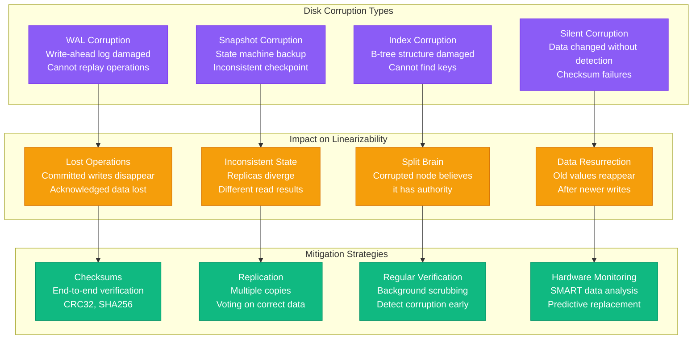
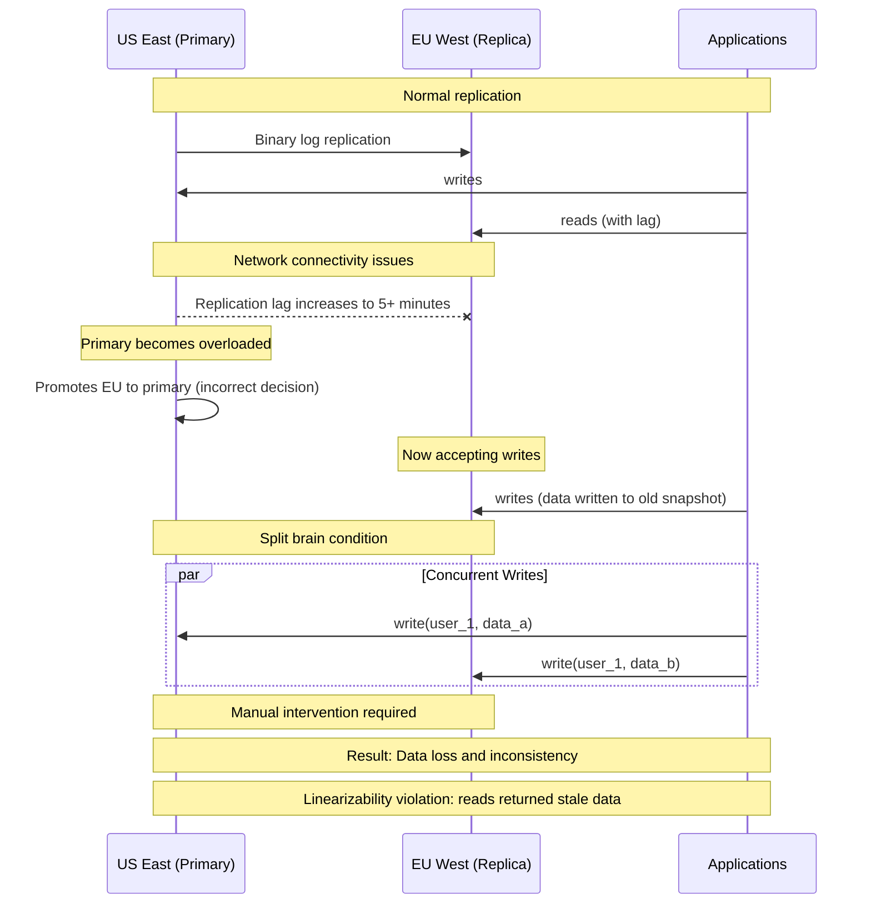
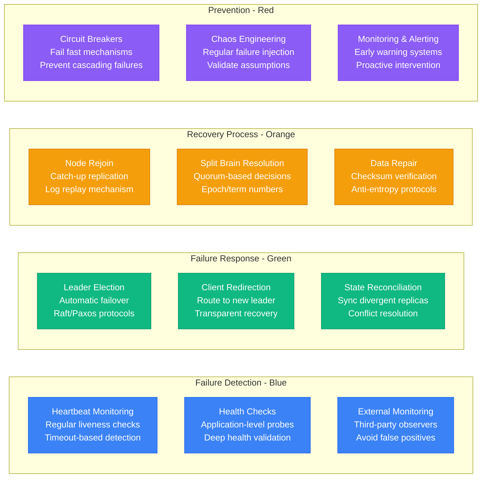
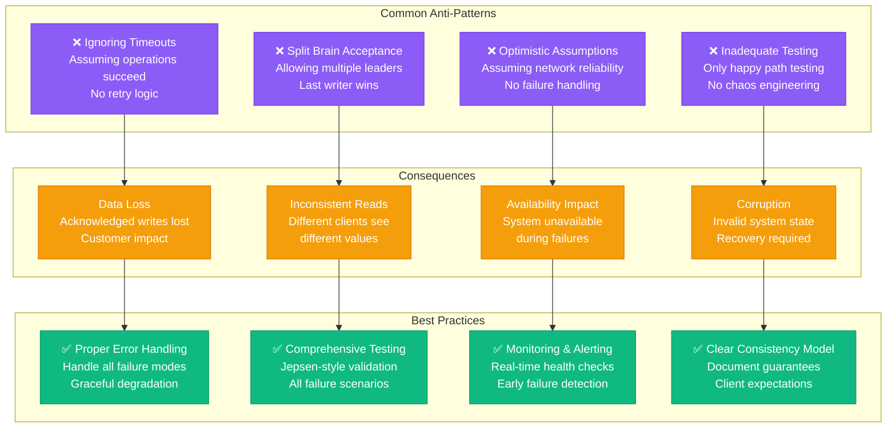

# Linearizability Failures: What Happens When It Breaks

## Overview

Understanding how linearizability fails in production is crucial for building robust distributed systems. This guide examines real failure scenarios from major companies and their impact on system behavior.

## Failure Taxonomy



## Split Brain Scenario



## MongoDB Rollback Incident

```mermaid
graph TB
    subgraph BeforePartition[Before Network Partition]
        P1[Primary<br/>write({_id: 1, x: 5})<br/>acknowledged]
        S1[Secondary 1<br/>replicated x=5]
        S2[Secondary 2<br/>not yet replicated]
    end

    subgraph DuringPartition[During Partition]
        PP[Primary (isolated)<br/>steps down<br/>no majority]
        SP1[Secondary 1<br/>becomes primary<br/>continues operations]
        SP2[Secondary 2<br/>joins new primary]
    end

    subgraph AfterPartition[After Partition Heals]
        OP[Old Primary<br/>rollback file created<br/>x=5 rolled back]
        NP[New Primary<br/>x=5 never existed<br/>linearizability violation]
    end

    P1 --> PP
    S1 --> SP1
    S2 --> SP2

    PP --> OP
    SP1 --> NP

    classDef beforeStyle fill:#10B981,stroke:#059669,color:#fff
    classDef duringStyle fill:#F59E0B,stroke:#D97706,color:#fff
    classDef afterStyle fill:#8B5CF6,stroke:#7C3AED,color:#fff

    class P1,S1,S2 beforeStyle
    class PP,SP1,SP2 duringStyle
    class OP,NP afterStyle
```

## Cassandra LWT Race Condition



## Clock Skew Impact

```mermaid
graph LR
    subgraph ClockSkew[Clock Skew Scenario]
        N1[Node 1<br/>Clock: 10:00:00<br/>Fast by 30s]
        N2[Node 2<br/>Clock: 09:59:30<br/>Correct time]
        N3[Node 3<br/>Clock: 09:59:25<br/>Slow by 5s]
    end

    subgraph TimestampOrdering[Timestamp Ordering Issue]
        O1[Operation 1<br/>Node 1: 10:00:00<br/>Appears "latest"]
        O2[Operation 2<br/>Node 2: 09:59:30<br/>Actually latest]
        O3[Ordering Violation<br/>O1 before O2<br/>Breaks linearizability]
    end

    subgraph SpannerSolution[Google Spanner Solution]
        TT[TrueTime API<br/>GPS + Atomic clocks<br/>Uncertainty bounds]
        WU[Wait Uncertainty<br/>Delay commit until<br/>timestamp certainty]
        GO[Global Ordering<br/>Consistent timestamps<br/>across datacenters]
    end

    N1 --> O1
    N2 --> O2
    O1 --> O3
    O2 --> O3

    TT --> WU
    WU --> GO

    classDef skewStyle fill:#8B5CF6,stroke:#7C3AED,color:#fff
    classDef orderStyle fill:#F59E0B,stroke:#D97706,color:#fff
    classDef solutionStyle fill:#10B981,stroke:#059669,color:#fff

    class N1,N2,N3 skewStyle
    class O1,O2,O3 orderStyle
    class TT,WU,GO solutionStyle
```

## Disk Corruption Failures



## Real-World Failure Examples

### GitHub MySQL Outage (2018)



### etcd Network Asymmetry Bug

```mermaid
graph TB
    subgraph NetworkTopology[Network Topology]
        L[Leader (Node A)<br/>Can send to B, C<br/>Cannot receive from C]
        F1[Follower B<br/>Full connectivity]
        F2[Follower C<br/>Can send to A, B<br/>A cannot receive]
    end

    subgraph FailureScenario[Asymmetric Partition]
        S1[Leader sends heartbeats<br/>to both followers]
        S2[Follower C cannot<br/>acknowledge heartbeats]
        S3[Leader thinks C is down<br/>but C thinks leader is up]
        S4[Split brain potential<br/>Both accept writes]
    end

    subgraph Resolution[Bug Fix]
        R1[Bidirectional heartbeats<br/>Required for leadership]
        R2[Jepsen testing<br/>Discovered the issue]
        R3[Improved failure detection<br/>More robust networking]
    end

    L --> S1
    F1 --> S1
    F2 --> S2

    S1 --> S3
    S2 --> S3
    S3 --> S4

    S4 --> R1
    R1 --> R2
    R2 --> R3

    classDef networkStyle fill:#3B82F6,stroke:#2563EB,color:#fff
    classDef failureStyle fill:#8B5CF6,stroke:#7C3AED,color:#fff
    classDef resolutionStyle fill:#10B981,stroke:#059669,color:#fff

    class L,F1,F2 networkStyle
    class S1,S2,S3,S4 failureStyle
    class R1,R2,R3 resolutionStyle
```

## Failure Detection and Recovery



## Testing Failure Scenarios

```python
# Jepsen test for linearizability violations
def test_partition_during_write():
    """Test linearizability during network partition"""

    # Setup: 3-node cluster
    cluster = setup_cluster(nodes=3)

    # Step 1: Normal operation
    client1.write("key1", "value1")
    assert client2.read("key1") == "value1"

    # Step 2: Inject network partition
    # Isolate node3 from nodes 1,2
    nemesis.partition([node1, node2], [node3])

    # Step 3: Concurrent operations
    future1 = async_write(client1, "key2", "value2")  # to majority
    future2 = async_write(client2, "key2", "value3")  # to minority

    # Step 4: Heal partition
    nemesis.heal_partition()

    # Step 5: Validate linearizability
    result1 = future1.get()
    result2 = future2.get()

    # Only one write should succeed
    assert (result1.success and not result2.success) or \
           (not result1.success and result2.success)

    # All nodes should converge to same value
    assert cluster.validate_convergence()

def test_leader_crash_during_consensus():
    """Test behavior when leader crashes during consensus"""

    cluster = setup_cluster(nodes=5)

    # Start write operation
    write_future = async_write(client, "key", "value")

    # Crash leader after log entry but before commit
    time.sleep(0.01)  # Let log entry propagate
    nemesis.crash_node(cluster.leader)

    # Wait for leader election
    cluster.wait_for_leader_election()

    # Verify operation outcome
    result = write_future.get()

    if result.success:
        # If write succeeded, all nodes must have the value
        assert all(node.read("key") == "value" for node in cluster.nodes)
    else:
        # If write failed, no node should have the value
        assert all(node.read("key") is None for node in cluster.nodes)
```

## Common Anti-Patterns



## Incident Response Playbook

### Immediate Response (0-15 minutes)
1. **Detect the Issue**
   - Monitor alerts for consensus failures
   - Check leader election frequency
   - Validate read/write success rates

2. **Assess Impact**
   - Determine affected operations
   - Check data consistency across replicas
   - Identify client impact

3. **Contain the Issue**
   - Stop writes if data corruption suspected
   - Redirect traffic to healthy nodes
   - Prevent cascading failures

### Investigation (15-60 minutes)
1. **Gather Data**
   - Collect consensus logs from all nodes
   - Check network connectivity between nodes
   - Analyze timing of operations

2. **Identify Root Cause**
   - Network partition vs node failure
   - Software bug vs hardware issue
   - Configuration error vs load spike

### Recovery (60+ minutes)
1. **Restore Service**
   - Heal network partitions
   - Restart failed nodes
   - Rebuild corrupted data

2. **Validate Consistency**
   - Run linearizability tests
   - Check data integrity
   - Verify all nodes converged

3. **Post-Incident**
   - Document lessons learned
   - Update monitoring and alerting
   - Improve testing coverage

## Key Takeaways

1. **Linearizability failures are subtle** - Often appear as data inconsistencies rather than obvious errors
2. **Network partitions are the primary threat** - Split brain scenarios violate linearizability
3. **Testing is crucial** - Jepsen and chaos engineering find real bugs
4. **Implementation matters** - Even well-designed algorithms can have bugs
5. **Monitoring is essential** - Early detection prevents data corruption
6. **Recovery procedures must be tested** - Incident response requires practice
7. **Human factors are significant** - Operational errors often cause violations

Understanding these failure modes is essential for operating linearizable systems in production and maintaining data consistency guarantees.