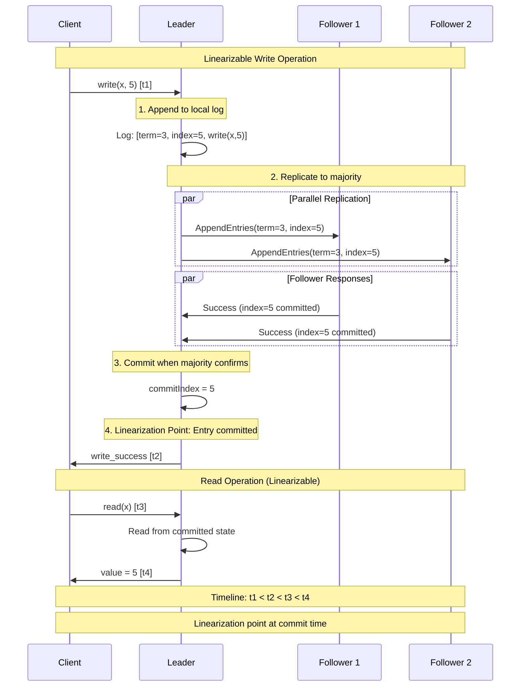
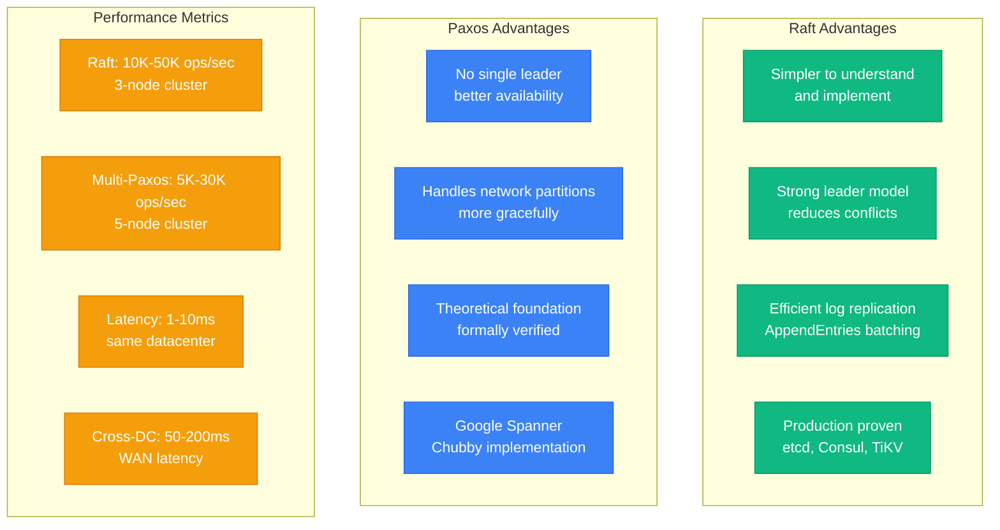
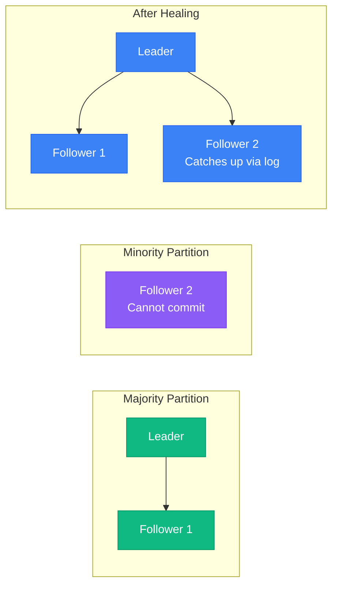

# Linearizability Implementation: Raft, Paxos, and Production Systems

## Overview

Implementing linearizability requires consensus algorithms that ensure all nodes agree on a single order of operations. This diagram explores battle-tested approaches used in production systems.

## Raft-Based Linearizability

```mermaid
graph TB
    subgraph Client[Client Layer - Blue]
        C1[Client A]
        C2[Client B]
        C3[Client C]
    end

    subgraph RaftCluster[Raft Consensus Layer - Green]
        L[Leader Node<br/>Handles all writes]
        F1[Follower 1<br/>Replicates log]
        F2[Follower 2<br/>Replicates log]
    end

    subgraph Storage[Storage Layer - Orange]
        LL[Leader Log<br/>Entry 1: write(x,5)<br/>Entry 2: write(y,10)]
        FL1[Follower Log 1<br/>Entry 1: write(x,5)<br/>Entry 2: write(y,10)]
        FL2[Follower Log 2<br/>Entry 1: write(x,5)<br/>Entry 2: write(y,10)]
    end

    subgraph Monitoring[Control Plane - Red]
        HB[Heartbeat Monitor]
        LE[Leader Election]
        LC[Log Compaction]
    end

    %% Client to Raft
    C1 -->|write(x,5)| L
    C2 -->|read(x)| L
    C3 -->|write(y,10)| L

    %% Raft replication
    L -->|AppendEntries| F1
    L -->|AppendEntries| F2
    F1 -->|AppendEntriesReply| L
    F2 -->|AppendEntriesReply| L

    %% Storage
    L --- LL
    F1 --- FL1
    F2 --- FL2

    %% Control plane
    HB -.->|Monitor| L
    LE -.->|Trigger| F1
    LC -.->|Compact| LL

    %% Apply 4-plane colors
    classDef clientStyle fill:#3B82F6,stroke:#2563EB,color:#fff
    classDef serviceStyle fill:#10B981,stroke:#059669,color:#fff
    classDef stateStyle fill:#F59E0B,stroke:#D97706,color:#fff
    classDef controlStyle fill:#8B5CF6,stroke:#7C3AED,color:#fff

    class C1,C2,C3 clientStyle
    class L,F1,F2 serviceStyle
    class LL,FL1,FL2 stateStyle
    class HB,LE,LC controlStyle
```

## Linearizability Protocol Flow



## Multi-Paxos Implementation

```mermaid
graph TB
    subgraph Proposers[Proposer Layer - Blue]
        P1[Proposer 1<br/>Client Proxy]
        P2[Proposer 2<br/>Client Proxy]
    end

    subgraph Acceptors[Acceptor Layer - Green]
        A1[Acceptor 1<br/>Promise: n=5<br/>Accepted: (3, v1)]
        A2[Acceptor 2<br/>Promise: n=5<br/>Accepted: (4, v2)]
        A3[Acceptor 3<br/>Promise: n=5<br/>Accepted: (5, v3)]
    end

    subgraph Learners[Learner Layer - Orange]
        L1[Learner 1<br/>Learned: v3]
        L2[Learner 2<br/>Learned: v3]
    end

    subgraph Control[Control Plane - Red]
        FD[Failure Detector]
        LO[Leader Oracle]
        GC[Garbage Collection]
    end

    %% Paxos phases
    P1 -.->|Phase 1: Prepare(n=5)| A1
    P1 -.->|Phase 1: Prepare(n=5)| A2
    P1 -.->|Phase 1: Prepare(n=5)| A3

    A1 -.->|Promise(n=5, v1)| P1
    A2 -.->|Promise(n=5, v2)| P1
    A3 -.->|Promise(n=5, v3)| P1

    P1 -->|Phase 2: Accept(n=5, v3)| A1
    P1 -->|Phase 2: Accept(n=5, v3)| A2
    P1 -->|Phase 2: Accept(n=5, v3)| A3

    A1 -->|Accepted(n=5, v3)| L1
    A2 -->|Accepted(n=5, v3)| L1
    A3 -->|Accepted(n=5, v3)| L2

    FD -.-> A1
    LO -.-> P1
    GC -.-> A1

    %% Apply 4-plane colors
    classDef proposerStyle fill:#3B82F6,stroke:#2563EB,color:#fff
    classDef acceptorStyle fill:#10B981,stroke:#059669,color:#fff
    classDef learnerStyle fill:#F59E0B,stroke:#D97706,color:#fff
    classDef controlStyle fill:#8B5CF6,stroke:#7C3AED,color:#fff

    class P1,P2 proposerStyle
    class A1,A2,A3 acceptorStyle
    class L1,L2 learnerStyle
    class FD,LO,GC controlStyle
```

## Production Implementation: etcd

```mermaid
graph LR
    subgraph ClientLayer[Client Layer - Blue]
        EC[etcd Client<br/>clientv3]
        LB[Load Balancer<br/>HAProxy]
    end

    subgraph EtcdCluster[etcd Cluster - Green]
        E1[etcd-1 (Leader)<br/>Raft Node ID: 1<br/>State: Leader]
        E2[etcd-2 (Follower)<br/>Raft Node ID: 2<br/>State: Follower]
        E3[etcd-3 (Follower)<br/>Raft Node ID: 3<br/>State: Follower]
    end

    subgraph Storage[Storage Layer - Orange]
        W1[WAL Log<br/>wal-000001.log]
        S1[BoltDB<br/>db snapshot]
        B1[Backend Store<br/>key-value pairs]
    end

    subgraph Monitoring[Control Plane - Red]
        M[Metrics<br/>Prometheus]
        A[Alerts<br/>Leader election time]
        H[Health Checks<br/>Consensus health]
    end

    EC --> LB
    LB --> E1
    LB -.-> E2
    LB -.-> E3

    E1 <-->|Raft Messages| E2
    E1 <-->|Raft Messages| E3
    E2 <-->|Raft Messages| E3

    E1 --> W1
    E1 --> S1
    E1 --> B1

    E1 --> M
    M --> A
    H -.-> E1

    %% Apply 4-plane colors
    classDef clientStyle fill:#3B82F6,stroke:#2563EB,color:#fff
    classDef serviceStyle fill:#10B981,stroke:#059669,color:#fff
    classDef stateStyle fill:#F59E0B,stroke:#D97706,color:#fff
    classDef controlStyle fill:#8B5CF6,stroke:#7C3AED,color:#fff

    class EC,LB clientStyle
    class E1,E2,E3 serviceStyle
    class W1,S1,B1 stateStyle
    class M,A,H controlStyle
```

## Implementation Comparison



## Code Example: Raft Linearizable Read

```go
// Linearizable read in Raft requires reading from leader
func (r *RaftNode) LinearizableRead(key string) (string, error) {
    // 1. Ensure we're still the leader
    if !r.isLeader() {
        return "", ErrNotLeader
    }

    // 2. Check if we have uncommitted entries
    if r.hasUncommittedEntries() {
        // 3. Send heartbeat to confirm leadership
        if !r.confirmLeadership() {
            return "", ErrLeadershipLost
        }
    }

    // 4. Linearization point: Read from committed state
    value := r.stateMachine.Get(key)
    return value, nil
}

// Confirms leadership by getting acknowledgment from majority
func (r *RaftNode) confirmLeadership() bool {
    acks := 1 // self
    for _, peer := range r.peers {
        if peer.sendHeartbeat(r.currentTerm) {
            acks++
        }
    }
    return acks > len(r.peers)/2
}
```

## Implementation Checklist

### Raft Implementation
- [ ] Leader election with randomized timeouts
- [ ] Log replication with AppendEntries RPCs
- [ ] Commit index advancement on majority ACK
- [ ] Read linearizability through leader confirmation
- [ ] Snapshot and log compaction
- [ ] Membership changes using joint consensus

### Paxos Implementation
- [ ] Phase 1: Prepare with proposal numbers
- [ ] Phase 2: Accept with chosen values
- [ ] Learner notification mechanism
- [ ] Multi-Paxos optimization for multiple rounds
- [ ] Failure detection and recovery
- [ ] Distinguished proposer for efficiency

## Production Considerations

### Network Partitions


### Performance Tuning
1. **Batch Size**: Larger batches improve throughput but increase latency
2. **Heartbeat Frequency**: Balance between failure detection and overhead
3. **Pipeline Depth**: Allow multiple outstanding requests
4. **Network Optimization**: Use dedicated network for consensus traffic

## Real-World Systems

### Google Spanner
- Uses Paxos for linearizable reads and writes
- TrueTime API provides global timestamps
- 99.999% availability across multiple datacenters

### Amazon DynamoDB
- Originally eventual consistency
- Added strongly consistent reads using quorum reads
- Global tables use multi-master replication

### CockroachDB
- Raft-based consensus for range replication
- Serializable isolation provides linearizability
- Automatic range splitting and rebalancing

## Key Takeaways

1. **Consensus is required** for linearizability in distributed systems
2. **Raft is simpler** to implement and understand than Paxos
3. **Leader-based systems** provide better performance but single point of failure
4. **Network partitions** significantly impact availability
5. **Production systems** require careful tuning and monitoring
6. **Testing tools** like Jepsen are essential for verification