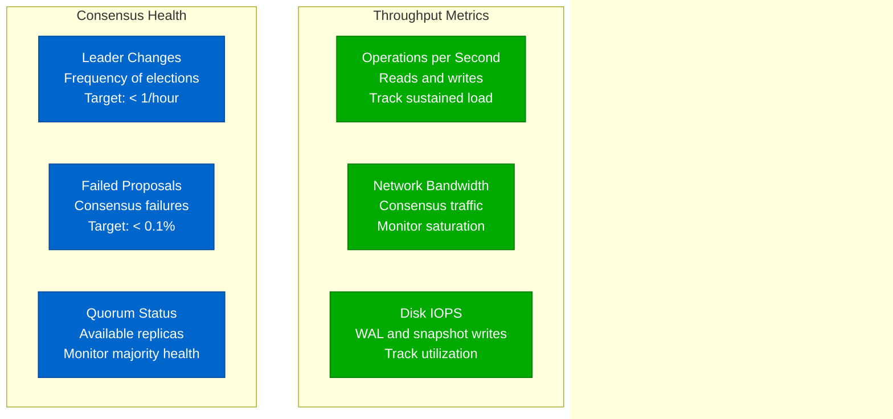

# Linearizability Performance: Latency Costs at Scale

## Overview

Linearizability provides the strongest consistency guarantees but comes with significant performance costs. This analysis examines real-world performance implications from production systems at Netflix, Google, and other large-scale deployments.

## Performance Cost Architecture


## Latency Breakdown Analysis


## Throughput Impact at Scale

```mermaid
graph LR
    subgraph ThroughputMetrics[Throughput Analysis]
        subgraph SingleNode[Single Node Baseline]
            SN1[Memory Read: 1M ops/sec]
            SN2[Disk Write: 10K ops/sec]
            SN3[Network: 100K ops/sec]
        end

        subgraph EventualConsistency[Eventually Consistent]
            EC1[Read: 800K ops/sec<br/>20% penalty]
            EC2[Write: 8K ops/sec<br/>20% penalty]
        end

        subgraph StrongConsistency[Linearizable]
            SC1[Read: 50K ops/sec<br/>95% penalty]
            SC2[Write: 2K ops/sec<br/>80% penalty]
        end
    end

    subgraph ScalingLimits[Scaling Constraints]
        SL1[Leader Bottleneck<br/>Single write path]
        SL2[Consensus Overhead<br/>O(n²) message complexity]
        SL3[Network Partitions<br/>Availability impact]
        SL4[Cross-DC Latency<br/>200ms+ round trips]
    end

    classDef baselineStyle fill:#00AA00,stroke:#007700,color:#fff
    classDef eventualStyle fill:#0066CC,stroke:#004499,color:#fff
    classDef strongStyle fill:#CC0000,stroke:#990000,color:#fff
    classDef constraintStyle fill:#FF8800,stroke:#CC6600,color:#fff

    class SN1,SN2,SN3 baselineStyle
    class EC1,EC2 eventualStyle
    class SC1,SC2 strongStyle
    class SL1,SL2,SL3,SL4 constraintStyle
```

## Production Performance Data


## Performance Optimization Strategies


## Cross-Datacenter Performance


## Performance Benchmarks

```mermaid
graph TB
    subgraph BenchmarkSetup[Benchmark Configuration]
        B1[Hardware<br/>AWS c5.4xlarge<br/>16 vCPU, 32GB RAM<br/>EBS gp3 storage]
        B2[Network<br/>10 Gbps enhanced<br/>Same AZ deployment<br/>1ms RTT]
        B3[Workload<br/>50% reads, 50% writes<br/>Uniform key distribution<br/>1KB value size]
    end

    subgraph Results[Performance Results]
        R1[etcd (Raft)<br/>Throughput: 10K writes/sec<br/>Latency p99: 50ms<br/>3-node cluster]
        R2[Consul (Raft)<br/>Throughput: 8K writes/sec<br/>Latency p99: 80ms<br/>5-node cluster]
        R3[TiKV (Raft)<br/>Throughput: 30K writes/sec<br/>Latency p99: 20ms<br/>Multi-raft groups]
    end

    subgraph Scaling[Scaling Behavior]
        S1[3 nodes → 5 nodes<br/>Throughput: -20%<br/>Latency: +15%]
        S2[5 nodes → 7 nodes<br/>Throughput: -30%<br/>Latency: +25%]
        S3[Single DC → Multi DC<br/>Throughput: -60%<br/>Latency: +300%]
    end

    classDef setupStyle fill:#0066CC,stroke:#004499,color:#fff
    classDef resultStyle fill:#00AA00,stroke:#007700,color:#fff
    classDef scalingStyle fill:#FF8800,stroke:#CC6600,color:#fff

    class B1,B2,B3 setupStyle
    class R1,R2,R3 resultStyle
    class S1,S2,S3 scalingStyle
```

## Cost Analysis


## Performance Tuning Guide

### Critical Configuration Parameters

```yaml
# etcd performance tuning example
etcd_config:
  # Heartbeat interval - affects leader election time
  heartbeat_interval: 100ms  # Default: 100ms, Min: 10ms

  # Election timeout - affects availability during failures
  election_timeout: 1000ms   # Default: 1000ms, Min: 100ms

  # Snapshot settings - affects memory usage
  snapshot_count: 10000      # Default: 100000, Min: 10000

  # WAL settings - affects write performance
  max_wals: 5               # Default: 5, impacts disk usage

  # Network settings
  max_request_bytes: 1572864 # Default: 1.5MB, affects batch size

  # Read performance
  read_only_range_req: true  # Enable linearizable reads from followers
```

### Monitoring Critical Metrics



## Trade-off Decision Matrix


## Performance Optimization Checklist

### Infrastructure Optimization
- [ ] Use SSD storage with high IOPS for WAL
- [ ] Dedicated network for consensus traffic
- [ ] Co-locate replicas in same availability zone when possible
- [ ] Use RDMA/InfiniBand for ultra-low latency networks
- [ ] Tune OS parameters (TCP buffers, file descriptors)

### Application Optimization
- [ ] Batch writes when possible to amortize consensus cost
- [ ] Use read leases for linearizable reads without consensus
- [ ] Implement proper retry logic with exponential backoff
- [ ] Cache frequently accessed data with bounded staleness
- [ ] Partition data to avoid hot spots on single Raft group

### Monitoring and Alerting
- [ ] Track p99 latency with aggressive SLA thresholds
- [ ] Monitor consensus health metrics continuously
- [ ] Alert on leader election frequency spikes
- [ ] Set up automated capacity planning based on growth trends
- [ ] Implement circuit breakers for degraded performance

## Key Takeaways

1. **Linearizability has significant performance costs** - 5-10x latency penalty, 60-80% throughput reduction
2. **Cross-datacenter deployments** multiply the performance impact due to network latency
3. **Careful tuning is essential** - Default configurations are rarely optimal for production
4. **Use alternatives when possible** - Eventually consistent systems perform much better
5. **Monitor consensus health** - Leader elections and log replication lag are critical metrics
6. **Plan for scale** - Performance degrades as cluster size increases
7. **Hardware matters** - NVMe SSDs and high-speed networks make a significant difference