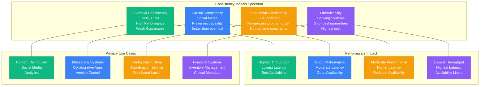
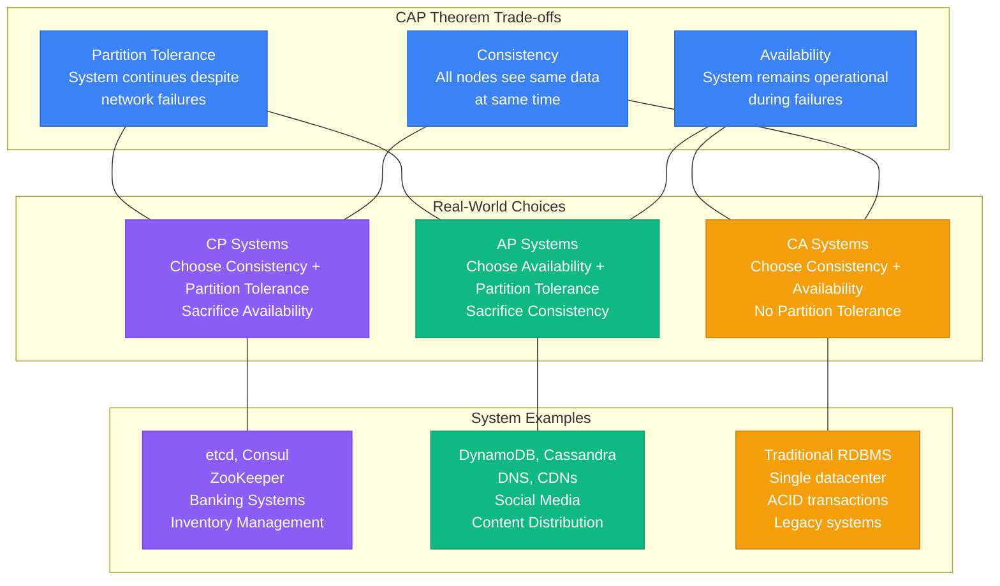
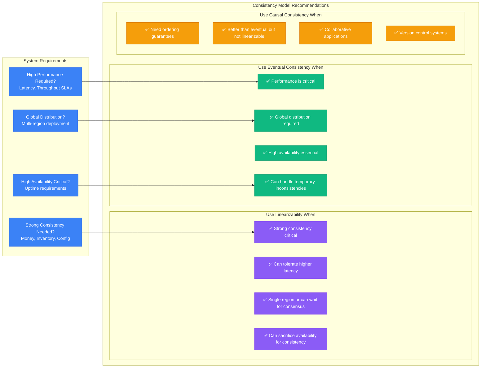
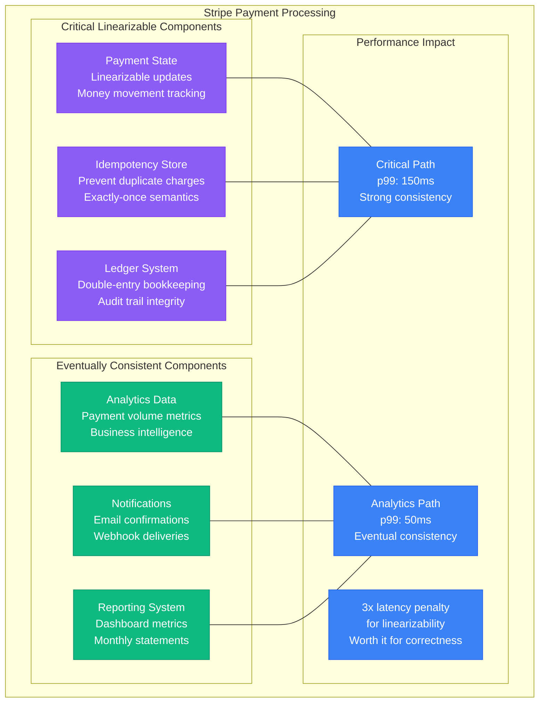
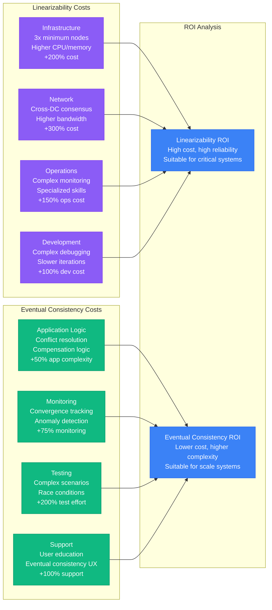
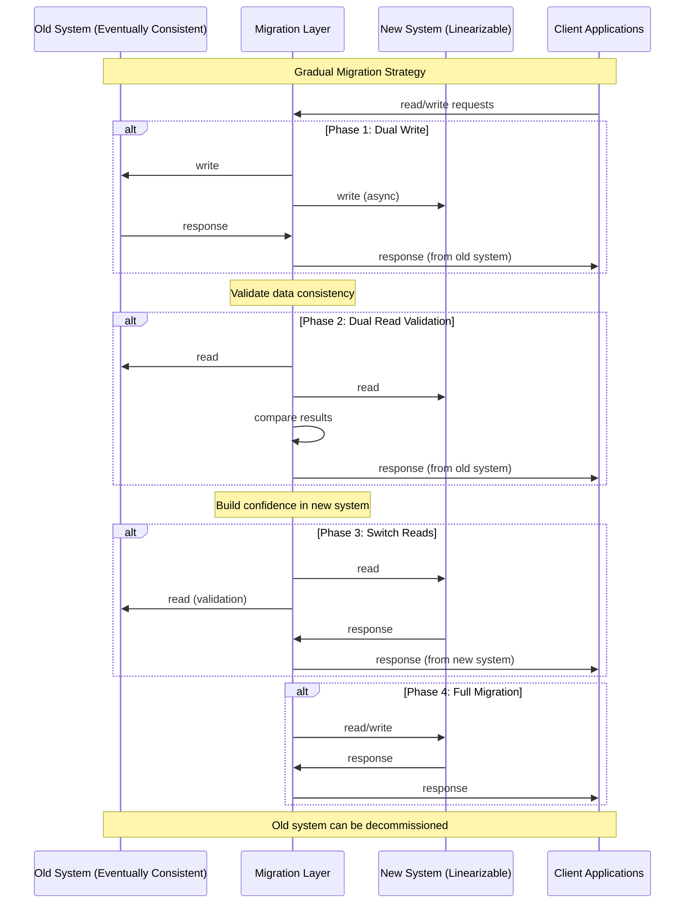
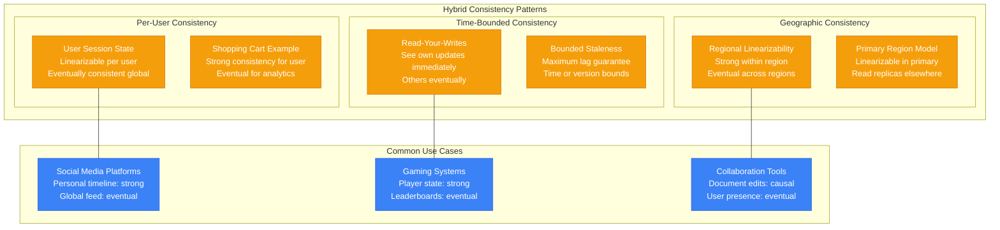
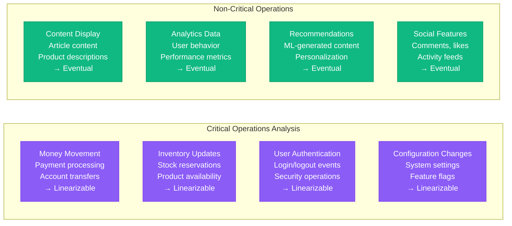

# Linearizability Tradeoffs: When to Use vs Alternatives

## Overview

Choosing the right consistency model is one of the most critical decisions in distributed systems design. This guide examines when to use linearizability versus alternatives, with real-world examples from production systems.

## Consistency Spectrum



## CAP Theorem Implications



## Decision Matrix



## Real-World System Analysis

### Banking System: Stripe



### Social Media: Facebook

```mermaid
graph TB
    subgraph FacebookArchitecture[Facebook Social Graph]
        subgraph EventualComponents[Eventually Consistent (95% of system)]
            NF[News Feed<br/>Timeline generation<br/>Acceptable staleness]
            PH[Photos/Videos<br/>Content delivery<br/>CDN distribution]
            MS[Messaging (non-critical)<br/>Chat history<br/>Read receipts]
        end

        subgraph LinearizableComponents[Linearizable (5% of system)]
            AC[Account Creation<br/>Username uniqueness<br/>Critical for user experience]
            PY[Payment Processing<br/>Ad billing<br/>Revenue critical]
            SE[Security Events<br/>Password changes<br/>Account lockouts]
        end

        subgraph PerformanceGains[Performance Benefits]
            PG1[Feed Generation<br/>p50: 10ms<br/>Massive scale possible]
            PG2[Content Delivery<br/>p50: 5ms<br/>Global CDN performance]
            PG3[10-100x better performance<br/>vs linearizable<br/>Enables massive scale]
        end
    end

    NF --- PG1
    PH --- PG2
    MS --- PG3

    classDef eventualStyle fill:#10B981,stroke:#059669,color:#fff
    classDef linearStyle fill:#8B5CF6,stroke:#7C3AED,color:#fff
    classDef performanceStyle fill:#3B82F6,stroke:#2563EB,color:#fff

    class NF,PH,MS eventualStyle
    class AC,PY,SE linearStyle
    class PG1,PG2,PG3 performanceStyle
```

### E-commerce: Amazon

```mermaid
graph TB
    subgraph AmazonArchitecture[Amazon E-commerce Platform]
        subgraph InventoryManagement[Inventory (Linearizable)]
            IV[Item Availability<br/>Prevent overselling<br/>Strong consistency required]
            OR[Order Reservation<br/>Hold inventory<br/>During checkout]
            PR[Pricing Updates<br/>Consistent pricing<br/>Across all services]
        end

        subgraph ProductCatalog[Catalog (Eventually Consistent)]
            PD[Product Descriptions<br/>Marketing content<br/>OK to be stale]
            RV[Reviews & Ratings<br/>User-generated content<br/>Eventual propagation]
            RC[Recommendations<br/>Machine learning<br/>Based on historical data]
        end

        subgraph HybridSystems[Hybrid Approaches]
            SC[Shopping Cart<br/>Session-based consistency<br/>User-specific linearizability]
            WL[Wish Lists<br/>Personal data<br/>Per-user consistency]
            OH[Order History<br/>Eventually consistent<br/>with compensation]
        end
    end

    subgraph BusinessImpact[Business Impact]
        BI1[Inventory Accuracy<br/>Prevents customer frustration<br/>Reduces refunds]
        BI2[Catalog Performance<br/>Fast browsing experience<br/>Increased conversions]
        BI3[Optimal User Experience<br/>Balance consistency vs speed<br/>Context-dependent choices]
    end

    IV --- BI1
    PD --- BI2
    SC --- BI3

    classDef inventoryStyle fill:#8B5CF6,stroke:#7C3AED,color:#fff
    classDef catalogStyle fill:#10B981,stroke:#059669,color:#fff
    classDef hybridStyle fill:#F59E0B,stroke:#D97706,color:#fff
    classDef impactStyle fill:#3B82F6,stroke:#2563EB,color:#fff

    class IV,OR,PR inventoryStyle
    class PD,RV,RC catalogStyle
    class SC,WL,OH hybridStyle
    class BI1,BI2,BI3 impactStyle
```

## Performance Comparison

```mermaid
graph TB
    subgraph BenchmarkResults[Production Performance Benchmarks]
        subgraph LinearizableSystems[Linearizable Systems]
            LS1[etcd (Raft)<br/>Writes: 10K/sec<br/>p99: 50ms<br/>3 nodes same DC]
            LS2[CockroachDB<br/>Writes: 30K/sec<br/>p99: 100ms<br/>Regional cluster]
            LS3[Spanner<br/>Writes: 100K/sec<br/>p99: 10ms<br/>Global with TrueTime]
        end

        subgraph EventuallySystems[Eventually Consistent Systems]
            ES1[DynamoDB<br/>Writes: 1M/sec<br/>p99: 10ms<br/>Global tables]
            ES2[Cassandra<br/>Writes: 500K/sec<br/>p99: 5ms<br/>Multi-DC cluster]
            ES3[Redis<br/>Writes: 5M/sec<br/>p99: 1ms<br/>In-memory cache]
        end

        subgraph PerformanceGap[Performance Gap Analysis]
            PG[Throughput Gap<br/>50-500x difference<br/>Latency Gap<br/>5-50x difference]
        end
    end

    LS1 --> PG
    LS2 --> PG
    LS3 --> PG
    ES1 --> PG
    ES2 --> PG
    ES3 --> PG

    classDef linearStyle fill:#8B5CF6,stroke:#7C3AED,color:#fff
    classDef eventualStyle fill:#10B981,stroke:#059669,color:#fff
    classDef gapStyle fill:#F59E0B,stroke:#D97706,color:#fff

    class LS1,LS2,LS3 linearStyle
    class ES1,ES2,ES3 eventualStyle
    class PG gapStyle
```

## Cost Analysis



## Migration Strategies



## Hybrid Consistency Patterns



## Decision Framework

### Step 1: Identify Critical Operations


### Step 2: Performance Requirements
- **Latency SLA**: Can you accept 10-50x higher latency?
- **Throughput SLA**: Can you accept 60-80% throughput reduction?
- **Availability SLA**: Can you accept reduced availability during partitions?

### Step 3: Operational Complexity
- **Team Expertise**: Do you have experience with consensus algorithms?
- **Debugging Capability**: Can you debug distributed consensus issues?
- **Monitoring Infrastructure**: Can you implement comprehensive monitoring?

## Implementation Checklist

### Choosing Linearizability
- [ ] Business requires strong consistency guarantees
- [ ] Can tolerate higher latency (10-100ms additional)
- [ ] Can tolerate reduced throughput (60-80% penalty)
- [ ] Have expertise in consensus algorithms (Raft/Paxos)
- [ ] Can implement comprehensive testing (Jepsen-style)
- [ ] Budget allows for 2-3x infrastructure costs
- [ ] Can accept reduced availability during network partitions

### Choosing Eventual Consistency
- [ ] Performance is critical (sub-10ms latency)
- [ ] High throughput required (100K+ ops/sec)
- [ ] Global distribution needed
- [ ] Can handle temporary inconsistencies
- [ ] Have conflict resolution strategies
- [ ] Can implement convergence monitoring
- [ ] Can educate users about consistency model

### Hybrid Approach
- [ ] Can identify which operations need strong consistency
- [ ] Can implement multiple consistency models
- [ ] Have sophisticated routing/proxy layer
- [ ] Can monitor consistency boundaries
- [ ] Team understands complexity tradeoffs

## Key Takeaways

1. **No one-size-fits-all solution** - Different parts of your system may need different consistency models
2. **Performance gap is significant** - 5-100x difference between linearizable and eventually consistent systems
3. **Operational complexity differs** - Linearizable systems require specialized expertise
4. **Business requirements drive decisions** - Technical preferences must yield to business needs
5. **Hybrid approaches work** - Many successful systems use multiple consistency models
6. **Start simple** - Begin with eventual consistency and add stronger guarantees where needed
7. **Test thoroughly** - Consistency bugs are subtle and costly to fix in production
8. **Plan for migration** - You may need to change consistency models as you scale