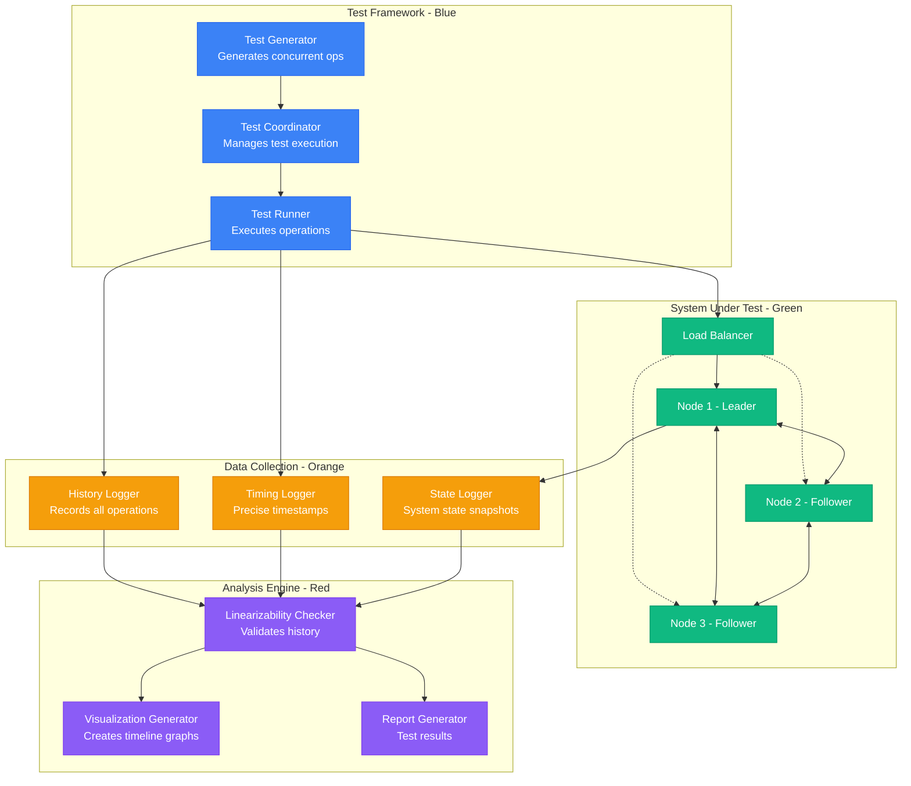
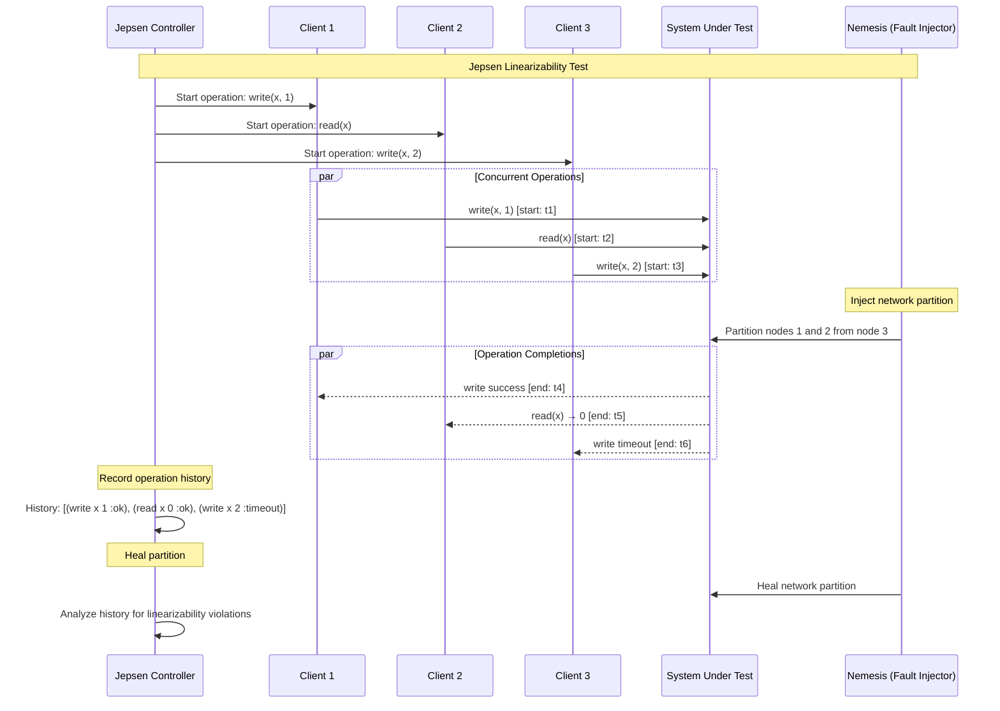
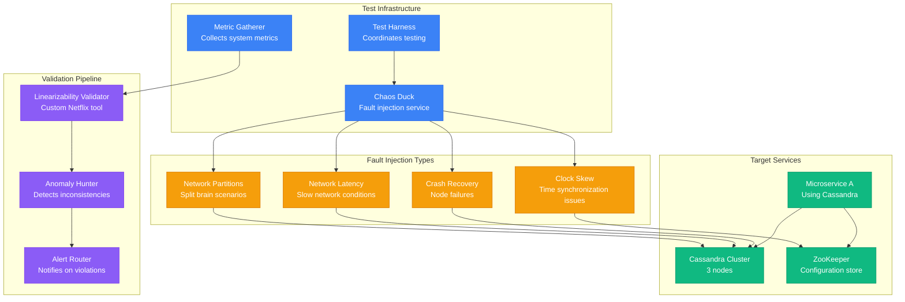
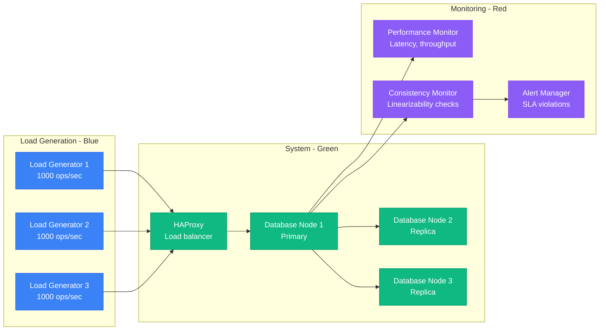
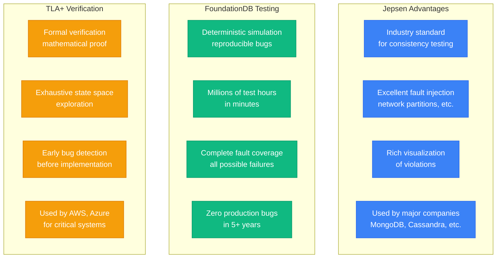
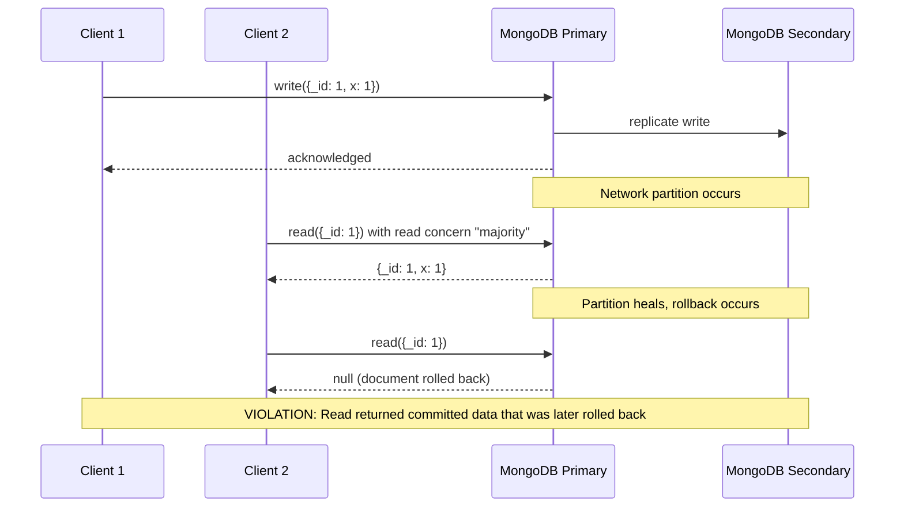
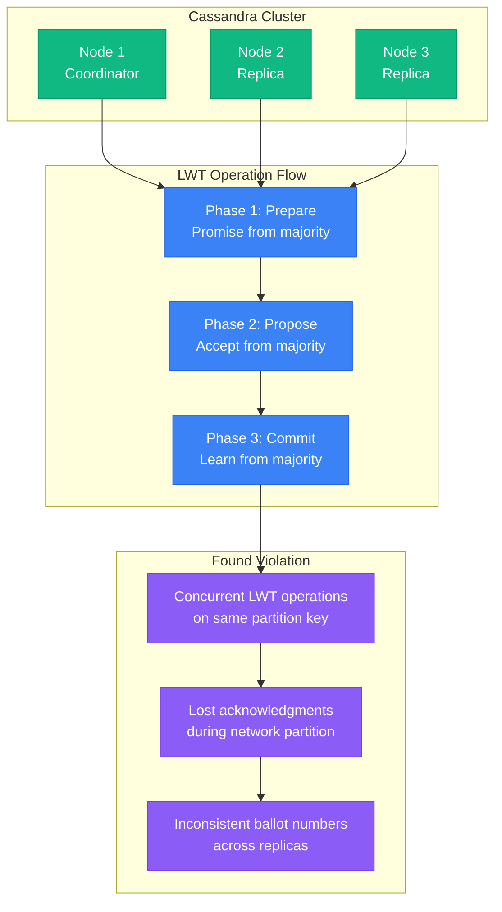
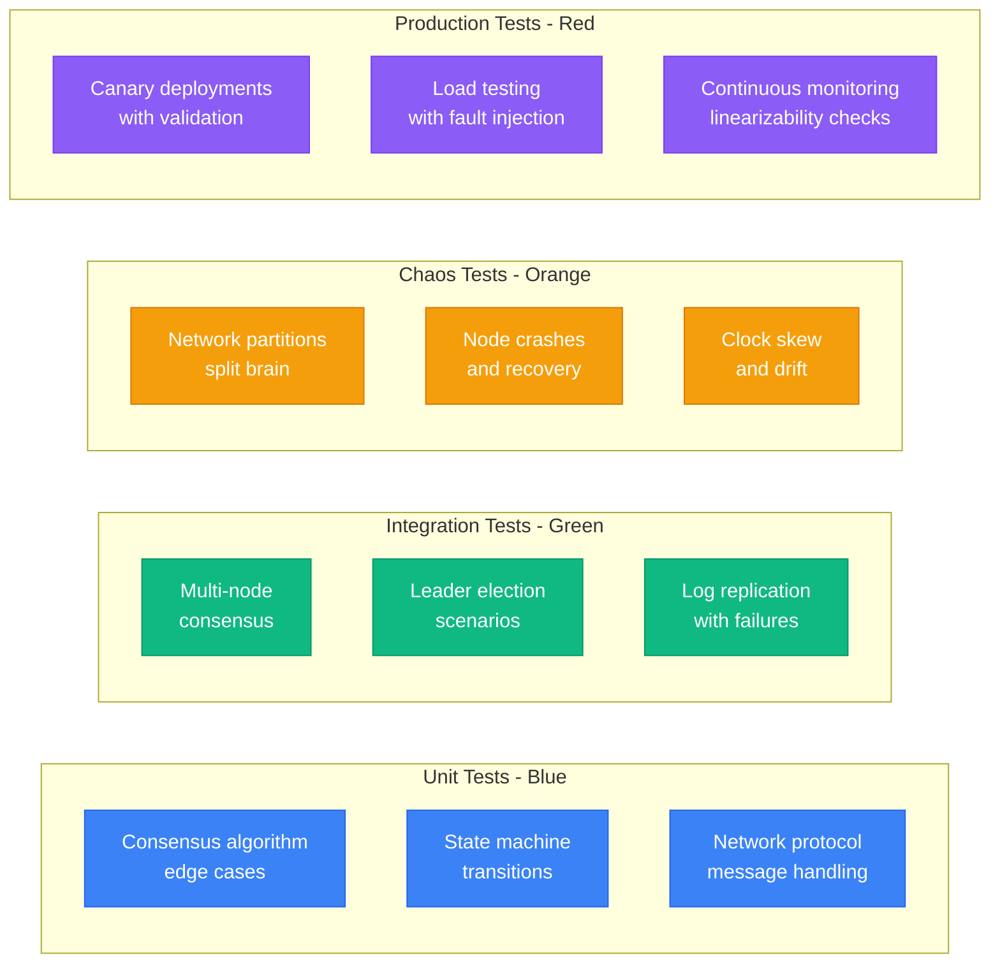

# Linearizability Verification: Testing and Validation Methods

## Overview

Verifying linearizability in production systems is crucial but challenging. This guide covers testing strategies, tools, and methodologies used by companies like Netflix, Uber, and Google to ensure their systems maintain linearizable guarantees.

## Verification Architecture



## Jepsen Testing Methodology



## History-Based Verification

```mermaid
graph TB
    subgraph OperationHistory[Operation History]
        O1[write(x, 5) :ok<br/>start: 100ms, end: 150ms]
        O2[read(x) → 0 :ok<br/>start: 120ms, end: 140ms]
        O3[read(x) → 5 :ok<br/>start: 160ms, end: 180ms]
        O4[write(x, 10) :ok<br/>start: 170ms, end: 200ms]
    end

    subgraph LinearizationPoints[Find Linearization Points]
        LP1[Try: write(x,5) at 125ms]
        LP2[Try: read(x) at 130ms]
        LP3[Try: read(x) at 170ms]
        LP4[Try: write(x,10) at 185ms]
    end

    subgraph Validation[Validation Results]
        V1[❌ VIOLATION:<br/>read(x) → 0 at 130ms<br/>but write(x,5) at 125ms]
        V2[✅ VALID if:<br/>read(x) at 130ms happens<br/>before write(x,5) linearization]
    end

    O1 --> LP1
    O2 --> LP2
    O3 --> LP3
    O4 --> LP4

    LP1 --> V1
    LP2 --> V1
    LP3 --> V2
    LP4 --> V2

    classDef historyStyle fill:#3B82F6,stroke:#2563EB,color:#fff
    classDef pointStyle fill:#10B981,stroke:#059669,color:#fff
    classDef validStyle fill:#F59E0B,stroke:#D97706,color:#fff

    class O1,O2,O3,O4 historyStyle
    class LP1,LP2,LP3,LP4 pointStyle
    class V1,V2 validStyle
```

## Model-Based Testing

```mermaid
graph LR
    subgraph Model[Abstract Model - Blue]
        AM[Sequential Specification<br/>register.put(k,v)<br/>register.get(k) → v]
        AS[Abstract State<br/>Map: k → v]
    end

    subgraph Implementation[Real Implementation - Green]
        API[Distributed KV Store<br/>Raft consensus]
        RS[Real State<br/>Replicated across nodes]
    end

    subgraph TestGeneration[Test Generation - Orange]
        OG[Operation Generator<br/>Random read/write ops]
        SG[State Generator<br/>Check state equivalence]
    end

    subgraph Verification[Verification - Red]
        HC[History Checker<br/>Compare model vs impl]
        SC[State Checker<br/>Verify final states match]
        BG[Bug Reporter<br/>Generate counterexamples]
    end

    %% Model relationships
    AM --> AS
    API --> RS

    %% Test generation
    OG --> AM
    OG --> API
    SG --> AS
    SG --> RS

    %% Verification
    AS --> HC
    RS --> HC
    HC --> BG
    AS --> SC
    RS --> SC
    SC --> BG

    classDef modelStyle fill:#3B82F6,stroke:#2563EB,color:#fff
    classDef implStyle fill:#10B981,stroke:#059669,color:#fff
    classDef genStyle fill:#F59E0B,stroke:#D97706,color:#fff
    classDef verifyStyle fill:#8B5CF6,stroke:#7C3AED,color:#fff

    class AM,AS modelStyle
    class API,RS implStyle
    class OG,SG genStyle
    class HC,SC,BG verifyStyle
```

## Production Testing at Netflix



## Linearizability Checker Algorithm

```python
def check_linearizability(history):
    """
    Simplified linearizability checker
    Used by Jepsen and similar tools
    """
    # 1. Extract all possible linearization points
    operations = parse_history(history)

    # 2. Generate all valid orderings
    for ordering in generate_valid_orderings(operations):
        # 3. Check if this ordering is linearizable
        if is_sequential_valid(ordering):
            return True, ordering

    return False, None

def is_sequential_valid(ordering):
    """Check if sequential execution matches observed results"""
    state = {}

    for op in ordering:
        if op.type == 'write':
            state[op.key] = op.value
            if op.result != 'ok':
                return False
        elif op.type == 'read':
            expected = state.get(op.key, None)
            if op.result != expected:
                return False

    return True

# Example usage with Jepsen-style history
history = [
    {'op': 'write', 'key': 'x', 'value': 1, 'start': 100, 'end': 150, 'result': 'ok'},
    {'op': 'read', 'key': 'x', 'start': 120, 'end': 140, 'result': 0},
    {'op': 'read', 'key': 'x', 'start': 160, 'end': 180, 'result': 1}
]

is_linearizable, witness = check_linearizability(history)
print(f"Linearizable: {is_linearizable}")
```

## Performance Testing Setup



## Testing Tools Comparison



## Real-World Violation Examples

### Example 1: MongoDB WiredTiger Bug


### Example 2: Cassandra Lightweight Transactions


## Testing Best Practices

### Comprehensive Test Suite


## Verification Checklist

### Pre-Deployment Testing
- [ ] Unit tests for all consensus edge cases
- [ ] Jepsen tests with comprehensive fault injection
- [ ] Performance tests under load with linearizability validation
- [ ] Formal verification of critical algorithms (TLA+)
- [ ] Property-based testing with QuickCheck-style tools

### Production Monitoring
- [ ] Continuous linearizability checking on sample operations
- [ ] Automated anomaly detection for consistency violations
- [ ] Real-time monitoring of consensus health metrics
- [ ] Alert thresholds for SLA violations
- [ ] Runbook procedures for linearizability violations

### Incident Response
- [ ] Automated rollback procedures for detected violations
- [ ] Data integrity validation after outages
- [ ] Post-incident consistency audits
- [ ] Root cause analysis with timeline reconstruction
- [ ] Preventive measures to avoid recurrence

## Key Takeaways

1. **Testing is crucial** - Most linearizability bugs are found through systematic testing
2. **Jepsen is the gold standard** for distributed systems consistency testing
3. **Formal verification** catches bugs that testing might miss
4. **Continuous monitoring** is essential in production
5. **Fault injection** reveals edge cases not found in normal testing
6. **Real violations happen** - even in well-established systems like MongoDB and Cassandra
7. **Investment in testing infrastructure** pays dividends in system reliability