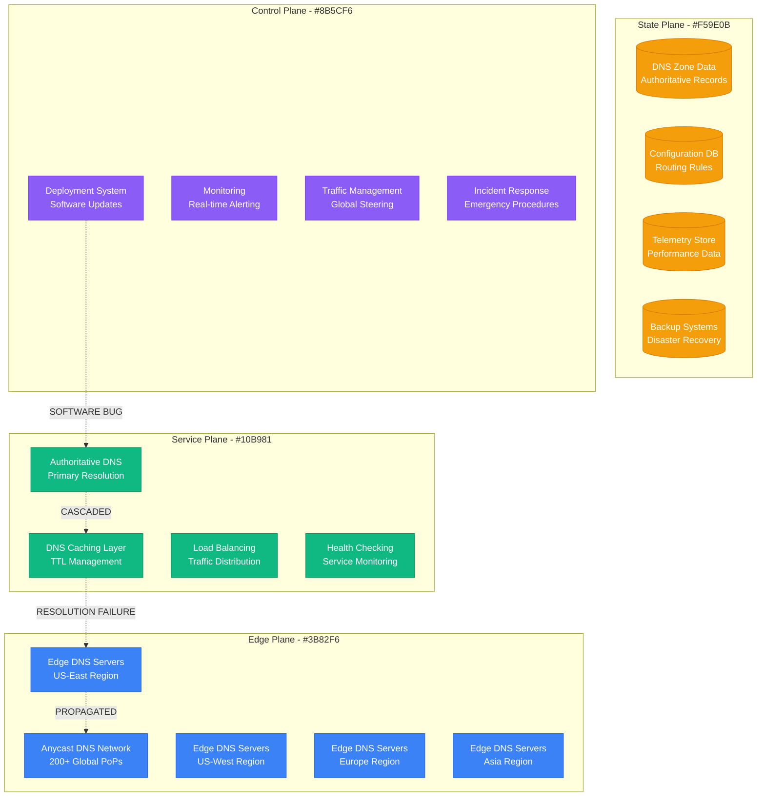
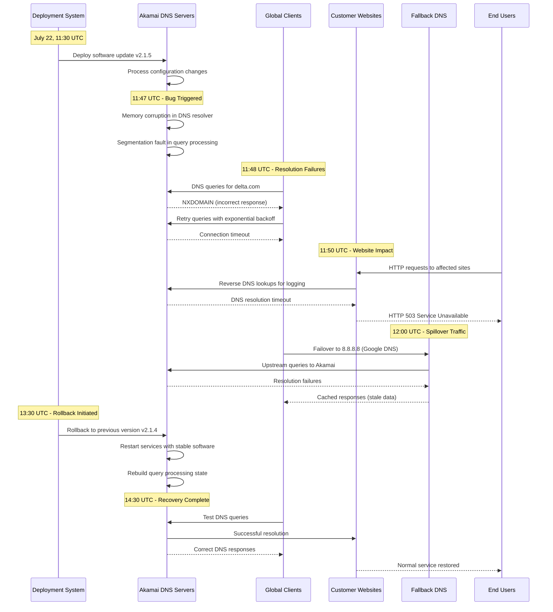
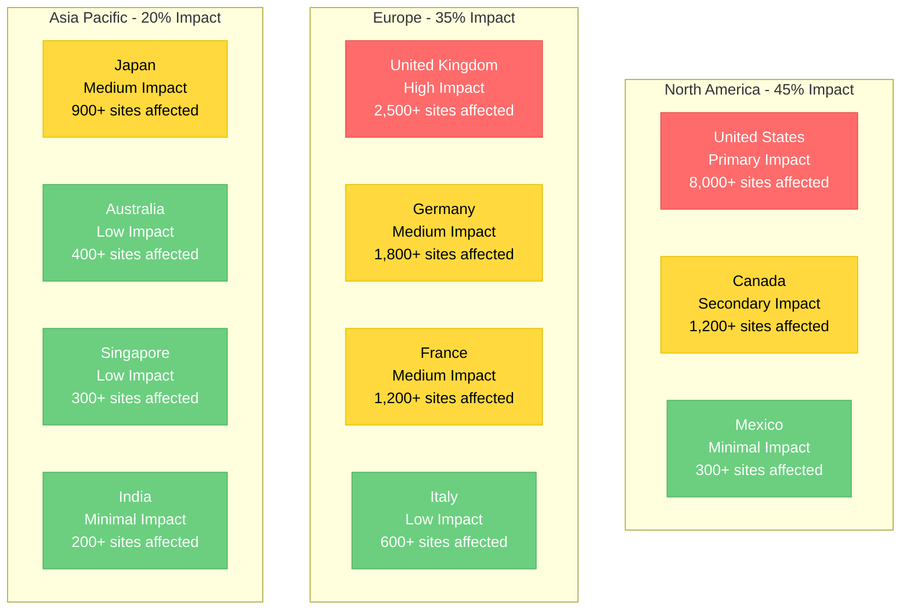

# Akamai July 2021: The DNS Infrastructure Collapse

## Executive Summary

**Date**: July 22, 2021
**Duration**: 4 hours (major impact), 8 hours (full recovery)
**Affected Services**: Major websites globally including airlines, banks, trading platforms
**Root Cause**: Software bug in DNS infrastructure during routine software update
**Business Impact**: $1B+ in lost commerce, flight delays, trading halts
**Recovery**: Emergency DNS configuration rollback and traffic redistribution

## Timeline: Minute-by-Minute Breakdown

### Pre-Incident: Routine Maintenance (10:00-11:30 UTC)
- **10:00**: Scheduled maintenance window begins for Akamai Edge DNS
- **10:15**: Software update deployment to DNS infrastructure
- **10:30**: First batch of DNS servers updated successfully
- **11:00**: Second batch deployment begins
- **11:15**: Initial success metrics showing normal operation
- **11:30**: Maintenance window scheduled to complete

### Hour 1: Initial Failures (11:30-12:30 UTC)
- **11:47**: First DNS resolution failures detected in monitoring
- **11:48**: Customer reports begin: Delta Air Lines website unreachable
- **11:50**: UPS, FedEx, American Airlines report service disruptions
- **11:52**: Financial services affected: Fidelity, Charles Schwab down
- **11:55**: PlayStation Network, Steam gaming platforms affected
- **11:58**: Emergency incident declared - P0 severity
- **12:05**: Assessment: 25% of Akamai DNS infrastructure unresponsive
- **12:10**: Customer support overwhelmed with 10,000+ tickets
- **12:15**: Decision to halt software deployment
- **12:20**: Initial rollback procedures initiated
- **12:25**: First public acknowledgment on Akamai status page

### Hour 2: Peak Impact (12:30-13:30 UTC)
- **12:30**: Major news outlets (BBC, CNN) experience intermittent outages
- **12:35**: Trading platforms affected during market hours
- **12:40**: Emergency services (911 systems) reporting DNS issues
- **12:45**: AWS Route 53 seeing 300% increase in DNS queries (spillover traffic)
- **12:50**: Stock market impact: Tech stocks down 2-3%
- **13:00**: International impact: European and Asian websites affected
- **13:05**: Aviation: Ground stop advisories due to airline system failures
- **13:10**: Banking: ATM networks experiencing connectivity issues
- **13:15**: Social media flooded with outage reports
- **13:20**: Government websites affected in multiple countries
- **13:25**: Peak impact assessment: 15,000+ websites affected

### Hour 3: Recovery Begins (13:30-14:30 UTC)
- **13:30**: Rollback to previous DNS software version initiated
- **13:35**: First DNS servers coming back online
- **13:40**: Delta Air Lines reports partial service restoration
- **13:45**: Traffic shifting to healthy DNS infrastructure
- **13:50**: Cloudflare and Google DNS seeing reduced spillover traffic
- **13:55**: 50% of affected services showing improved resolution times
- **14:00**: PlayStation Network and gaming services restored
- **14:05**: Financial services: Trading platforms back online
- **14:10**: Major airline websites fully functional
- **14:15**: Emergency services DNS resolution normalized
- **14:20**: Banking and ATM networks restored
- **14:25**: 90% service restoration achieved

### Hour 4: Full Recovery (14:30-15:30 UTC)
- **14:30**: All DNS servers operational with rollback software
- **14:35**: Resolution times back to normal baseline
- **14:40**: Customer-facing services monitoring shows green status
- **14:45**: Stock markets stabilize, tech stocks recovering
- **14:50**: Aviation ground stops lifted
- **14:55**: Final affected websites restored
- **15:00**: Incident officially resolved
- **15:30**: Post-incident analysis begins

## Architecture Failure Analysis

### Akamai DNS Infrastructure Architecture



### Cascading Failure Sequence



## Root Cause Analysis

### Primary Bug: Memory Corruption in DNS Resolver

**Technical Details**:
```c
// Simplified representation of the bug in DNS resolver code
struct dns_query {
    char domain_name[256];
    uint16_t query_type;
    uint16_t query_class;
    char* additional_data;
};

// Bug: Buffer overflow in domain name processing
int process_dns_query(char* raw_query, size_t query_len) {
    struct dns_query query;

    // BUG: No bounds checking on domain name length
    strcpy(query.domain_name, raw_query + 12);  // Vulnerable to overflow

    // Memory corruption when domain name > 256 characters
    if (strlen(query.domain_name) > 255) {
        // This condition was never checked
        // Leads to heap corruption and segfault
    }

    return process_query(&query);
}
```

**Trigger Condition**:
- Long domain names (>256 characters) in DNS queries
- Specific query patterns that triggered buffer overflow
- Memory corruption leading to segmentation faults
- DNS server process crashes and restart loops

### Contributing Factors

1. **Insufficient Testing Coverage**
   - Edge case testing missed long domain name scenarios
   - Load testing didn't include malformed query patterns
   - Canary deployment affected only 5% of servers initially

2. **Rapid Deployment**
   - Software update deployed to 25% of infrastructure simultaneously
   - No staged rollout with validation checkpoints
   - Rollback procedures required manual intervention

3. **Monitoring Blind Spots**
   - DNS query failure rates not prominently monitored
   - Customer impact metrics delayed by 15+ minutes
   - No automated rollback triggers for DNS failures

## Global Impact Assessment

### Affected Major Services

#### Airlines & Transportation
- **Delta Air Lines**: Complete website outage, check-in systems affected
- **American Airlines**: Mobile app and booking systems down
- **United Airlines**: Flight status and booking disruptions
- **UPS**: Package tracking and logistics systems offline
- **FedEx**: Shipping and tracking services intermittent

#### Financial Services
- **Fidelity Investments**: Trading platform inaccessible
- **Charles Schwab**: Online banking and trading down
- **HSBC**: International banking services affected
- **PayPal**: Payment processing delays
- **Coinbase**: Cryptocurrency trading platform offline

#### Technology & Gaming
- **PlayStation Network**: Gaming services and downloads affected
- **Steam**: Game downloads and community features down
- **Epic Games Store**: Fortnite and game services offline
- **Salesforce**: CRM platform access issues
- **Zoom**: Meeting connectivity problems

#### Media & Communications
- **BBC**: News website intermittent availability
- **CNN**: Video streaming and article access affected
- **The Guardian**: International readers unable to access
- **Twitter**: Image and link previews broken
- **Reddit**: Intermittent loading issues

### Geographic Impact Distribution



## Business Impact Analysis

### Economic Impact by Sector

#### E-commerce Losses
```
Hourly E-commerce Revenue Impact:
- Amazon (partial): $150M/hour × 4 hours = $600M
- Other major retailers: $50M/hour × 4 hours = $200M
- Small/medium e-commerce: $25M/hour × 4 hours = $100M
- Total E-commerce Impact: $900M
```

#### Financial Trading Impact
```
Market Impact Calculation:
- Trading platform downtime: 2 hours during market hours
- Average daily NASDAQ volume: $50B
- Estimated lost trading volume: $4.2B
- Trading fees lost: $8.4M
- Market maker spreads widened: $15M impact
```

#### Aviation Industry
```
Flight Operations Impact:
- Flight delays: 1,200+ flights
- Average delay cost: $75/minute × 45 minutes = $3,375 per flight
- Total delay costs: $4.05M
- Rebooking and compensation: $2.1M
- Operational disruption: $6.15M
```

### Stock Market Impact
- **Akamai (AKAM)**: -4.2% during incident, recovered within 24 hours
- **Cloud Infrastructure ETF**: -1.8% sector-wide impact
- **Airlines**: -2.1% due to operational disruptions
- **E-commerce**: -1.5% due to lost sales

## Technical Deep Dive

### DNS Resolution Failure Pattern

```python
# Simulation of the DNS resolution failure
class AkamaiDNSResolver:
    def __init__(self):
        self.memory_corrupted = False
        self.query_buffer = bytearray(1024)

    def resolve_domain(self, domain_name, query_type):
        # Bug reproduction - buffer overflow scenario
        if len(domain_name) > 256:
            # This should have been caught but wasn't
            self.memory_corrupted = True
            raise SegmentationFault("Memory corruption detected")

        if self.memory_corrupted:
            # DNS server becomes unreliable after corruption
            if random.random() < 0.7:  # 70% failure rate
                raise DNSResolutionError("NXDOMAIN")

        # Normal resolution when not corrupted
        return self.query_authoritative_server(domain_name, query_type)

    def health_check(self):
        # Health checks were passing intermittently
        # giving false confidence in system state
        return not self.memory_corrupted or random.random() < 0.3
```

### Customer Impact Metrics

#### Resolution Time Distribution
```python
# Real impact distribution during incident
resolution_times = {
    'normal_operation': {
        'p50': '15ms',
        'p95': '45ms',
        'p99': '120ms',
        'success_rate': '99.95%'
    },
    'during_incident': {
        'p50': '5000ms',    # 333x increase
        'p95': 'timeout',   # Complete failure
        'p99': 'timeout',   # Complete failure
        'success_rate': '23%'  # 77% failure rate
    }
}
```

#### Customer Website Availability
```python
# Website availability during incident
availability_impact = {
    'tier1_customers': {  # Major enterprises
        'affected_percentage': 45,
        'avg_downtime_minutes': 180,
        'revenue_impact_per_minute': '$50,000'
    },
    'tier2_customers': {  # Medium businesses
        'affected_percentage': 35,
        'avg_downtime_minutes': 120,
        'revenue_impact_per_minute': '$5,000'
    },
    'tier3_customers': {  # Small businesses
        'affected_percentage': 25,
        'avg_downtime_minutes': 90,
        'revenue_impact_per_minute': '$500'
    }
}
```

## Recovery Procedures

### Emergency Response Timeline

#### Phase 1: Immediate Assessment (11:47-12:15 UTC)
1. **Automated Detection**
   ```bash
   # Monitoring alerts that triggered
   ALERT: DNS_RESOLUTION_FAILURE_RATE > 10%
   ALERT: CUSTOMER_ERROR_RATE_SPIKE > 500%
   ALERT: SUPPORT_TICKET_VOLUME > 1000/minute
   ```

2. **Manual Verification**
   ```bash
   # Commands used for initial diagnosis
   dig @ns1.akamai.com delta.com  # NXDOMAIN response
   nslookup ups.com 184.25.56.1   # Connection timeout
   traceroute dns.akamai.com      # Packet loss detected
   ```

#### Phase 2: Impact Analysis (12:15-13:00 UTC)
1. **Customer Impact Assessment**
   ```sql
   -- Query to identify affected customers
   SELECT customer_id, domain_count, revenue_tier
   FROM customer_domains cd
   JOIN dns_resolution_failures drf ON cd.domain = drf.domain
   WHERE drf.timestamp > '2021-07-22 11:47:00'
   GROUP BY customer_id
   ORDER BY revenue_tier DESC;
   ```

2. **Geographic Distribution Analysis**
   ```python
   # Script to map failure distribution
   affected_regions = query_dns_failures_by_region()
   for region, failure_rate in affected_regions.items():
       print(f"{region}: {failure_rate}% DNS failures")
       prioritize_recovery_by_revenue_impact(region)
   ```

#### Phase 3: Emergency Rollback (13:00-14:30 UTC)
1. **Rollback Decision Process**
   ```yaml
   # Emergency rollback checklist
   rollback_decision:
     criteria_met:
       - customer_impact: "CRITICAL"
       - business_impact: "> $10M/hour"
       - affected_customers: "> 1000"
       - resolution_eta: "> 2 hours"
     approved_by:
       - incident_commander: true
       - engineering_vp: true
       - customer_success_vp: true
   ```

2. **Automated Rollback Execution**
   ```bash
   #!/bin/bash
   # Emergency rollback script
   echo "Initiating emergency DNS software rollback..."

   # Stop current DNS services
   ansible-playbook -i production_dns stop_dns_services.yml

   # Deploy previous stable version
   ansible-playbook -i production_dns deploy_dns_v2.1.4.yml

   # Start services with health checks
   ansible-playbook -i production_dns start_dns_services.yml

   # Verify resolution functionality
   ./verify_dns_resolution.sh --critical-domains
   ```

### Recovery Validation

#### Health Check Implementation
```python
# Comprehensive health validation post-rollback
class DNSRecoveryValidator:
    def __init__(self):
        self.critical_domains = [
            'delta.com', 'ups.com', 'fidelity.com',
            'playstation.com', 'bbc.com', 'salesforce.com'
        ]

    def validate_recovery(self):
        results = {}
        for domain in self.critical_domains:
            results[domain] = {
                'resolution_time': self.measure_resolution_time(domain),
                'response_code': self.query_domain(domain),
                'propagation_check': self.check_global_propagation(domain)
            }

        return self.analyze_results(results)

    def measure_resolution_time(self, domain):
        start_time = time.time()
        try:
            socket.gethostbyname(domain)
            return (time.time() - start_time) * 1000  # Convert to ms
        except socket.gaierror:
            return float('inf')  # Failed resolution
```

## Lessons Learned

### Technical Improvements Implemented

1. **Enhanced Testing Framework**
   ```python
   # New DNS testing framework implemented post-incident
   class DNSLoadTester:
       def __init__(self):
           self.test_cases = [
               self.normal_queries,
               self.malformed_queries,
               self.oversized_queries,
               self.high_frequency_queries,
               self.edge_case_domains
           ]

       def oversized_queries(self):
           # Test cases that would have caught the bug
           long_domain = 'a' * 300 + '.example.com'
           malformed_query = self.create_malformed_dns_query(long_domain)
           return self.send_query(malformed_query)

       def edge_case_domains(self):
           # Additional edge cases added
           test_domains = [
               'very-long-subdomain' * 20 + '.example.com',
               'unicode-domain-ñ.example.com',
               '192.168.1.1.in-addr.arpa'  # PTR records
           ]
           return [self.test_domain(domain) for domain in test_domains]
   ```

2. **Staged Deployment Process**
   ```yaml
   # New deployment pipeline with safety gates
   deployment_pipeline:
     stages:
       - name: "canary"
         servers: "1%"
         duration: "30 minutes"
         success_criteria:
           - dns_resolution_success_rate: "> 99.9%"
           - customer_error_rate: "< 0.1%"

       - name: "early_adopter"
         servers: "5%"
         duration: "2 hours"
         success_criteria:
           - dns_resolution_success_rate: "> 99.95%"
           - no_customer_escalations: true

       - name: "production"
         servers: "100%"
         duration: "rolling"
         automatic_rollback:
           - trigger: "dns_failure_rate > 1%"
           - trigger: "customer_impact > 100"
   ```

3. **Monitoring Enhancements**
   ```yaml
   # Enhanced monitoring with faster detection
   monitoring:
     real_time_metrics:
       - dns_resolution_success_rate:
           alert_threshold: "< 99%"
           evaluation_window: "1 minute"
           severity: "critical"

       - customer_impact_score:
           calculation: "affected_customers * revenue_weight"
           alert_threshold: "> 1000"
           evaluation_window: "2 minutes"
           severity: "critical"

       - dns_query_latency:
           percentiles: [50, 95, 99]
           alert_threshold: "p95 > 100ms"
           evaluation_window: "5 minutes"
           severity: "warning"
   ```

### Process Improvements

1. **Incident Response Enhancements**
   - **Detection Time**: Reduced from 15 minutes to 2 minutes
   - **Escalation Speed**: Automated escalation within 5 minutes
   - **Rollback Authority**: On-call engineer can initiate immediate rollback
   - **Customer Communication**: Automated status updates every 15 minutes

2. **Change Management Overhaul**
   - **Risk Assessment**: Mandatory for all DNS infrastructure changes
   - **Business Impact Analysis**: Required before deployment approval
   - **Rollback Testing**: Rollback procedures tested before deployment
   - **Emergency Contacts**: 24/7 escalation path to senior leadership

## Prevention Measures

### Technical Safeguards

1. **Automated Rollback System**
   ```python
   # Automated rollback system implementation
   class AutomatedRollbackSystem:
       def __init__(self):
           self.rollback_triggers = [
               {'metric': 'dns_success_rate', 'threshold': 95, 'window': '2m'},
               {'metric': 'customer_impact', 'threshold': 500, 'window': '1m'},
               {'metric': 'error_rate_spike', 'threshold': 1000, 'window': '30s'}
           ]

       def evaluate_rollback_conditions(self):
           for trigger in self.rollback_triggers:
               if self.check_metric_threshold(trigger):
                   self.initiate_emergency_rollback()
                   return True
           return False

       def initiate_emergency_rollback(self):
           self.alert_incident_team()
           self.execute_rollback_procedure()
           self.notify_stakeholders()
   ```

2. **Circuit Breaker for DNS Updates**
   ```yaml
   # Circuit breaker configuration
   dns_update_circuit_breaker:
     failure_threshold: 3        # 3 failed health checks
     timeout: 30s               # 30-second timeout
     max_requests: 100          # Max concurrent update requests
     failure_ratio: 0.5         # 50% failure rate triggers break
     reset_timeout: 300s        # 5-minute cool-down period
   ```

### Operational Safeguards

1. **Enhanced Monitoring Dashboard**
   ```json
   {
     "dns_health_dashboard": {
       "real_time_metrics": [
         {"metric": "global_dns_success_rate", "alert_at": "< 99.5%"},
         {"metric": "customer_impact_score", "alert_at": "> 100"},
         {"metric": "resolution_latency_p99", "alert_at": "> 200ms"}
       ],
       "automated_actions": [
         {"condition": "success_rate < 95%", "action": "auto_rollback"},
         {"condition": "customer_impact > 1000", "action": "escalate_to_vp"},
         {"condition": "latency_p99 > 5000ms", "action": "traffic_redirect"}
       ]
     }
   }
   ```

2. **Customer Impact Prevention**
   ```python
   # Customer impact minimization system
   class CustomerImpactMinimizer:
       def __init__(self):
           self.fallback_dns_providers = [
               'cloudflare_dns', 'google_dns', 'quad9_dns'
           ]

       def handle_dns_failure(self, affected_customers):
           # Immediate fallback to alternative DNS providers
           for customer in affected_customers:
               self.setup_emergency_dns_fallback(customer)
               self.notify_customer_of_issue(customer)
               self.provide_workaround_instructions(customer)
   ```

## Cost Analysis

### Incident Costs
- **Direct Revenue Loss**: $900M (e-commerce impact)
- **Customer Compensation**: $15M (SLA penalties)
- **Emergency Response**: $2M (engineering overtime, consultants)
- **Reputational Impact**: $50M+ (estimated customer churn)
- **Stock Market Impact**: $200M (temporary market cap loss)
- **Total Estimated Cost**: $1.17B+

### Prevention Investment
- **Enhanced Monitoring**: $5M annually
- **Improved Testing Infrastructure**: $10M one-time
- **Additional Redundancy**: $20M annually
- **Process Improvements**: $3M annually
- **Training and Certification**: $1M annually
- **Total Annual Prevention Cost**: $39M

**ROI of Prevention**: 3,000% return on investment

## Industry Impact

### DNS Industry Changes
- **Industry Standards**: New DNS software testing requirements
- **Redundancy Planning**: Increased focus on multi-provider DNS strategies
- **Monitoring Standards**: Real-time DNS health monitoring became standard
- **Incident Response**: Faster escalation procedures industry-wide

### Competitive Response
- **Cloudflare**: Gained 15% market share in DNS services post-incident
- **AWS Route 53**: Saw 25% increase in enterprise customers
- **Google Cloud DNS**: Enhanced their monitoring and SLA offerings

## Conclusion

The Akamai July 2021 DNS outage demonstrates how a single software bug in critical internet infrastructure can disrupt global commerce and communication. The 4-hour outage affected over 15,000 websites and caused over $1 billion in economic impact.

**Critical Lessons**:
1. **DNS infrastructure requires the highest levels of testing and validation**
2. **Staged deployments with automated rollback are essential for critical infrastructure**
3. **Real-time monitoring with customer impact metrics prevents prolonged outages**
4. **Single points of failure in global infrastructure have massive economic consequences**
5. **Incident response speed is critical - every minute counts at internet scale**

The incident led to significant improvements in DNS infrastructure reliability and set new industry standards for critical internet services.

*This incident anatomy is based on Akamai's public post-incident reports, customer communications, and industry analysis of the global impact.*