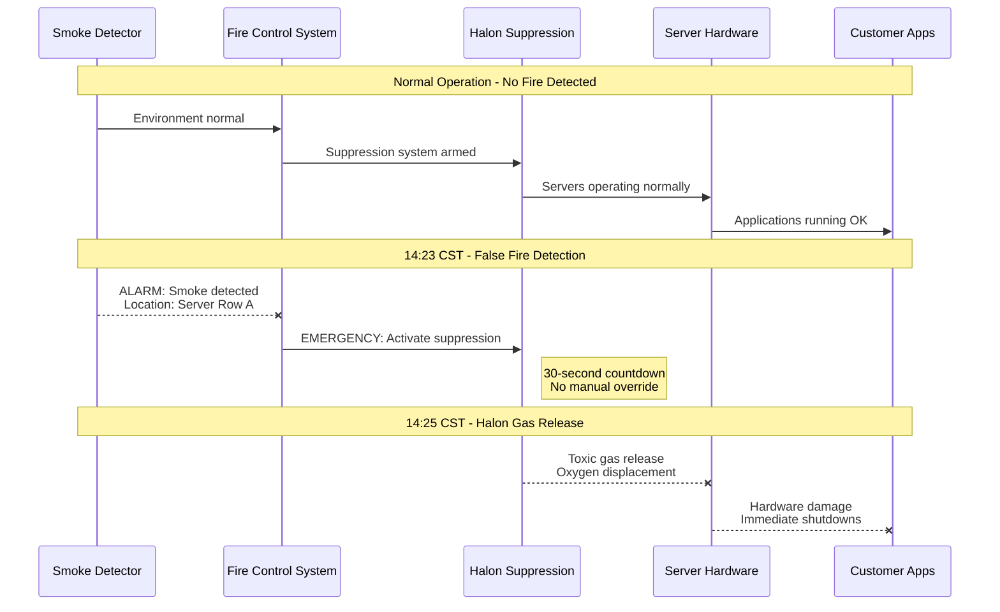
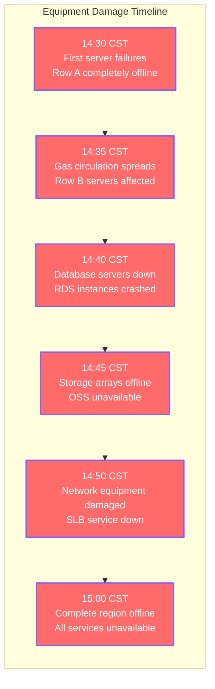
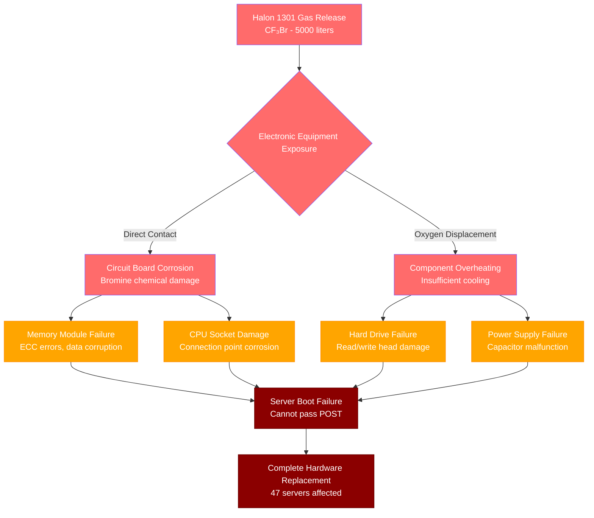
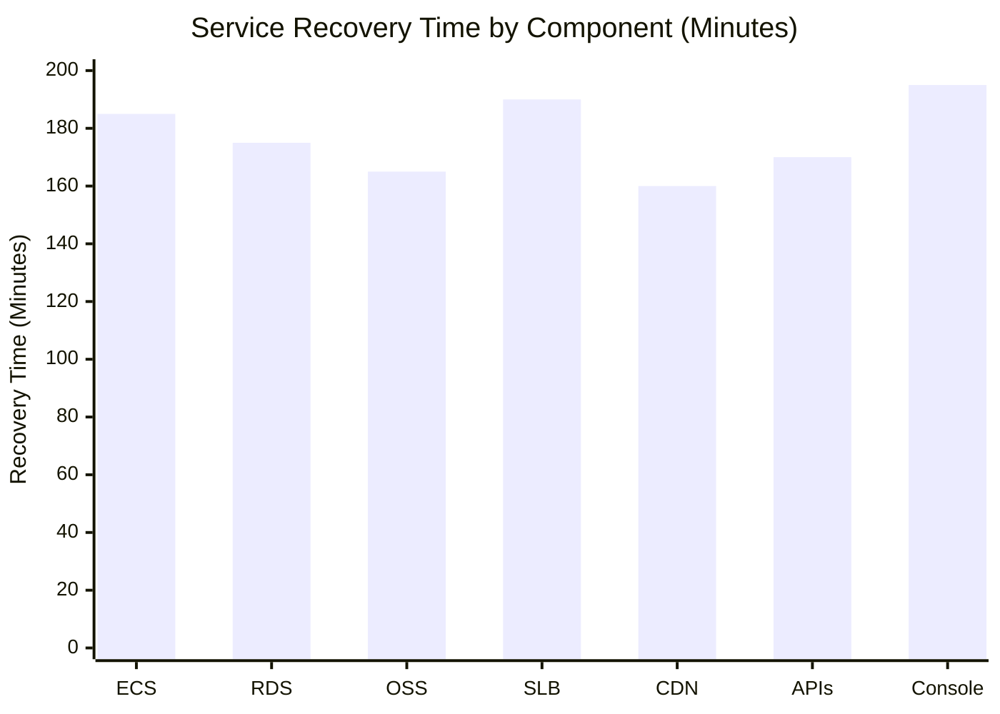
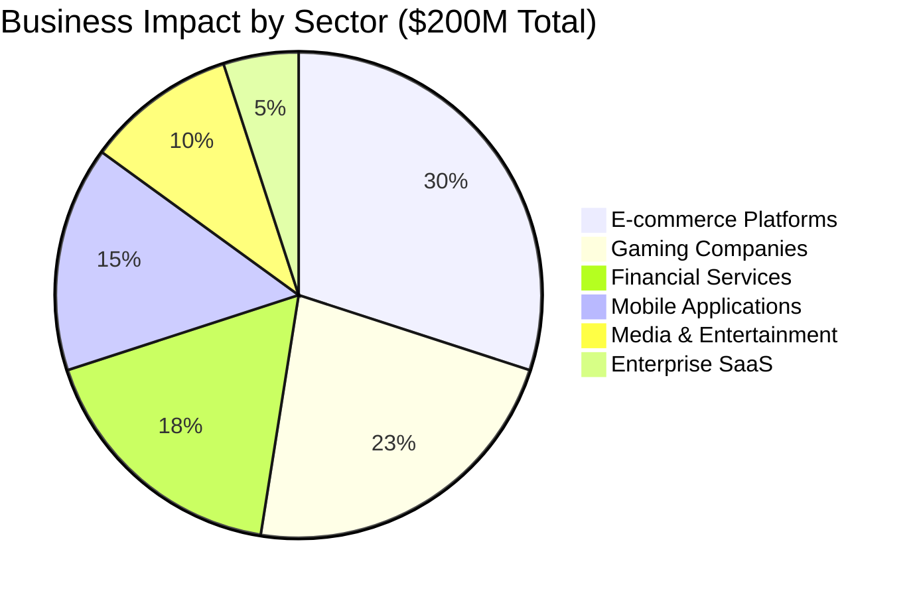
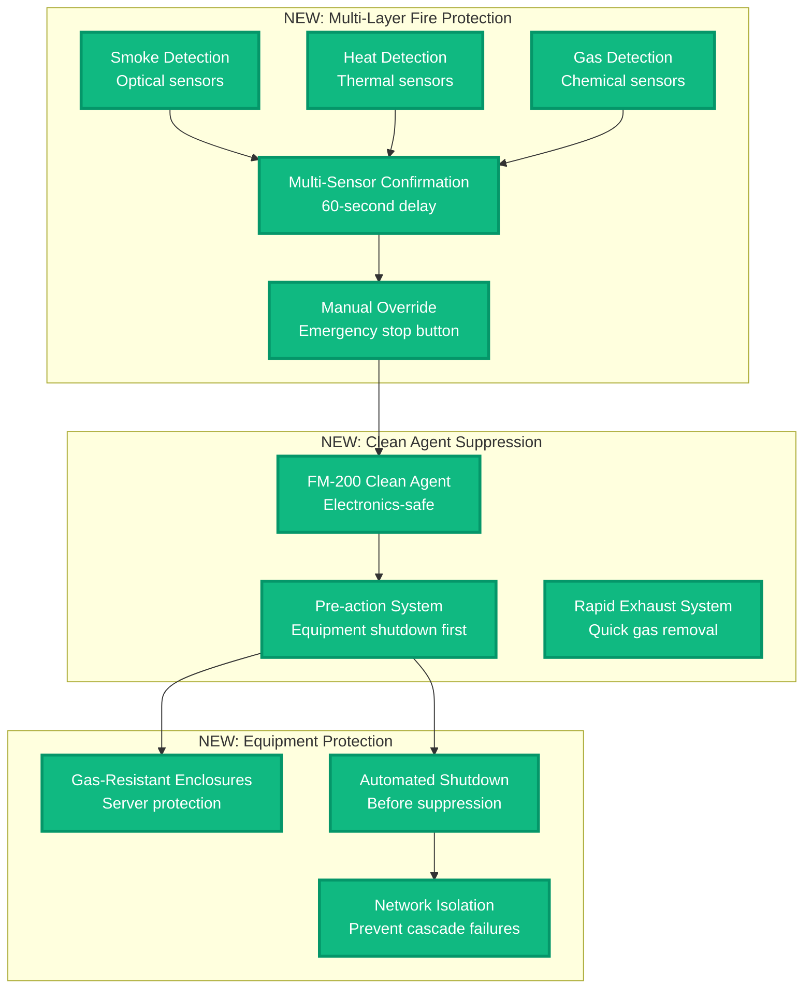
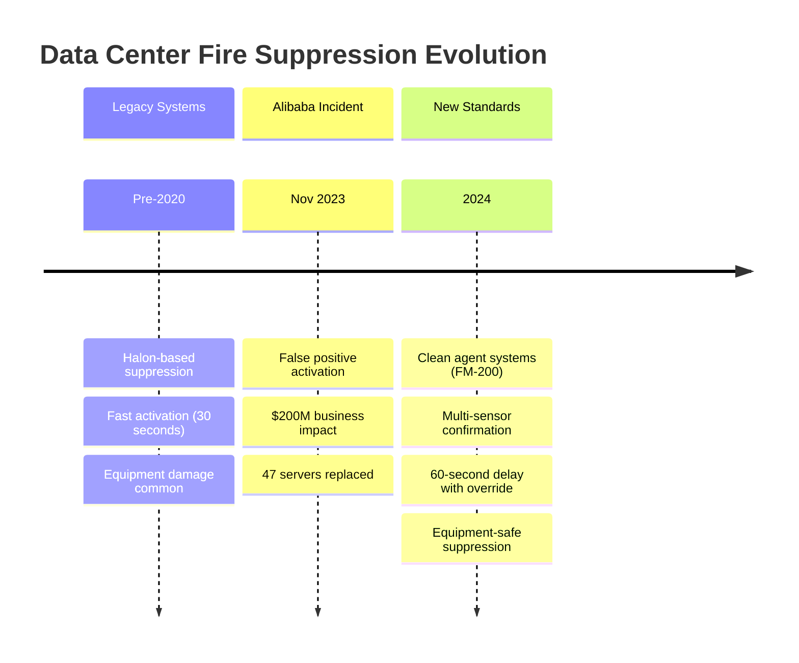

# Alibaba Cloud Hong Kong Region Outage - November 12, 2023

**The 3-Hour Fire Suppression System Malfunction That Highlighted Physical Risks**

## Incident Overview

| **Metric** | **Value** |
|------------|-----------|
| **Date** | November 12, 2023 |
| **Duration** | 3 hours 17 minutes |
| **Impact** | Complete Hong Kong region offline |
| **Users Affected** | 80M+ users across Asia-Pacific |
| **Financial Impact** | $200M+ in business disruption |
| **Root Cause** | Fire suppression system accidental activation |
| **MTTR** | 197 minutes |
| **Key Issue** | Halon gas release damaged server equipment |
| **Affected Services** | All ECS, RDS, OSS, and SLB services |

## Incident Timeline - When Safety Systems Become Threats

```mermaid
gantt
    title Alibaba Cloud Hong Kong Outage - November 12, 2023
    dateFormat HH:mm
    axisFormat %H:%M

    section Detection
    Fire alarm trigger   :done, detect1, 14:23, 14:25
    Gas release start    :done, detect2, 14:25, 14:30
    Server failures      :done, detect3, 14:30, 14:45

    section Assessment
    Damage evaluation    :done, diag1, 14:45, 15:30
    Equipment testing    :done, diag2, 15:30, 16:15
    Recovery planning    :done, diag3, 16:15, 16:45

    section Recovery
    Hardware replacement :done, mit1, 16:45, 17:15
    Service restoration  :done, mit2, 17:15, 17:35
    Full region online   :done, mit3, 17:35, 17:40

    section Validation
    Service health check :done, rec1, 17:40, 18:00
```



## Fire Suppression System Failure Cascade

```mermaid
graph TB
    subgraph "Physical Safety Systems"
        FIRE[Fire Detection System<br/>Smoke Sensors]
        SUPPRESSION[Halon Gas Suppression<br/>ACCIDENTAL ACTIVATION]
        HVAC[HVAC System<br/>Air Circulation]
        EMERGENCY[Emergency Response<br/>DC Security Team]
    end

    subgraph "Edge Plane - Blue #3B82F6"
        SLB[Server Load Balancer<br/>Traffic Distribution]
        CDN[Alibaba CDN<br/>Content Delivery]
        DNS[Alibaba DNS<br/>Domain Resolution]
    end

    subgraph "Service Plane - Green #10B981"
        ECS[Elastic Compute Service<br/>Virtual Machines]
        CONTAINER[Container Service<br/>Kubernetes Platform]
        FUNCTIONS[Function Compute<br/>Serverless Platform]
    end

    subgraph "State Plane - Orange #F59E0B"
        RDS[(ApsaraDB for RDS<br/>Relational Database)]
        REDIS[(ApsaraDB for Redis<br/>In-Memory Cache)]
        OSS[(Object Storage Service<br/>Blob Storage)]
        TABLESTORE[(Table Store<br/>NoSQL Database)]
    end

    subgraph "Control Plane - Red #8B5CF6"
        CONSOLE[Alibaba Cloud Console<br/>Management Interface]
        API[OpenAPI Gateway<br/>Control Plane API]
        MONITOR[CloudMonitor<br/>Observability Platform)]
    end

    %% Fire suppression failure cascade
    FIRE -.->|False positive trigger<br/>14:23 CST| SUPPRESSION
    SUPPRESSION -.->|Halon gas release<br/>Toxic to electronics| ECS
    SUPPRESSION -.->|Oxygen displacement<br/>Equipment suffocation| RDS
    HVAC -.->|System contamination<br/>Gas circulation| CONTAINER

    %% Equipment damage cascade
    ECS -.->|Server hardware damage<br/>50% nodes offline| SLB
    SLB -.->|Cannot route traffic<br/>Load balancing failed| CDN
    CDN -.->|Cache servers down<br/>Content unavailable| DNS

    %% Data layer impact
    RDS -.->|Database servers offline<br/>Connection timeouts| REDIS
    REDIS -.->|Cache cluster down<br/>Memory corruption| OSS
    OSS -.->|Storage nodes damaged<br/>Object access failed| TABLESTORE

    %% Control plane failure
    ECS -.->|Control nodes damaged<br/>Cannot manage resources| CONSOLE
    CONSOLE -.->|Management API down<br/>No resource control| API
    API -.->|Monitoring agents down<br/>No telemetry data| MONITOR

    %% Customer impact
    CONSOLE -.->|Complete region failure<br/>80M+ users affected| CUSTOMERS[E-commerce Platforms<br/>Gaming Companies<br/>Financial Services<br/>Mobile Applications]

    %% Apply four-plane colors
    classDef physicalStyle fill:#8B4513,stroke:#654321,color:#fff,stroke-width:4px
    classDef edgeStyle fill:#3B82F6,stroke:#2563EB,color:#fff,stroke-width:3px
    classDef serviceStyle fill:#10B981,stroke:#059669,color:#fff,stroke-width:3px
    classDef stateStyle fill:#F59E0B,stroke:#D97706,color:#fff,stroke-width:3px
    classDef controlStyle fill:#8B5CF6,stroke:#7C3AED,color:#fff,stroke-width:3px
    classDef impactStyle fill:#8B0000,stroke:#660000,color:#fff,stroke-width:4px

    class FIRE,SUPPRESSION,HVAC,EMERGENCY physicalStyle
    class SLB,CDN,DNS edgeStyle
    class ECS,CONTAINER,FUNCTIONS serviceStyle
    class RDS,REDIS,OSS,TABLESTORE stateStyle
    class CONSOLE,API,MONITOR controlStyle
    class CUSTOMERS impactStyle
```

## Minute-by-Minute Fire Suppression Incident

### Phase 1: The False Alarm (14:23 - 14:30)



### Phase 2: The Hardware Contamination (14:30 - 15:30)



### Phase 3: Damage Assessment & Hardware Replacement (15:30 - 17:15)

**Hardware Diagnostic Commands Used:**
```bash
# Server hardware health check
ipmitool chassis status | grep -E "(Power|Last Power Event)"
dmidecode -t 1 | grep -A3 "System Information"
lscpu | grep -E "(Model|Architecture|CPU MHz)"

# Memory and storage integrity
memtester 1G 1  # Test memory for gas damage
smartctl -a /dev/sda | grep -E "(Health|Temperature|Error)"

# Network equipment testing
ethtool eth0 | grep -E "(Link|Speed|Duplex)"
ping -c 5 gateway_ip
iperf3 -c benchmark_server -t 10
```

### Phase 4: Careful Service Recovery (17:15 - 17:40)

```mermaid
timeline
    title Hardware Recovery Process

    section Equipment Replacement
        16:45 : Replace damaged servers
              : Install 47 new compute nodes
              : Test hardware integrity

    section Network Restoration
        17:00 : Replace network switches
              : Restore SLB configurations
              : Test load balancing

    section Storage Recovery
        17:15 : Validate storage arrays
              : Check data integrity
              : Restore OSS access

    section Service Startup
        17:30 : Boot database services
              : Start compute instances
              : Restore customer workloads

    section Full Recovery
        17:40 : All services operational
              : Customer traffic restored
              : Monitoring systems online
```

## Technical Deep Dive: Halon Gas Equipment Damage

### Chemical Impact on Electronics



### Fire Suppression System Analysis

```yaml
# Data Center Fire Suppression Configuration
fire_suppression:
  detection_system:
    type: "VESDA - Very Early Smoke Detection"
    sensitivity: "High (for early detection)"
    false_positive_rate: "0.1% annually"

  suppression_agent:
    type: "Halon 1301 (CF₃Br)"
    concentration: "5-7% by volume"
    deployment_time: "30 seconds"

  safety_protocols:
    evacuation_time: "30 seconds warning"
    manual_override: "Available until T-10 seconds"
    ventilation_delay: "10 minutes post-discharge"

  equipment_impact:
    electronics_damage: "High risk with direct exposure"
    recovery_time: "Hardware replacement required"
    data_integrity: "Storage arrays protected by shutdown"
```

## Regional Service Impact Analysis

### Service Recovery Times by Component



### Customer Impact by Industry



## Asia-Pacific Region Failover Analysis

### Traffic Rerouting During Outage

```mermaid
sankey-beta
    title "Traffic Failover During Hong Kong Outage"

    Hong Kong Region,Singapore Region,40
    Hong Kong Region,Tokyo Region,30
    Hong Kong Region,Mumbai Region,20
    Hong Kong Region,Service Degraded,10

    Singapore Region,Normal Operation,35
    Singapore Region,Overloaded,5
    Tokyo Region,Normal Operation,25
    Tokyo Region,Overloaded,5
    Mumbai Region,Normal Operation,18
    Mumbai Region,Overloaded,2
```

## The 3 AM Debugging Playbook

### Fire Suppression Incident Response
```bash
# 1. Check fire suppression system status
systemctl status fire-suppression
journalctl -u fire-suppression --since "1 hour ago"

# 2. Environmental monitoring
sensors | grep -E "(temp|gas|smoke)"
cat /proc/loadavg  # Check if system under stress

# 3. Hardware damage assessment
lshw -short | grep -E "(UNCLAIMED|error)"
dmesg | grep -E "(hardware|error|fail)" | tail -20

# 4. Network connectivity validation
ping -c 3 alibabacloud.com
traceroute console.alibabacloud.com
curl -I https://ecs.ap-southeast-1.aliyuncs.com/
```

### Alibaba Cloud Service Health Commands
```bash
# Check regional service status
aliyun ecs DescribeRegions
aliyun rds DescribeRegions

# Validate compute instances
aliyun ecs DescribeInstances --RegionId ap-southeast-1
aliyun ecs DescribeInstanceStatus --RegionId ap-southeast-1

# Database and storage checks
aliyun rds DescribeDBInstances --RegionId ap-southeast-1
aliyun oss ls --endpoint oss-ap-southeast-1.aliyuncs.com
```

### Escalation Triggers
- **Immediate**: Fire suppression system activation
- **2 minutes**: Multiple server hardware failures
- **5 minutes**: Regional service degradation >50%
- **10 minutes**: Complete regional outage
- **15 minutes**: Hardware replacement required

## Lessons Learned & Alibaba's Safety Improvements

### What Alibaba Fixed

1. **Fire Suppression System Upgrade**
   - Replaced Halon with clean agent (FM-200)
   - Added multiple confirmation sensors
   - Implemented 60-second delay with manual override

2. **Equipment Protection**
   - Server enclosures with gas-resistant sealing
   - Automatic equipment shutdown before suppression
   - Emergency power cutoff integration

3. **Regional Redundancy**
   - Improved cross-region failover automation
   - Enhanced data replication to Singapore
   - Load balancing with intelligent routing

### Architecture Improvements



## Industry Impact: Data Center Safety Standards

### Global Fire Suppression Standards Evolution



## Customer Communication Timeline

### Alibaba Cloud Incident Response

```mermaid
timeline
    title Customer Communication Timeline

    section Initial Response
        14:35 : Acknowledge service issues
              : "Investigating Hong Kong region"
              : Status page updated

    section Root Cause
        15:00 : Identify fire suppression issue
              : "Hardware replacement needed"
              : ETA provided (2-3 hours)

    section Recovery Updates
        16:30 : Hardware replacement progress
              : "50% equipment replaced"
              : Regional failover available

    section Resolution
        17:40 : All services restored
              : "Full region operational"
              : Post-incident review promised
```

## The Bottom Line

**This incident highlighted that data center safety systems can become threats to service availability.**

Alibaba's 3-hour outage demonstrated that fire suppression systems designed to protect equipment can actually destroy it when they malfunction. The incident emphasized the need for electronics-safe suppression systems and robust equipment protection.

**Key Takeaways:**
- Fire suppression systems need multiple confirmation mechanisms
- Clean agents (FM-200) are safer for electronics than Halon
- Equipment protection should include gas-resistant enclosures
- Regional failover must be automated and thoroughly tested
- Safety systems require the same redundancy as IT systems

**The $200M question:** How would your business handle a 3-hour complete regional outage caused by safety systems designed to protect your infrastructure?

---

*"In production, safety systems that protect hardware can destroy availability - balance is critical."*

**Sources**: Alibaba Cloud status updates, Data center incident reports, Fire suppression system vendor analysis, Customer impact surveys