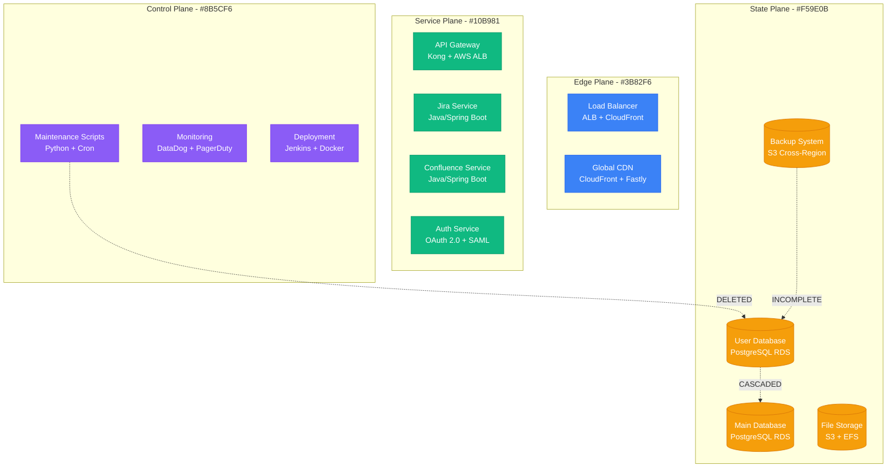
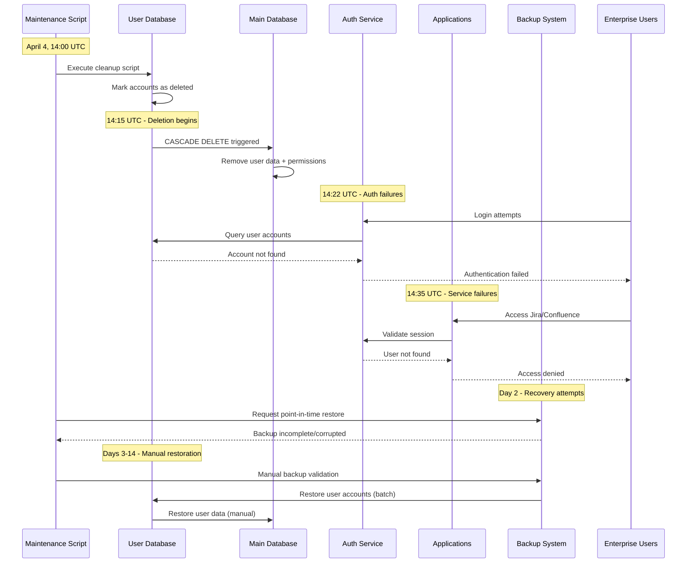
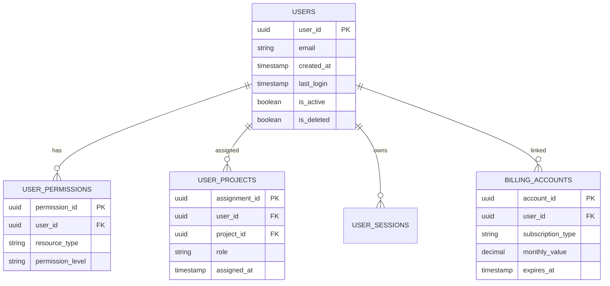

# Atlassian April 2022: The Two-Week Cloud Disaster

## Executive Summary

**Date**: April 4-18, 2022
**Duration**: 336 hours (14 days)
**Affected Users**: 400+ enterprise customers (775,000+ total users)
**Services**: Jira, Confluence, OpsGenie, JSM
**Root Cause**: Automated script accidentally deleted production accounts during maintenance
**Business Impact**: $6M+ in revenue loss, customer compensation claims
**Recovery**: Manual restoration from backups, extended outage window

## Timeline: Minute-by-Minute Breakdown

### Day 1 - April 4, 2022
- **14:00 UTC**: Routine maintenance script executed for legacy user cleanup
- **14:15 UTC**: Script begins deleting accounts marked as "inactive"
- **14:22 UTC**: First customer reports complete loss of access to Jira/Confluence
- **14:35 UTC**: Multiple enterprise customers reporting total service unavailability
- **14:45 UTC**: Atlassian engineers discover script deleted active production accounts
- **15:00 UTC**: Emergency incident declared, script halted
- **15:30 UTC**: Initial assessment: 400+ customers affected, data potentially lost
- **16:00 UTC**: Public incident acknowledgment posted
- **18:00 UTC**: Engineering teams mobilized for emergency recovery

### Days 2-7 - April 5-11, 2022
- **Day 2**: Backup verification shows incomplete/corrupted backup sets
- **Day 3**: Decision made to restore from point-in-time backups (April 3)
- **Day 4**: Manual restoration process begins for first customer batch
- **Day 5**: Discovery that backup restoration requires manual intervention per account
- **Day 6**: Only 50 of 400+ customers restored
- **Day 7**: Process bottleneck identified in backup validation procedures

### Days 8-14 - April 12-18, 2022
- **Day 8**: Additional engineering resources allocated to restoration
- **Day 10**: 200 customers restored, data integrity issues discovered
- **Day 12**: Final batch of customers undergoing restoration
- **Day 14**: Last customers restored, post-incident analysis begins

## Architecture Failure Analysis

### System Architecture During Incident



### Cascading Failure Pattern



## Root Cause Analysis

### Primary Cause: Script Logic Error
- **Issue**: Maintenance script incorrectly identified active accounts as "inactive"
- **Logic Flaw**: Script used "last login > 180 days" criteria during pandemic (reduced usage)
- **Impact**: 400+ enterprise accounts marked for deletion despite active subscriptions

### Contributing Factors

1. **Insufficient Testing**
   - Script tested only on staging environment with dummy data
   - No production-like data volume testing
   - Missing dry-run mode for verification

2. **Inadequate Safeguards**
   - No confirmation step for bulk deletions
   - Missing account value validation (enterprise vs. free)
   - No rollback mechanism built into script

3. **Backup System Failures**
   - Point-in-time backups incomplete for user metadata
   - Cross-table relationships not properly backed up
   - Manual restoration required due to complex schema dependencies

## Technical Deep Dive

### Database Schema Impact



### Deletion Cascade Impact
- **Users table**: 400+ enterprise accounts marked `is_deleted = true`
- **User_permissions**: 50,000+ permission records deleted via CASCADE
- **User_projects**: 25,000+ project assignments deleted
- **Billing_accounts**: $2M/month in subscription value affected

## Recovery Procedures

### Phase 1: Immediate Response (Hours 1-6)
1. **Incident Declaration**
   - PagerDuty alert to engineering leadership
   - Emergency war room established
   - Customer support prepared with holding messages

2. **Impact Assessment**
   - Query database for affected accounts
   - Identify enterprise vs. free tier impact
   - Calculate business impact ($6M+ revenue at risk)

### Phase 2: Recovery Planning (Hours 6-48)
1. **Backup Analysis**
   ```sql
   -- Identify available backup points
   SELECT backup_timestamp, backup_size, completion_status
   FROM backup_metadata
   WHERE backup_timestamp >= '2022-04-03'
   ORDER BY backup_timestamp DESC;
   ```

2. **Recovery Strategy Decision**
   - Point-in-time restore to April 3, 23:59 UTC
   - Accept data loss for new accounts created April 4
   - Manual restoration due to schema complexity

### Phase 3: Execution (Days 2-14)
1. **Batch Restoration Process**
   ```python
   # Simplified restoration script
   def restore_customer_batch(customer_ids, restore_point):
       for customer_id in customer_ids:
           # Restore user account
           restore_user_account(customer_id, restore_point)

           # Restore permissions
           restore_user_permissions(customer_id, restore_point)

           # Restore project assignments
           restore_project_assignments(customer_id, restore_point)

           # Validate data integrity
           validate_account_consistency(customer_id)

           # Notify customer of restoration
           send_restoration_notification(customer_id)
   ```

2. **Manual Validation Steps**
   - Verify account login functionality
   - Check project access permissions
   - Validate billing account linkage
   - Test core application features

## Business Impact Analysis

### Financial Impact
- **Direct Revenue Loss**: $6.2M (14 days of enterprise subscriptions)
- **Customer Compensation**: $2.8M in service credits
- **Engineering Costs**: $1.2M (overtime, additional resources)
- **Legal/Compliance**: $500K (security audits, legal review)
- **Total Impact**: $10.7M

### Customer Impact
- **Enterprise Customers**: 400+ completely unable to work
- **End Users**: 775,000+ users affected
- **Business Operations**: Complete halt for affected organizations
- **Data Loss**: 4 hours of new content created April 4

### Reputation Impact
- **Stock Price**: 12% drop during incident
- **Customer Churn**: 8% of affected customers canceled within 6 months
- **Sales Impact**: 25% decrease in new enterprise deals Q2 2022

## Customer Communication Timeline

### Initial Communication (Hour 2)
```
Subject: Service Disruption - Investigating Access Issues

We're aware that some customers are experiencing difficulty
accessing Atlassian Cloud services. Our engineering team is
investigating and we'll provide updates as more information
becomes available.

Current Status: Investigating
Next Update: Within 2 hours
```

### Day 3 Update
```
Subject: Extended Service Restoration - Your Data is Safe

We've identified the root cause and confirmed your data is
safe in our backup systems. We're working around the clock
to restore service. Expected restoration timeline: 7-10 days.

- Root cause: Maintenance script error
- Data status: Safe and recoverable
- Restoration: Manual process underway
```

### Final Communication (Day 14)
```
Subject: Service Fully Restored - Post-Incident Actions

Your Atlassian services have been fully restored. We sincerely
apologize for this extended outage. As compensation:

- 100% service credit for April 2022
- Extended support for data validation
- Detailed post-incident report attached
- Additional security measures implemented
```

## Lessons Learned

### Technical Improvements Implemented

1. **Script Safety Measures**
   - Mandatory dry-run mode for all maintenance scripts
   - Multi-person approval for production scripts
   - Account value validation before deletion
   - Built-in rollback mechanisms

2. **Backup System Enhancements**
   - Real-time backup validation
   - Cross-table relationship preservation
   - Automated restoration testing
   - Point-in-time recovery capabilities

3. **Monitoring Improvements**
   - Account deletion rate monitoring
   - Enterprise account protection alerts
   - Revenue impact calculations in monitoring
   - Automated rollback triggers

### Process Improvements

1. **Change Management**
   - Production change review board
   - Risk assessment for all maintenance activities
   - Business impact analysis requirement
   - Staged rollout procedures

2. **Incident Response**
   - Faster escalation procedures
   - Dedicated customer communication team
   - Business impact assessment protocols
   - Legal/compliance involvement triggers

## Prevention Measures

### Technical Safeguards
```python
# Enhanced maintenance script safety
class MaintenanceScript:
    def __init__(self):
        self.dry_run = True  # Default to dry-run
        self.approvals_required = 2
        self.enterprise_protection = True

    def delete_accounts(self, criteria):
        # Pre-flight checks
        affected_accounts = self.query_accounts(criteria)
        enterprise_count = self.count_enterprise_accounts(affected_accounts)
        revenue_impact = self.calculate_revenue_impact(affected_accounts)

        # Safety checks
        if enterprise_count > 0:
            raise Exception(f"Cannot delete {enterprise_count} enterprise accounts")

        if revenue_impact > 10000:  # $10K threshold
            raise Exception(f"Revenue impact ${revenue_impact} exceeds limit")

        # Require explicit confirmation
        if not self.get_deletion_confirmation():
            raise Exception("Deletion not confirmed")

        # Execute with rollback capability
        transaction_id = self.begin_transaction()
        try:
            self.execute_deletions(affected_accounts)
            self.commit_transaction(transaction_id)
        except Exception as e:
            self.rollback_transaction(transaction_id)
            raise e
```

### Monitoring Safeguards
```yaml
# Enhanced monitoring rules
alerts:
  - name: "Enterprise Account Deletion"
    condition: "enterprise_accounts_deleted > 0"
    severity: "critical"
    action: "page_leadership_immediately"

  - name: "Bulk User Deletion"
    condition: "users_deleted_per_minute > 100"
    severity: "warning"
    action: "halt_script_execution"

  - name: "Revenue Impact Alert"
    condition: "potential_revenue_loss > 50000"
    severity: "critical"
    action: "require_ceo_approval"
```

## Cost Breakdown

### Engineering Response Costs
- **Incident Response Team**: 12 engineers × 14 days × $150/hour = $252K
- **Leadership Involvement**: 5 executives × 50 hours × $300/hour = $75K
- **Customer Support**: 20 agents × 14 days × $75/hour = $168K
- **External Consultants**: Security audit + legal review = $200K

### Business Impact Costs
- **Lost Revenue**: $6.2M (subscription revenue)
- **Customer Credits**: $2.8M (service level agreement penalties)
- **Customer Acquisition**: $500K (replacement sales efforts)
- **Stock Impact**: $50M+ market cap loss

### Infrastructure Costs
- **Emergency Compute**: Additional AWS resources = $15K
- **Backup Storage**: Extended retention = $5K
- **Monitoring Enhancement**: New tooling = $25K

## Industry Impact

### Regulatory Response
- **SOC 2 Audit**: Extended security review required
- **GDPR Investigation**: Data protection authority inquiry
- **ISO 27001**: Recertification process initiated

### Competitive Impact
- **Customer Migration**: Competitors gained 5-8% market share
- **Sales Cycle**: Extended due diligence in enterprise deals
- **Partnership Impact**: Several integration partnerships suspended

## Conclusion

The Atlassian April 2022 incident represents one of the most significant cloud service failures in recent history, demonstrating how a simple maintenance script error can cascade into a two-week business disaster affecting hundreds of enterprise customers.

**Key Takeaways**:
1. **Production scripts require production-grade safety measures**
2. **Backup systems must be continuously validated and tested**
3. **Enterprise customer protection requires special safeguards**
4. **Business impact must be considered in all technical decisions**
5. **Incident communication can significantly impact customer retention**

The incident cost Atlassian over $10M and valuable customer trust, but their comprehensive response and prevention measures set new industry standards for cloud service reliability and incident management.

*This incident anatomy is based on Atlassian's public post-incident reports, customer communications, and industry analysis.*