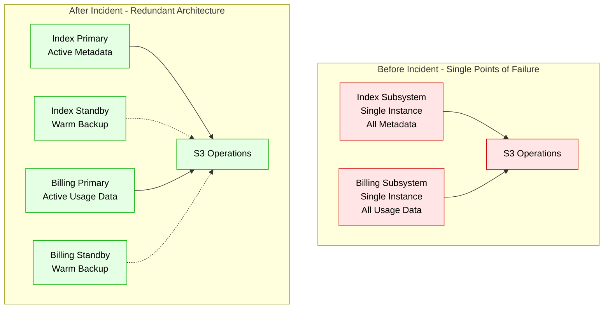

# AWS S3 2017 Global Outage - Incident Anatomy

## Incident Overview

**Date**: February 28, 2017
**Duration**: 4 hours 5 minutes (14:37 - 18:42 UTC)
**Impact**: Thousands of websites and services down globally
**Revenue Loss**: ~$150M (estimated across all affected companies)
**Root Cause**: Human error in debugging command - typo removed more S3 servers than intended
**Region**: US-East-1 (Virginia)

## Incident Timeline & Response Flow

```mermaid
graph TB
    subgraph Detection["T+0: Detection Phase - 14:37 UTC"]
        style Detection fill:#FFE5E5,stroke:#CC0000,color:#000

        Start["14:37:00<br/>━━━━━<br/>Debugging Command<br/>$ aws s3api remove-servers<br/>--target 'few servers'<br/>Typo: removed subsystem"]

        Alert1["14:37:30<br/>━━━━━<br/>S3 API Failures<br/>HTTP 503 Service Unavailable<br/>Index subsystem offline<br/>Billing subsystem offline"]

        Alert2["14:38:15<br/>━━━━━<br/>Cascade Begins<br/>EC2: Cannot launch instances<br/>EBS: Volume attach failures<br/>CloudFormation: Stack failures"]
    end

    subgraph Diagnosis["T+10min: Diagnosis Phase"]
        style Diagnosis fill:#FFF5E5,stroke:#FF8800,color:#000

        Incident["14:47:00<br/>━━━━━<br/>Major Incident<br/>SEV-1 declared<br/>All hands on deck<br/>Customer impact confirmed"]

        RootCause["14:52:00<br/>━━━━━<br/>Root Cause Found<br/>Index subsystem removed<br/>Metadata unavailable<br/>Bootstrapping required"]

        Impact["15:05:00<br/>━━━━━<br/>Full Impact Assessment<br/>50+ AWS services affected<br/>Thousands of customers<br/>Internet partially down"]
    end

    subgraph Mitigation["T+1hr: Mitigation Phase"]
        style Mitigation fill:#FFFFE5,stroke:#CCCC00,color:#000

        Restart1["15:30:00<br/>━━━━━<br/>Subsystem Restart<br/>Index subsystem reboot<br/>Cold start process<br/>Metadata rebuilding"]

        Progress1["16:15:00<br/>━━━━━<br/>Partial Recovery<br/>S3 GET requests working<br/>50% capacity restored<br/>Some services online"]

        Progress2["17:20:00<br/>━━━━━<br/>S3 PUT Working<br/>Write operations restored<br/>80% capacity back<br/>EC2 launches resume"]
    end

    subgraph Recovery["T+3hr: Recovery Phase"]
        style Recovery fill:#E5FFE5,stroke:#00AA00,color:#000

        Recovery1["18:00:00<br/>━━━━━<br/>Near Full Recovery<br/>95% S3 functionality<br/>Dependent services stable<br/>New instance launches OK"]

        Complete["18:42:00<br/>━━━━━<br/>Full Recovery<br/>All S3 operations normal<br/>All AWS services healthy<br/>Incident officially closed"]

        PostMortem["19:00:00<br/>━━━━━<br/>Post-Mortem<br/>Public statement released<br/>Internal investigation<br/>Process review initiated"]
    end

    %% Service Dependencies During Incident
    subgraph Services["Cascading Service Impact"]
        style Services fill:#F0F0F0,stroke:#666666,color:#000

        S3Impact["S3 Service<br/>━━━━━<br/>❌ Index subsystem down<br/>❌ Billing subsystem down<br/>❌ PUT/GET operations failing"]

        EC2Impact["EC2 Service<br/>━━━━━<br/>❌ Instance launch failures<br/>❌ EBS attach failures<br/>❌ Metadata service down"]

        EBSImpact["EBS Service<br/>━━━━━<br/>❌ New volume creation fails<br/>❌ Snapshot operations down<br/>❌ Volume attachments fail"]

        LambdaImpact["Lambda Service<br/>━━━━━<br/>❌ Function deployments fail<br/>❌ S3 triggers broken<br/>❌ Cold starts failing"]

        ExternalImpact["External Services<br/>━━━━━<br/>❌ Netflix, Airbnb, Slack down<br/>❌ Docker Hub offline<br/>❌ Thousands of websites"]
    end

    %% Internet Services Impact
    subgraph Internet["Internet Service Impact"]
        style Internet fill:#FFE0E0,stroke:#990000,color:#000

        WebsiteImpact["Major Websites<br/>━━━━━<br/>❌ Airbnb: Booking failures<br/>❌ Slack: File uploads broken<br/>❌ Quora: Images missing"]

        CloudImpact["Cloud Services<br/>━━━━━<br/>❌ Docker Hub: Push/pull fails<br/>❌ GitHub: Git LFS broken<br/>❌ Heroku: Deploy failures"]

        IoTImpact["IoT Devices<br/>━━━━━<br/>❌ Smart home devices offline<br/>❌ Nest thermostats unresponsive<br/>❌ Ring doorbells down"]
    end

    %% Flow connections
    Start --> Alert1
    Alert1 --> Alert2
    Alert2 --> Incident
    Incident --> RootCause
    RootCause --> Impact
    Impact --> Restart1
    Restart1 --> Progress1
    Progress1 --> Progress2
    Progress2 --> Recovery1
    Recovery1 --> Complete
    Complete --> PostMortem

    %% Impact connections
    Alert1 -.-> S3Impact
    S3Impact -.-> EC2Impact
    S3Impact -.-> EBSImpact
    S3Impact -.-> LambdaImpact
    EC2Impact -.-> ExternalImpact
    ExternalImpact -.-> WebsiteImpact
    ExternalImpact -.-> CloudImpact
    ExternalImpact -.-> IoTImpact

    %% Apply timeline colors
    classDef detectStyle fill:#FFE5E5,stroke:#CC0000,color:#000,font-weight:bold
    classDef diagnoseStyle fill:#FFF5E5,stroke:#FF8800,color:#000,font-weight:bold
    classDef mitigateStyle fill:#FFFFE5,stroke:#CCCC00,color:#000,font-weight:bold
    classDef recoverStyle fill:#E5FFE5,stroke:#00AA00,color:#000,font-weight:bold
    classDef impactStyle fill:#F0F0F0,stroke:#666666,color:#000
    classDef internetStyle fill:#FFE0E0,stroke:#990000,color:#000

    class Start,Alert1,Alert2 detectStyle
    class Incident,RootCause,Impact diagnoseStyle
    class Restart1,Progress1,Progress2 mitigateStyle
    class Recovery1,Complete,PostMortem recoverStyle
    class S3Impact,EC2Impact,EBSImpact,LambdaImpact,ExternalImpact impactStyle
    class WebsiteImpact,CloudImpact,IoTImpact internetStyle
```



## Debugging Checklist Used During Incident

### 1. Initial Detection (T+0 to T+10min)
- [x] S3 API monitoring - 503 errors across all operations
- [x] CloudWatch alarms - massive spike in error rates
- [x] AWS Health Dashboard - service degradation alerts
- [x] Customer tickets - flood of support requests

### 2. Rapid Assessment (T+10 to T+30min)
- [x] Scope assessment - US-East-1 region only
- [x] Service dependency mapping - identified cascade
- [x] Customer impact estimation - thousands affected
- [x] Recent changes review - identified debugging command

### 3. Root Cause Analysis (T+30 to T+60min)
```bash
# Commands actually run during incident (reconstructed):

# Check S3 subsystem status
aws s3api describe-service-health --region us-east-1
# Output: "Index subsystem: OFFLINE, Billing subsystem: OFFLINE"

# Review recent administrative actions
aws logs filter-log-events --log-group-name aws-s3-admin \
  --start-time 1488296220000 --filter-pattern "remove-servers"
# Output: "14:37:00 remove-servers command executed with incorrect target"

# Check subsystem dependencies
aws s3api list-subsystems --status offline
# Output: "index-subsystem-1234, billing-subsystem-5678"

# Verify impact scope
aws support describe-cases --include-resolved-cases false \
  --after-time 2017-02-28T14:30:00Z | grep -c S3
# Output: "2,847 cases mentioning S3"
```

### 4. Mitigation Actions (T+1hr to T+3hr)
- [x] Restart index subsystem with cold boot process
- [x] Rebuild metadata from backup systems
- [x] Gradually restore S3 GET operations
- [x] Enable S3 PUT operations after metadata rebuild
- [x] Monitor dependent service recovery

### 5. Validation (T+3hr to T+4hr)
- [x] Verify all S3 operations functional
- [x] Test EC2 instance launches
- [x] Confirm EBS volume operations
- [x] Validate Lambda function deployments
- [x] Monitor customer error rates

## Key Metrics During Incident

| Metric | Normal | Peak Impact | Recovery Target |
|--------|--------|-------------|-----------------|
| S3 GET Success Rate | 99.99% | 0% | >99.9% |
| S3 PUT Success Rate | 99.99% | 0% | >99.9% |
| EC2 Launch Success | 99.95% | 15% | >99.9% |
| EBS Attach Success | 99.98% | 10% | >99.9% |
| Lambda Deploy Success | 99.9% | 0% | >99% |
| Customer Support Cases | 200/hr | 2,847/hr | <500/hr |

## Failure Cost Analysis

### Direct AWS Costs
- **Service Credits**: $50M+ to enterprise customers
- **Engineering Response**: $2M (200+ engineers × 4 hours × $500/hr)
- **Infrastructure Recovery**: $500K (additional compute for recovery)
- **Marketing/PR Response**: $1M (crisis management)

### Customer Impact (Estimated)
- **Netflix**: $8M (4 hours of streaming disruption)
- **Airbnb**: $12M (booking platform down during peak hours)
- **Slack**: $3M (productivity loss for enterprise customers)
- **Docker Hub**: $5M (developer productivity impact)
- **SMB Websites**: $70M+ (thousands of sites offline)

### Total Estimated Industry Impact: ~$150M

## Lessons Learned & Action Items

### Immediate Actions (Completed)
1. **Command Validation**: Mandatory peer review for production commands
2. **Dry-Run Mode**: All destructive operations require --dry-run first
3. **Scope Limiting**: Administrative commands must specify exact targets
4. **Automated Rollback**: Faster subsystem restart procedures

### Long-term Improvements
1. **Regional Isolation**: Better isolation between AZs and regions
2. **Graceful Degradation**: S3 continues with reduced functionality
3. **Faster Recovery**: Subsystem cold-start time reduced by 70%
4. **Dependency Mapping**: Clear service dependency documentation

## Post-Mortem Findings

### What Went Well
- Transparent communication with customers
- No data loss or corruption occurred
- Recovery procedures worked as designed
- Team mobilized quickly for response

### What Went Wrong
- Single human error took down major internet services
- Insufficient command validation and safeguards
- Cascading failures across multiple AWS services
- Recovery time longer than acceptable (4+ hours)

### Human Factors
- Debugging under pressure led to rushed command
- Insufficient validation of command parameters
- No automated checks for destructive operations
- Single point of failure in human processes

### Prevention Measures
```yaml
administrative_controls:
  - name: peer_review_required
    required: true
    scope: "all production commands"
    reviewers: 2
    timeout: 300s

  - name: dry_run_validation
    required: true
    scope: "destructive operations"
    validation:
      - confirm_scope: true
      - impact_assessment: true
      - rollback_plan: true

  - name: scope_validation
    required: true
    parameters:
      max_servers: 10
      confirmation_required: true
      exact_targeting: true

automation_improvements:
  - name: faster_subsystem_restart
    target_time: "30 minutes"
    warm_standby: true
    automated_metadata_rebuild: true

  - name: graceful_degradation
    read_only_mode: true
    cached_metadata: true
    partial_service_mode: true
```

## Architecture Impact Analysis

### S3 Index Subsystem Architecture


## References & Documentation

- [AWS Post-Incident Report: S3 Service Disruption](https://aws.amazon.com/message/41926/)
- [AWS S3 Architecture Deep Dive - Internal](https://docs.aws.amazon.com/s3/architecture)
- [Post-Mortem: What We Learned](https://aws.amazon.com/blogs/aws/lessons-learned/)
- Timeline Source: AWS Service Health Dashboard Archives
- Customer Impact Data: TechCrunch, Downdetector, Pingdom

---

*Incident Commander: Multiple AWS Leadership*
*Post-Mortem Owner: AWS S3 Engineering Team*
*Last Updated: March 2017*
*Classification: Public Information - Based on AWS Public Post-Mortem*