# AWS S3 February 28, 2017 - The Typo That Broke The Internet

*"A single character typo in a debugging command removed more servers than intended, bringing down half the internet for 4+ hours"*

## Incident Overview

| Attribute | Value |
|-----------|-------|
| **Date** | February 28, 2017 |
| **Duration** | 4 hours, 17 minutes |
| **Trigger Time** | 09:37 PST (17:37 UTC) |
| **Resolution Time** | 13:54 PST (21:54 UTC) |
| **Impact** | Global internet disruption |
| **Region** | US-EAST-1 (Northern Virginia) |
| **Services Affected** | S3, EC2, EBS, Lambda, Websites |
| **Estimated Economic Impact** | $150M+ in losses |
| **Root Cause** | Human error - typo in operational command |

## The Most Expensive Typo in History


## Global Infrastructure Collapse

```mermaid
graph TB
    subgraph Internet[Global Internet Services]
        WEB1[Netflix<br/>❌ Cannot stream<br/>🎬 Video errors]
        WEB2[Slack<br/>❌ File uploads fail<br/>💬 Images broken]
        WEB3[Trello<br/>❌ Board images missing<br/>📋 Attachments gone]
        WEB4[Medium<br/>❌ Articles unreadable<br/>📝 Images broken]
        WEBN[1000+ Other Sites<br/>❌ Broken layouts<br/>🌐 Missing assets]
    end

    subgraph EdgePlane["Edge Plane"]
        CF[CloudFront CDN<br/>❌ Origin fetch fails<br/>📡 502 Bad Gateway]
        ELB[Elastic Load Balancer<br/>❌ Health checks fail<br/>⚖️ Cannot route traffic]
    end

    subgraph ServicePlane["Service Plane"]
        subgraph S3Core[S3 Core Services - TOTAL FAILURE]
            S3API[S3 API Gateway<br/>❌ All endpoints down<br/>🔌 Cannot process requests]
            S3WEB[S3 Web Console<br/>❌ Admin interface dead<br/>🖥️ Cannot manage buckets]
        end

        subgraph AWSServices[AWS Services - CASCADING FAILURE]
            EC2[EC2 Service<br/>❌ Cannot launch instances<br/>🖥️ AMI storage in S3]
            EBS[EBS Service<br/>❌ Snapshot restore fails<br/>💾 Snapshots stored in S3]
            LAMBDA[Lambda Service<br/>❌ Function deployment fails<br/>⚡ Code packages in S3]
        end
    end

    subgraph StatePlane[State Plane - #FF8800 - THE EPICENTER]
        subgraph S3Infrastructure[S3 Storage Infrastructure US-EAST-1]
            subgraph IndexSubsystem[Index Subsystem - DEAD]
                INDEX1[Index Server 1<br/>❌ REMOVED BY MISTAKE<br/>💀 Critical metadata lost]
                INDEX2[Index Server 2<br/>❌ REMOVED BY MISTAKE<br/>💀 Critical metadata lost]
                INDEXN[Index Server N<br/>❌ REMOVED BY MISTAKE<br/>💀 Critical metadata lost]
            end

            subgraph PlacementSubsystem[Placement Subsystem - DEAD]
                PLACE1[Placement Server 1<br/>❌ REMOVED BY MISTAKE<br/>💀 Cannot allocate storage]
                PLACE2[Placement Server 2<br/>❌ REMOVED BY MISTAKE<br/>💀 Cannot allocate storage]
                PLACEN[Placement Server N<br/>❌ REMOVED BY MISTAKE<br/>💀 Cannot allocate storage]
            end

            subgraph BillingSubsystem[Billing Subsystem - TARGET]
                BILL1[Billing Server 1<br/>✅ Successfully removed<br/>🎯 Original target]
                BILL2[Billing Server 2<br/>✅ Successfully removed<br/>🎯 Original target]
            end

            subgraph StorageNodes[Storage Nodes - HEALTHY BUT UNREACHABLE]
                STORAGE[Physical Storage<br/>✅ Data intact<br/>📚 Cannot be accessed]
            end
        end
    end

    subgraph ControlPlane[Control Plane - #CC0000 - BLIND]
        subgraph Monitoring[Monitoring - DEPENDENCY FAILURE]
            DASH[AWS Service Dashboard<br/>❌ Depends on S3<br/>📊 Cannot update status]
            CW[CloudWatch<br/>❌ Metrics storage in S3<br/>📈 Blind to the crisis]
        end

        subgraph Operations[Operations - MANUAL ONLY]
            TWITTER[AWS Twitter Account<br/>✅ Manual updates only<br/>🐦 Primary communication]
            PHONE[Phone Tree<br/>✅ Emergency escalation<br/>📞 All hands on deck]
        end

        subgraph DebugCommand[The Fatal Command]
            OPERATOR[AWS Operator<br/>👤 Debugging billing issue<br/>⌨️ Typo in command]
            TOOL[Capacity Removal Tool<br/>❌ No safeguards<br/>🔧 Removed wrong servers]
        end
    end

    %% The critical failure flow
    OPERATOR -.->|❌ TYPED WRONG COMMAND| TOOL
    TOOL -.->|💥 MASSIVE REMOVAL| INDEX1
    TOOL -.->|💥 MASSIVE REMOVAL| INDEX2
    TOOL -.->|💥 MASSIVE REMOVAL| INDEXN
    TOOL -.->|💥 MASSIVE REMOVAL| PLACE1
    TOOL -.->|💥 MASSIVE REMOVAL| PLACE2
    TOOL -.->|💥 MASSIVE REMOVAL| PLACEN

    %% Cascading failures
    INDEX1 -.->|❌ NO METADATA| S3API
    PLACE1 -.->|❌ NO ALLOCATION| S3API
    S3API -.->|❌ API DOWN| EC2
    S3API -.->|❌ API DOWN| EBS
    S3API -.->|❌ API DOWN| LAMBDA
    S3API -.->|❌ API DOWN| CF
    CF -.->|❌ ORIGIN FAIL| WEB1
    CF -.->|❌ ORIGIN FAIL| WEB2
    CF -.->|❌ ORIGIN FAIL| WEB3

    %% Monitoring dependency failure
    S3API -.->|❌ CANNOT ACCESS| DASH
    DASH -.->|❌ BLIND| TWITTER

    %% Apply four-plane colors
    classDef edgeStyle fill:#0066CC,stroke:#004499,color:#fff
    classDef serviceStyle fill:#00AA00,stroke:#007700,color:#fff
    classDef stateStyle fill:#FF8800,stroke:#CC6600,color:#fff
    classDef controlStyle fill:#CC0000,stroke:#990000,color:#fff

    class CF,ELB edgeStyle
    class S3API,S3WEB,EC2,EBS,LAMBDA serviceStyle
    class INDEX1,INDEX2,INDEXN,PLACE1,PLACE2,PLACEN,BILL1,BILL2,STORAGE stateStyle
    class DASH,CW,TWITTER,PHONE,OPERATOR,TOOL controlStyle
```



## The Fatal Command Sequence

### Phase 1: The Setup (09:30-09:37 PST)

```mermaid
sequenceDiagram
    participant TEAM as S3 Team
    participant BILLING as Billing System
    participant OPERATOR as AWS Operator
    participant TOOL as Capacity Removal Tool

    Note over TEAM,TOOL: February 28, 2017 - 9:30 AM PST

    BILLING->>TEAM: 🚨 Billing system performance issue
    TEAM->>OPERATOR: Debug the billing subsystem
    OPERATOR->>OPERATOR: Need to remove some billing servers

    Note over OPERATOR: Prepare capacity removal command
    OPERATOR->>TOOL: Prepare command to remove billing servers

    Note over TEAM,TOOL: 9:37 AM PST - The Fatal Moment
    OPERATOR->>TOOL: Execute removal command
    Note over TOOL: ❌ TYPO: Larger server set selected
```


### Phase 2: The Catastrophic Removal (09:37-09:40 PST)
```mermaid
sequenceDiagram
    participant TOOL as Removal Tool
    participant BILLING as Billing Servers
    participant INDEX as Index Subsystem
    parameter PLACEMENT as Placement Subsystem
    participant S3 as S3 API

    Note over TOOL,S3: 9:37 AM PST - Command Execution

    TOOL->>BILLING: ✅ Remove billing servers (intended)
    TOOL->>INDEX: ❌ Remove index servers (MISTAKE)
    TOOL->>PLACEMENT: ❌ Remove placement servers (MISTAKE)

    Note over INDEX: Index subsystem offline
    Note over PLACEMENT: Placement subsystem offline

    INDEX--xS3: ❌ Cannot locate objects
    PLACEMENT--xS3: ❌ Cannot allocate new storage
    S3->>S3: ❌ All operations fail

    Note over TOOL,S3: 9:40 AM PST - S3 completely unavailable
```

### Phase 3: The Internet Breaks (09:40-12:26 PST)

```mermaid
sequenceDiagram
    participant USERS as Internet Users
    participant SITES as Websites/Apps
    participant CDN as CloudFront CDN
    participant S3 as S3 API
    participant AWS_DASH as AWS Dashboard

    Note over USERS,AWS_DASH: 9:40 AM PST - Cascade Begins

    USERS->>SITES: Load website
    SITES->>CDN: Request images/assets
    CDN->>S3: Fetch from S3 origin
    S3--xCDN: ❌ 503 Service Unavailable

    CDN--xSITES: ❌ 502 Bad Gateway
    SITES--xUSERS: ❌ Broken layouts, missing images

    Note over USERS: Websites breaking across the internet

    USERS->>AWS_DASH: Check AWS status
    AWS_DASH->>S3: Load dashboard assets
    S3--xAWS_DASH: ❌ Cannot load
    AWS_DASH--xUSERS: ❌ Dashboard broken too

    Note over USERS,AWS_DASH: 12:26 PM PST - Partial recovery begins
```


### Phase 4: The Long Recovery (12:26-13:54 PST)

```mermaid
sequenceDiagram
    participant SRE as AWS SRE Team
    participant INDEX as Index Subsystem
    participant PLACEMENT as Placement Subsystem
    participant S3 as S3 Services
    participant WORLD as Internet

    Note over SRE,WORLD: 12:26 PM PST - Index Recovery Begins

    SRE->>INDEX: Restart index subsystem
    INDEX->>INDEX: ⚠️ Full restart required (hasn't been done in years)
    INDEX->>INDEX: Validate metadata integrity
    INDEX->>INDEX: Rebuild index structures

    Note over INDEX: Massive growth since last restart
    INDEX->>S3: ✅ GET, LIST, DELETE working
    S3->>WORLD: ⚠️ Read operations restored

    Note over SRE,WORLD: 1:18 PM PST - Index fully recovered

    SRE->>PLACEMENT: Restart placement subsystem
    PLACEMENT->>PLACEMENT: Restart and integrity checks
    PLACEMENT->>S3: ✅ PUT operations working

    Note over SRE,WORLD: 1:54 PM PST - Full S3 recovery
    S3->>WORLD: ✅ All operations normal
```


## Impact Analysis & Economic Damage

### Service Recovery Timeline


### Economic Impact Assessment
| Sector | Impact Description | Duration | Est. Loss |
|--------|-------------------|----------|-----------|
| **E-commerce** | Online shopping broken | 4h 17m | $75M |
| **Media & Publishing** | Content delivery failed | 4h 17m | $25M |
| **Enterprise SaaS** | Business applications down | 4h 17m | $20M |
| **Startups & SMBs** | Complete service outage | 4h 17m | $15M |
| **Gaming** | Game assets/saves unavailable | 4h 17m | $8M |
| **Financial Services** | Document/image access failed | 4h 17m | $5M |
| **AWS Revenue Loss** | Direct service credits | 4h 17m | $2M |
| **Total Economic Impact** | | | **$150M** |

### The Domino Effect Analysis


## Technical Deep Dive

### S3 Architecture & Subsystem Dependencies

```mermaid
graph TB
    subgraph S3Architecture[S3 Internal Architecture]
        subgraph Frontend[Frontend Layer]
            API[S3 API Endpoints<br/>REST/SOAP Interface]
            WEB[S3 Web Console<br/>Management Interface]
        end

        subgraph Metadata[Metadata Layer - CRITICAL]
            INDEX[Index Subsystem<br/>📍 Object Location Mapping<br/>🗂️ Bucket/Key → Physical Location<br/>❌ REMOVED BY MISTAKE]
        end

        subgraph Allocation[Storage Allocation - CRITICAL]
            PLACE[Placement Subsystem<br/>📦 Storage Allocation<br/>🎯 Where to store new objects<br/>❌ REMOVED BY MISTAKE]
        end

        subgraph Storage[Physical Storage]
            DISK[Storage Nodes<br/>💾 Actual object data<br/>✅ Data intact, just unreachable]
        end

        subgraph Billing[Billing Layer - ORIGINAL TARGET]
            BILL[Billing Subsystem<br/>💰 Usage tracking & billing<br/>✅ Successfully removed]
        end
    end

    API --> INDEX
    API --> PLACE
    WEB --> INDEX
    WEB --> PLACE

    INDEX --> DISK
    PLACE --> DISK

    INDEX -.->|❌ GONE| API
    PLACE -.->|❌ GONE| API

    style INDEX fill:#CC0000
    style PLACE fill:#CC0000
    style API fill:#CC0000
```


### The Command That Broke Everything
```bash
# What was intended (remove small set of billing servers):
aws s3-capacity remove --subsystem=billing --count=small

# What was actually typed (remove large set including critical subsystems):
aws s3-capacity remove --subsystem=billing --count=large
# This expanded to include index and placement subsystems
```

### Restart Complexity Problem


## Root Cause Analysis

### The Perfect Storm Factors


### The Chain of Errors


## Remediation & Prevention

### Immediate Actions (Completed during incident)
- [x] **Index Subsystem Recovery**: Full restart with integrity checks
- [x] **Placement Subsystem Recovery**: Rebuild storage allocation maps
- [x] **Communication**: Twitter updates while dashboard down
- [x] **Service Validation**: Extensive testing before declaring recovery

### Short-term Fixes (30 days)
- [x] **Tool Safeguards**: Added confirmation prompts to removal tool
- [x] **Command Validation**: Require explicit server list specification
- [x] **Operational Training**: Enhanced procedures for critical operations
- [x] **Dashboard Independence**: Moved status dashboard off S3 dependency

### Long-term Solutions (6 months)
- [x] **Region Partitioning**: Split index/placement systems across AZs
- [x] **Faster Recovery**: Regular restart testing and optimization
- [x] **Better Tooling**: Safer operational tools with built-in safeguards
- [x] **Incremental Restart**: Capability to restart subsystems incrementally

## Prevention Framework

### Operational Safety Checklist


### Tool Safety Design


## Engineering Lessons

### The Human Error Amplification Problem


### The Dependency Cascade Visualization


## War Stories & Lessons for 3 AM Engineers

### 🚨 Critical Warning Signs
1. **Manual capacity operations** = potential for human error
2. **Subsystem restart taking hours** = architectural scaling problem
3. **Dashboard depends on failed service** = monitoring blind spot
4. **Single region hosts critical metadata** = single point of failure

### 🛠️ Emergency Procedures


### 💡 Key Takeaways
- **Human error** is **inevitable** - **design systems** to **contain it**
- **Critical tools** need **multiple confirmation** steps
- **Restart complexity** grows with **system age** and **scale**
- **Monitoring dependencies** create **communication blind spots**
- **Single regions** hosting **metadata** = **global risk**

---

*"We want to apologize for the impact this event caused for our customers. S3 has experienced massive growth over the last several years and the process of restarting these services and running the necessary safety checks to validate the integrity of the metadata took longer than expected."* - AWS Team

**Quote from postmortem**: *"An incorrect input was entered on the command line that intended to remove a small number of servers for one of the S3 subsystems that is used by the S3 billing process. Unfortunately, one of the inputs to the command was entered incorrectly and a larger set of servers was removed than intended."*

**Impact**: This incident led to AWS's comprehensive operational safety improvements and influenced the entire cloud industry's approach to operational tooling and safety procedures. It remains one of the most studied outages in internet history.