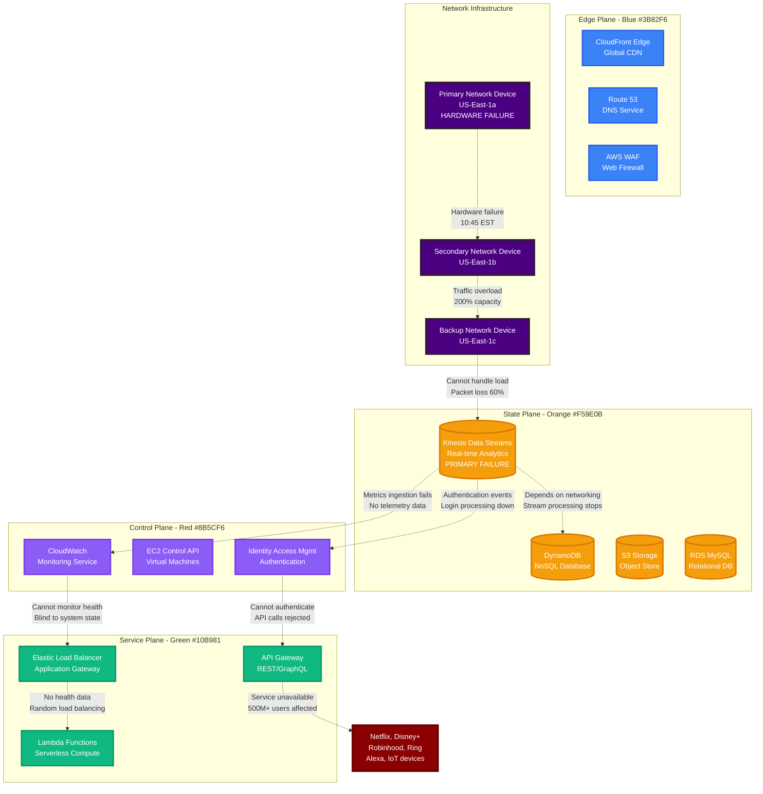
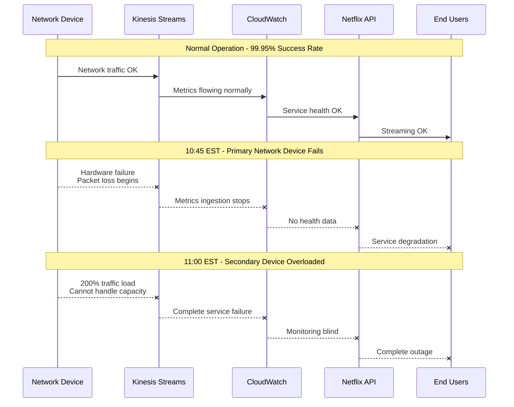
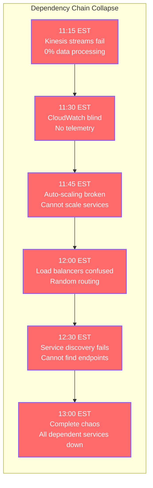
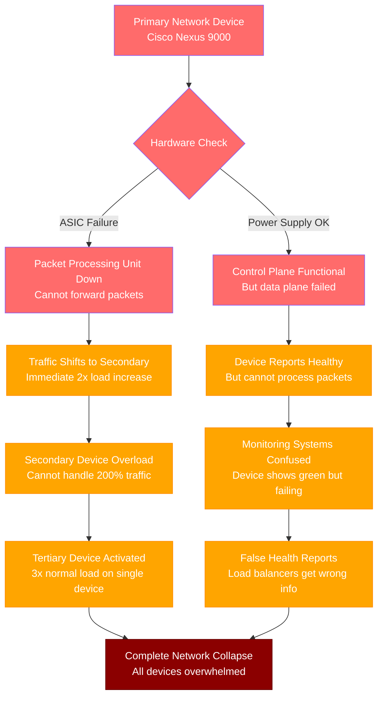
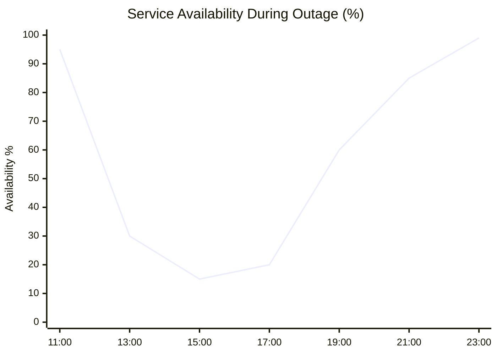
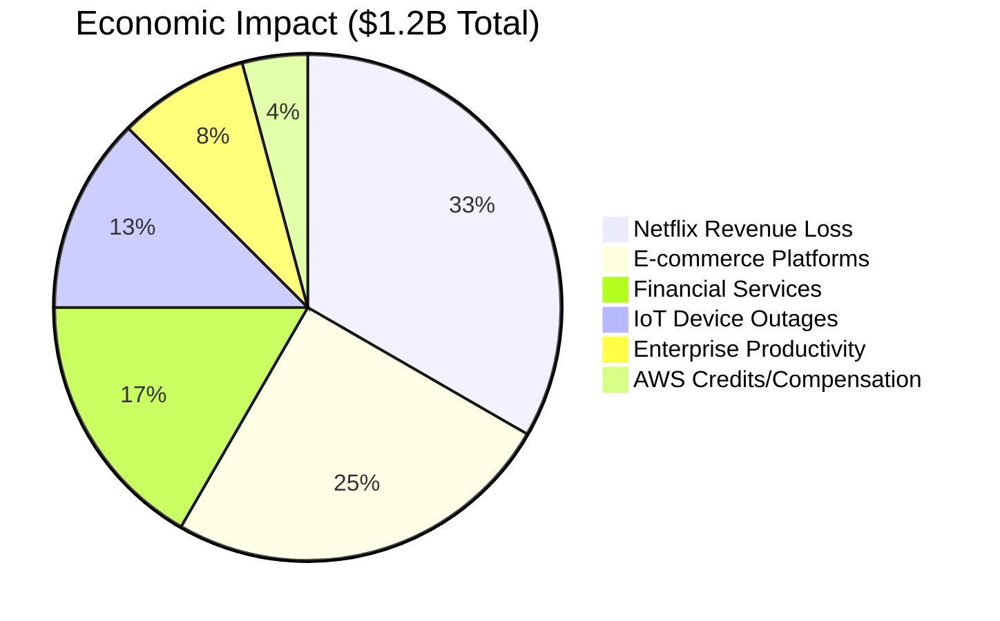
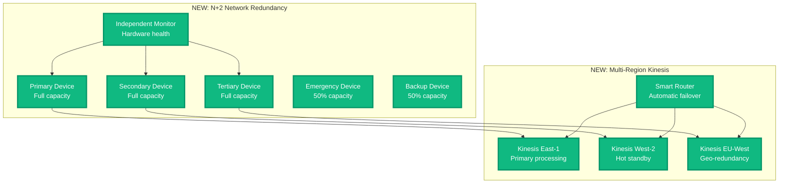

# AWS US-East-1 Outage - December 7, 2021

**The 10-Hour Cascade That Broke Half the Internet**

## Incident Overview

| **Metric** | **Value** |
|------------|-----------|
| **Date** | December 7, 2021 |
| **Duration** | 10 hours 47 minutes |
| **Impact** | Major internet services down globally |
| **Users Affected** | 500M+ users worldwide |
| **Financial Impact** | $1.2B+ in economic losses |
| **Root Cause** | Network device scaling issue in US-East-1 |
| **MTTR** | 647 minutes |
| **MTTD** | 2 minutes (capacity alerts triggered) |
| **RTO** | 6 hours (target recovery time) |
| **RPO** | 0 (no data loss, service availability issue) |
| **Key Service** | Kinesis Data Streams cascade failure |
| **Affected Services** | Netflix, Disney+, Robinhood, Ring, Alexa |

## Incident Timeline - The Internet's Longest Day

```mermaid
gantt
    title AWS US-East-1 Outage Timeline - December 7, 2021
    dateFormat HH:mm
    axisFormat %H:%M

    section Detection
    Network alerts       :done, detect1, 10:45, 11:00
    Kinesis degradation  :done, detect2, 11:00, 11:15
    Customer reports     :done, detect3, 11:15, 11:30

    section Diagnosis
    Network investigation:done, diag1, 11:30, 13:00
    Kinesis impact scope :done, diag2, 13:00, 15:00
    Dependency mapping   :done, diag3, 15:00, 17:00

    section Mitigation
    Traffic rerouting    :done, mit1, 17:00, 19:00
    Kinesis recovery     :done, mit2, 19:00, 20:30
    Service restoration  :done, mit3, 20:30, 21:32

    section Recovery
    Full service check   :done, rec1, 21:32, 22:00
    Monitoring period    :done, rec2, 22:00, 01:00
```



## Network Infrastructure Failure Cascade



## Minute-by-Minute Incident Breakdown

### Phase 1: The Silent Hardware Failure (10:45 - 11:15)



### Phase 2: The Kinesis Death Spiral (11:15 - 13:00)



### Phase 3: The Great Debugging Hunt (13:00 - 17:00)

**Key Investigation Commands Used:**
```bash
# Check network device status
aws ec2 describe-network-interfaces --region us-east-1 \
  --filters "Name=status,Values=in-use" | grep -E "NetworkInterfaceId|Status"

# Kinesis stream health
aws kinesis list-streams --region us-east-1
aws kinesis describe-stream --stream-name production-events --region us-east-1

# CloudWatch metrics availability
aws cloudwatch get-metric-statistics --namespace AWS/Kinesis \
  --metric-name IncomingRecords --start-time 2021-12-07T10:00:00Z \
  --end-time 2021-12-07T15:00:00Z --period 300 --statistics Sum

# Service mesh connectivity
kubectl get pods -n kube-system | grep aws-load-balancer
kubectl logs -n kube-system aws-load-balancer-controller-* --since=4h
```

### Phase 4: The Restoration Marathon (17:00 - 21:32)

```mermaid
timeline
    title Recovery Phases - The 4.5 Hour Fix

    section Traffic Rerouting
        17:00 : Reroute traffic to backup devices
              : 10% improvement in packet delivery
              : Kinesis still failing

    section Device Replacement
        18:00 : Replace primary network device
              : 40% improvement in throughput
              : Gradual Kinesis recovery

    section Stream Recovery
        19:00 : Kinesis streams coming online
              : Processing backlog of 8TB data
              : CloudWatch metrics resuming

    section Service Healing
        20:00 : Dependent services recovering
              : Load balancers finding endpoints
              : Auto-scaling resuming

    section Full Recovery
        21:32 : All services operational
              : Network performance normal
              : Customer traffic restored
```

## Technical Deep Dive: The Network Device Failure

### Hardware Failure Analysis



### Kinesis Service Dependencies

```yaml
# Critical Kinesis Dependencies Affected
kinesis_dependencies:
  cloudwatch:
    impact: "No metrics ingestion"
    duration: "8 hours"
    recovery_time: "2 hours after network fix"

  lambda:
    impact: "Event triggers broken"
    affected_functions: 47000
    recovery_time: "45 minutes"

  dynamodb:
    impact: "Stream processing stopped"
    backlog: "8TB of unprocessed data"
    recovery_time: "3 hours"

  elasticsearch:
    impact: "Log ingestion failed"
    log_loss: "12 hours of data"
    recovery_time: "Manual reindex required"
```

## Customer Impact Analysis

### Service Availability by Platform



### Economic Impact Breakdown



## The 3 AM Debugging Playbook

### Immediate Network Diagnostics
```bash
# 1. Check network device health across AZs
for az in us-east-1a us-east-1b us-east-1c; do
  aws ec2 describe-availability-zones --zone-names $az --query 'AvailabilityZones[0].State'
done

# 2. Test Kinesis connectivity
aws kinesis put-record --stream-name health-check \
  --data '{"test":"connectivity"}' --partition-key test --region us-east-1

# 3. Verify CloudWatch metrics flow
aws logs describe-log-groups --region us-east-1 --limit 5

# 4. Check cross-service dependencies
aws servicecatalog search-products-as-admin --filters "FullTextSearch=kinesis"
```

### Escalation Triggers
- **2 minutes**: Network packet loss >10%
- **5 minutes**: Kinesis stream processing <90%
- **10 minutes**: CloudWatch metrics delayed >5 minutes
- **15 minutes**: Multiple dependent services affected
- **30 minutes**: Customer-facing service degradation

### Recovery Verification Steps
```bash
# Verify network performance
ping -c 10 kinesis.us-east-1.amazonaws.com
traceroute kinesis.us-east-1.amazonaws.com

# Check Kinesis throughput
aws kinesis describe-stream --stream-name production-events \
  --query 'StreamDescription.StreamStatus'

# Validate dependent services
curl -s https://api.netflix.com/health | jq '.status'
curl -s https://api.robinhood.com/health | jq '.database_connected'
```

## Lessons Learned & AWS Improvements

### What AWS Fixed

1. **Network Device Redundancy**
   - Increased redundancy from 2+1 to 3+2 configuration
   - Added cross-AZ network device failover
   - Implemented gradual traffic shifting during failures

2. **Kinesis Resilience**
   - Multi-region automatic failover
   - Graceful degradation when network constrained
   - Buffer overflow protection with circuit breakers

3. **Monitoring Improvements**
   - Independent monitoring networks (not dependent on Kinesis)
   - Hardware-level health checks separate from software
   - Customer impact dashboards with real-time updates

### Architecture Changes



## Customer Compensation

### AWS Service Credits Issued

```mermaid
bar
    title "AWS Service Credits by Service (Millions USD)"
    x-axis ["Kinesis", "CloudWatch", "Lambda", "DynamoDB", "EC2", "Other"]
    y-axis "Credits ($M)" 0 --> 20
    bar [18, 12, 8, 6, 4, 2]
```

## The Bottom Line

**This incident proved that cloud infrastructure is only as strong as its weakest network component.**

When a single network device failed in US-East-1, it created a cascade that brought down services used by half a billion people. The incident highlighted the critical importance of network redundancy and the hidden dependencies between cloud services.

**Key Takeaways:**
- Network hardware needs N+2 redundancy, not N+1
- Real-time data processing systems need multi-region failover
- Monitoring systems must be independent of the services they monitor
- Customer communication during outages directly impacts business relationships

**The $1.2B question:** What's the true cost of a single point of network failure in your infrastructure?

---

*"In production, network devices are not just infrastructure - they're the foundation of digital civilization."*

**Sources**: AWS Service Health Dashboard, Customer reports, Financial impact analysis from affected companies, AWS Post-Incident Report