# Azure AD Global Outage - March 15, 2021

**The 14-Hour Authentication Apocalypse That Broke Half the Internet**

## Incident Overview

| **Metric** | **Value** |
|------------|-----------|
| **Date** | March 15, 2021 |
| **Duration** | 14 hours 23 minutes |
| **Impact** | Global authentication failures |
| **Users Affected** | 300M+ users globally |
| **Financial Impact** | $500M+ (estimated productivity loss) |
| **Root Cause** | DNS configuration error cascading to auth services |
| **MTTR** | 863 minutes |
| **MTTD** | 5 minutes (authentication failures detected) |
| **RTO** | 4 hours (initial target, exceeded) |
| **RPO** | 0 (no data loss, authentication unavailable) |
| **Services Down** | Office 365, Teams, OneDrive, Xbox Live, Dynamics |

## Incident Timeline - The 14-Hour Nightmare

```mermaid
gantt
    title Azure AD Outage Timeline - March 15, 2021
    dateFormat HH:mm
    axisFormat %H:%M

    section Detection
    First alerts         :done, detect1, 09:58, 10:15
    Teams reports        :done, detect2, 10:15, 10:30
    Public acknowledgment:done, detect3, 10:30, 10:45

    section Diagnosis
    DNS investigation    :done, diag1, 10:45, 12:00
    Auth service analysis:done, diag2, 12:00, 14:30
    Cascade mapping      :done, diag3, 14:30, 16:00

    section Mitigation
    DNS rollback attempt :done, mit1, 16:00, 18:00
    Service isolation    :done, mit2, 18:00, 20:00
    Regional failover    :done, mit3, 20:00, 22:00

    section Recovery
    Gradual restoration  :done, rec1, 22:00, 02:00
    Full service return  :done, rec2, 02:00, 03:21
    Monitoring period    :done, rec3, 03:21, 06:00
```



## Architecture Failure Cascade


## Minute-by-Minute Incident Breakdown

### Phase 1: The Silent Deployment (09:45 - 09:58)


### Phase 2: The Great Authentication Collapse (09:58 - 12:00)


### Phase 3: The Long Diagnosis (12:00 - 16:00)

**Key Investigation Commands Used:**
```bash
# DNS resolution testing
nslookup login.microsoftonline.com ns1.azure.com
dig @ns1.azure.com login.microsoftonline.com

# Load balancer health checks
az network lb probe show --resource-group AAD-Global --lb-name AAD-LB --name health-probe

# Azure AD service logs
kubectl logs -n aad-system aad-service-* --since=4h | grep "DNS resolution"

# Database connectivity
az cosmosdb check-connectivity --resource-group AAD-Data --account-name aad-cosmos-prod
```

### Phase 4: The Recovery Marathon (16:00 - 03:21)

```mermaid
timeline
    title Recovery Phases

    section DNS Rollback
        16:00 : Attempt DNS config rollback
              : 20% improvement in resolution
              : Still failing for cached entries

    section Service Isolation
        18:00 : Isolate failing DNS servers
              : Route traffic to backup DNS
              : 60% service restoration

    section Regional Failover
        20:00 : Activate backup regions
              : Gradually shift traffic
              : 85% service restoration

    section Full Recovery
        22:00 : Primary DNS fixed
              : Cache clearing initiated
              : 95% service restoration

        03:21 : Complete recovery
              : All services operational
              : Full monitoring restored
```

## Technical Deep Dive: The DNS Configuration Error

### The Fatal Configuration Change

```yaml
# BEFORE (Working Configuration)
azure_dns_zone:
  name: "azure.com"
  records:
    - name: "ns1"
      type: "A"
      ttl: 300
      value: "40.90.4.10"
    - name: "login.microsoftonline"
      type: "CNAME"
      ttl: 900
      value: "aad-prod-eastus.cloudapp.net"

# AFTER (Broken Configuration)
azure_dns_zone:
  name: "azure.com"
  records:
    - name: "ns1"
      type: "A"
      ttl: 300
      value: "40.90.4.10"
    - name: "login.microsoftonline"
      type: "CNAME"
      ttl: 900
      value: "aad-prod-eastus..cloudapp.net"  # Double dot!
```

### Cascade Failure Analysis


## Business Impact Analysis

### Financial Impact Calculation


### Service Impact by Hours


## The 3 AM Debugging Playbook

### Immediate Actions (First 30 Minutes)
```bash
# 1. Check DNS resolution globally
for region in eastus westus eastus2 westeurope; do
  nslookup login.microsoftonline.com ${region}.azure.com
done

# 2. Test authentication endpoints directly
curl -v https://login.microsoftonline.com/common/oauth2/authorize

# 3. Check load balancer health
az network lb list-effective-routes --resource-group AAD-Global

# 4. Monitor authentication success rates
az monitor metrics list --resource-group AAD-Global \
  --resource aad-service --metric "AuthenticationSuccess"
```

### Escalation Triggers
- **5 minutes**: DNS resolution <90% success rate
- **15 minutes**: Authentication success <50%
- **30 minutes**: Multiple service dependencies affected
- **60 minutes**: Customer reports exceed 1000/hour

### Recovery Verification Commands
```bash
# Verify DNS propagation
dig +trace login.microsoftonline.com

# Check service health across regions
for region in $(az account list-locations --query '[].name' -o tsv); do
  echo "Testing $region..."
  curl -s -w "%{http_code}\n" https://login.microsoftonline.$region.com/health
done

# Validate token issuance
az ad signed-in-user show --query userPrincipalName
```

## Lessons Learned & Prevention

### What Microsoft Fixed

1. **DNS Configuration Validation**
   - Automated syntax checking before deployment
   - Staged rollouts with 1% traffic testing
   - Automated rollback on health check failures

2. **Monitoring Improvements**
   - Real-time DNS resolution success rate alerts
   - Cross-region authentication success monitoring
   - Customer impact correlation dashboards

3. **Incident Response**
   - Dedicated DNS experts on-call rotation
   - Pre-approved emergency DNS rollback procedures
   - Customer communication within 15 minutes

### Architecture Changes


## The Bottom Line

**This incident taught the industry that DNS is not just infrastructure - it's the foundation of digital identity.**

When authentication fails globally, every cloud service becomes unusable. Microsoft's 14-hour outage demonstrated that even the most resilient systems can collapse from a single configuration error.

**Key Takeaways:**
- DNS changes require the same rigor as database migrations
- Authentication systems need offline fallback capabilities
- Customer communication during outages is as critical as technical fixes
- Global services need truly independent failover systems

**The $500M question:** How much would your organization lose if authentication failed for 14 hours?

---

*"In production, there are no minor DNS changes - only potential global outages waiting to happen."*

**Source**: Microsoft Azure Status History, Internal Incident Reports, Customer Impact Analysis