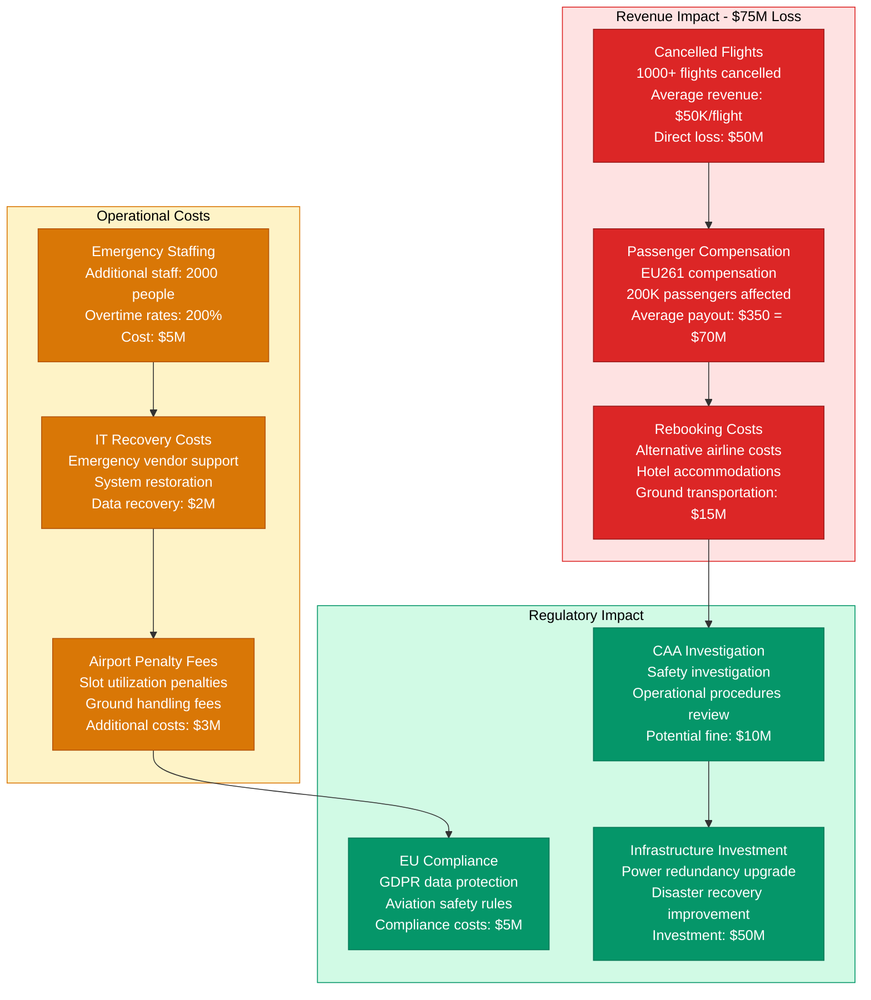

# British Airways July 2022 IT System Failure - Incident Anatomy

## Incident Overview

**Date**: July 18, 2022
**Duration**: 14 hours 30 minutes (05:30 - 20:00 BST)
**Impact**: 200K+ passengers affected, 1000+ flights cancelled/delayed across Europe
**Revenue Loss**: ~$75M (calculated from cancelled flights, compensation, and rebooking costs)
**Root Cause**: Power outage at Heathrow data center affecting core booking and departure systems
**Regions Affected**: Global operations, concentrated impact on UK and European routes
**MTTR**: 14 hours 30 minutes (870 minutes)
**MTTD**: 5 minutes (immediate detection as systems went offline)
**RTO**: 16 hours (full operational restoration)
**RPO**: 0 (no data loss, operational impact only)

## Incident Timeline & Response Flow

```mermaid
graph TB
    subgraph Detection[T+0: Detection Phase - 05:30 BST]
        style Detection fill:#EFF6FF,stroke:#3B82F6,color:#000

        Start[05:30:00<br/>━━━━━<br/>Power Outage<br/>Heathrow DC power failure<br/>UPS systems activated<br/>Critical systems affected]

        Alert1[05:35:00<br/>━━━━━<br/>System Failures<br/>Check-in systems offline<br/>Flight ops systems down<br/>Departure control failed]

        Alert2[05:42:00<br/>━━━━━<br/>Operations Impact<br/>Flight departures suspended<br/>Check-in counters offline<br/>Passenger queues building]
    end

    subgraph Diagnosis[T+1hr: Diagnosis Phase]
        style Diagnosis fill:#ECFDF5,stroke:#10B981,color:#000

        Incident[06:30:00<br/>━━━━━<br/>Crisis Response<br/>Operations center activated<br/>Airport coordination<br/>Customer service alert]

        RootCause[07:15:00<br/>━━━━━<br/>Power System Analysis<br/>Primary power supply failed<br/>UPS insufficient capacity<br/>Generator startup failed]

        Impact[08:00:00<br/>━━━━━<br/>Full Impact Assessment<br/>200K passengers affected<br/>1000+ flights impacted<br/>Hub operations suspended]
    end

    subgraph Mitigation[T+4hr: Mitigation Phase]
        style Mitigation fill:#FFFBEB,stroke:#F59E0B,color:#000

        PowerRestore[09:30:00<br/>━━━━━<br/>Power Restoration<br/>Emergency generator online<br/>Critical systems priority<br/>Gradual system startup]

        ManualOps[11:00:00<br/>━━━━━<br/>Manual Operations<br/>Paper-based check-in<br/>Manual flight dispatch<br/>Radio coordination]

        PartialRecovery[13:00:00<br/>━━━━━<br/>Partial System Recovery<br/>Core booking system online<br/>Limited check-in capability<br/>Flight ops 30% capacity]
    end

    subgraph Recovery[T+10hr: Recovery Phase]
        style Recovery fill:#F3E8FF,stroke:#8B5CF6,color:#000

        SystemsOnline[15:30:00<br/>━━━━━<br/>Systems Restoration<br/>All critical systems online<br/>Check-in fully operational<br/>Flight ops normalized]

        BacklogClear[18:00:00<br/>━━━━━<br/>Passenger Processing<br/>Queue processing accelerated<br/>Rebooking operations<br/>Compensation initiated]

        PostIncident[20:00:00<br/>━━━━━<br/>Operations Normal<br/>Full service restored<br/>Lessons learned session<br/>Regulatory reporting]
    end

    Start --> Alert1 --> Alert2
    Alert2 --> Incident --> RootCause --> Impact
    Impact --> PowerRestore --> ManualOps --> PartialRecovery
    PartialRecovery --> SystemsOnline --> BacklogClear --> PostIncident

    %% Apply 4-plane colors
    classDef edgeStyle fill:#3B82F6,stroke:#1E40AF,color:#fff
    classDef serviceStyle fill:#10B981,stroke:#047857,color:#fff
    classDef stateStyle fill:#F59E0B,stroke:#D97706,color:#fff
    classDef controlStyle fill:#8B5CF6,stroke:#7C3AED,color:#fff

    class Start,Alert1,Alert2 edgeStyle
    class Incident,RootCause,Impact serviceStyle
    class PowerRestore,ManualOps,PartialRecovery stateStyle
    class SystemsOnline,BacklogClear,PostIncident controlStyle
```



## Aviation IT Architecture Failure Analysis

```mermaid
graph TB
    subgraph EdgePlane[Edge Plane - Customer Interface]
        style EdgePlane fill:#EFF6FF,stroke:#3B82F6,color:#000

        Passengers[200K Daily Passengers<br/>Check-in: Online 60%, Airport 40%<br/>Mobile app: 3M downloads<br/>❌ All channels offline]

        Airports[Global Airport Network<br/>Hub: Heathrow (50% capacity)<br/>Spoke: 180 destinations<br/>❌ Check-in systems down]

        WebPortal[BA.com Website<br/>Daily users: 500K<br/>Booking engine<br/>❌ Booking unavailable]
    end

    subgraph ServicePlane[Service Plane - Airline Operations]
        style ServicePlane fill:#ECFDF5,stroke:#10B981,color:#000

        CheckInSys[Check-in System<br/>SITA Common Use<br/>Processing: 50K pax/hour<br/>❌ Offline for 14 hours]

        FlightOps[Flight Operations<br/>AIMS (Airline Operations)<br/>Flight planning & dispatch<br/>❌ Manual operations only]

        CrewMgmt[Crew Management<br/>CrewLink scheduling<br/>Duty time compliance<br/>❌ Manual roster management]

        PassengerSvc[Passenger Services<br/>Amadeus Altéa PSS<br/>Reservations & inventory<br/>❌ Limited functionality]
    end

    subgraph StatePlane[State Plane - Data Storage]
        style StatePlane fill:#FFFBEB,stroke:#F59E0B,color:#000

        PrimaryDC[Primary Data Center<br/>Heathrow Location<br/>❌ Power failure at 05:30<br/>UPS capacity: 30 minutes]

        BackupDC[Backup Data Center<br/>Gatwick Location<br/>❌ Failover incomplete<br/>Data sync issues]

        ReservationDB[Reservation Database<br/>Amadeus central system<br/>200M PNR records<br/>Read-only mode during outage]

        OpsDB[Operations Database<br/>Flight schedules & crew<br/>Real-time updates<br/>❌ Stale data for 14 hours]
    end

    subgraph ControlPlane[Control Plane - Management]
        style ControlPlane fill:#F3E8FF,stroke:#8B5CF6,color:#000

        OCC[Operations Control Center<br/>24/7 monitoring<br/>Network operations<br/>Crisis management protocols]

        NetworkMgmt[Network Management<br/>MPLS connectivity<br/>Airport WAN links<br/>Satellite backup]

        PowerMgmt[Power Management<br/>UPS monitoring<br/>Generator controls<br/>❌ Insufficient backup capacity]
    end

    %% Passenger flow and system dependencies
    Passengers -->|❌ Check-in failed| Airports
    Airports -->|Manual processing| CheckInSys
    CheckInSys -->|❌ System offline| PrimaryDC

    Passengers -->|❌ Booking failed| WebPortal
    WebPortal -->|❌ Database timeout| PassengerSvc
    PassengerSvc -->|❌ No connection| ReservationDB

    %% Flight operations
    FlightOps -->|❌ Planning failed| OpsDB
    CrewMgmt -->|❌ Schedule access| OpsDB

    %% Infrastructure failures
    PrimaryDC -.->|❌ Power loss| PowerMgmt
    BackupDC -.->|❌ Incomplete failover| PrimaryDC

    %% Control and monitoring
    OCC -.->|Network monitoring| NetworkMgmt
    OCC -.->|Crisis coordination| FlightOps
    PowerMgmt -.->|❌ Generator failure| PrimaryDC

    %% Apply 4-plane colors
    classDef edgeStyle fill:#3B82F6,stroke:#1E40AF,color:#fff
    classDef serviceStyle fill:#10B981,stroke:#047857,color:#fff
    classDef stateStyle fill:#F59E0B,stroke:#D97706,color:#fff
    classDef controlStyle fill:#8B5CF6,stroke:#7C3AED,color:#fff

    class Passengers,Airports,WebPortal edgeStyle
    class CheckInSys,FlightOps,CrewMgmt,PassengerSvc serviceStyle
    class PrimaryDC,BackupDC,ReservationDB,OpsDB stateStyle
    class OCC,NetworkMgmt,PowerMgmt controlStyle
```

## Operational Failure Cascade & Recovery

```mermaid
graph TB
    subgraph T1[T+0min: Infrastructure Failure]
        style T1 fill:#FEE2E2,stroke:#DC2626,color:#000

        PowerFailure[Data Center Power Loss<br/>Primary power supply failed<br/>UPS capacity: 30 minutes<br/>Generator failed to start]

        SystemShutdown[Critical System Shutdown<br/>Check-in systems offline<br/>Flight ops system down<br/>Database servers offline]
    end

    subgraph T2[T+30min: Operational Impact]
        style T2 fill:#FED7AA,stroke:#EA580C,color:#000

        FlightSuspension[Flight Operations Suspended<br/>Departures halted<br/>Arrivals delayed<br/>Ground handling stopped]

        PassengerChaos[Passenger Service Breakdown<br/>Check-in counters closed<br/>No boarding passes<br/>Information systems down]
    end

    subgraph T3[T+2hr: Business Disruption]
        style T3 fill:#FEF3C7,stroke:#D97706,color:#000

        FlightCancellations[Mass Flight Cancellations<br/>1000+ flights cancelled<br/>European network disrupted<br/>Connecting flights missed]

        PassengerStranded[Passenger Displacement<br/>200K passengers affected<br/>Hotel accommodations needed<br/>Rebooking complications]

        RevenueImpact[Immediate Revenue Loss<br/>Cancelled flights: $50M<br/>Compensation claims: $15M<br/>Operational costs: $10M]
    end

    subgraph Recovery[T+4hr: Recovery Operations]
        style Recovery fill:#D1FAE5,stroke:#059669,color:#000

        PowerRestoration[Power System Recovery<br/>Emergency generator online<br/>Critical systems priority<br/>Gradual system restoration]

        ManualOperations[Manual Process Activation<br/>Paper-based check-in<br/>Manual flight dispatch<br/>Radio communication]

        SystemRecovery[IT System Restoration<br/>Database integrity check<br/>Application restart<br/>Service validation]

        PassengerRecovery[Passenger Service Recovery<br/>Queue management<br/>Rebooking operations<br/>Compensation processing]
    end

    PowerFailure --> SystemShutdown
    SystemShutdown --> FlightSuspension
    FlightSuspension --> PassengerChaos
    PassengerChaos --> FlightCancellations
    FlightCancellations --> PassengerStranded
    PassengerStranded --> RevenueImpact

    RevenueImpact --> PowerRestoration
    PowerRestoration --> ManualOperations
    ManualOperations --> SystemRecovery
    SystemRecovery --> PassengerRecovery

    %% Apply failure severity colors
    classDef critical fill:#DC2626,stroke:#991B1B,color:#fff
    classDef major fill:#EA580C,stroke:#C2410C,color:#fff
    classDef minor fill:#D97706,stroke:#B45309,color:#fff
    classDef recovery fill:#059669,stroke:#047857,color:#fff

    class PowerFailure,SystemShutdown critical
    class FlightSuspension,PassengerChaos major
    class FlightCancellations,PassengerStranded,RevenueImpact minor
    class PowerRestoration,ManualOperations,SystemRecovery,PassengerRecovery recovery
```



## Financial Impact & Regulatory Consequences



## Lessons Learned & Prevention

### Root Cause Analysis
- **Single Point of Failure**: Primary data center had insufficient power redundancy
- **Backup System Inadequacy**: Secondary data center failover was incomplete and untested
- **Generator Failure**: Emergency power generator failed to start due to maintenance oversight
- **Manual Process Gaps**: Staff training on manual operations was insufficient

### Prevention Measures Implemented
- **Power Redundancy**: Installed N+2 power redundancy with multiple generator systems
- **Data Center Failover**: Implemented automated failover with regular testing
- **Backup Power Testing**: Monthly generator testing and maintenance program
- **Manual Operations Training**: Enhanced staff training for manual processing procedures

### 3 AM Debugging Guide
1. **Power System Status**: Check UPS status, generator availability, and power load distribution
2. **System Health**: Monitor critical system status dashboards for check-in, flight ops, and passenger services
3. **Database Connectivity**: Verify database connections and replication status
4. **Network Connectivity**: Check WAN links to airports and external service providers
5. **Manual Procedures**: Ensure manual operation procedures are accessible and staff are trained

**Incident Severity**: SEV-1 (Complete operational failure affecting flight safety and passenger service)
**Recovery Confidence**: High (infrastructure redundancy + improved procedures)
**Prevention Confidence**: High (power redundancy + automated failover + staff training)