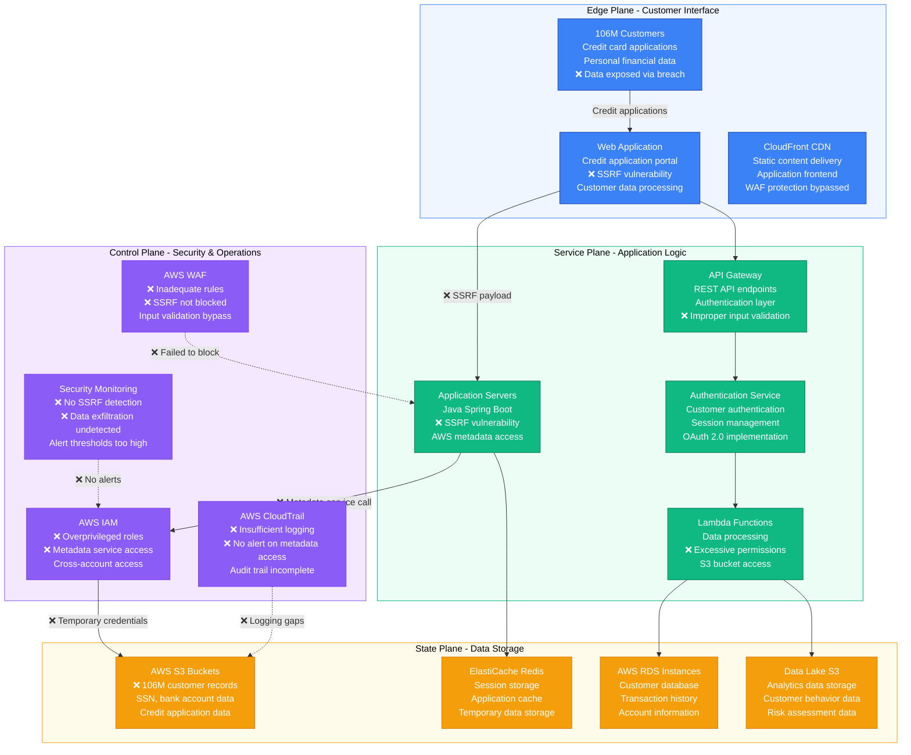
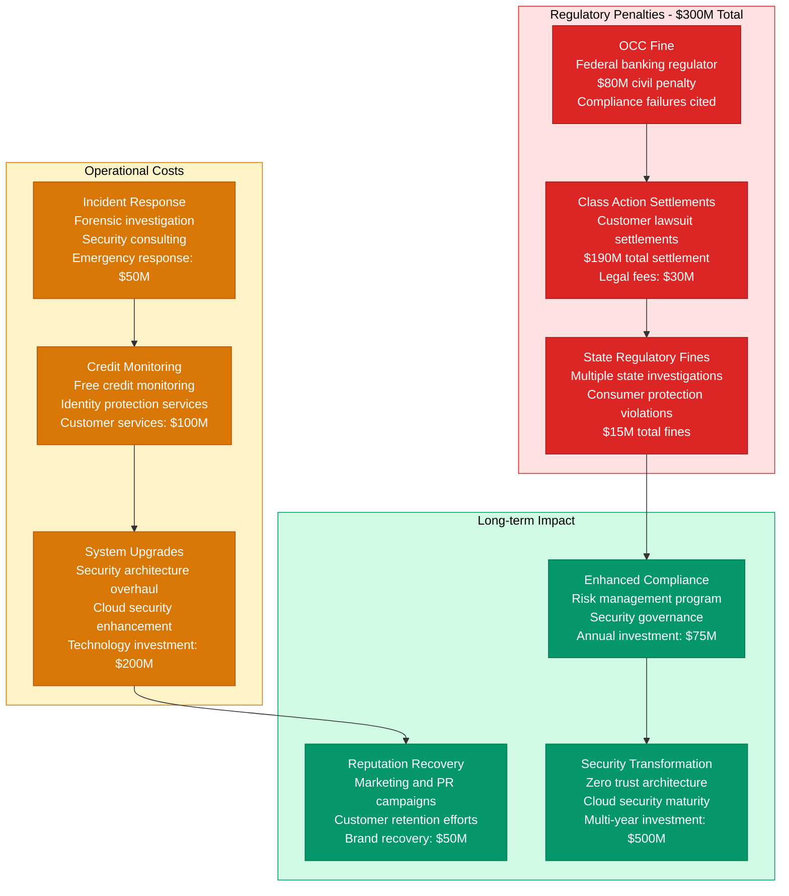

# Capital One July 2019 Data Breach - Incident Anatomy

## Incident Overview

**Date**: July 19, 2019 (Discovery), March 22-23, 2019 (Actual breach)
**Duration**: 119 days (breach undetected for ~4 months)
**Impact**: 106M customer records compromised (100M US, 6M Canada)
**Revenue Loss**: ~$300M (regulatory fines, legal costs, remediation)
**Root Cause**: Server-Side Request Forgery (SSRF) vulnerability in web application
**Regions Affected**: US and Canada customer data
**MTTR**: 119 days (time from breach to discovery)
**MTTD**: 119 days (external notification led to discovery)
**RTO**: 24 hours (immediate system hardening after discovery)
**RPO**: 106M records (complete data exfiltration)

## Incident Timeline & Response Flow

```mermaid
graph TB
    subgraph Detection[T+0: Breach Execution - March 22, 2019]
        style Detection fill:#EFF6FF,stroke:#3B82F6,color:#000

        Start[March 22, 2019<br/>━━━━━<br/>SSRF Attack Initiated<br/>Web application vulnerability<br/>AWS metadata service access<br/>IAM credentials obtained]

        Exploit[March 22-23, 2019<br/>━━━━━<br/>Data Exfiltration<br/>S3 bucket access gained<br/>106M records downloaded<br/>WAF logs bypassed]

        Persistence[March-July 2019<br/>━━━━━<br/>Undetected Activity<br/>No security alerts triggered<br/>Data exfiltration continues<br/>No monitoring detection]
    end

    subgraph Discovery[T+119 days: Discovery Phase - July 19, 2019]
        style Discovery fill:#ECFDF5,stroke:#10B981,color:#000

        ExternalTip[July 17, 2019<br/>━━━━━<br/>External Report<br/>Ethical hacker notification<br/>Security researcher disclosure<br/>Vulnerability details provided]

        Investigation[July 19, 2019<br/>━━━━━<br/>Internal Investigation<br/>Vulnerability confirmed<br/>Breach scope assessment<br/>Customer data impact analysis]

        BreachConfirmed[July 19, 2019<br/>━━━━━<br/>Breach Confirmation<br/>106M records compromised<br/>SSN, bank account data<br/>Credit application data]
    end

    subgraph Response[T+120 days: Incident Response]
        style Response fill:#FFFBEB,stroke:#F59E0B,color:#000

        ImmediateAction[July 19, 2019<br/>━━━━━<br/>Immediate Response<br/>Vulnerability patched<br/>AWS access revoked<br/>Security systems hardened]

        RegulatoryNotif[July 20, 2019<br/>━━━━━<br/>Regulatory Notification<br/>OCC notification<br/>FBI involvement<br/>State attorney generals]

        CustomerNotif[July 22, 2019<br/>━━━━━<br/>Customer Notification<br/>Email notifications sent<br/>Credit monitoring offered<br/>Public disclosure made]
    end

    subgraph Recovery[T+125 days: Recovery Phase]
        style Recovery fill:#F3E8FF,stroke:#8B5CF6,color:#000

        SecurityHardening[July 30, 2019<br/>━━━━━<br/>Security Enhancement<br/>WAF rules updated<br/>Access controls tightened<br/>Monitoring enhanced]

        LegalResponse[August 2019<br/>━━━━━<br/>Legal Proceedings<br/>Class action lawsuits<br/>Regulatory investigations<br/>Compliance reviews]

        SystemOverhaul[Q4 2019<br/>━━━━━<br/>System Overhaul<br/>Security architecture review<br/>Cloud security enhancement<br/>Vendor security assessment]
    end

    Start --> Exploit --> Persistence
    Persistence --> ExternalTip --> Investigation --> BreachConfirmed
    BreachConfirmed --> ImmediateAction --> RegulatoryNotif --> CustomerNotif
    CustomerNotif --> SecurityHardening --> LegalResponse --> SystemOverhaul

    %% Apply 4-plane colors
    classDef edgeStyle fill:#3B82F6,stroke:#1E40AF,color:#fff
    classDef serviceStyle fill:#10B981,stroke:#047857,color:#fff
    classDef stateStyle fill:#F59E0B,stroke:#D97706,color:#fff
    classDef controlStyle fill:#8B5CF6,stroke:#7C3AED,color:#fff

    class Start,Exploit,Persistence edgeStyle
    class ExternalTip,Investigation,BreachConfirmed serviceStyle
    class ImmediateAction,RegulatoryNotif,CustomerNotif stateStyle
    class SecurityHardening,LegalResponse,SystemOverhaul controlStyle
```

## Cloud Security Architecture Vulnerability

## Data Breach Attack Chain & Impact

```mermaid
graph TB
    subgraph T1[T+0min: Initial Compromise]
        style T1 fill:#FEE2E2,stroke:#DC2626,color:#000

        SSRFVuln[SSRF Vulnerability<br/>Web application input validation<br/>❌ URL parameter manipulation<br/>Internal service access gained]

        MetadataAccess[AWS Metadata Service<br/>EC2 instance metadata<br/>❌ IAM credentials exposed<br/>Temporary AWS tokens obtained]
    end

    subgraph T2[T+30min: Privilege Escalation]
        style T2 fill:#FED7AA,stroke:#EA580C,color:#000

        IAMEscalation[IAM Role Exploitation<br/>❌ Overprivileged EC2 role<br/>S3 bucket access permissions<br/>Cross-service access granted]

        S3Discovery[S3 Bucket Enumeration<br/>AWS API calls to list buckets<br/>Customer data bucket identified<br/>Access permissions validated]
    end

    subgraph T3[T+2hr: Data Exfiltration]
        style T3 fill:#FEF3C7,stroke:#D97706,color:#000

        DataDownload[Mass Data Exfiltration<br/>106M customer records<br/>SSN, bank account numbers<br/>Credit application data]

        DetectionEvasion[Detection Evasion<br/>❌ No monitoring alerts<br/>❌ CloudTrail gaps<br/>❌ Data loss prevention bypass]
    end

    subgraph Recovery[T+119 days: Discovery & Response]
        style Recovery fill:#D1FAE5,stroke:#059669,color:#000

        ExternalDisclosure[External Disclosure<br/>Security researcher notification<br/>Vulnerability demonstration<br/>Breach scope revealed]

        ImmediatePatching[Immediate Response<br/>SSRF vulnerability patched<br/>IAM permissions tightened<br/>S3 access revoked]

        SecurityHardening[Security Hardening<br/>WAF rules enhanced<br/>Monitoring improved<br/>Data encryption added]

        CustomerNotification[Customer Notification<br/>Breach disclosure<br/>Credit monitoring offered<br/>Identity protection services]
    end

    SSRFVuln --> MetadataAccess
    MetadataAccess --> IAMEscalation
    IAMEscalation --> S3Discovery
    S3Discovery --> DataDownload
    DataDownload --> DetectionEvasion

    DetectionEvasion --> ExternalDisclosure
    ExternalDisclosure --> ImmediatePatching
    ImmediatePatching --> SecurityHardening
    SecurityHardening --> CustomerNotification

    %% Apply failure severity colors
    classDef critical fill:#DC2626,stroke:#991B1B,color:#fff
    classDef major fill:#EA580C,stroke:#C2410C,color:#fff
    classDef minor fill:#D97706,stroke:#B45309,color:#fff
    classDef recovery fill:#059669,stroke:#047857,color:#fff

    class SSRFVuln,MetadataAccess critical
    class IAMEscalation,S3Discovery major
    class DataDownload,DetectionEvasion minor
    class ExternalDisclosure,ImmediatePatching,SecurityHardening,CustomerNotification recovery
```

## Financial & Regulatory Impact

## Lessons Learned & Prevention

### Root Cause Analysis
- **SSRF Vulnerability**: Web application failed to validate user input for internal service calls
- **Cloud Security Misconfiguration**: EC2 IAM roles had excessive S3 permissions
- **Monitoring Gaps**: No detection of AWS metadata service abuse or mass data downloads
- **Data Protection**: Sensitive customer data stored without adequate encryption

### Prevention Measures Implemented
- **Input Validation**: Comprehensive input validation and URL filtering
- **Least Privilege**: IAM roles redesigned with minimal necessary permissions
- **Enhanced Monitoring**: Cloud security monitoring with behavioral analytics
- **Data Encryption**: Encryption at rest and in transit for all customer data

### 3 AM Debugging Guide
1. **SSRF Detection**: Monitor for internal service calls from web applications
2. **AWS Metadata Access**: Alert on unusual EC2 metadata service calls
3. **S3 Access Patterns**: Monitor for mass data downloads from S3 buckets
4. **IAM Activity**: Track unusual IAM credential usage and cross-service access
5. **Data Exfiltration**: Monitor for large data transfers and unusual API usage patterns

**Incident Severity**: SEV-1 (Massive customer data breach with regulatory impact)
**Recovery Confidence**: High (comprehensive security overhaul implemented)
**Prevention Confidence**: High (zero trust architecture + enhanced monitoring)