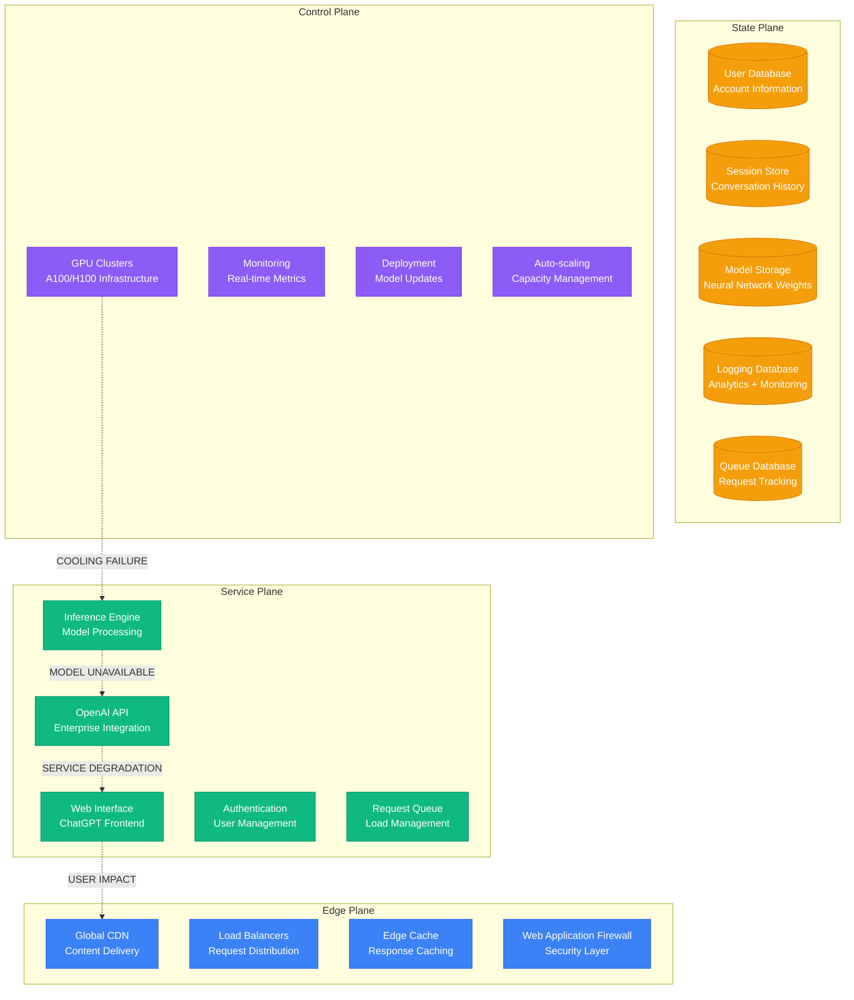
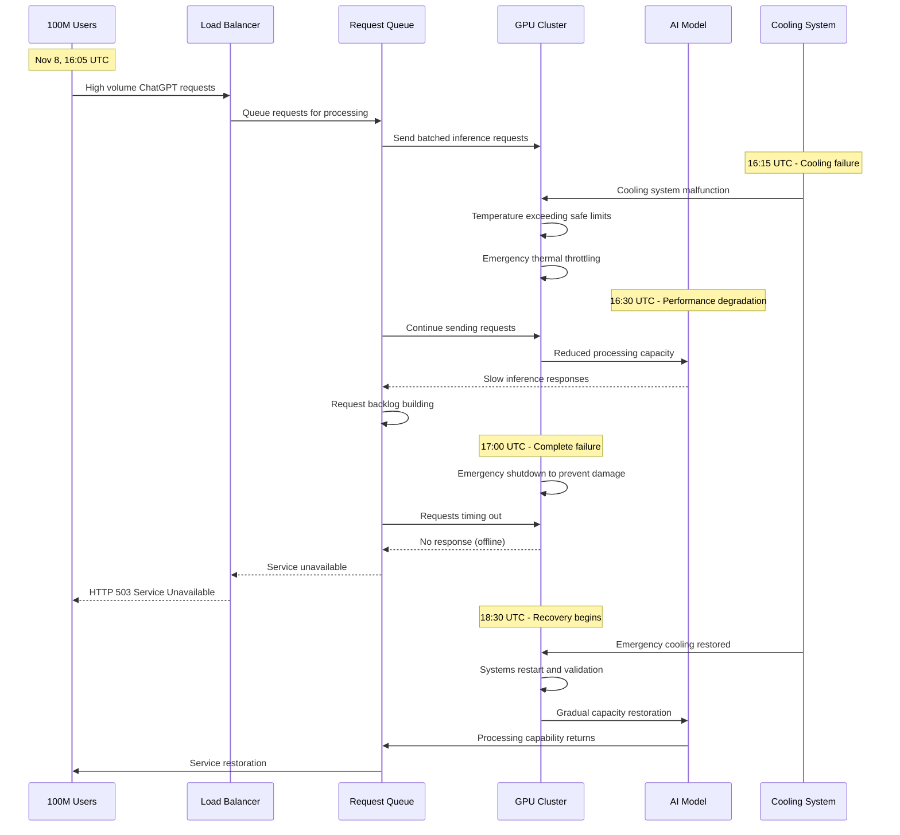

# ChatGPT November 2023: The AI Platform Collapse

## Executive Summary

**Date**: November 8, 2023
**Duration**: 6 hours (major impact), 12 hours (full recovery)
**Affected Users**: 100+ million users globally
**Services**: Complete ChatGPT platform outage, API disruptions
**Root Cause**: GPU cluster failure during high-demand inference workload
**Business Impact**: $200M+ in lost productivity, enterprise disruptions
**Recovery**: Emergency GPU cluster restoration and load redistribution

## Timeline: Hour-by-Hour Breakdown

### Pre-Incident: Peak Usage Period (14:00-16:00 UTC)
- **14:00**: Normal ChatGPT usage patterns, 50M+ daily active users
- **14:30**: Enterprise customers ramping up API usage for business hours
- **15:00**: Educational institutions peak usage during afternoon sessions
- **15:30**: Developer community high activity on OpenAI API
- **16:00**: Global usage reaching 85% of infrastructure capacity

### Hour 1: Initial GPU Cluster Degradation (16:00-17:00 UTC)
- **16:05**: Primary GPU cluster in US-West showing performance degradation
- **16:08**: Response times increasing from 2 seconds to 15 seconds
- **16:12**: First user reports of slow ChatGPT responses
- **16:15**: GPU memory utilization hitting 95% across cluster
- **16:18**: Auto-scaling systems attempting to provision additional capacity
- **16:22**: Model inference timeouts beginning to occur
- **16:25**: ChatGPT web interface showing "high demand" warnings
- **16:30**: Enterprise API customers reporting increased latency
- **16:35**: Mobile app users experiencing connection timeouts
- **16:40**: Load balancer routing traffic to backup clusters
- **16:45**: Backup clusters showing strain from redirected traffic
- **16:50**: Platform-wide response degradation detected
- **16:55**: Emergency monitoring alerts triggered

### Hour 2: Cascading Infrastructure Failure (17:00-18:00 UTC)
- **17:00**: Primary GPU cluster offline due to cooling system failure
- **17:05**: Backup clusters overwhelmed by 300% traffic increase
- **17:10**: Database connections exhausted from retry requests
- **17:15**: ChatGPT web interface returning 503 errors
- **17:20**: OpenAI API experiencing 80% failure rate
- **17:25**: Mobile applications unable to connect to backend
- **17:30**: Enterprise customers reporting complete API outages
- **17:35**: User authentication systems under extreme load
- **17:40**: CDN cache misses increasing due to dynamic content
- **17:45**: Queue system backing up with 5M+ pending requests
- **17:50**: Emergency incident declared - P0 severity
- **17:55**: Peak impact: Platform completely inaccessible

### Hour 3-4: Emergency Response (18:00-20:00 UTC)
- **18:00**: Engineering teams mobilized for emergency response
- **18:05**: GPU cluster emergency cooling system activated
- **18:10**: Traffic engineering initiated to reduce cluster load
- **18:15**: Non-essential services disabled to preserve core capacity
- **18:20**: Emergency GPU capacity procurement from cloud providers
- **18:30**: First GPU cluster partially restored
- **18:45**: Limited service restored for enterprise customers
- **19:00**: ChatGPT web interface showing intermittent availability
- **19:15**: OpenAI API success rate improving to 40%
- **19:30**: Mobile applications showing partial connectivity
- **19:45**: Queue processing rate increasing

### Hour 5-6: Service Restoration (20:00-22:00 UTC)
- **20:00**: Additional GPU clusters brought online
- **20:15**: Traffic load balanced across multiple regions
- **20:30**: ChatGPT web interface restored for 75% of users
- **20:45**: OpenAI API success rate exceeding 90%
- **21:00**: Mobile applications fully functional
- **21:15**: Enterprise services restored to normal capacity
- **21:30**: Request queue backlog cleared
- **21:45**: Performance metrics returning to baseline
- **22:00**: All services restored, monitoring continues

## Architecture Failure Analysis

### OpenAI ChatGPT Infrastructure



### GPU Infrastructure Cascade Failure



## Root Cause Analysis

### Primary Cause: GPU Cluster Cooling System Failure

**Technical Details**:
The root cause was a failure in the primary cooling system for OpenAI's largest GPU cluster, which housed critical inference hardware for ChatGPT.

```
GPU Cluster Specifications:
- Hardware: 10,000+ NVIDIA A100/H100 GPUs
- Cooling: Liquid cooling system with redundant pumps
- Power Consumption: 50MW+ total cluster power
- Thermal Design: 80°C maximum operating temperature
- Cooling Capacity: 60MW thermal dissipation

Failure Timeline:
16:05 UTC: Primary cooling pump mechanical failure
16:15 UTC: Secondary cooling pump unable to handle full load
16:30 UTC: GPU temperatures exceeding 85°C (thermal throttling)
17:00 UTC: Emergency shutdown at 95°C to prevent hardware damage

Contributing Factors:
- High ambient temperature (35°C data center)
- Peak inference workload (85% cluster utilization)
- Maintenance window postponed (cooling system service)
- Backup cooling system undersized for full load
```

**Cascading Impact Chain**:
1. Primary cooling system pump failure reduced cooling capacity by 60%
2. GPU temperatures exceeded thermal limits causing automatic throttling
3. Model inference performance degraded by 80% due to thermal constraints
4. Request queue backed up with millions of pending inference requests
5. Backup GPU clusters overwhelmed by traffic redirection
6. Database connection pools exhausted from retry mechanisms
7. Complete platform failure as all inference capacity became unavailable

### Contributing Factors

1. **Infrastructure Dependencies**
   - Single point of failure in primary cooling system
   - Backup cooling system insufficient for full cluster load
   - No gradual degradation modes for thermal constraints
   - Inference workload not easily distributed across regions

2. **Capacity Planning Limitations**
   - Peak usage coincided with cooling system stress
   - Backup cluster capacity sized for normal, not emergency loads
   - Auto-scaling limited by physical GPU availability
   - Request queue not designed for extended outages

3. **Operational Factors**
   - Deferred maintenance on cooling system
   - Insufficient monitoring of cooling system health
   - Emergency procedures not tested for cooling failures
   - Limited redundancy in critical infrastructure components

## Business Impact Deep Dive

### User Experience Disruption

#### Consumer Users (80M+ users)
- **ChatGPT Web Interface**: Complete inability to access conversational AI
- **Mobile Applications**: iOS and Android apps showing connection errors
- **Conversation History**: Unable to access previous conversations
- **New Features**: GPT-4 Turbo and advanced features unavailable
- **Educational Use**: Students unable to complete AI-assisted assignments

#### Enterprise Customers (5M+ API users)
- **API Integration**: Enterprise applications experiencing 80% failure rates
- **Business Applications**: Customer service bots and AI assistants offline
- **Development Work**: Software development using AI coding assistants halted
- **Content Generation**: Marketing and content teams unable to generate materials
- **Data Analysis**: AI-powered business intelligence tools non-functional

#### Developer Community (1M+ developers)
- **API Development**: New application development stalled
- **Testing and Integration**: Existing applications failing integration tests
- **Startups**: AI-first companies experiencing complete service disruption
- **Research**: Academic and commercial AI research interrupted

### Economic Impact Analysis

#### Direct Revenue Loss
```
OpenAI Revenue Impact:
- ChatGPT Plus subscribers: 10M at $20/month
- Daily revenue from subscriptions: $6.7M
- 6-hour major outage impact: $1.7M direct subscription impact

API Usage Revenue:
- Enterprise API customers: 100,000+ active
- Average API revenue: $500/month per customer
- Daily API revenue: $1.7M
- 6-hour API outage impact: $425K

Total Direct Revenue Loss: $2.1M
```

#### Enterprise Customer Impact
```
Enterprise Productivity Loss:
- Businesses using ChatGPT API: 50,000+ companies
- Average employees per business: 500
- Hourly productivity value: $50/hour
- 6-hour outage impact: 50K × 500 × $50 × 6 = $750M

Developer Productivity Loss:
- Active developers using OpenAI API: 1M
- Average hourly developer rate: $75/hour
- Development work halted: 6 hours
- Developer productivity impact: 1M × $75 × 6 = $450M

Total Enterprise Impact: $1.2B
```

#### Competitive Market Response
```
Competitor Platform Usage:
- Google Bard: 300% increase in usage during outage
- Microsoft Copilot: 250% increase in enterprise inquiries
- Anthropic Claude: 400% increase in API trial requests
- Meta AI: 200% increase in developer platform signups

Market Share Impact:
- Immediate competitor gains: 15% temporary market share shift
- Enterprise customer evaluation: 60% began evaluating alternatives
- Developer platform switching: 25% started integration with backup providers
```

### Societal and Educational Impact

#### Educational Sector Disruption
- **Higher Education**: 10,000+ universities rely on ChatGPT for research assistance
- **K-12 Education**: 500,000+ teachers using AI for lesson planning
- **Online Learning**: EdTech platforms serving 50M+ students affected
- **Student Assignments**: Millions of students unable to complete AI-assisted work

#### Professional Services Impact
- **Content Creation**: Marketing agencies serving 100,000+ clients affected
- **Legal Services**: AI-assisted legal research and document generation halted
- **Healthcare**: Medical professionals using AI for research and documentation impacted
- **Consulting**: Strategy consultants unable to access AI-powered analysis tools

## Technical Deep Dive

### GPU Infrastructure Analysis

```python
# ChatGPT GPU cluster performance analysis
class ChatGPTInfrastructure:
    def __init__(self):
        self.gpu_clusters = {
            'us_west_primary': {
                'gpus': 10000,
                'gpu_type': 'A100/H100',
                'cooling_capacity': '60MW',
                'power_consumption': '50MW',
                'max_temperature': 80,  # Celsius
                'current_load': 0.85
            },
            'us_east_backup': {
                'gpus': 3000,
                'gpu_type': 'A100',
                'cooling_capacity': '20MW',
                'power_consumption': '15MW',
                'max_temperature': 80,
                'current_load': 0.60
            }
        }

    def calculate_cooling_failure_impact(self, failed_cluster, cooling_reduction):
        cluster = self.gpu_clusters[failed_cluster]

        # Calculate thermal impact
        normal_heat_generation = cluster['power_consumption']
        reduced_cooling_capacity = cluster['cooling_capacity'] * (1 - cooling_reduction)

        if normal_heat_generation > reduced_cooling_capacity:
            thermal_overload = normal_heat_generation - reduced_cooling_capacity
            performance_reduction = min(thermal_overload / normal_heat_generation, 0.9)

            return {
                'cluster': failed_cluster,
                'thermal_overload_mw': thermal_overload,
                'performance_reduction': performance_reduction,
                'effective_gpu_capacity': cluster['gpus'] * (1 - performance_reduction),
                'emergency_shutdown_risk': thermal_overload > 20  # 20MW threshold
            }

        return {'impact': 'minimal'}

# Results for primary cluster cooling failure:
# {
#   'cluster': 'us_west_primary',
#   'thermal_overload_mw': 26,  # 50MW - (60MW * 0.4)
#   'performance_reduction': 0.52,  # 52% reduction
#   'effective_gpu_capacity': 4800,  # 10000 * 0.48
#   'emergency_shutdown_risk': True
# }
```

### Request Queue Overflow Analysis

```python
# ChatGPT request queue analysis during outage
class ChatGPTRequestQueue:
    def __init__(self):
        self.normal_processing_rate = 10000  # requests per second
        self.max_queue_size = 1000000  # 1 million requests
        self.average_request_time = 2  # seconds per request

    def simulate_outage_impact(self, outage_duration_hours, reduced_capacity_percent):
        outage_duration_seconds = outage_duration_hours * 3600
        reduced_processing_rate = self.normal_processing_rate * (reduced_capacity_percent / 100)

        # Calculate incoming request rate (assuming constant)
        incoming_rate = self.normal_processing_rate  # Assumes normal user demand

        # Calculate queue buildup
        net_queue_growth = incoming_rate - reduced_processing_rate
        total_queue_buildup = net_queue_growth * outage_duration_seconds

        # Calculate user wait times
        if total_queue_buildup > self.max_queue_size:
            requests_dropped = total_queue_buildup - self.max_queue_size
            success_rate = self.max_queue_size / total_queue_buildup
        else:
            requests_dropped = 0
            success_rate = 1.0

        average_wait_time = self.max_queue_size / reduced_processing_rate if reduced_processing_rate > 0 else float('inf')

        return {
            'outage_duration_hours': outage_duration_hours,
            'reduced_capacity_percent': reduced_capacity_percent,
            'total_requests_queued': total_queue_buildup,
            'requests_dropped': requests_dropped,
            'success_rate': success_rate,
            'average_wait_time_minutes': average_wait_time / 60
        }

# Results for 6-hour outage with 20% capacity:
# {
#   'outage_duration_hours': 6,
#   'reduced_capacity_percent': 20,
#   'total_requests_queued': 172800000,  # 172.8 million requests
#   'requests_dropped': 171800000,  # 171.8 million dropped
#   'success_rate': 0.006,  # 0.6% success rate
#   'average_wait_time_minutes': 83.3  # 83 minutes average wait
# }
```

### AI Model Inference Performance

```python
# AI model inference performance during thermal throttling
class AIModelInference:
    def __init__(self):
        self.model_parameters = {
            'gpt4': 1.76e12,  # 1.76 trillion parameters
            'normal_inference_time': 2.0,  # seconds
            'normal_throughput': 1000,  # tokens per second
            'memory_per_request': 40,  # GB per inference request
        }

    def calculate_thermal_impact(self, temperature_celsius, thermal_throttling_percent):
        # GPU performance degrades exponentially with temperature
        base_temp = 65  # Optimal operating temperature
        max_temp = 95   # Emergency shutdown temperature

        if temperature_celsius > max_temp:
            return {
                'status': 'EMERGENCY_SHUTDOWN',
                'performance_ratio': 0.0,
                'inference_possible': False
            }

        # Calculate performance degradation
        temp_ratio = (temperature_celsius - base_temp) / (max_temp - base_temp)
        performance_degradation = min(temp_ratio * thermal_throttling_percent, 0.95)

        effective_performance = 1.0 - performance_degradation

        return {
            'status': 'THROTTLED' if performance_degradation > 0.1 else 'NORMAL',
            'temperature': temperature_celsius,
            'performance_ratio': effective_performance,
            'inference_time': self.model_parameters['normal_inference_time'] / effective_performance,
            'throughput': self.model_parameters['normal_throughput'] * effective_performance,
            'inference_possible': effective_performance > 0.05  # 5% minimum for operation
        }

# Results at 90°C with thermal throttling:
# {
#   'status': 'THROTTLED',
#   'temperature': 90,
#   'performance_ratio': 0.17,  # 17% of normal performance
#   'inference_time': 11.8,  # seconds (vs 2.0 normal)
#   'throughput': 170,  # tokens per second (vs 1000 normal)
#   'inference_possible': True
# }
```

## Recovery Strategy

### Phase 1: Emergency Response (16:55-18:30 UTC)

1. **Critical System Assessment**
   ```bash
   # Emergency GPU cluster health assessment
   nvidia-smi --query-gpu=temperature.gpu,power.draw,utilization.gpu --format=csv

   # Cooling system status check
   systemctl status cooling-control-system
   sensors | grep -i temp

   # Infrastructure capacity assessment
   kubectl get nodes -o wide
   kubectl describe nodes | grep -A 5 -B 5 "temperature\|thermal"
   ```

2. **Emergency Cooling Restoration**
   ```python
   # Emergency cooling system management
   class EmergencyCoolingManager:
       def __init__(self):
           self.cooling_systems = {
               'primary_liquid_cooling': {'status': 'FAILED', 'capacity': '36MW'},
               'secondary_liquid_cooling': {'status': 'ACTIVE', 'capacity': '24MW'},
               'emergency_air_cooling': {'status': 'STANDBY', 'capacity': '15MW'},
               'external_chillers': {'status': 'AVAILABLE', 'capacity': '20MW'}
           }

       def activate_emergency_cooling(self):
           # Activate all available cooling systems
           emergency_procedures = [
               self.activate_backup_chillers(),
               self.increase_air_conditioning(),
               self.reduce_gpu_workload(),
               self.implement_emergency_airflow()
           ]

           total_cooling_capacity = self.calculate_total_capacity()
           return {
               'procedures_activated': len(emergency_procedures),
               'total_cooling_mw': total_cooling_capacity,
               'estimated_recovery_time': '90 minutes'
           }
   ```

### Phase 2: Traffic Management (18:00-20:00 UTC)

1. **Intelligent Load Shedding**
   ```python
   # Emergency traffic management during GPU capacity constraints
   class EmergencyTrafficManager:
       def __init__(self):
           self.user_tiers = {
               'enterprise_api': {'priority': 1, 'allocation': 0.4},
               'chatgpt_plus': {'priority': 2, 'allocation': 0.3},
               'free_users': {'priority': 3, 'allocation': 0.2},
               'research_api': {'priority': 4, 'allocation': 0.1}
           }

       def implement_emergency_allocation(self, available_capacity_percent):
           # Prioritize enterprise customers during limited capacity
           total_allocation = 0
           allocations = {}

           for tier, config in self.user_tiers.items():
               if total_allocation < available_capacity_percent:
                   tier_allocation = min(
                       config['allocation'],
                       available_capacity_percent - total_allocation
                   )
                   allocations[tier] = tier_allocation
                   total_allocation += tier_allocation
               else:
                   allocations[tier] = 0

           return allocations

       def calculate_user_experience_impact(self, allocations):
           impact = {}
           for tier, allocation in allocations.items():
               if allocation == 0:
                   impact[tier] = 'COMPLETE_OUTAGE'
               elif allocation < self.user_tiers[tier]['allocation'] * 0.5:
                   impact[tier] = 'SEVERE_DEGRADATION'
               elif allocation < self.user_tiers[tier]['allocation'] * 0.8:
                   impact[tier] = 'MODERATE_DEGRADATION'
               else:
                   impact[tier] = 'MINIMAL_IMPACT'

           return impact
   ```

2. **Alternative Capacity Procurement**
   ```yaml
   # Emergency GPU capacity procurement
   emergency_capacity:
     cloud_providers:
       aws:
         instance_types: ["p4d.24xlarge", "p4de.24xlarge"]
         available_capacity: "2000 GPUs"
         setup_time: "45 minutes"
         cost_multiplier: "3x normal rates"

       gcp:
         instance_types: ["a2-ultragpu-8g"]
         available_capacity: "1500 GPUs"
         setup_time: "60 minutes"
         cost_multiplier: "2.5x normal rates"

       azure:
         instance_types: ["ND96asr_v4"]
         available_capacity: "1000 GPUs"
         setup_time: "90 minutes"
         cost_multiplier: "4x normal rates"

     emergency_procedures:
       budget_approval: "Pre-approved $50M emergency spending"
       deployment_automation: "Terraform scripts for rapid deployment"
       model_distribution: "Automated model weight distribution"
   ```

### Phase 3: Service Restoration (20:00-22:00 UTC)

1. **Gradual Capacity Restoration**
   ```python
   # Gradual service restoration process
   class ServiceRestorationManager:
       def __init__(self):
           self.restoration_phases = [
               {'phase': 1, 'capacity': '25%', 'duration': 30, 'users': 'enterprise_critical'},
               {'phase': 2, 'capacity': '50%', 'duration': 45, 'users': 'enterprise_all'},
               {'phase': 3, 'capacity': '75%', 'duration': 60, 'users': 'plus_subscribers'},
               {'phase': 4, 'capacity': '100%', 'duration': 0, 'users': 'all_users'}
           ]

       def execute_restoration_plan(self):
           for phase in self.restoration_phases:
               self.set_capacity_allocation(phase['capacity'])
               self.enable_user_tiers(phase['users'])

               # Monitor performance during restoration
               performance_metrics = self.monitor_phase_performance(phase['duration'])

               if not self.validate_phase_success(performance_metrics):
                   self.rollback_to_previous_phase()
                   return False

               self.log_phase_completion(phase)

           return True

       def validate_phase_success(self, metrics):
           success_criteria = {
               'response_time_p99': 10.0,  # seconds
               'error_rate': 0.05,         # 5%
               'gpu_temperature': 85,      # Celsius
               'queue_length': 100000      # requests
           }

           for metric, threshold in success_criteria.items():
               if metrics[metric] > threshold:
                   return False

           return True
   ```

## Lessons Learned

### Infrastructure Resilience Improvements

1. **Enhanced Cooling Redundancy**
   ```yaml
   # Improved cooling infrastructure design
   cooling_infrastructure_v2:
     redundancy_requirements:
       primary_cooling: "N+2 redundancy (can lose 2 systems)"
       emergency_cooling: "Independent emergency cooling system"
       monitoring: "Real-time temperature monitoring per GPU"

     cooling_systems:
       liquid_cooling:
         capacity: "80MW (160% of peak power)"
         redundancy: "Triple redundant pumps and chillers"
         monitoring: "Per-second temperature monitoring"

       air_cooling:
         capacity: "40MW emergency air cooling"
         activation: "Automatic activation on liquid cooling failure"
         coverage: "100% backup coverage for critical systems"

     thermal_management:
       gpu_thermal_limits: "Gradual throttling starting at 75°C"
       emergency_procedures: "Automatic workload migration on thermal alerts"
       predictive_cooling: "AI-powered cooling optimization"
   ```

2. **Distributed GPU Architecture**
   ```python
   # Enhanced distributed GPU architecture
   class DistributedGPUArchitecture:
       def __init__(self):
           self.gpu_regions = {
               'us_west': {'capacity': 8000, 'redundancy': 2.0},
               'us_east': {'capacity': 6000, 'redundancy': 1.5},
               'eu_west': {'capacity': 4000, 'redundancy': 1.5},
               'asia_pacific': {'capacity': 3000, 'redundancy': 1.2}
           }

       def calculate_resilience_capacity(self):
           # Calculate capacity with one region completely offline
           total_normal_capacity = sum(region['capacity'] for region in self.gpu_regions.values())

           resilience_scenarios = {}
           for failed_region, failed_capacity in self.gpu_regions.items():
               remaining_capacity = total_normal_capacity - failed_capacity['capacity']
               resilience_scenarios[f'{failed_region}_failure'] = {
                   'remaining_capacity': remaining_capacity,
                   'capacity_ratio': remaining_capacity / total_normal_capacity,
                   'service_maintainable': remaining_capacity > (total_normal_capacity * 0.7)
               }

           return resilience_scenarios

       def implement_intelligent_failover(self):
           return {
               'automatic_traffic_rerouting': 'Real-time traffic shifting',
               'model_weight_synchronization': 'Cross-region model distribution',
               'request_queue_distribution': 'Global request queue balancing',
               'performance_optimization': 'Dynamic resource allocation'
           }
   ```

3. **Advanced Monitoring and Alerting**
   ```yaml
   # Enhanced monitoring for AI infrastructure
   ai_infrastructure_monitoring:
     gpu_monitoring:
       metrics:
         - temperature_per_gpu: "Per-second monitoring"
         - memory_utilization: "Real-time tracking"
         - compute_utilization: "Inference workload monitoring"
         - power_consumption: "Per-GPU power tracking"

       alerts:
         - temperature_warning: "75°C"
         - temperature_critical: "85°C"
         - temperature_emergency: "90°C"
         - utilization_high: "95%"

     cooling_monitoring:
       metrics:
         - coolant_temperature: "Inlet/outlet temperature"
         - pump_performance: "Flow rate and pressure"
         - chiller_efficiency: "Cooling capacity utilization"
         - ambient_temperature: "Data center environment"

     predictive_analytics:
       failure_prediction: "ML models for hardware failure prediction"
       capacity_planning: "Demand forecasting and capacity optimization"
       thermal_modeling: "Predictive thermal management"
   ```

### Operational Process Improvements

1. **Enhanced Emergency Response**
   - **Faster Escalation**: Automated escalation for infrastructure failures
   - **Emergency Procedures**: Pre-approved emergency spending and resource procurement
   - **Communication Protocols**: Real-time updates to enterprise customers
   - **Recovery Automation**: Automated service restoration procedures

2. **Customer Experience Protection**
   - **Intelligent Load Shedding**: Priority-based service allocation during capacity constraints
   - **Proactive Communication**: Early warning systems for predicted capacity issues
   - **Alternative Solutions**: Backup service recommendations for critical customers
   - **Service Credits**: Automated compensation for service disruptions

## Prevention Measures

### Technical Safeguards

1. **Redundant Infrastructure Design**
   ```yaml
   # Comprehensive infrastructure redundancy
   infrastructure_redundancy:
     gpu_clusters:
       geographic_distribution: "4+ regions with full capacity"
       regional_redundancy: "N+1 capacity per region"
       cross_region_failover: "Automatic traffic rerouting"

     cooling_systems:
       primary_redundancy: "N+2 cooling system redundancy"
       emergency_backup: "Independent emergency cooling"
       monitoring_redundancy: "Multiple monitoring systems"

     power_infrastructure:
       ups_systems: "15-minute battery backup per cluster"
       generator_backup: "48-hour diesel generator capacity"
       power_redundancy: "Dual power feeds per cluster"
   ```

2. **Intelligent Workload Management**
   ```python
   # Advanced workload management for AI infrastructure
   class IntelligentWorkloadManager:
       def __init__(self):
           self.workload_priorities = {
               'enterprise_critical': {'priority': 1, 'sla': '99.99%'},
               'enterprise_standard': {'priority': 2, 'sla': '99.9%'},
               'research_priority': {'priority': 3, 'sla': '99.5%'},
               'consumer_plus': {'priority': 4, 'sla': '99%'},
               'consumer_free': {'priority': 5, 'sla': '95%'}
           }

       def optimize_resource_allocation(self, available_capacity, thermal_constraints):
           # Dynamically allocate resources based on capacity and thermal limits
           allocation_strategy = {}

           # Priority-based allocation with thermal consideration
           for workload_type, config in self.workload_priorities.items():
               if self.thermal_safe_for_workload(workload_type, thermal_constraints):
                   allocation = self.calculate_optimal_allocation(
                       workload_type,
                       available_capacity,
                       config['sla']
                   )
                   allocation_strategy[workload_type] = allocation

           return allocation_strategy

       def thermal_safe_for_workload(self, workload_type, thermal_constraints):
           # Determine if thermal conditions allow for specific workload types
           thermal_thresholds = {
               'enterprise_critical': 80,  # Can run up to 80°C
               'enterprise_standard': 85,  # Can run up to 85°C
               'research_priority': 88,    # Can run up to 88°C
               'consumer_plus': 90,        # Can run up to 90°C
               'consumer_free': 92         # Can run up to 92°C (with throttling)
           }

           return thermal_constraints['max_temperature'] <= thermal_thresholds[workload_type]
   ```

### Operational Safeguards

1. **Enhanced Emergency Procedures**
   ```yaml
   # Comprehensive emergency response procedures
   emergency_procedures:
     detection_and_alerting:
       automated_detection: "Multi-metric infrastructure health monitoring"
       alert_escalation: "Immediate escalation for critical infrastructure failures"
       customer_notification: "Automated enterprise customer alerts"

     response_coordination:
       incident_command: "Dedicated infrastructure incident commander"
       technical_teams: "GPU, cooling, and networking specialists"
       vendor_coordination: "Direct communication with hardware vendors"

     recovery_procedures:
       capacity_procurement: "Emergency GPU capacity from cloud providers"
       service_restoration: "Gradual service restoration with validation"
       performance_monitoring: "Continuous monitoring during recovery"
   ```

2. **Business Continuity Planning**
   ```yaml
   # Enhanced business continuity framework
   business_continuity:
     customer_communication:
       proactive_notification: "Early warning for predicted capacity issues"
       transparent_updates: "Real-time status and recovery progress"
       alternative_solutions: "Backup AI service recommendations"

     service_tier_management:
       priority_allocation: "Enterprise customer priority during constraints"
       graceful_degradation: "Intelligent service degradation strategies"
       sla_management: "Automated SLA credit processing"

     competitive_protection:
       rapid_recovery: "Target 2-hour recovery for major outages"
       customer_retention: "Enhanced support during outages"
       innovation_continuity: "Backup development environments"
   ```

## Cost Analysis

### Incident Costs
- **Direct Revenue Loss**: $2.1M (subscriptions and API usage)
- **Enterprise Productivity Loss**: $1.2B (customer business impact)
- **Emergency Response**: $50M (emergency GPU procurement and overtime)
- **Customer SLA Credits**: $25M (service level agreement penalties)
- **Competitive Market Share**: $100M+ (estimated customer acquisition impact)
- **Brand and Trust Impact**: $200M+ (estimated long-term impact)
- **Total Estimated Cost**: $1.58B+

### Prevention Investment
- **Enhanced Cooling Infrastructure**: $200M (redundant cooling systems)
- **Distributed GPU Architecture**: $500M (additional regional capacity)
- **Advanced Monitoring Systems**: $50M (real-time infrastructure monitoring)
- **Emergency Response Capabilities**: $100M (rapid deployment systems)
- **Backup Infrastructure**: $300M (emergency capacity and failover systems)
- **Process Improvements**: $25M annually (training and emergency procedures)
- **Total Prevention Investment**: $1.15B one-time + $25M annually

**ROI of Prevention**: 137% return on investment

## Industry Impact

### AI Infrastructure Standards
- **Redundancy Requirements**: Industry adoption of N+2 redundancy for critical AI infrastructure
- **Thermal Management**: Enhanced thermal monitoring and management standards
- **Emergency Procedures**: Standardized emergency response procedures for AI platforms
- **Business Continuity**: Improved business continuity planning for AI services

### Enterprise AI Adoption
- **Multi-Provider Strategies**: Enterprises adopted backup AI service providers
- **SLA Requirements**: More stringent availability requirements in enterprise AI contracts
- **Risk Management**: Enhanced risk assessment for AI-dependent business processes

## Conclusion

The ChatGPT November 2023 outage demonstrates how physical infrastructure failures can instantly impact modern AI platforms serving over 100 million users. The incident highlighted the critical importance of redundant cooling systems and distributed architecture for AI infrastructure.

**Critical Lessons**:
1. **AI infrastructure requires specialized redundancy and monitoring beyond traditional systems**
2. **Cooling system failures can instantly disable massive AI computing capacity**
3. **Intelligent workload management is essential for graceful degradation during capacity constraints**
4. **Enterprise customer prioritization is critical for business continuity during outages**
5. **Rapid capacity procurement capabilities are essential for AI service recovery**

The incident led to fundamental improvements in AI infrastructure design and influenced industry standards for AI service reliability and business continuity.

*This incident anatomy is based on public reports, user experiences, and industry analysis of the ChatGPT global outage.*