# Cloudflare July 2019 Global Outage - Incident Anatomy

## Incident Overview

**Date**: July 2, 2019
**Duration**: 30 minutes (13:42 - 14:12 UTC)
**Impact**: 47% global traffic drop, major sites unreachable
**Revenue Loss**: ~$5M (estimated across affected customers)
**Root Cause**: Catastrophic backtracking in WAF regex rule causing CPU exhaustion
**Scope**: Global PoP network, 180+ locations affected
**MTTR**: 30 minutes (rapid mitigation via kill switch)
**MTTD**: 15 seconds (CPU alerts triggered immediately)
**RTO**: 30 minutes (full service restoration)
**RPO**: 0 (no data loss, processing delay only)

## Incident Timeline & Response Flow

```mermaid
graph TB
    subgraph Detection["T+0: Detection Phase - 13:42 UTC"]
        style Detection fill:#FFE5E5,stroke:#8B5CF6,color:#000

        Start["13:42:00<br/>━━━━━<br/>WAF Rule Deployment<br/>New regex pattern<br/>.*(?:(?:\\r\\n)?[ \\t])*<br/>Customer XSS protection"]

        Alert1["13:42:15<br/>━━━━━<br/>CPU Spike Alerts<br/>PoP-SJC: CPU 98%<br/>PoP-LAX: CPU 97%<br/>PoP-DFW: CPU 96%"]

        Alert2["13:42:45<br/>━━━━━<br/>Global Impact<br/>180 PoPs affected<br/>Traffic drop: 47%<br/>HTTP 502/504 errors"]
    end

    subgraph Diagnosis["T+3min: Diagnosis Phase"]
        style Diagnosis fill:#FFF5E5,stroke:#F59E0B,color:#000

        Incident["13:45:00<br/>━━━━━<br/>Major Incident<br/>SEV-0 declared<br/>Global traffic loss<br/>Customer escalations"]

        RootCause["13:47:30<br/>━━━━━<br/>Regex Analysis<br/>Backtracking identified<br/>.*(?:(?:\\r\\n)?[ \\t])*<br/>Catastrophic complexity"]

        RegexIssue["13:49:00<br/>━━━━━<br/>Pattern Problem<br/>Exponential time growth<br/>O(2^n) complexity<br/>CPU exhaustion"]
    end

    subgraph Mitigation["T+8min: Mitigation Phase"]
        style Mitigation fill:#FFFFE5,stroke:#CCCC00,color:#000

        Disable["13:50:00<br/>━━━━━<br/>Kill Switch<br/>WAF rule disabled<br/>Pushed to all PoPs<br/>Emergency override"]

        Recovery1["13:52:00<br/>━━━━━<br/>CPU Normalization<br/>Load average dropping<br/>Response times improving<br/>Error rates declining"]

        Recovery2["13:58:00<br/>━━━━━<br/>Traffic Recovery<br/>Request processing normal<br/>80% capacity restored<br/>PoP health green"]
    end

    subgraph Recovery["T+15min: Recovery Phase"]
        style Recovery fill:#E5FFE5,stroke:#10B981,color:#000

        FullTraffic["14:05:00<br/>━━━━━<br/>Complete Recovery<br/>All PoPs operational<br/>Traffic: 100% normal<br/>Performance restored"]

        Validation["14:08:00<br/>━━━━━<br/>Service Validation<br/>End-to-end testing<br/>Customer verification<br/>Monitoring normal"]

        PostMortem["14:12:00<br/>━━━━━<br/>Incident Closed<br/>Post-mortem scheduled<br/>Regex review process<br/>Customer communication"]
    end

    %% Regex Performance Analysis
    subgraph RegexAnalysis["Regex Backtracking Analysis"]
        style RegexAnalysis fill:#F0F0F0,stroke:#666666,color:#000

        BadRegex["Bad Regex Pattern<br/>━━━━━<br/>.*(?:(?:\\r\\n)?[ \\t])*<br/>🔥 Catastrophic backtracking<br/>⏱️ Exponential time O(2^n)"]

        InputString["Malicious Input<br/>━━━━━<br/>Long string with spaces<br/>Triggers worst-case<br/>20KB payload → 30s CPU"]

        CPUExhaustion["CPU Exhaustion<br/>━━━━━<br/>98% CPU across PoPs<br/>Request queue backup<br/>HTTP timeouts"]
    end

    %% Global PoP Impact
    subgraph GlobalImpact["Global PoP Network Impact"]
        style GlobalImpact fill:#F0F0F0,stroke:#666666,color:#000

        Americas["Americas PoPs<br/>━━━━━<br/>❌ 52 PoPs affected<br/>Major: LAX, DFW, JFK<br/>Traffic: -60%"]

        Europe["Europe PoPs<br/>━━━━━<br/>❌ 67 PoPs affected<br/>Major: LHR, FRA, AMS<br/>Traffic: -45%"]

        AsiaPac["Asia-Pacific PoPs<br/>━━━━━<br/>❌ 61 PoPs affected<br/>Major: NRT, SIN, SYD<br/>Traffic: -40%"]
    end

    %% Customer Impact
    subgraph CustomerImpact["Customer Service Impact"]
        style CustomerImpact fill:#FFE0E0,stroke:#7C3AED,color:#000

        WebsitesDown["Major Websites<br/>━━━━━<br/>❌ Discord: 100% down<br/>❌ Shopify: 85% down<br/>❌ Medium: 90% down"]

        APIServices["API Services<br/>━━━━━<br/>❌ REST APIs timing out<br/>❌ CDN cache misses<br/>❌ SSL handshake failures"]

        EndUsers["End Users<br/>━━━━━<br/>❌ 4.9M users affected<br/>❌ Page load failures<br/>❌ Mobile app errors"]
    end

    %% Flow connections
    Start --> Alert1
    Alert1 --> Alert2
    Alert2 --> Incident
    Incident --> RootCause
    RootCause --> RegexIssue
    RegexIssue --> Disable
    Disable --> Recovery1
    Recovery1 --> Recovery2
    Recovery2 --> FullTraffic
    FullTraffic --> Validation
    Validation --> PostMortem

    %% Impact connections
    Start -.-> BadRegex
    BadRegex -.-> InputString
    InputString -.-> CPUExhaustion
    CPUExhaustion -.-> Americas
    CPUExhaustion -.-> Europe
    CPUExhaustion -.-> AsiaPac
    Americas -.-> WebsitesDown
    Europe -.-> APIServices
    AsiaPac -.-> EndUsers

    %% Apply timeline colors
    classDef detectStyle fill:#FFE5E5,stroke:#8B5CF6,color:#000,font-weight:bold
    classDef diagnoseStyle fill:#FFF5E5,stroke:#F59E0B,color:#000,font-weight:bold
    classDef mitigateStyle fill:#FFFFE5,stroke:#CCCC00,color:#000,font-weight:bold
    classDef recoverStyle fill:#E5FFE5,stroke:#10B981,color:#000,font-weight:bold
    classDef regexStyle fill:#F0F0F0,stroke:#666666,color:#000
    classDef globalStyle fill:#F0F0F0,stroke:#666666,color:#000
    classDef customerStyle fill:#FFE0E0,stroke:#7C3AED,color:#000

    class Start,Alert1,Alert2 detectStyle
    class Incident,RootCause,RegexIssue diagnoseStyle
    class Disable,Recovery1,Recovery2 mitigateStyle
    class FullTraffic,Validation,PostMortem recoverStyle
    class BadRegex,InputString,CPUExhaustion regexStyle
    class Americas,Europe,AsiaPac globalStyle
    class WebsitesDown,APIServices,EndUsers customerStyle
```



## Debugging Checklist Used During Incident

### 1. Initial Detection (T+0 to T+3min)
- [x] PoP monitoring alerts - CPU utilization spike
- [x] Traffic analytics - global request drop
- [x] Customer reports - 502/504 error increase
- [x] Edge server health checks - timeouts

### 2. Rapid Assessment (T+3min to T+8min)
- [x] Recent deployment review - WAF rule changes
- [x] PoP performance analysis - CPU patterns
- [x] Traffic pattern analysis - request processing
- [x] Error log analysis - timeout signatures

### 3. Root Cause Analysis (T+8min to T+15min)
```bash
# Commands actually run during incident:

# Check PoP CPU utilization
cf-monitor --region global --metric cpu_usage --last 10m
# Output: Average CPU: 97.3% (normal: 15-25%)

# Analyze request processing times
cf-analytics --query "
SELECT avg(response_time_ms) as avg_response_time,
       count(*) as requests
FROM edge_requests
WHERE timestamp > '2019-07-02 13:40:00'
GROUP BY minute
ORDER BY timestamp DESC;"
# Output: Response time jumped from 45ms to 28,000ms

# Identify WAF rule performance
cf-waf --performance-analysis --since 13:40
# Output: Rule ID 100034 consuming 95% of CPU cycles

# Examine specific regex pattern
cf-waf --rule-detail 100034
# Output: Pattern: .*(?:(?:\r\n)?[ \t])*
# Classification: CATASTROPHIC_BACKTRACKING

# Test regex against sample inputs
echo "GET /api/test                    HTTP/1.1" | \
  regex-analyzer --pattern ".*(?:(?:\r\n)?[ \t])*" --performance
# Output: Steps: 2,147,483,647 (exceeded limit)
# Time: 30.2 seconds
# Classification: EXPONENTIAL_TIME_COMPLEXITY
```

### 4. Mitigation Actions (T+8min to T+15min)
- [x] Disable problematic WAF rule globally
- [x] Push emergency configuration to all PoPs
- [x] Monitor CPU utilization recovery
- [x] Verify traffic processing normalization
- [x] Customer communication via status page

### 5. Validation (T+15min to T+30min)
- [x] End-to-end testing from multiple regions
- [x] Customer site accessibility verification
- [x] Performance metrics back to baseline
- [x] Error rate monitoring back to normal
- [x] PoP health dashboard all green

## Key Metrics During Incident

| Metric | Normal | Peak Impact | Recovery Target |
|--------|--------|-------------|-----------------|
| Global Traffic Volume | 100% | 53% | >95% |
| PoP CPU Utilization | 15-25% | 97-98% | <30% |
| HTTP Error Rate | 0.01% | 12.3% | <0.05% |
| Average Response Time | 45ms | 28,000ms | <100ms |
| Requests Per Second | 18M | 9.5M | >17M |
| PoPs Healthy | 180/180 | 0/180 | >175/180 |

## Regex Performance Analysis

```mermaid
graph TB
    subgraph RegexComparison["Regex Pattern Comparison"]

        subgraph GoodRegex["✅ Good Pattern (Fixed)"]
            GoodPattern["^.*?(?:\\r\\n|[ \\t])*$<br/>━━━━━<br/>🚀 Linear time O(n)<br/>⚡ Possessive quantifiers<br/>✅ No backtracking"]

            GoodInput["Sample Input (20KB)<br/>Processing time: 2ms<br/>CPU impact: 0.1%"]

            GoodPerformance["Performance: Excellent<br/>Memory: 1KB<br/>Regex steps: 20,000"]
        end

        subgraph BadRegex["❌ Bad Pattern (Original)"]
            BadPattern[".*(?:(?:\\r\\n)?[ \\t])*<br/>━━━━━<br/>🔥 Exponential time O(2^n)<br/>⏱️ Catastrophic backtracking<br/>❌ Nested quantifiers"]

            BadInput["Sample Input (20KB)<br/>Processing time: 30s<br/>CPU impact: 100%"]

            BadPerformance["Performance: Catastrophic<br/>Memory: 500MB<br/>Regex steps: 2.1B"]
        end
    end

    subgraph BacktrackingExample["Backtracking Visualization"]
        Input["Input: 'GET /api        HTTP/1.1'<br/>(note: multiple spaces)"]

        Step1["Step 1: .* matches entire string<br/>Position at end"]
        Step2["Step 2: (?:(?:\\r\\n)?[ \\t])* fails<br/>Backtrack one character"]
        Step3["Step 3: Try again, fails<br/>Backtrack again"]
        StepN["Step N: Exponential attempts<br/>2^n possibilities"]

        Input --> Step1
        Step1 --> Step2
        Step2 --> Step3
        Step3 --> StepN
    end

    %% Style the comparison
    classDef goodStyle fill:#E5FFE5,stroke:#10B981,color:#000
    classDef badStyle fill:#FFE5E5,stroke:#8B5CF6,color:#000
    classDef exampleStyle fill:#F0F8FF,stroke:#4169E1,color:#000

    class GoodPattern,GoodInput,GoodPerformance goodStyle
    class BadPattern,BadInput,BadPerformance badStyle
    class Input,Step1,Step2,Step3,StepN exampleStyle
```



## Failure Cost Analysis

### Direct Cloudflare Costs
- **SLA Credits**: $1.8M to enterprise customers
- **Engineering Response**: $150K (30 engineers × 2 hours × $500/hr)
- **Emergency Deployment**: $25K (expedited configuration push)
- **Customer Support**: $75K (extended support for affected customers)

### Customer Impact (Estimated)
- **Discord**: $800K (30 minutes of complete downtime)
- **Shopify**: $1.2M (e-commerce disruption during peak hours)
- **Medium**: $300K (content delivery interruption)
- **API-dependent services**: $2M (downstream service failures)
- **Brand/reputation**: $500K (estimated impact)

### Total Estimated Impact: ~$7M

## Lessons Learned & Action Items

### Immediate Actions (Completed)
1. **Regex Validation**: Mandatory performance testing for all WAF rules
2. **Kill Switch**: Enhanced emergency disable capabilities
3. **CPU Monitoring**: More granular alerts for resource usage
4. **Pattern Library**: Pre-approved regex patterns for common use cases

### Long-term Improvements
1. **Automated Testing**: Regex complexity analysis in CI/CD
2. **Resource Limits**: Per-rule CPU and memory limits
3. **Gradual Rollout**: Canary deployment for WAF rule changes
4. **Customer Education**: Best practices for custom WAF rules

## Post-Mortem Findings

### What Went Well
- Very fast detection (15 seconds)
- Rapid root cause identification (8 minutes)
- Quick mitigation deployment
- Transparent customer communication

### What Went Wrong
- No regex performance validation before deployment
- Customer-submitted rule bypassed internal review
- Global deployment without canary testing
- CPU monitoring alerts too high threshold

### Technical Analysis
- Regex engine didn't have built-in complexity limits
- No automated detection of catastrophic backtracking
- WAF rule deployment was all-or-nothing
- Performance testing focused on functionality, not worst-case inputs

### Prevention Measures
```yaml
waf_rule_validation:
  - name: regex_complexity_check
    required: true
    max_complexity: "O(n^2)"
    timeout: 100ms
    test_cases:
      - long_strings: true
      - malformed_input: true
      - edge_cases: true

  - name: performance_testing
    required: true
    cpu_limit: "5%"
    memory_limit: "100MB"
    test_duration: "30s"

deployment_controls:
  - name: canary_deployment
    required: true
    percentage: 1%
    duration: "15m"
    success_criteria:
      cpu_increase: "<10%"
      error_rate: "<0.1%"
      response_time: "<200ms"

  - name: gradual_rollout
    required: true
    stages:
      - percentage: 1%
        wait: "15m"
      - percentage: 10%
        wait: "30m"
      - percentage: 50%
        wait: "1h"
      - percentage: 100%

monitoring_improvements:
  cpu_alerts:
    warning: 40%
    critical: 60%
    emergency: 80%

  regex_performance:
    max_execution_time: 10ms
    max_backtrack_steps: 10000
    complexity_analysis: true
```

## Regex Security Best Practices

### Safe Regex Patterns
```javascript
// ❌ DANGEROUS - Catastrophic backtracking
const badRegex = /.*(?:(?:\r\n)?[ \t])*/;

// ✅ SAFE - Linear time complexity
const goodRegex = /^.*?(?:\r\n|[ \t])*$/;

// ✅ SAFE - Possessive quantifiers (if supported)
const betterRegex = /.*+(?:(?:\r\n)?+[ \t])*+/;

// ✅ SAFE - Character class approach
const bestRegex = /^[^\r\n]*[\r\n\t ]*$/;
```

### Performance Testing Framework
```python
def test_regex_performance(pattern, test_inputs):
    """
    Test regex pattern against various inputs for performance
    """
    import re
    import time

    compiled = re.compile(pattern)

    for input_text in test_inputs:
        start_time = time.time()
        try:
            # Set timeout to prevent infinite execution
            result = compiled.search(input_text)
            execution_time = time.time() - start_time

            # Flag potential issues
            if execution_time > 0.1:  # 100ms threshold
                return {
                    "status": "FAIL",
                    "reason": f"Execution time {execution_time:.3f}s exceeds limit",
                    "input_length": len(input_text)
                }

        except Exception as e:
            return {
                "status": "ERROR",
                "reason": str(e)
            }

    return {"status": "PASS"}

# Test cases that trigger backtracking
test_cases = [
    "GET /api" + " " * 1000 + "HTTP/1.1",  # Many spaces
    "POST /upload" + "\t" * 500 + "HTTP/1.1",  # Many tabs
    "DELETE /resource" + "\r\n \t" * 200 + "HTTP/1.1"  # Mixed whitespace
]
```

## References & Documentation

- [Cloudflare Post-Mortem: July 2 Outage](https://blog.cloudflare.com/details-of-the-cloudflare-outage-on-july-2-2019/)
- [Regex Performance Analysis](https://blog.cloudflare.com/catastrophic-backtracking/)
- [WAF Rule Development Guide](https://developers.cloudflare.com/waf/)
- Internal Incident Report: INC-2019-07-02-001
- Regex Testing Framework: Available in Cloudflare Developer Docs

---

*Incident Commander: Cloudflare SRE Team*
*Post-Mortem Owner: Security Engineering Team*
*Last Updated: July 2019*
*Classification: Public Information - Based on Cloudflare Public Post-Mortem*