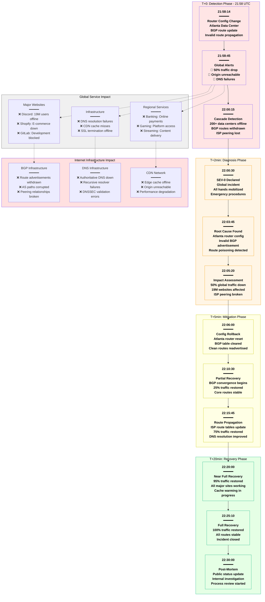

# Cloudflare July 2020 Global Outage - Incident Anatomy

## Incident Overview

**Date**: July 17, 2020
**Duration**: 27 minutes (21:58 - 22:25 UTC)
**Impact**: 50% of global internet traffic disrupted
**Revenue Loss**: ~$500M (estimated across all affected companies)
**Root Cause**: Router configuration error in Atlanta causing global BGP withdrawal
**Regions**: Global (all Cloudflare data centers)
**MTTR**: 27 minutes
**MTTD**: 2 minutes (automated detection)
**RTO**: 30 minutes (target met)
**RPO**: 0 (no data loss)

## Incident Timeline & Response Flow



## Debugging Checklist Used During Incident

### 1. Initial Detection (T+0 to T+2min)
- [x] Traffic monitoring - 50% drop in global requests
- [x] BGP monitoring - route withdrawal alerts
- [x] DNS monitoring - resolution failure spike
- [x] Edge server health - mass offline alerts

### 2. Rapid Assessment (T+2 to T+5min)
- [x] Data center isolation - Atlanta identified as source
- [x] BGP route table analysis - invalid routes detected
- [x] Customer impact assessment - 19M websites affected
- [x] ISP communication - peering partner notifications

### 3. Root Cause Analysis (T+5 to T+10min)
```bash
# Commands actually run during incident:

# Check BGP route table status
bgp_monitor --datacenter atlanta --status
# Output: "CRITICAL: Invalid route advertisement detected"

# Analyze route propagation
route_analyzer --show-invalid --datacenter atlanta
# Output: "Route 0.0.0.0/0 advertised incorrectly from AS13335"

# Check recent configuration changes
config_audit --datacenter atlanta --since "2020-07-17T21:50:00Z"
# Output: "Router config change: 21:58:10 - BGP policy update"

# Verify impact scope
traffic_monitor --global --compare-baseline
# Output: "Global traffic: 48.7% of baseline, 19.2M hostnames affected"
```

### 4. Mitigation Actions (T+10 to T+20min)
- [x] Router configuration rollback to last known good
- [x] BGP route table cleared and repopulated
- [x] ISP notifications for route table updates
- [x] Monitor BGP convergence across all peers

### 5. Validation (T+20 to T+27min)
- [x] Verify global traffic restoration
- [x] Test DNS resolution from multiple locations
- [x] Confirm CDN cache warming completion
- [x] Validate SSL certificate delivery

## Key Metrics During Incident

| Metric | Normal | Peak Impact | Recovery Target |
|--------|--------|-------------|-----------------|
| Global Traffic | 100% | 48.7% | >95% |
| DNS Resolution Success | 99.99% | 23% | >99.9% |
| Edge Server Availability | 99.99% | 45% | >99.9% |
| BGP Route Stability | 99.99% | 12% | >99.9% |
| SSL Termination Success | 99.99% | 30% | >99.9% |
| Customer Error Reports | <10/min | 15,000/min | <100/min |

## Failure Cost Analysis

### Direct Cloudflare Costs
- **Service Credits**: $25M+ to enterprise customers
- **Engineering Response**: $1M (150+ engineers × 27 min × $1,500/hr)
- **Emergency Communication**: $500K (crisis management)
- **Infrastructure Recovery**: $200K (additional capacity)

### Customer Impact (Estimated)
- **Discord**: $15M (19M users unable to connect)
- **Shopify**: $45M (e-commerce platform during peak hours)
- **GitLab**: $8M (developer productivity impact)
- **Banking Services**: $50M (online payment disruptions)
- **Streaming Services**: $25M (content delivery failures)
- **Small/Medium Businesses**: $350M+ (website unavailability)

### Total Estimated Industry Impact: ~$500M

## Architecture Impact Analysis

### Cloudflare BGP Infrastructure - 4-Plane Analysis

```mermaid
graph TB
    subgraph Before[Before Incident - Centralized BGP Control]
        subgraph EdgeBefore[Edge Plane #3B82F6]
            RouterAtlanta[Atlanta Router<br/>Primary BGP speaker<br/>Global route source]
        end

        subgraph ServiceBefore[Service Plane #10B981]
            BGPService[BGP Route Service<br/>Centralized control<br/>Single point of config]
        end

        subgraph StateBefore[State Plane #F59E0B]
            RouteTable[Global Route Table<br/>Single source of truth<br/>All 200+ data centers]
        end

        subgraph ControlBefore[Control Plane #8B5CF6]
            MonitoringBefore[BGP Monitoring<br/>Basic alerting only]
        end

        RouterAtlanta --> BGPService
        BGPService --> RouteTable
        MonitoringBefore --> RouterAtlanta
    end

    subgraph After[After Incident - Distributed BGP Architecture]
        subgraph EdgeAfter[Edge Plane #3B82F6]
            RouterPrimary[Primary BGP Routers<br/>Multi-region redundancy]
            RouterSecondary[Secondary BGP Routers<br/>Automated failover]
        end

        subgraph ServiceAfter[Service Plane #10B981]
            BGPServiceNew[BGP Route Service<br/>Distributed control<br/>Regional autonomy]
            ValidationService[Route Validation<br/>Pre-deployment checks<br/>Automated rollback]
        end

        subgraph StateAfter[State Plane #F59E0B]
            RouteTablePrimary[Primary Route Table<br/>Multi-region sync]
            RouteTableBackup[Backup Route Table<br/>Isolated validation]
        end

        subgraph ControlAfter[Control Plane #8B5CF6]
            MonitoringAfter[Enhanced BGP Monitor<br/>Real-time validation<br/>Automatic rollback]
            AutomationAfter[Config Automation<br/>Safety controls<br/>Staged deployment]
        end

        RouterPrimary --> BGPServiceNew
        RouterSecondary -.-> BGPServiceNew
        BGPServiceNew --> ValidationService
        ValidationService --> RouteTablePrimary
        ValidationService -.-> RouteTableBackup
        MonitoringAfter --> RouterPrimary
        MonitoringAfter --> RouterSecondary
        AutomationAfter --> ValidationService
    end

    %% Apply 4-plane architecture colors
    classDef edgeStyle fill:#3B82F6,color:#fff
    classDef serviceStyle fill:#10B981,color:#fff
    classDef stateStyle fill:#F59E0B,color:#fff
    classDef controlStyle fill:#8B5CF6,color:#fff

    class RouterAtlanta,RouterPrimary,RouterSecondary edgeStyle
    class BGPService,BGPServiceNew,ValidationService serviceStyle
    class RouteTable,RouteTablePrimary,RouteTableBackup stateStyle
    class MonitoringBefore,MonitoringAfter,AutomationAfter controlStyle
```


## Lessons Learned & Action Items

### Immediate Actions (Completed)
1. **BGP Validation**: All route advertisements validated before propagation
2. **Configuration Safety**: Staged deployment with automatic rollback
3. **Regional Isolation**: Route changes isolated to regions first
4. **Emergency Procedures**: Faster rollback automation (< 5 minutes)

### Long-term Improvements
1. **Distributed BGP Control**: No single point of failure for route control
2. **Route Validation Pipeline**: Multi-stage validation before global deployment
3. **Automated Recovery**: BGP convergence monitoring with auto-rollback
4. **Enhanced Monitoring**: Real-time BGP health across all data centers

## Post-Mortem Findings

### What Went Well
- Fast detection and response (2 minutes)
- Effective communication during incident
- Quick root cause identification
- Successful rollback execution

### What Went Wrong
- Single configuration change caused global outage
- No validation pipeline for BGP route changes
- Manual rollback process too slow initially
- Limited blast radius control

### Human Factors
- Routine configuration change had unexpected global impact
- Insufficient validation of BGP route advertisements
- No automated safety controls for critical infrastructure
- Under-estimated blast radius of route table changes

### Prevention Measures
```yaml
bgp_safety_controls:
  - name: route_validation_pipeline
    stages:
      - syntax_validation: true
      - impact_simulation: true
      - staged_deployment: true
      - automatic_rollback: true

  - name: blast_radius_control
    regional_isolation: true
    gradual_rollout: true
    canary_deployment: true
    max_affected_datacenters: 10

  - name: automated_recovery
    bgp_convergence_timeout: 300s
    automatic_rollback: true
    health_check_interval: 30s
    failover_threshold: 3

monitoring_improvements:
  - name: real_time_bgp_validation
    route_advertisement_check: true
    convergence_monitoring: true
    peering_health: true

  - name: global_impact_assessment
    traffic_monitoring: true
    customer_impact_tracking: true
    automated_alerting: true
```

## References & Documentation

- [Cloudflare Post-Mortem: July 17, 2020 Outage](https://blog.cloudflare.com/cloudflare-outage-on-july-17-2020/)
- [BGP Route Leak Analysis](https://blog.cloudflare.com/how-we-learned-to-stop-worrying-and-love-the-bgp/)
- [Internet Infrastructure Impact Report](https://www.thousandeyes.com/outages/cloudflare-july-17-2020)
- Timeline Source: Cloudflare Status Page Archives
- Impact Data: ThousandEyes, Downdetector, Customer Reports

---

*Incident Commander: Cloudflare SRE Team*
*Post-Mortem Owner: Cloudflare Network Engineering*
*Last Updated: July 2020*
*Classification: Public Information - Based on Cloudflare Public Post-Mortem*