# Cloudflare July 2, 2019 - The Regex That Broke The Internet

*"A single catastrophic backtracking regex pattern caused 27 minutes of global internet disruption, dropping traffic by 82%"*

## Incident Overview

| Attribute | Value |
|-----------|-------|
| **Date** | July 2, 2019 |
| **Duration** | 27 minutes |
| **Trigger Time** | 13:42 UTC |
| **Resolution Time** | 14:09 UTC |
| **Impact** | Global internet disruption |
| **Traffic Drop** | 82% at peak |
| **Users Affected** | 200M+ websites globally |
| **Estimated Cost** | $50M+ in lost e-commerce revenue |
| **Root Cause** | Catastrophic regex backtracking in WAF rules |

## The 27-Minute Internet Apocalypse


## Global Architecture Under Attack

```mermaid
graph TB
    subgraph Internet[Global Internet Traffic]
        WEB1[Website 1<br/>❌ 502 Bad Gateway]
        WEB2[Website 2<br/>❌ 502 Bad Gateway]
        WEB3[Website N<br/>❌ 502 Bad Gateway]
    end

    subgraph EdgePlane[Edge Plane - #0066CC - 200+ PoPs Worldwide]
        subgraph Americas[Americas PoPs]
            EDGE_US[Edge Servers<br/>❌ CPU: 100%<br/>🔥 Regex Backtrack Hell]
        end
        subgraph Europe[Europe PoPs]
            EDGE_EU[Edge Servers<br/>❌ CPU: 100%<br/>🔥 Regex Backtrack Hell]
        end
        subgraph APAC[Asia-Pacific PoPs]
            EDGE_AP[Edge Servers<br/>❌ CPU: 100%<br/>🔥 Regex Backtrack Hell]
        end
    end

    subgraph ServicePlane["Service Plane"]
        subgraph WAF[Web Application Firewall]
            LUA[Lua WAF Engine<br/>❌ PCRE Regex<br/>❌ Catastrophic Backtracking]
            RULES[3,868 WAF Rules<br/>⚠️ Rule #XSS.001 TOXIC]
        end

        PROXY[HTTP/HTTPS Proxy<br/>❌ Can't reach backends<br/>502 Error Generator]
    end

    subgraph StatePlane["State Plane"]
        BACKENDS[Origin Servers<br/>✅ Healthy but unreachable<br/>❌ Cloudflare blocking all]
    end

    subgraph ControlPlane["Control Plane"]
        DEPLOY[Global Deployment<br/>❌ No Staged Rollout<br/>💀 Instant Global Push]
        MON[Monitoring<br/>✅ PagerDuty Firing<br/>📊 CPU Alerts: 100%]
        DASH[Cloudflare Dashboard<br/>❌ Also Behind CF<br/>❌ Can't Access Own Tools]
    end

    %% Traffic flow during incident
    WEB1 --> EDGE_US
    WEB2 --> EDGE_EU
    WEB3 --> EDGE_AP

    EDGE_US --> LUA
    EDGE_EU --> LUA
    EDGE_AP --> LUA

    LUA --> RULES
    RULES -.->|❌ INFINITE BACKTRACK| PROXY
    PROXY -.->|❌ 502 ERRORS| BACKENDS

    DEPLOY -->|🚨 GLOBAL PUSH| RULES

    %% Apply four-plane colors
    classDef edgeStyle fill:#0066CC,stroke:#004499,color:#fff
    classDef serviceStyle fill:#00AA00,stroke:#007700,color:#fff
    classDef stateStyle fill:#FF8800,stroke:#CC6600,color:#fff
    classDef controlStyle fill:#CC0000,stroke:#990000,color:#fff

    class EDGE_US,EDGE_EU,EDGE_AP edgeStyle
    class LUA,RULES,PROXY,WAF serviceStyle
    class BACKENDS stateStyle
    class DEPLOY,MON,DASH controlStyle
```



## The Toxic Regex Pattern

### The Catastrophic Expression
```regex
(?:(?:\"|'|\]|\}|\\|\d|(?:nan|infinity|true|false|null|undefined|symbol|math)|\`|\-|\+)+[)]*;?((?:\s|-|~|!|{}|\|\||\+)*.*(?:.*=.*)))
```

### Backtracking Explosion Analysis
```mermaid
graph TD
    A[Input String: 'x=x=x=x=x=x=x=x=x=x'] --> B{Regex Match Attempt}
    B --> C[First Alternative: \"]
    C --> D{Match Failed}
    D --> E[Try Second Alternative: ']
    E --> F{Match Failed}
    F --> G[Try Third Alternative: \]]
    G --> H{Match Failed}
    H --> I[... Continue through all 20+ alternatives]
    I --> J[Try Nested Group: (?:.*=.*)]
    J --> K[Exponential Backtracking]
    K --> L[2^n possible paths to explore]
    L --> M[CPU Usage: 100%]
    M --> N[Request Timeout: 502 Error]

    style K fill:#CC0000
    style M fill:#CC0000
    style N fill:#CC0000
```

## Detailed Incident Timeline

### Phase 1: The Deployment (13:42-13:45 UTC)

```mermaid
sequenceDiagram
    participant DEV as WAF Team Engineer
    participant DEPLOY as Global Deployment
    participant EDGE as Edge Servers (200+ PoPs)
    participant CPU as CPU Monitors
    participant PD as PagerDuty

    Note over DEV,PD: 13:42 UTC - Routine XSS Rule Update

    DEV->>DEPLOY: Deploy WAF Rule #XSS.001
    Note over DEPLOY: No staged rollout - GLOBAL PUSH
    DEPLOY->>EDGE: Push toxic regex to all PoPs

    Note over EDGE: 13:43 UTC - Regex compilation
    EDGE->>CPU: CPU spike to 100%
    CPU->>CPU: Catastrophic backtracking begins

    Note over EDGE: First HTTP requests hit toxic regex
    EDGE->>EDGE: 🔥 PCRE engine trapped in backtrack hell

    CPU->>PD: 🚨 CPU threshold alert (13:45 UTC)
    Note over PD: "High CPU usage across all PoPs"
```


### Phase 2: The Cascade (13:45-14:00 UTC)

```mermaid
sequenceDiagram
    participant USER as Internet Users
    participant EDGE as Cloudflare Edge
    participant WAF as WAF Engine
    participant ORIGIN as Origin Servers
    participant OPS as Cloudflare Ops

    Note over USER,OPS: 13:45 UTC - Global Impact Begins

    USER->>EDGE: HTTP Request (normal websites)
    EDGE->>WAF: Process through WAF rules
    WAF->>WAF: Hit toxic regex pattern

    Note over WAF: ⚠️ PCRE enters exponential backtracking
    WAF->>WAF: CPU spinning on regex match

    Note over EDGE: HTTP proxy can't get WAF response
    EDGE->>USER: 502 Bad Gateway (timeout)

    Note over USER: Websites worldwide returning 502
    OPS->>OPS: Dashboard also behind Cloudflare
    OPS->>OPS: ❌ Can't access own monitoring

    Note over USER,OPS: 14:00 UTC - 82% traffic drop
```


### Phase 3: The Recovery (14:00-14:09 UTC)

```mermaid
sequenceDiagram
    participant OPS as Incident Response
    participant WAF as WAF System
    participant EDGE as Edge Servers
    participant MON as External Monitoring
    participant USER as Internet Users

    Note over OPS,USER: 14:00 UTC - Root Cause Identified

    MON->>OPS: CPU usage 100% across all PoPs
    OPS->>OPS: Correlate with WAF deployment
    OPS->>OPS: Identify toxic regex as culprit

    Note over OPS: 14:07 UTC - Execute Kill Switch
    OPS->>WAF: 🚨 GLOBAL WAF TERMINATION
    WAF->>EDGE: Disable all WAF managed rules

    Note over EDGE: CPU immediately drops to normal
    EDGE->>USER: HTTP proxy functioning again
    USER->>EDGE: ✅ Websites loading normally

    Note over OPS,USER: 14:09 UTC - Service fully restored
```


## Impact Analysis & Metrics

### Global Traffic Disruption


### Economic Impact Assessment
| Sector | Impact | Duration | Est. Loss |
|--------|--------|----------|-----------|
| **E-commerce** | 200M+ sites down | 27 minutes | $25M |
| **SaaS Platforms** | Service disruptions | 27 minutes | $8M |
| **Media & Content** | CDN unavailable | 27 minutes | $5M |
| **Enterprise Productivity** | Apps inaccessible | 27 minutes | $7M |
| **Gaming & Entertainment** | Platform outages | 27 minutes | $3M |
| **Financial Services** | Trading disruptions | 27 minutes | $2M |
| **Total Estimated Loss** | | | **$50M** |

## Technical Deep Dive

### Regex Engine Comparison
```mermaid
graph TB
    subgraph Current[PCRE - Current Engine]
        PCRE[PCRE Engine<br/>❌ Backtracking<br/>❌ No Runtime Guarantees<br/>❌ Exponential Complexity]
        INPUT[Input: x=x=x=x=x=x=x=x=x=x]
        PROCESS[Processing Time: ∞<br/>CPU Usage: 100%]

        INPUT --> PCRE
        PCRE --> PROCESS
    end

    subgraph Future[RE2 - Target Engine]
        RE2[RE2 Engine<br/>✅ Linear Complexity<br/>✅ Runtime Guarantees<br/>✅ No Backtracking]
        INPUT2[Input: x=x=x=x=x=x=x=x=x=x]
        PROCESS2[Processing Time: O(n)<br/>CPU Usage: <5%]

        INPUT2 --> RE2
        RE2 --> PROCESS2
    end

    Current ==> Future

    style PROCESS fill:#CC0000
    style PROCESS2 fill:#00AA00
```

### WAF Rule Processing Flow


## Root Cause Analysis

### The Perfect Storm Components


### Contributing Factors Timeline


## Remediation Actions

### Immediate Response (Completed)
- [x] **Global WAF Termination**: Kill switch activated at 14:07 UTC
- [x] **Rule Audit**: Manual inspection of all 3,868 WAF rules
- [x] **Toxic Pattern Removal**: Eliminated problematic regex patterns
- [x] **Emergency Procedures**: Updated global kill switch procedures

### Short-term Fixes (30 days)
- [x] **CPU Protection**: Reintroduced CPU usage limits for regex processing
- [x] **Performance Testing**: Added regex performance profiling to test suite
- [x] **Staged Rollout**: Implemented progressive deployment for WAF rules
- [x] **Monitoring Enhancement**: Real-time regex performance monitoring

### Long-term Solutions (6 months)
- [ ] **Regex Engine Migration**: Transition from PCRE to RE2
- [ ] **Runtime Guarantees**: Implement O(n) complexity guarantees
- [ ] **Automated Testing**: Regex performance regression testing
- [ ] **Circuit Breakers**: Per-rule CPU usage circuit breakers

## Prevention Framework

### Regex Safety Checklist

```mermaid
flowchart TD
    A[New Regex Pattern] --> B{Nested Quantifiers?}
    B -->|Yes| C[❌ REJECT - High Risk]
    B -->|No| D{Alternation Count >10?}
    D -->|Yes| E[❌ REJECT - Complexity Risk]
    D -->|No| F[Performance Test]
    F --> G{CPU Usage <10ms?}
    G -->|No| H[❌ REJECT - Performance Risk]
    G -->|Yes| I[Staged Deployment]
    I --> J[Monitor & Validate]

    style C fill:#CC0000
    style E fill:#CC0000
    style H fill:#CC0000
    style I fill:#00AA00
```


### Deployment Safety Gates


## Engineering Lessons

### The Catastrophic Backtracking Problem
```mermaid
graph TB
    subgraph RegexProblem[Why This Regex Was Toxic]
        PAT[Pattern: (?:(?:\"|'|...)+[)]*;?((?:\s|-|~|!|{}|\|\||\+)*.*(?:.*=.*)))]
        ALT[20+ Alternations in outer group]
        NEST[Nested quantifiers: .* inside (?:.*=.*)]
        INPUT[Input: x=x=x=x=x=x=x=x=x=x]

        PAT --> ALT
        PAT --> NEST
        ALT --> BACK[Exponential Backtracking]
        NEST --> BACK
        INPUT --> BACK
        BACK --> CPU[CPU: 100%]
    end

    style BACK fill:#CC0000
    style CPU fill:#CC0000
```

### Critical Decision Points


## War Stories & Lessons for 3 AM Engineers

### 🚨 Critical Warning Signs
1. **CPU spikes across multiple PoPs simultaneously** = likely regex issue
2. **WAF deployment + immediate 502 errors** = toxic pattern deployed
3. **Can't access your own dashboard** = you're behind your own proxy
4. **Exponential request processing time** = catastrophic backtracking

### 🛠️ Emergency Procedures


### 💡 Key Takeaways
- **Regex complexity** can literally break the internet
- **Global deployments** without staging = **global disasters**
- **Performance testing** must include **worst-case inputs**
- **Kill switches** are not optional for **global systems**
- **Your monitoring** shouldn't depend on **your own infrastructure**

---

*"We believed incorrectly that our test cases for the type of rule change made would reliably find high CPU usage. We introduced a new regex pattern that was not included in our test data."* - Cloudflare Engineering Team

**Quote from the postmortem**: *"The real story of how the Cloudflare service went down for 27 minutes is much more complex than 'a regular expression went bad'."*

**Impact**: This incident led to Cloudflare's adoption of RE2 regex engine and comprehensive regex safety frameworks, establishing industry best practices for regex performance testing.