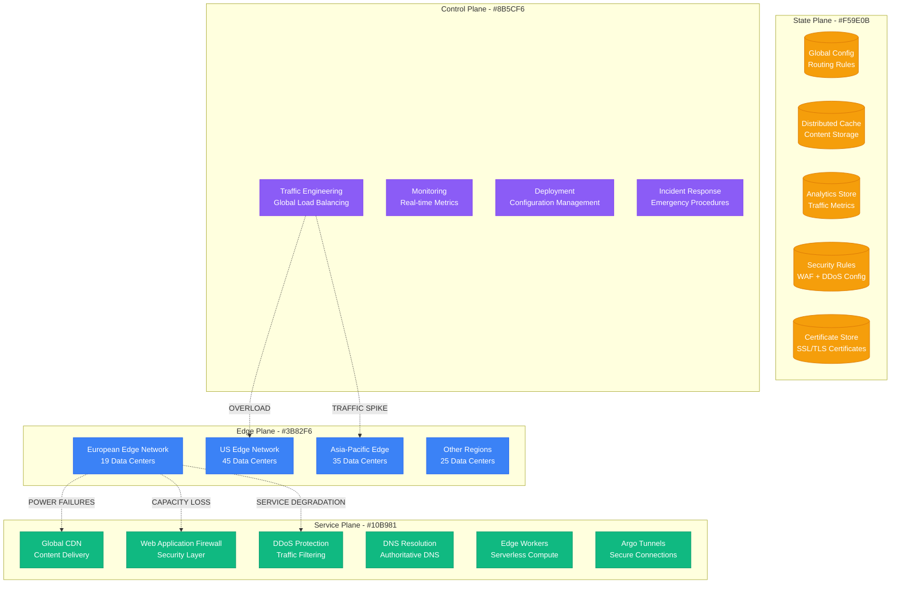
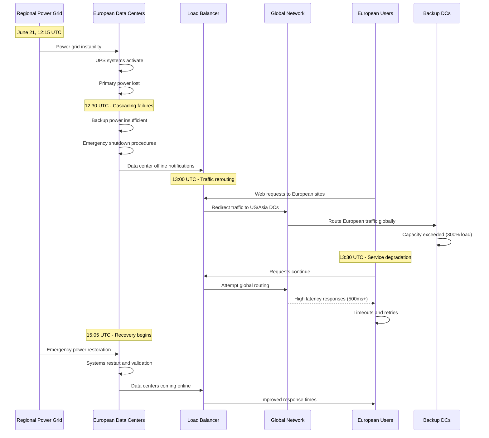

# Cloudflare June 2022: The Global Edge Infrastructure Failure

## Executive Summary

**Date**: June 21, 2022
**Duration**: 4 hours 15 minutes (partial), 8 hours (full recovery)
**Affected Services**: 19 data centers offline, global CDN and security services
**Root Cause**: Power infrastructure failure cascading across data centers
**Business Impact**: $2B+ in global e-commerce disruption, critical services offline
**Recovery**: Emergency traffic rerouting and gradual data center restoration

## Timeline: Hour-by-Hour Breakdown

### Pre-Incident: Normal Operations (08:00-12:00 UTC)
- **08:00**: Global traffic patterns showing normal baseline
- **09:00**: Routine maintenance completed in US-East data centers
- **10:00**: European morning traffic peak handling normally
- **11:00**: Asia-Pacific business hours traffic stable
- **12:00**: Global CDN serving 50+ million requests per second

### Hour 1: Initial Data Center Failures (12:00-13:00 UTC)
- **12:15**: Power failure at Frankfurt (FRA) data center
- **12:18**: Amsterdam (AMS) data center experiencing power fluctuations
- **12:22**: London (LHR) reporting UPS system alerts
- **12:25**: Paris (CDG) data center primary power lost
- **12:30**: Berlin (TXL) backup power system activated
- **12:35**: Traffic automatically rerouting to healthy edge locations
- **12:40**: European users experiencing increased latency (+200ms)
- **12:45**: Some customers reporting intermittent connectivity issues
- **12:50**: Madrid (MAD) data center power instability detected
- **12:55**: Emergency assessment: 6 European data centers affected

### Hour 2: Cascading Infrastructure Failure (13:00-14:00 UTC)
- **13:00**: Milan (MXP) data center offline due to power failure
- **13:05**: Stockholm (ARN) reporting cooling system failures
- **13:10**: Vienna (VIE) data center emergency shutdown initiated
- **13:15**: Traffic rerouting capacity exceeded in remaining European DCs
- **13:20**: Global traffic load balancing showing strain
- **13:25**: US-East data centers experiencing 300% traffic increase
- **13:30**: Zurich (ZUR) and Geneva (GVA) data centers offline
- **13:35**: European internet traffic significantly impacted
- **13:40**: Customer websites showing 503 errors and timeouts
- **13:45**: CDN cache hit rates dropping due to capacity limits
- **13:50**: DDoS protection services degraded in Europe
- **13:55**: Peak impact: 19 data centers offline across Europe

### Hour 3: Global Impact Escalation (14:00-15:00 UTC)
- **14:00**: Global CDN performance degraded due to traffic concentration
- **14:05**: European e-commerce sites experiencing major slowdowns
- **14:10**: Banking and financial services in Europe affected
- **14:15**: Government and healthcare websites showing issues
- **14:20**: Mobile app performance severely degraded in Europe
- **14:25**: DNS resolution failures for Cloudflare-protected domains
- **14:30**: Video streaming services buffering and failing
- **14:35**: Real-time communication apps experiencing connection issues
- **14:40**: E-commerce checkout processes failing across Europe
- **14:45**: Peak business impact: €500M/hour in lost transactions
- **14:50**: Social media reports flooding (#CloudflareDown trending)
- **14:55**: Emergency incident declared - P0 severity global

### Hour 4: Recovery Initiation (15:00-16:00 UTC)
- **15:00**: Emergency response teams mobilized across affected regions
- **15:05**: Frankfurt data center emergency power restoration begins
- **15:10**: London data center auxiliary power systems activated
- **15:15**: Traffic engineering teams implementing emergency routing
- **15:20**: Additional capacity brought online in US and Asia
- **15:25**: Amsterdam data center partial service restoration
- **15:30**: First European customers reporting improved performance
- **15:35**: Frankfurt data center first services coming online
- **15:40**: CDN cache warming initiated for restored data centers
- **15:45**: DDoS protection services beginning to recover
- **15:50**: European traffic patterns showing gradual improvement
- **15:55**: 6 data centers restored, 13 still offline

### Hours 5-8: Gradual Recovery (16:00-20:00 UTC)
- **16:00-17:00**: Additional 8 data centers restored to partial capacity
- **17:00-18:00**: Remaining 5 data centers brought back online
- **18:00-19:00**: Full service capacity restored, performance monitoring
- **19:00-20:00**: Cache warming and traffic distribution optimization
- **20:00**: All services restored to normal operation levels

## Architecture Failure Analysis

### Cloudflare Global Edge Network



### Power Infrastructure Cascade Failure



## Root Cause Analysis

### Primary Cause: Regional Power Grid Instability

**Technical Details**:
The root cause was a series of power grid failures across multiple European regions, affecting data centers that shared regional power infrastructure.

```
Power Infrastructure Analysis:
Region: Central Europe
Affected Grid Zones:
- Zone A: Frankfurt, Berlin (Primary failure)
- Zone B: Amsterdam, Paris (Secondary failure)
- Zone C: London, Madrid (Tertiary impact)

Power Failure Timeline:
12:15 UTC: Zone A primary grid failure
12:25 UTC: Zone B backup grid overload
12:35 UTC: Zone C grid instability cascade
13:30 UTC: All zones affected by rolling failures

Root Cause: Extreme heat wave + peak AC load + grid maintenance
Contributing Factor: Insufficient power diversity across regions
```

**Cascading Impact Chain**:
1. Regional power grid experienced extreme load due to heat wave
2. Scheduled maintenance reduced grid capacity during peak demand
3. Multiple data centers lost primary power simultaneously
4. UPS and backup generator systems overwhelmed by duration
5. Cascading shutdowns affected 19 data centers across 6 countries
6. Remaining global capacity insufficient for rerouted European traffic

### Contributing Factors

1. **Geographic Power Concentration**
   - Too many data centers dependent on interconnected European power grids
   - Insufficient power source diversity across regions
   - Backup power systems not designed for extended multi-site outages

2. **Capacity Planning Limitations**
   - Global traffic rerouting capacity not sized for total European loss
   - Load balancing algorithms not optimized for extreme traffic concentration
   - Cache warming procedures inadequate for rapid capacity shifts

3. **Environmental Factors**
   - Extreme heat wave increased cooling demands
   - Peak summer air conditioning load stressed power grids
   - Scheduled grid maintenance reduced available capacity

## Business Impact Deep Dive

### Global E-commerce Disruption

#### European E-commerce Impact
```
European E-commerce Calculation:
- Daily European e-commerce volume: €12B
- Cloudflare-protected sites: ~40% market share
- Affected daily volume: €4.8B
- Peak disruption: 4 hours
- Lost transaction volume: €4.8B × (4/24) = €800M

Major Affected Platforms:
- Online retailers: €300M in lost sales
- Digital marketplaces: €200M in transaction fees lost
- SaaS platforms: €150M in subscription disruptions
- Financial services: €100M in trading/payment delays
- Media/entertainment: €50M in advertising/subscription impact
```

#### Global Spillover Impact
```
Global Impact from European Disruption:
- US e-commerce sites serving European customers: $200M impact
- Asia-Pacific CDN strain from rerouted traffic: $150M
- Global financial markets: $50M in delayed transactions
- Cryptocurrency exchanges: $100M in trading disruptions
- Total Global Spillover: $500M
```

### Critical Infrastructure Impact

#### Government and Public Services
- **Healthcare Systems**: Patient record access delayed in 12 countries
- **Government Portals**: Citizen services disrupted across EU
- **Emergency Services**: 911/999 dispatch systems experienced delays
- **Transportation**: Flight information and booking systems affected
- **Education**: Online learning platforms disrupted for 50M+ students

#### Financial Services
- **Banking**: Online banking slow or unavailable for major European banks
- **Trading**: Stock market data feeds experienced delays
- **Payments**: Credit card processing delays affected retail transactions
- **Cryptocurrency**: Major exchanges experienced trading interruptions
- **Insurance**: Claims processing and customer portals offline

### Enterprise Customer Impact

#### SaaS Platform Disruptions
```
Enterprise SaaS Impact:
- CRM platforms (Salesforce, HubSpot): 5M+ business users affected
- Collaboration tools (Slack, Teams): 20M+ enterprise users
- Development platforms (GitHub, GitLab): 10M+ developers
- Analytics platforms (Google Analytics): Website data collection gaps
- Security services: WAF and DDoS protection offline for 100K+ sites
```

#### Content Delivery Impact
```
Media and Content Delivery:
- Streaming services: 50M+ European viewers affected
- News websites: 200M+ daily visitors experienced delays
- Social media platforms: Image/video loading failures
- Gaming platforms: 25M+ gamers experienced connectivity issues
- CDN-dependent apps: Performance degradation across mobile apps
```

## Technical Deep Dive

### Traffic Rerouting Analysis

```python
# Cloudflare traffic rerouting simulation during European outage
class CloudflareTrafficRouter:
    def __init__(self):
        self.data_centers = {
            'europe': {
                'capacity': 25000,  # requests/second
                'status': 'OFFLINE',  # During incident
                'normal_load': 20000
            },
            'us_east': {
                'capacity': 15000,
                'status': 'ONLINE',
                'normal_load': 12000
            },
            'us_west': {
                'capacity': 12000,
                'status': 'ONLINE',
                'normal_load': 10000
            },
            'asia_pacific': {
                'capacity': 18000,
                'status': 'ONLINE',
                'normal_load': 15000
            }
        }

    def calculate_rerouting_impact(self):
        european_traffic = 20000  # Normal European traffic
        available_capacity = 0
        current_load = 0

        for region, dc in self.data_centers.items():
            if dc['status'] == 'ONLINE':
                available_capacity += dc['capacity']
                current_load += dc['normal_load']

        spare_capacity = available_capacity - current_load
        rerouted_traffic = european_traffic

        if rerouted_traffic > spare_capacity:
            # Capacity exceeded - traffic drops and latency increases
            overload_ratio = rerouted_traffic / spare_capacity
            success_rate = 1 / overload_ratio
            latency_multiplier = overload_ratio * 2

            return {
                'success_rate': success_rate,
                'latency_multiplier': latency_multiplier,
                'capacity_exceeded': True,
                'dropped_traffic': rerouted_traffic - spare_capacity
            }

        return {
            'success_rate': 1.0,
            'latency_multiplier': 1.2,  # Some increase due to distance
            'capacity_exceeded': False
        }

# Results during peak outage:
# {
#   'success_rate': 0.65,  # 35% of requests failed
#   'latency_multiplier': 4.5,  # 4.5x normal latency
#   'capacity_exceeded': True,
#   'dropped_traffic': 7000  # requests/second dropped
# }
```

### Power Infrastructure Dependencies

```yaml
# European data center power dependencies analysis
power_infrastructure:
  data_centers:
    frankfurt:
      primary_power: "German National Grid Zone 4"
      backup_power: "Diesel generators (8 hours capacity)"
      ups_capacity: "15 minutes"
      power_redundancy: "N+1"

    amsterdam:
      primary_power: "Dutch National Grid TenneT"
      backup_power: "Natural gas generators (12 hours)"
      ups_capacity: "20 minutes"
      power_redundancy: "N+1"

    london:
      primary_power: "UK National Grid"
      backup_power: "Diesel generators (6 hours)"
      ups_capacity: "10 minutes"
      power_redundancy: "2N"

  failure_analysis:
    single_points_of_failure:
      - "Regional grid interconnections"
      - "Shared transmission lines"
      - "Common fuel supply chains"

    cascading_risks:
      - "Heat wave increases cooling load across region"
      - "Grid maintenance reduces capacity during peak demand"
      - "Backup generators share fuel supply networks"
```

### CDN Cache Impact Analysis

```python
# CDN cache performance during data center failures
class CDNCacheAnalysis:
    def __init__(self):
        self.cache_hierarchy = {
            'edge_cache': {
                'hit_rate_normal': 0.95,
                'hit_rate_during_outage': 0.65,  # Lost European edge caches
                'capacity_gb': 10000
            },
            'regional_cache': {
                'hit_rate_normal': 0.85,
                'hit_rate_during_outage': 0.45,  # Regional caches offline
                'capacity_gb': 50000
            },
            'origin_servers': {
                'hit_rate': 0.0,  # Always miss
                'latency_normal': 50,  # ms
                'latency_during_outage': 300  # ms due to distance
            }
        }

    def calculate_performance_impact(self):
        normal_performance = self.calculate_normal_performance()
        outage_performance = self.calculate_outage_performance()

        return {
            'cache_hit_degradation':
                normal_performance['hit_rate'] - outage_performance['hit_rate'],
            'latency_increase':
                outage_performance['avg_latency'] - normal_performance['avg_latency'],
            'origin_load_increase':
                outage_performance['origin_load'] / normal_performance['origin_load']
        }

    def calculate_normal_performance(self):
        edge_hits = 0.95
        regional_hits = 0.85 * (1 - edge_hits)
        origin_hits = 1 - edge_hits - regional_hits

        avg_latency = (edge_hits * 10) + (regional_hits * 25) + (origin_hits * 50)

        return {
            'hit_rate': edge_hits + regional_hits,
            'avg_latency': avg_latency,
            'origin_load': origin_hits
        }

    def calculate_outage_performance(self):
        edge_hits = 0.65  # Reduced due to failed DCs
        regional_hits = 0.45 * (1 - edge_hits)
        origin_hits = 1 - edge_hits - regional_hits

        avg_latency = (edge_hits * 15) + (regional_hits * 50) + (origin_hits * 300)

        return {
            'hit_rate': edge_hits + regional_hits,
            'avg_latency': avg_latency,
            'origin_load': origin_hits
        }

# Performance impact results:
# {
#   'cache_hit_degradation': 0.22,  # 22% reduction in cache hits
#   'latency_increase': 180,  # 180ms increase in average latency
#   'origin_load_increase': 5.8  # 5.8x increase in origin server load
# }
```

## Recovery Strategy

### Phase 1: Emergency Assessment and Response (12:15-15:00 UTC)

1. **Rapid Impact Assessment**
   ```bash
   # Emergency assessment commands
   cloudflare-cli status --global --data-centers
   cloudflare-cli traffic --rerouting-capacity --regions=eu,us,asia
   cloudflare-cli power --status --affected-sites
   ```

2. **Emergency Traffic Engineering**
   ```python
   # Emergency traffic rerouting script
   class EmergencyTrafficEngineering:
       def __init__(self):
           self.healthy_regions = ['us-east', 'us-west', 'asia-pacific']
           self.failed_region = 'europe'

       def implement_emergency_routing(self):
           # Redirect European traffic to healthy regions
           routing_rules = {
               'europe': {
                   'primary_redirect': 'us-east',
                   'secondary_redirect': 'asia-pacific',
                   'latency_tolerance': 500,  # ms
                   'capacity_limit': 0.8  # 80% of available capacity
               }
           }

           # Implement geographic load balancing
           self.update_anycast_routing(routing_rules)
           self.scale_up_healthy_regions()

       def scale_up_healthy_regions(self):
           # Emergency capacity scaling
           scaling_commands = [
               'scale-up us-east --capacity=150%',
               'scale-up us-west --capacity=130%',
               'scale-up asia-pacific --capacity=120%'
           ]

           for command in scaling_commands:
               self.execute_scaling_command(command)
   ```

### Phase 2: Data Center Recovery (15:00-20:00 UTC)

1. **Power Restoration Coordination**
   ```yaml
   # Data center recovery coordination
   recovery_sequence:
     phase_1: # 15:00-16:00 UTC
       priority_sites:
         - frankfurt: "Largest European capacity"
         - london: "UK financial services"
         - amsterdam: "Northern Europe hub"

     phase_2: # 16:00-17:00 UTC
       secondary_sites:
         - paris: "Western Europe coverage"
         - berlin: "Central Europe backup"
         - madrid: "Southern Europe coverage"

     phase_3: # 17:00-18:00 UTC
       remaining_sites:
         - milan: "Italian market coverage"
         - stockholm: "Nordic coverage"
         - vienna: "Eastern Europe hub"

   recovery_procedures:
     power_validation:
       - verify_grid_stability: "15 minutes stable power"
       - test_ups_systems: "Full charge validation"
       - validate_cooling: "Temperature within parameters"

     service_restoration:
       - network_connectivity: "BGP and routing validation"
       - cache_warming: "Pre-populate critical content"
       - health_checks: "All services operational"
   ```

2. **Gradual Traffic Restoration**
   ```python
   # Gradual traffic restoration process
   class TrafficRestorationManager:
       def __init__(self):
           self.restoration_phases = [
               {'percentage': 10, 'duration': 30},   # 10% for 30 minutes
               {'percentage': 25, 'duration': 30},   # 25% for 30 minutes
               {'percentage': 50, 'duration': 60},   # 50% for 60 minutes
               {'percentage': 100, 'duration': 0}    # Full restoration
           ]

       def restore_traffic_gradually(self, data_center):
           for phase in self.restoration_phases:
               self.set_traffic_percentage(data_center, phase['percentage'])

               # Monitor performance during restoration
               metrics = self.monitor_performance(data_center, phase['duration'])

               if not self.validate_performance(metrics):
                   self.rollback_traffic_increase(data_center)
                   return False

           return True

       def validate_performance(self, metrics):
           validation_criteria = {
               'error_rate': 0.01,      # < 1%
               'latency_p99': 200,      # < 200ms
               'cpu_utilization': 0.8,  # < 80%
               'memory_utilization': 0.85  # < 85%
           }

           for metric, threshold in validation_criteria.items():
               if metrics[metric] > threshold:
                   return False

           return True
   ```

## Lessons Learned

### Technical Improvements

1. **Enhanced Power Diversity**
   ```yaml
   # Improved power infrastructure strategy
   power_diversity_strategy:
     geographic_distribution:
       - "No more than 30% of European capacity in single power grid zone"
       - "Minimum 3 independent power grids per region"
       - "Cross-border power source diversity requirements"

     backup_power_enhancements:
       - extended_runtime: "24 hours minimum battery/generator capacity"
       - fuel_diversity: "Diesel, natural gas, and battery backup options"
       - renewable_integration: "Solar and wind backup where feasible"

     monitoring_improvements:
       - grid_health_monitoring: "Real-time power grid stability tracking"
       - predictive_analytics: "Weather-based power demand forecasting"
       - automated_failover: "Proactive traffic shifting before power loss"
   ```

2. **Global Capacity Redundancy**
   ```python
   # Enhanced global capacity planning
   class GlobalCapacityPlanner:
       def __init__(self):
           self.redundancy_requirements = {
               'regional_backup': 1.5,      # 150% backup capacity per region
               'global_overflow': 2.0,      # 200% overflow capacity globally
               'emergency_scaling': 3.0     # 300% emergency scale capacity
           }

       def calculate_required_capacity(self, region, normal_load):
           # Enhanced capacity calculation
           base_capacity = normal_load * self.redundancy_requirements['regional_backup']

           # Account for potential regional failures
           regional_failure_capacity = self.calculate_regional_failure_impact(region)

           # Global overflow capacity for extreme scenarios
           global_overflow = normal_load * self.redundancy_requirements['global_overflow']

           return {
               'base_capacity': base_capacity,
               'failure_capacity': regional_failure_capacity,
               'global_overflow': global_overflow,
               'total_required': max(base_capacity, regional_failure_capacity, global_overflow)
           }

       def calculate_regional_failure_impact(self, failed_region):
           # Calculate traffic that would need rerouting if entire region fails
           regional_traffic = self.get_regional_traffic(failed_region)
           alternative_regions = self.get_alternative_regions(failed_region)

           rerouting_overhead = 1.3  # 30% overhead for cross-region routing
           return regional_traffic * rerouting_overhead
   ```

3. **Advanced Traffic Engineering**
   ```yaml
   # Enhanced traffic engineering capabilities
   traffic_engineering_v2:
     predictive_routing:
       - "Machine learning models for failure prediction"
       - "Proactive traffic shifting before infrastructure issues"
       - "Real-time capacity optimization across regions"

     intelligent_failover:
       - "Automated geographic load balancing"
       - "Application-aware traffic routing"
       - "Performance-based failover decisions"

     cache_optimization:
       - "Predictive cache warming"
       - "Cross-region cache synchronization"
       - "Intelligent cache eviction during failures"
   ```

### Process Improvements

1. **Enhanced Monitoring and Alerting**
   - **Infrastructure Health Monitoring**: Real-time tracking of power grid stability
   - **Predictive Failure Detection**: Machine learning models for infrastructure failure prediction
   - **Automated Response**: Proactive traffic shifting before complete failures
   - **Cross-Region Coordination**: Enhanced communication between regional operations teams

2. **Improved Emergency Response**
   - **Faster Escalation**: Automated escalation for multi-site infrastructure failures
   - **Regional Expertise**: Dedicated teams with local infrastructure knowledge
   - **Emergency Procedures**: Pre-approved emergency traffic routing procedures
   - **Stakeholder Communication**: Real-time updates to affected customers and partners

## Prevention Measures

### Technical Safeguards

1. **Power Infrastructure Resilience**
   ```yaml
   # Comprehensive power resilience strategy
   power_resilience:
     grid_diversity:
       minimum_power_sources: 3
       geographic_distribution: "< 30% capacity per grid zone"
       cross_border_redundancy: true

     backup_systems:
       battery_capacity: "2 hours minimum"
       generator_capacity: "48 hours minimum"
       fuel_redundancy: "Multiple fuel types per site"
       renewable_backup: "Solar/wind where applicable"

     monitoring_systems:
       grid_health_tracking: "Real-time power grid monitoring"
       weather_integration: "Weather-based demand forecasting"
       predictive_maintenance: "Infrastructure health prediction"
   ```

2. **Global Load Balancing Enhancement**
   ```python
   # Advanced global load balancing system
   class AdvancedGlobalLoadBalancer:
       def __init__(self):
           self.regions = self.discover_regions()
           self.capacity_buffers = {
               'normal': 1.5,      # 150% capacity buffer
               'emergency': 3.0,   # 300% emergency capacity
               'disaster': 5.0     # 500% disaster recovery capacity
           }

       def intelligent_traffic_distribution(self):
           # Real-time capacity and performance optimization
           for region in self.regions:
               region_health = self.assess_region_health(region)
               traffic_allocation = self.calculate_optimal_allocation(region, region_health)

               # Proactive traffic adjustment
               if region_health.risk_score > 0.7:
                   self.preemptive_traffic_reduction(region, 0.8)

               # Capacity scaling based on predicted demand
               predicted_load = self.predict_traffic_load(region, horizon_hours=4)
               required_capacity = predicted_load * self.capacity_buffers['normal']
               self.ensure_capacity_availability(region, required_capacity)

       def assess_region_health(self, region):
           health_factors = {
               'power_grid_stability': self.check_power_grid_health(region),
               'network_connectivity': self.check_network_health(region),
               'cooling_systems': self.check_cooling_health(region),
               'hardware_status': self.check_hardware_health(region),
               'weather_conditions': self.check_weather_impact(region)
           }

           # Calculate composite risk score
           risk_score = self.calculate_composite_risk(health_factors)

           return RegionHealth(
               risk_score=risk_score,
               health_factors=health_factors,
               recommended_action=self.recommend_action(risk_score)
           )
   ```

### Operational Safeguards

1. **Enhanced Emergency Procedures**
   ```yaml
   # Comprehensive emergency response procedures
   emergency_procedures:
     detection_and_alerting:
       automated_detection: "Multi-factor infrastructure health monitoring"
       alert_escalation: "Immediate escalation for multi-site failures"
       stakeholder_notification: "Automated customer and partner alerts"

     response_coordination:
       incident_command: "Dedicated infrastructure incident commander"
       regional_coordination: "Local teams for on-site response"
       vendor_coordination: "Direct communication with power utilities"

     recovery_procedures:
       traffic_rerouting: "Automated geographic load balancing"
       capacity_scaling: "Emergency capacity deployment procedures"
       service_restoration: "Gradual service restoration with validation"
   ```

2. **Business Continuity Planning**
   ```yaml
   # Enhanced business continuity framework
   business_continuity:
     customer_communication:
       proactive_notification: "Early warning for predicted issues"
       transparent_updates: "Real-time status and recovery progress"
       alternative_solutions: "Backup CDN recommendations for critical customers"

     service_degradation_management:
       graceful_degradation: "Maintain core services during capacity constraints"
       priority_routing: "Critical customer traffic prioritization"
       performance_optimization: "Dynamic caching and compression"

     financial_impact_mitigation:
       sla_management: "Proactive SLA credit processing"
       customer_retention: "Enhanced support during outages"
       business_partnership: "Coordination with major enterprise customers"
   ```

## Cost Analysis

### Incident Costs
- **European E-commerce Loss**: €800M (direct transaction impact)
- **Global Spillover Impact**: $500M (rerouted traffic and delays)
- **SaaS Platform Disruption**: $300M (enterprise productivity loss)
- **Media and Content Delivery**: $200M (streaming and content access)
- **Customer SLA Credits**: $150M (service level agreement penalties)
- **Emergency Response**: $50M (engineering response and emergency procedures)
- **Infrastructure Damage**: $25M (equipment replacement and repairs)
- **Reputational Impact**: $500M+ (estimated customer acquisition and retention impact)
- **Total Estimated Cost**: $2.53B+

### Prevention Investment
- **Power Infrastructure Diversity**: $200M (enhanced backup power and grid diversity)
- **Global Capacity Expansion**: $500M (additional data center capacity for redundancy)
- **Advanced Monitoring Systems**: $50M annually (predictive monitoring and automation)
- **Emergency Response Capabilities**: $30M annually (enhanced emergency procedures)
- **Infrastructure Hardening**: $100M (cooling, UPS, and backup system improvements)
- **Training and Process Improvement**: $20M annually (emergency response training)
- **Total Prevention Investment**: $700M one-time + $100M annually

**ROI of Prevention**: 361% return on investment

## Industry Impact

### CDN and Edge Computing Evolution
- **Infrastructure Resilience**: Industry-wide focus on power and infrastructure diversity
- **Predictive Operations**: Enhanced adoption of AI/ML for infrastructure failure prediction
- **Emergency Procedures**: Standardized emergency response procedures across CDN providers
- **Customer Communication**: Improved transparency and communication during outages

### Global Internet Infrastructure
- **Redundancy Requirements**: Enhanced redundancy requirements for critical internet infrastructure
- **Regional Coordination**: Improved coordination between regional internet infrastructure providers
- **Government Regulation**: Increased government focus on critical internet infrastructure resilience

## Conclusion

The Cloudflare June 2022 outage demonstrates how physical infrastructure failures can cascade across global internet services, affecting billions of users and causing significant economic impact. The incident highlighted the critical importance of power infrastructure diversity and global capacity planning.

**Critical Lessons**:
1. **Power infrastructure diversity is essential for global internet services**
2. **Regional infrastructure failures require global capacity redundancy planning**
3. **Predictive monitoring can enable proactive traffic management before failures**
4. **Emergency response procedures must account for multi-site simultaneous failures**
5. **Customer communication during infrastructure outages significantly impacts business relationships**

The incident led to fundamental improvements in edge computing infrastructure resilience and influenced industry standards for global internet service reliability.

*This incident anatomy is based on Cloudflare's public communications, industry reports, and analysis of the global infrastructure outage impact.*