# Coinbase Outage During Crypto Market Crash - May 19, 2021

**The 5-Hour Trading Halt When Crypto Markets Collapsed 40%**

## Incident Overview

| **Metric** | **Value** |
|------------|-----------||
| **Date** | May 19, 2021 |
| **Duration** | 5 hours intermittent outages |
| **Impact** | Unable to trade during massive volatility |
| **Users Affected** | 68M+ registered users |
| **Financial Impact** | $500M+ in missed trading opportunities |
| **Root Cause** | Traffic spike 60x normal volume |
| **MTTR** | 300 minutes |
| **Key Issue** | Capacity planning failure during crypto crash |
| **Services Down** | Trading, Pro platform, mobile app |

## Timeline - When Crypto Traders Were Locked Out

```mermaid
gantt
    title Coinbase Outage During Market Crash - May 19, 2021
    dateFormat HH:mm
    axisFormat %H:%M

    section Market Crash
    Crypto prices fall    :done, crash1, 06:00, 09:00
    Volume spike begins   :done, crash2, 09:00, 10:30
    Panic selling starts :done, crash3, 10:30, 11:45

    section System Failure
    Trading engine slow   :done, fail1, 11:45, 12:15
    Complete platform down:done, fail2, 12:15, 14:30
    Intermittent recovery :done, fail3, 14:30, 17:45

    section Recovery
    Capacity scaling      :done, rec1, 17:45, 18:30
    Full service restore  :done, rec2, 18:30, 19:00
```



## Crypto Exchange Under Extreme Load


## Crypto Market Timeline

### Market Crash Triggers


### Trading Volume Explosion


## Economic Impact Analysis

### Missed Trading Opportunities


## Technical Recovery

```mermaid
timeline
    title Coinbase System Recovery

    section Emergency Scaling
        12:30 : Auto-scaling triggered
              : 10x server capacity
              : Database read replicas

    section Load Balancing
        14:00 : Traffic distribution
              : Geographic load balancing
              : Queue management

    section Service Restoration
        17:00 : Trading engine stable
              : Order processing resumed
              : Mobile app functional

    section Full Recovery
        19:00 : All services operational
              : Normal trading volume
              : Price data accurate
```

## The Bottom Line

**This incident showed that crypto exchanges must be built to handle 50-100x normal traffic during market crashes - exactly when users need them most.**

**Key Takeaways:**
- Crypto volatility creates massive traffic spikes
- Trading platforms need extreme capacity planning
- Market crashes test infrastructure limits
- User trust depends on uptime during critical moments

**The $500M question:** How much capacity should crypto exchanges maintain for black swan market events?

---

*"In crypto markets, your platform goes down exactly when your users need it most."*