# Discord January 2022 - API Cascade Failure & Database Cluster Meltdown

*"A Redis primary migration triggered API failures, exposing cascading database cluster dependencies across 400M users"*

## Incident Overview

| Attribute | Value |
|-----------|-------|
| **Date** | January 2022 |
| **Duration** | 4 hours, 23 minutes |
| **Trigger Time** | 14:30 UTC |
| **Resolution Time** | 18:53 UTC |
| **Impact** | Global Discord service disruption |
| **Users Affected** | 150M+ active users |
| **Servers Affected** | 19M+ Discord servers |
| **Message Delivery** | 95% failure rate |
| **Estimated Cost** | $18M+ in lost engagement |
| **Root Cause** | Google Cloud Platform Redis migration cascade |

## The Great Discord Meltdown


## Architecture Under Siege

```mermaid
graph TB
    subgraph Users[400M Global Users]
        DESKTOP[Desktop App<br/>💻 Connection drops]
        MOBILE[Mobile App<br/>📱 Push notifications fail]
        WEB[Web Client<br/>🌐 Constant reconnects]
        BOTS[Bot Ecosystem<br/>🤖 API failures]
    end

    subgraph EdgePlane["Edge Plane"]
        GATEWAY[Discord Gateway<br/>✅ Accepting connections<br/>⚠️ WebSocket drops]
        CDN[CloudFlare CDN<br/>✅ Static assets OK<br/>📊 API requests timing out]
    end

    subgraph ServicePlane["Service Plane"]
        subgraph APILayer[API Layer - CRITICAL FAILURE]
            API1[API Server 1<br/>❌ Redis connection lost]
            API2[API Server 2<br/>❌ Redis connection lost]
            API3[API Server N<br/>❌ Redis connection lost]
        end

        subgraph CoreServices[Core Services - DEGRADED]
            MSG[Message Service<br/>❌ 95% failure rate<br/>📊 Queue backing up]
            GUILD[Guild Service<br/>❌ Server list loading fails]
            USER[User Service<br/>❌ Profile/auth issues]
            VOICE[Voice Service<br/>❌ Channel join failures]
        end

        subgraph RealtimeLayer[Real-time Layer]
            WS[WebSocket Handlers<br/>❌ Mass disconnections<br/>🔄 Reconnect storm]
            PRES[Presence Service<br/>❌ Status updates fail]
        end
    end

    subgraph StatePlane["State Plane"]
        subgraph RedisCluster[Redis HA Cluster - EPICENTER]
            REDIS_OLD[Redis Primary (Old)<br/>❌ GCP migrated away<br/>💀 Node offline]
            REDIS_NEW[Redis Primary (New)<br/>⚠️ Promoting to primary<br/>🔄 Failover in progress]
            REDIS_R1[Redis Replica 1<br/>⚠️ Lag: 30+ seconds]
            REDIS_R2[Redis Replica 2<br/>⚠️ Lag: 30+ seconds]
        end

        subgraph DatabaseCluster[Database Cluster - SECONDARY FAILURE]
            POSTGRES1[PostgreSQL Primary<br/>❌ Connection pool exhausted<br/>📊 Slow queries: 5s+]
            POSTGRES2[PostgreSQL Replica<br/>❌ Replication lag: 2 minutes]
            CASSANDRA[Cassandra Cluster<br/>❌ Message storage degraded<br/>📚 Read timeouts]
        end

        subgraph MessageQueue[Message Queue System]
            KAFKA[Kafka Cluster<br/>⚠️ Consumer lag growing<br/>📈 2M+ backlogged messages]
        end
    end

    subgraph ControlPlane["Control Plane"]
        subgraph Monitoring[Monitoring - OVERWHELMED]
            METRICS[Prometheus<br/>❌ High cardinality explosion<br/>📊 Scrape timeouts]
            DASH[Grafana<br/>⚠️ Dashboard loading slowly<br/>📈 Alert fatigue]
        end

        subgraph Deployment[Deployment & Config]
            K8S[Kubernetes<br/>✅ Pods healthy<br/>⚠️ Service discovery issues]
            CONFIG[Config Service<br/>❌ Redis dependency<br/>❌ Can't update configs]
        end
    end

    %% Critical failure paths
    REDIS_OLD -.->|❌ GCP MIGRATION| REDIS_NEW
    REDIS_NEW -.->|❌ FAILOVER DELAY| API1
    REDIS_NEW -.->|❌ FAILOVER DELAY| API2
    REDIS_NEW -.->|❌ FAILOVER DELAY| API3

    API1 -.->|❌ OVERLOAD| POSTGRES1
    API2 -.->|❌ OVERLOAD| POSTGRES1
    API3 -.->|❌ OVERLOAD| POSTGRES1

    POSTGRES1 -.->|❌ SLOW QUERIES| MSG
    POSTGRES1 -.->|❌ SLOW QUERIES| GUILD
    POSTGRES1 -.->|❌ SLOW QUERIES| USER

    %% User experience degradation
    DESKTOP --> GATEWAY
    MOBILE --> GATEWAY
    WEB --> GATEWAY
    BOTS --> CDN

    GATEWAY --> WS
    CDN --> API1

    WS -.->|❌ MASS DISCONNECTS| PRES
    API1 -.->|❌ FAILURES| MSG

    %% Apply four-plane colors
    classDef edgeStyle fill:#0066CC,stroke:#004499,color:#fff
    classDef serviceStyle fill:#00AA00,stroke:#007700,color:#fff
    classDef stateStyle fill:#FF8800,stroke:#CC6600,color:#fff
    classDef controlStyle fill:#CC0000,stroke:#990000,color:#fff

    class GATEWAY,CDN edgeStyle
    class API1,API2,API3,MSG,GUILD,USER,VOICE,WS,PRES serviceStyle
    class REDIS_OLD,REDIS_NEW,REDIS_R1,REDIS_R2,POSTGRES1,POSTGRES2,CASSANDRA,KAFKA stateStyle
    class METRICS,DASH,K8S,CONFIG controlStyle
```

## Detailed Failure Sequence

### Phase 1: The Redis Migration Trigger (14:30-14:35 UTC)

```mermaid
sequenceDiagram
    participant GCP as Google Cloud Platform
    participant REDIS_OLD as Redis Primary (Old)
    participant REDIS_NEW as Redis Primary (New)
    participant API as Discord API Servers
    participant HEALTH as Health Checks

    Note over GCP,HEALTH: 14:30 UTC - Routine GCP Maintenance

    GCP->>REDIS_OLD: 🔧 Planned node migration
    REDIS_OLD->>REDIS_OLD: Begin graceful shutdown
    REDIS_OLD->>REDIS_NEW: Trigger failover process

    Note over REDIS_NEW: Promote replica to primary
    REDIS_NEW->>REDIS_NEW: ⚠️ Failover taking longer than expected

    API->>REDIS_OLD: Connection attempt
    REDIS_OLD--xAPI: ❌ Connection refused (migrated)
    API->>REDIS_NEW: Connection attempt
    REDIS_NEW--xAPI: ❌ Still promoting, not ready

    HEALTH->>API: Health check
    API->>HEALTH: ❌ Redis dependency unavailable

    Note over GCP,HEALTH: 14:35 UTC - API services start failing
```


### Phase 2: The API Cascade (14:35-15:30 UTC)


### Phase 3: The Database Overload (15:00-17:30 UTC)

```mermaid
sequenceDiagram
    participant API as API Servers
    participant REDIS as Redis (Recovering)
    participant POSTGRES as PostgreSQL Primary
    participant REPLICA as PostgreSQL Replica
    participant CACHE as Application Cache

    Note over API,CACHE: 15:00 UTC - Database Cluster Under Siege

    REDIS->>API: ✅ Redis primary online
    API->>API: Resume normal operations

    Note over API: Massive retry storm from users
    API->>POSTGRES: Flood of deferred requests
    POSTGRES->>POSTGRES: ❌ Connection pool exhausted
    POSTGRES->>POSTGRES: ❌ Slow queries: 5+ seconds

    API->>REPLICA: Attempt read fallback
    REPLICA->>REPLICA: ❌ Replication lag: 2+ minutes
    REPLICA--xAPI: ❌ Stale data, inconsistent state

    CACHE->>CACHE: ❌ Cache invalidation storm
    API->>POSTGRES: Re-populate cache (expensive)
    POSTGRES->>POSTGRES: ❌ Even more load

    Note over API,CACHE: 17:30 UTC - Database cluster at breaking point
```


### Phase 4: The Recovery (17:30-18:53 UTC)

```mermaid
sequenceDiagram
    participant SRE as Discord SRE
    participant POSTGRES as PostgreSQL
    participant API as API Services
    participant QUEUE as Message Queue
    participant USERS as Users

    Note over SRE,USERS: 17:30 UTC - Emergency Response

    SRE->>POSTGRES: Add read replicas
    SRE->>POSTGRES: Optimize slow queries
    SRE->>API: Implement circuit breakers

    API->>API: Enable degraded mode
    API->>QUEUE: Process backlog gradually
    QUEUE->>QUEUE: ✅ Processing 2M+ queued messages

    Note over POSTGRES: 18:00 UTC - DB performance stabilizing
    POSTGRES->>API: Response times < 500ms
    API->>USERS: ✅ Messages starting to deliver

    SRE->>SRE: Gradual traffic increase
    Note over SRE,USERS: 18:53 UTC - Full service restored
```


## Impact Analysis & Metrics

### Service Degradation Timeline


### Business Impact Breakdown
| Component | Impact | Duration | Est. Cost |
|-----------|--------|----------|-----------|
| **User Engagement** | 150M users disconnected | 4h 23m | $8M |
| **Gaming Communities** | 19M servers disrupted | 4h 23m | $4M |
| **Discord Nitro** | Subscription issues | 4h 23m | $2M |
| **Bot Ecosystem** | API-dependent bots down | 4h 23m | $1.5M |
| **Content Creators** | Stream disruptions | 4h 23m | $1M |
| **Enterprise** | Business communication down | 4h 23m | $1M |
| **SLA Credits** | Enterprise customers | 4h 23m | $0.5M |
| **Total Estimated Cost** | | | **$18M** |

## Technical Deep Dive

### Redis HA Failover Process

```mermaid
graph TB
    subgraph BeforeFailover[Before Failover - Normal State]
        RP1[Redis Primary<br/>GCP Node A<br/>✅ Serving requests]
        RR1[Redis Replica 1<br/>GCP Node B<br/>✅ Syncing]
        RR2[Redis Replica 2<br/>GCP Node C<br/>✅ Syncing]

        RP1 --> RR1
        RP1 --> RR2
    end

    subgraph DuringFailover[During Failover - The Gap]
        RP2[Redis Primary<br/>❌ Node migrated<br/>💀 Offline]
        RR3[Redis Replica 1<br/>⚠️ Promoting to primary<br/>🔄 Not ready yet]
        RR4[Redis Replica 2<br/>⚠️ Waiting for new primary<br/>📊 Stale data]

        RP2 -.->|❌ Connection lost| RR3
    end

    subgraph AfterFailover[After Failover - New Topology]
        RP3[Redis Primary<br/>✅ New primary online<br/>GCP Node B]
        RR5[Redis Replica 1<br/>✅ Syncing with new primary<br/>GCP Node C]
        RR6[Redis Replica 2<br/>✅ New replica provisioned<br/>GCP Node D]

        RP3 --> RR5
        RP3 --> RR6
    end

    BeforeFailover ==> DuringFailover
    DuringFailover ==> AfterFailover

    style RP2 fill:#CC0000
    style RR3 fill:#FF8800
    style RR4 fill:#FF8800
```


### API Dependency Cascade


## Root Cause Analysis

### Contributing Factors Analysis


### The Dependency Chain Problem


## Remediation & Prevention

### Immediate Actions (Completed)
- [x] **Database Scaling**: Added emergency read replicas
- [x] **Circuit Breakers**: Implemented API-level circuit breakers
- [x] **Queue Processing**: Gradual processing of 2M+ message backlog
- [x] **Query Optimization**: Fixed slow PostgreSQL queries

### Short-term Fixes (30 days)
- [x] **Redis Cluster Upgrade**: Multi-region Redis deployment
- [x] **Fallback Improvement**: Better database fallback patterns
- [x] **Rate Limiting**: Distributed rate limiting without Redis dependency
- [x] **Monitoring Enhancement**: Redis failover detection and alerting

### Long-term Solutions (6 months)
- [ ] **Microservice Isolation**: Reduce cross-service dependencies
- [ ] **Graceful Degradation**: Per-feature circuit breakers
- [ ] **Regional Failover**: Multi-region active-active architecture
- [ ] **Chaos Engineering**: Regular failover testing

## Prevention Framework

### Dependency Management Strategy


### Redis HA Best Practices


## Engineering Lessons

### The Redis Dependency Anti-Pattern


### The Thundering Herd Problem


## War Stories & Lessons for 3 AM Engineers

### 🚨 Critical Warning Signs
1. **Redis failover taking >30 seconds** = architectural problem
2. **API timeouts + database slow queries** = dependency cascade
3. **Message queue backlog growing** = downstream bottleneck
4. **WebSocket mass disconnections** = session storage issue

### 🛠️ Emergency Procedures


### 💡 Key Takeaways
- **Cloud provider migrations** can trigger **unexpected failovers**
- **Rate limiting dependencies** become **single points of failure**
- **Database fallbacks** must be **performance-tested** under load
- **Thundering herds** amplify **recovery difficulties**
- **Circuit breakers** are essential for **dependency management**

---

*"The issue was identified as a Redis instance acting as the primary for a highly-available cluster used by Discord's API services. This node was migrated automatically by Google's Cloud Platform, which caused the node to drop offline and trigger failover issues."*

**Critical Quote**: *"We have identified the underlying issue with the API outage but are dealing with a secondary issue on one of our database clusters."*

**Impact**: This incident led to Discord's comprehensive dependency mapping and implementation of graceful degradation patterns across their entire service architecture, establishing industry patterns for handling cloud provider migrations.