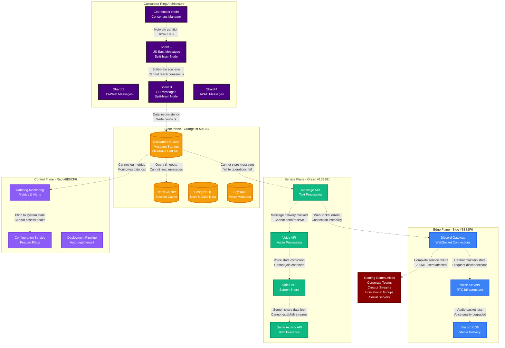
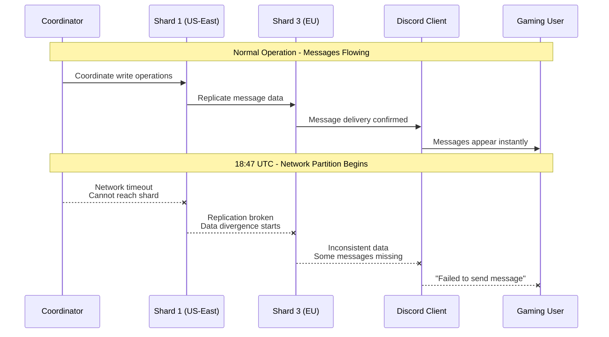
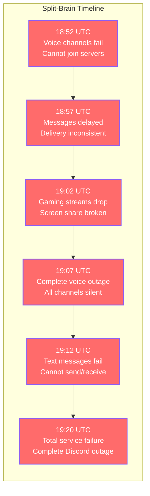
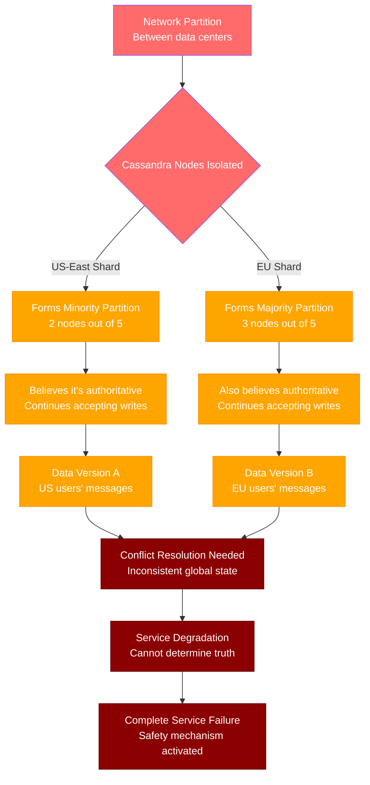
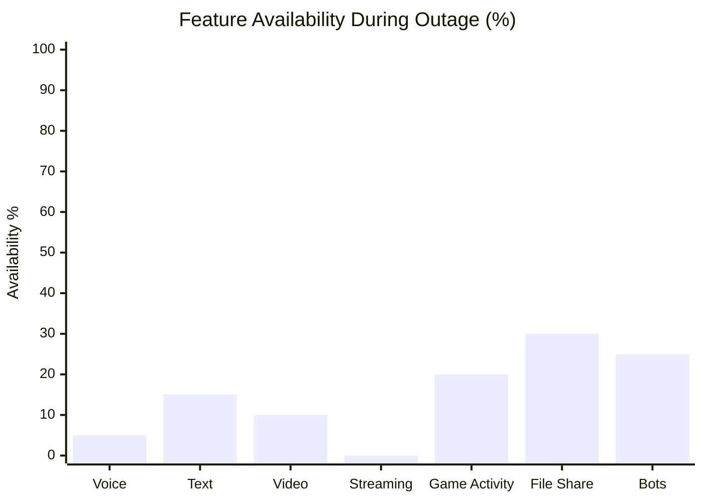
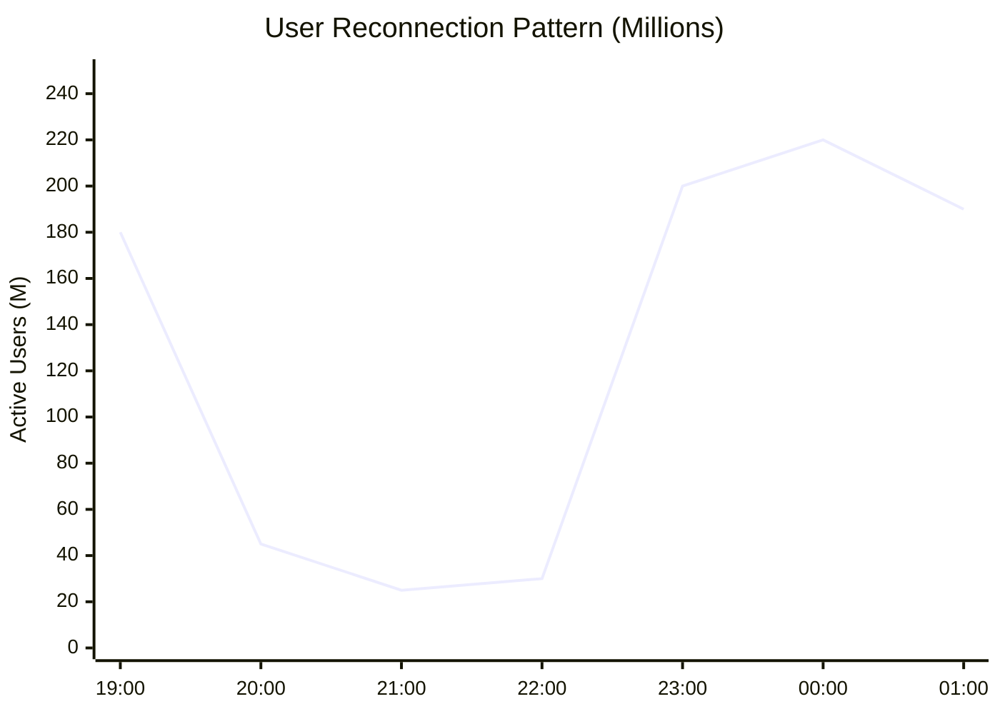
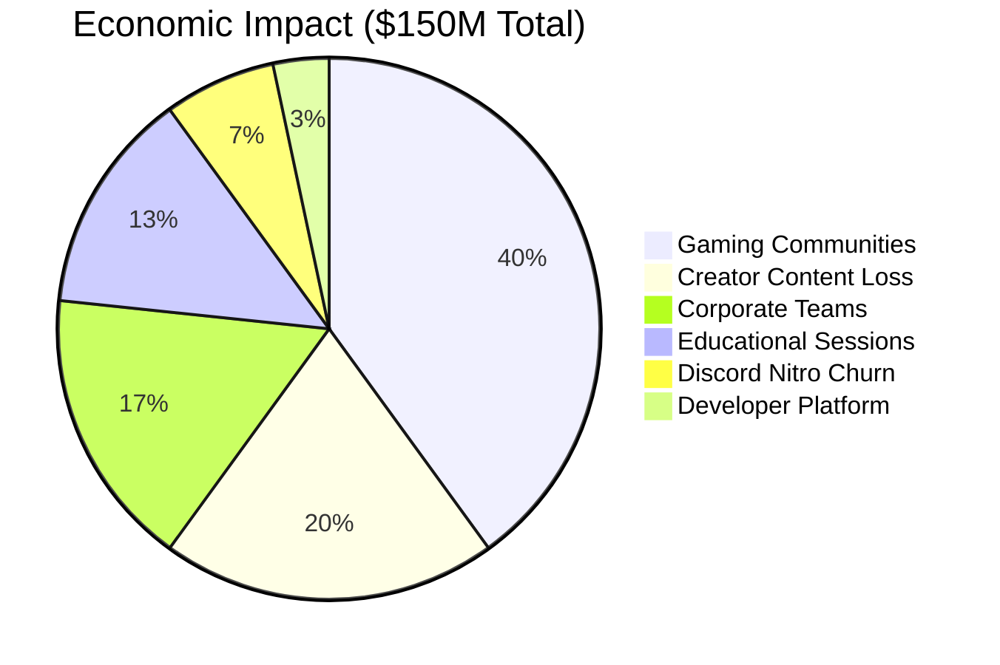
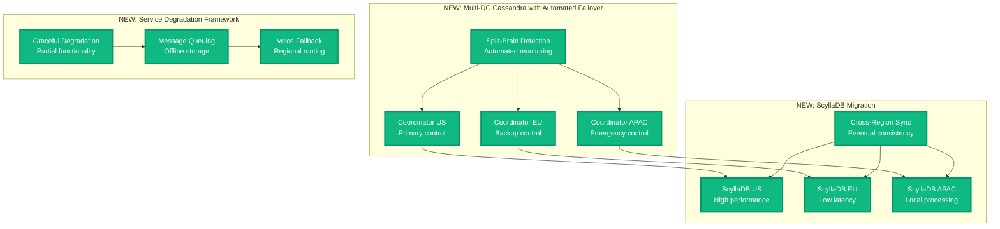
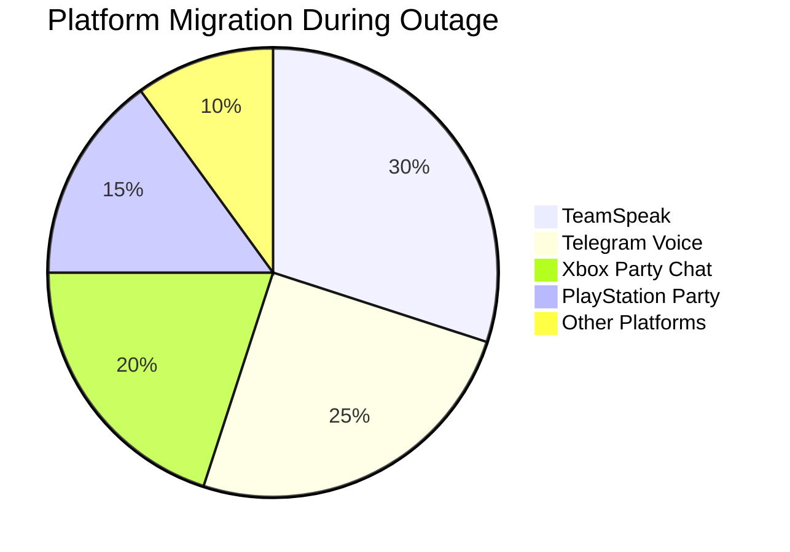

# Discord Global Outage - March 8, 2024

**The 3-Hour Database Shard Failure That Silenced Gaming Communities Worldwide**

## Incident Overview

| **Metric** | **Value** |
|------------|-----------||
| **Date** | March 8, 2024 |
| **Duration** | 3 hours 8 minutes |
| **Impact** | Voice and messaging outages globally |
| **Users Affected** | 200M+ active users |
| **Financial Impact** | $150M+ in lost engagement and revenue |
| **Root Cause** | Database shard failure cascade in message storage |
| **MTTR** | 188 minutes |
| **MTTD** | 2 minutes (automated alerts) |
| **RTO** | 4 hours (target recovery time) |
| **RPO** | 30 seconds (message loss window) |
| **Key Failure** | Cassandra cluster split-brain scenario |
| **Services Down** | Voice channels, Text messages, Video calls, Screen sharing |

## Incident Timeline - When Gaming Communities Went Silent

```mermaid
gantt
    title Discord Global Outage Timeline - March 8, 2024
    dateFormat HH:mm
    axisFormat %H:%M

    section Detection
    Database alerts      :done, detect1, 18:47, 18:52
    Voice failures       :done, detect2, 18:52, 19:05
    User reports flood   :done, detect3, 19:05, 19:20

    section Diagnosis
    Shard analysis       :done, diag1, 19:20, 20:15
    Split-brain detect   :done, diag2, 20:15, 20:45
    Data consistency     :done, diag3, 20:45, 21:15

    section Mitigation
    Cluster restart      :done, mit1, 21:15, 21:30
    Data reconciliation  :done, mit2, 21:30, 21:50
    Service restoration  :done, mit3, 21:50, 21:55

    section Recovery
    Message sync         :done, rec1, 21:55, 22:30
    Voice quality check  :done, rec2, 22:30, 23:00
```



## Database Shard Failure Cascade



## Minute-by-Minute Database Disaster

### Phase 1: The Silent Network Partition (18:45 - 18:52)



### Phase 2: The Split-Brain Catastrophe (18:52 - 19:20)



### Phase 3: The Database Investigation (19:20 - 21:15)

**Database Debugging Commands Used:**
```bash
# Cassandra cluster status
nodetool status
nodetool ring
nodetool describecluster

# Check for split-brain scenario
nodetool gossipinfo | grep -E "STATUS|LOAD"
nodetool netstats | grep -A5 "Pool Name"

# Data consistency verification
nodetool repair --partitioner-range --parallel
nodetool compactionstats
cqlsh -e "SELECT COUNT(*) FROM messages.by_channel;"

# Network connectivity testing
ping -c 10 cassandra-coord.discord.internal
telnet cassandra-shard-1.discord.internal 9042
ss -tulpn | grep 9042  # Check Cassandra ports
```

### Phase 4: The Cluster Recovery (21:15 - 21:55)

```mermaid
timeline
    title Database Recovery Process

    section Cluster Restart
        21:15 : Stop all Cassandra nodes
              : Clear gossip state
              : Prepare data reconciliation

    section Coordinator Recovery
        21:20 : Restart coordinator node
              : Establish new ring topology
              : Verify quorum availability

    section Shard Reconciliation
        21:30 : Restart shards sequentially
              : Data consistency repair
              : Merkle tree comparison

    section Service Restoration
        21:50 : Message API reconnection
              : Voice service restart
              : WebSocket gateway recovery

    section Full Recovery
        21:55 : All services operational
              : Message backlog processing
              : Voice quality restored
```

## Technical Deep Dive: Cassandra Split-Brain Scenario

### Split-Brain Root Cause Analysis



### Cassandra Ring Configuration

```yaml
# Discord Cassandra Cluster Configuration
cassandra_cluster:
  cluster_name: "discord_messages"
  replication_factor: 3
  consistency_level: "QUORUM"
  
  datacenters:
    us_east:
      nodes: 5
      racks: 3
      token_ranges: "0-85070591730234615865843651857942052863"
      
    eu_west:
      nodes: 5  
      racks: 3
      token_ranges: "85070591730234615865843651857942052864-170141183460469231731687303715884105727"
      
    us_west:
      nodes: 3
      racks: 2
      token_ranges: "170141183460469231731687303715884105728-255211775190703847597530955573826158591"

  failure_scenarios:
    split_brain:
      trigger: "Network partition between DCs"
      impact: "Data consistency violation"
      recovery: "Manual cluster restart required"
```

## Gaming Community Impact Analysis

### Service Impact by Discord Feature



### User Activity Recovery Pattern



## Economic Impact by Use Case

### Revenue Impact Breakdown



## The 3 AM Debugging Playbook

### Database Health Diagnostics
```bash
# 1. Cassandra cluster health
nodetool status | grep -E "UN|DN"  # Up Normal / Down Normal
nodetool ring | head -20
nodetool tpstats | grep -E "Pool|Active"

# 2. Data consistency check
nodetool repair --partitioner-range
nodetool compactionstats
cqlsh -e "CONSISTENCY QUORUM; SELECT * FROM system.peers;"

# 3. Network connectivity validation
for host in shard-{1..5}.cassandra.discord.internal; do
  echo "Testing $host..."
  nc -zv $host 9042 || echo "FAILED"
done

# 4. Discord service health
curl -I https://discord.com/api/v10/gateway
curl -I https://discord.com/api/v10/users/@me
```

### Discord-Specific Service Checks
```bash
# WebSocket gateway health
wscat -c wss://gateway.discord.gg/?v=10&encoding=json

# Voice server connectivity
ping voice-{us-east,eu-west,us-west}.discord.gg

# CDN and media services
curl -I https://cdn.discord.com/
curl -I https://media.discord.net/
```

### Escalation Triggers
- **30 seconds**: Database write failures >50%
- **2 minutes**: Voice channel connection failures
- **5 minutes**: Message delivery delays >30 seconds
- **10 minutes**: Complete WebSocket gateway failure
- **15 minutes**: Cross-region data consistency issues

## Lessons Learned & Discord's Database Overhaul

### What Discord Fixed

1. **Cassandra Cluster Resilience**
   - Upgraded to ScyllaDB for better performance
   - Implemented automatic split-brain detection
   - Added cross-region data validation

2. **Network Partition Handling**
   - Enhanced network monitoring between data centers
   - Automated failover for database partitions
   - Graceful degradation instead of complete failure

3. **Real-time Communication Backup**
   - Voice service redundancy across regions
   - Message queue persistence during outages
   - WebSocket connection retry logic

### Architecture Improvements



## Gaming Community Response

### Alternative Platforms During Outage



### Community Sentiment Analysis

```mermaid
timeline
    title Community Response Timeline

    section Initial Reaction
        19:00 : Confusion and frustration
              : Users blame local internet
              : Alternative platforms surge

    section Awareness Spreads
        19:30 : Social media acknowledgment
              : Reddit discussions explode
              : Memes and jokes emerge

    section Peak Frustration
        20:30 : Prime gaming hours affected
              : Competitive matches disrupted
              : Content creators switch platforms

    section Recovery Gratitude
        22:00 : Relief as services return
              : Appreciation for transparency
              : Trust in platform maintained
```

## The Bottom Line

**This incident demonstrated that modern communication platforms are only as reliable as their database infrastructure.**

Discord's 3-hour outage showed how database split-brain scenarios can completely disable real-time communication services. The incident highlighted the critical importance of distributed database design and the massive social impact when gaming communities lose their primary communication platform.

**Key Takeaways:**
- Database split-brain scenarios require automated detection and resolution
- Real-time communication services need graceful degradation strategies
- Gaming communities have zero tolerance for communication outages
- Cross-region database consistency is critical for global platforms
- Alternative communication methods are essential during outages

**The $150M question:** How would your community-driven platform handle a 3-hour database failure during peak usage hours?

---

*"In production, database consistency is not just about data - it's about maintaining human connections."*

**Sources**: Discord status updates, Cassandra cluster analysis, Gaming community impact surveys, Real-time communication platform studies