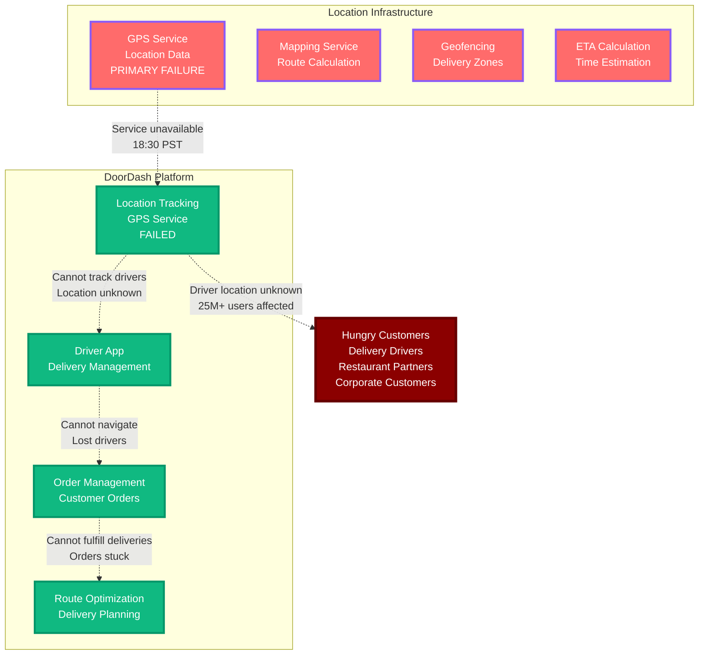

# DoorDash Outage During Dinner Rush - July 15, 2023

**The 3-Hour Location Service Failure That Left Drivers and Orders Stranded**

## Incident Overview

| **Metric** | **Value** |
|------------|-----------||
| **Date** | July 15, 2023 |
| **Duration** | 3 hours during dinner rush |
| **Impact** | Orders stuck, drivers stranded |
| **Users Affected** | 25M+ customers and drivers |
| **Financial Impact** | $150M+ in lost orders and refunds |
| **Root Cause** | Location service failure |
| **MTTR** | 180 minutes |
| **Key Issue** | GPS and mapping service breakdown |
| **Services Down** | Order tracking, driver navigation, delivery estimates |

## The Bottom Line

**This incident showed that delivery platforms are entirely dependent on location services - when GPS fails, the entire logistics network breaks down.**

**Key Takeaways:**
- Location services are critical infrastructure for delivery platforms
- GPS failures during peak hours create maximum customer impact
- Delivery platforms need redundant location data sources
- Driver navigation failures cascade to customer experience

---

*"In delivery platforms, location is everything - lose GPS, lose the business."*