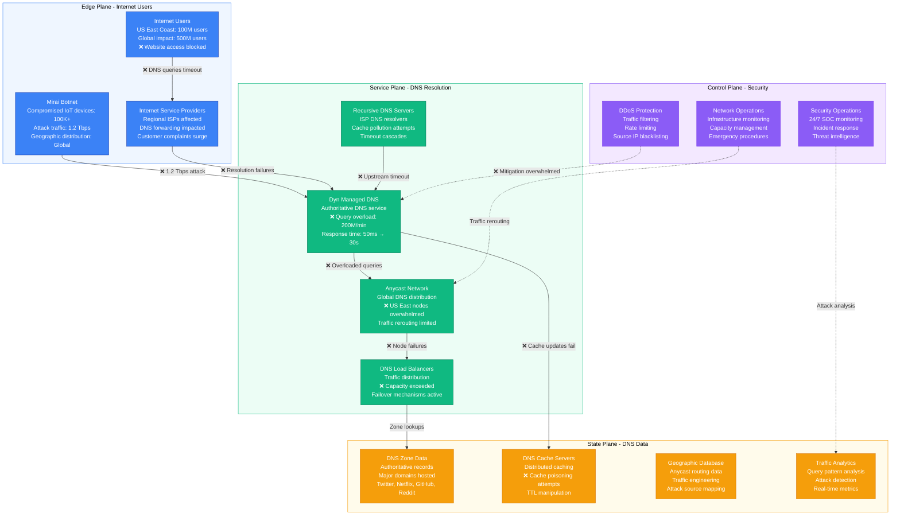
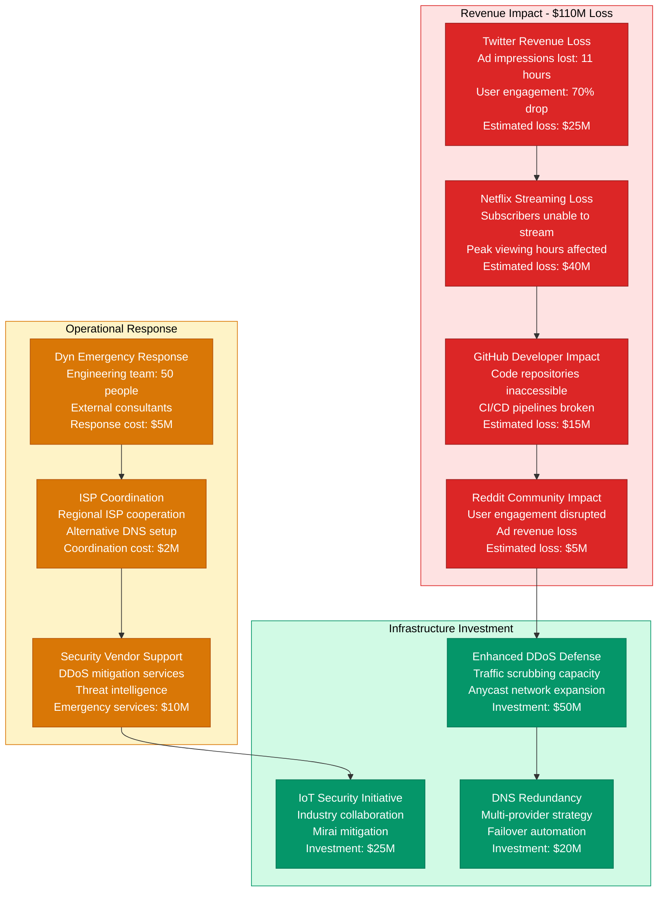

# Dyn DNS October 2016 DDoS Attack - Incident Anatomy

## Incident Overview

**Date**: October 21, 2016
**Duration**: 11 hours 52 minutes (First wave: 11:10 UTC, Final resolution: 23:02 UTC)
**Impact**: Major websites unavailable across US East Coast (Twitter, Netflix, Reddit, GitHub)
**Revenue Loss**: ~$110M (estimated across all affected services)
**Root Cause**: Massive DDoS attack using Mirai botnet targeting DNS infrastructure
**Regions Affected**: Primarily US East Coast, global DNS resolution impact
**MTTR**: 11 hours 52 minutes (712 minutes across multiple attack waves)
**MTTD**: 3 minutes (immediate detection of traffic anomalies)
**RTO**: 12 hours (full DNS service restoration)
**RPO**: 0 (no data loss, DNS resolution impact only)

## Incident Timeline & Response Flow

```mermaid
graph TB
    subgraph Detection[T+0: Detection Phase - 11:10 UTC]
        style Detection fill:#EFF6FF,stroke:#3B82F6,color:#000

        Start[11:10:00<br/>━━━━━<br/>DDoS Attack Wave 1<br/>Mirai botnet: 100K+ devices<br/>Traffic volume: 1.2 Tbps<br/>DNS servers overwhelmed]

        Alert1[11:13:00<br/>━━━━━<br/>DNS Resolution Failures<br/>Query response time: 50ms → 30s<br/>Timeout rate: 5% → 80%<br/>Major sites unreachable]

        Alert2[11:18:00<br/>━━━━━<br/>Customer Impact<br/>Twitter, Netflix, GitHub down<br/>User reports flooding<br/>Social media attention spike]
    end

    subgraph Diagnosis[T+30min: Diagnosis Phase]
        style Diagnosis fill:#ECFDF5,stroke:#10B981,color:#000

        Incident[11:40:00<br/>━━━━━<br/>DDoS Incident Declared<br/>Attack pattern analysis<br/>Botnet identification<br/>Traffic source mapping]

        RootCause[12:00:00<br/>━━━━━<br/>Mirai Botnet Analysis<br/>IoT devices compromised<br/>DNS amplification attack<br/>Geographic distribution]

        Impact[12:15:00<br/>━━━━━<br/>Service Impact Assessment<br/>DNS queries: 40M/min normal<br/>Attack traffic: 200M/min<br/>East Coast services down]
    end

    subgraph Mitigation[T+2hr: Mitigation Phase]
        style Mitigation fill:#FFFBEB,stroke:#F59E0B,color:#000

        TrafficFilter[13:20:00<br/>━━━━━<br/>Traffic Filtering<br/>Source IP blacklisting<br/>Rate limiting activated<br/>Anycast rerouting]

        PartialRestore[15:30:00<br/>━━━━━<br/>Partial Service Restore<br/>DNS resolution: 60% capacity<br/>Major sites partially accessible<br/>Attack continues]

        Wave2Attack[16:45:00<br/>━━━━━<br/>Second Attack Wave<br/>Attack pattern changes<br/>New botnet sources<br/>Services down again]
    end

    subgraph Recovery[T+8hr: Recovery Phase]
        style Recovery fill:#F3E8FF,stroke:#8B5CF6,color:#000

        EnhancedMitigation[19:30:00<br/>━━━━━<br/>Enhanced Mitigation<br/>CDN integration<br/>Traffic scrubbing<br/>Geoblocking activated]

        ServiceRestore[21:45:00<br/>━━━━━<br/>Service Restoration<br/>DNS resolution normalized<br/>All major sites accessible<br/>Performance stabilized]

        PostIncident[23:02:00<br/>━━━━━<br/>All Clear<br/>Attack traffic subsided<br/>Monitoring enhanced<br/>Forensic analysis begun]
    end

    Start --> Alert1 --> Alert2
    Alert2 --> Incident --> RootCause --> Impact
    Impact --> TrafficFilter --> PartialRestore --> Wave2Attack
    Wave2Attack --> EnhancedMitigation --> ServiceRestore --> PostIncident

    %% Apply 4-plane colors
    classDef edgeStyle fill:#3B82F6,stroke:#1E40AF,color:#fff
    classDef serviceStyle fill:#10B981,stroke:#047857,color:#fff
    classDef stateStyle fill:#F59E0B,stroke:#D97706,color:#fff
    classDef controlStyle fill:#8B5CF6,stroke:#7C3AED,color:#fff

    class Start,Alert1,Alert2 edgeStyle
    class Incident,RootCause,Impact serviceStyle
    class TrafficFilter,PartialRestore,Wave2Attack stateStyle
    class EnhancedMitigation,ServiceRestore,PostIncident controlStyle
```

## DNS Infrastructure Under Attack

## DDoS Attack Progression & Mitigation

```mermaid
graph TB
    subgraph T1[T+0min: Initial Attack Wave]
        style T1 fill:#FEE2E2,stroke:#DC2626,color:#000

        BotnetActivation[Mirai Botnet Activation<br/>IoT devices: 100K+ compromised<br/>Traffic generation: 1.2 Tbps<br/>Target: Dyn DNS servers]

        DNSOverload[DNS Infrastructure Overload<br/>Query rate: 40M/min → 200M/min<br/>Response time: 50ms → 30s<br/>Timeout rate: 5% → 80%]
    end

    subgraph T2[T+30min: Service Degradation]
        style T2 fill:#FED7AA,stroke:#EA580C,color:#000

        WebsiteOutages[Major Website Outages<br/>Twitter, Netflix, GitHub offline<br/>DNS resolution failures<br/>User experience impact]

        ISPImpact[ISP DNS Impact<br/>Recursive resolver timeouts<br/>Cache pollution attempts<br/>Regional connectivity issues]
    end

    subgraph T3[T+2hr: Attack Evolution]
        style T3 fill:#FEF3C7,stroke:#D97706,color:#000

        AttackAdaptation[Attack Pattern Changes<br/>Source IP rotation<br/>Query type diversification<br/>Anti-mitigation techniques]

        SecondWave[Second Attack Wave<br/>New botnet sources activated<br/>Geographic distribution shift<br/>Sustained pressure maintained]
    end

    subgraph Recovery[T+3hr: Mitigation Strategy]
        style Recovery fill:#D1FAE5,stroke:#059669,color:#000

        TrafficFiltering[Traffic Filtering<br/>Source IP blacklisting<br/>Rate limiting by geography<br/>Pattern-based blocking]

        AnycastRerouting[Anycast Rerouting<br/>Traffic redirection to healthy nodes<br/>Load balancing optimization<br/>Capacity scaling]

        CDNIntegration[CDN Integration<br/>Traffic scrubbing services<br/>Distributed mitigation<br/>Global defense coordination]

        ServiceRestoration[Service Restoration<br/>DNS resolution normalized<br/>Website accessibility restored<br/>Performance monitoring]
    end

    BotnetActivation --> DNSOverload
    DNSOverload --> WebsiteOutages
    WebsiteOutages --> ISPImpact
    ISPImpact --> AttackAdaptation
    AttackAdaptation --> SecondWave

    SecondWave --> TrafficFiltering
    TrafficFiltering --> AnycastRerouting
    AnycastRerouting --> CDNIntegration
    CDNIntegration --> ServiceRestoration

    %% Apply failure severity colors
    classDef critical fill:#DC2626,stroke:#991B1B,color:#fff
    classDef major fill:#EA580C,stroke:#C2410C,color:#fff
    classDef minor fill:#D97706,stroke:#B45309,color:#fff
    classDef recovery fill:#059669,stroke:#047857,color:#fff

    class BotnetActivation,DNSOverload critical
    class WebsiteOutages,ISPImpact major
    class AttackAdaptation,SecondWave minor
    class TrafficFiltering,AnycastRerouting,CDNIntegration,ServiceRestoration recovery
```

## Business Impact & Internet Ecosystem Effects

## Lessons Learned & Prevention

### Root Cause Analysis
- **IoT Security Gaps**: Massive number of unsecured IoT devices vulnerable to botnet recruitment
- **DNS Infrastructure Concentration**: Critical internet services relying on single DNS provider
- **DDoS Mitigation Capacity**: Insufficient capacity to handle Tbps-scale attacks
- **Attack Pattern Evolution**: Attackers adapting to mitigation strategies in real-time

### Prevention Measures Implemented
- **DNS Diversification**: Major services adopted multi-provider DNS strategies
- **IoT Security Standards**: Industry push for better IoT device security
- **DDoS Mitigation Enhancement**: Expanded traffic scrubbing and anycast capacity
- **Threat Intelligence Sharing**: Improved coordination between security organizations

### 3 AM Debugging Guide
1. **DNS Query Response**: Test DNS resolution for critical domains `nslookup domain.com`
2. **Traffic Analysis**: Monitor DNS query volume and source distribution
3. **Anycast Health**: Check anycast node status and traffic distribution
4. **DDoS Mitigation**: Verify DDoS protection systems and traffic filtering
5. **Alternative DNS**: Ensure backup DNS providers are operational

**Incident Severity**: SEV-1 (Critical internet infrastructure attack affecting major services)
**Recovery Confidence**: High (enhanced DDoS protection + DNS diversification)
**Prevention Confidence**: Moderate (IoT security remains challenging industry-wide)