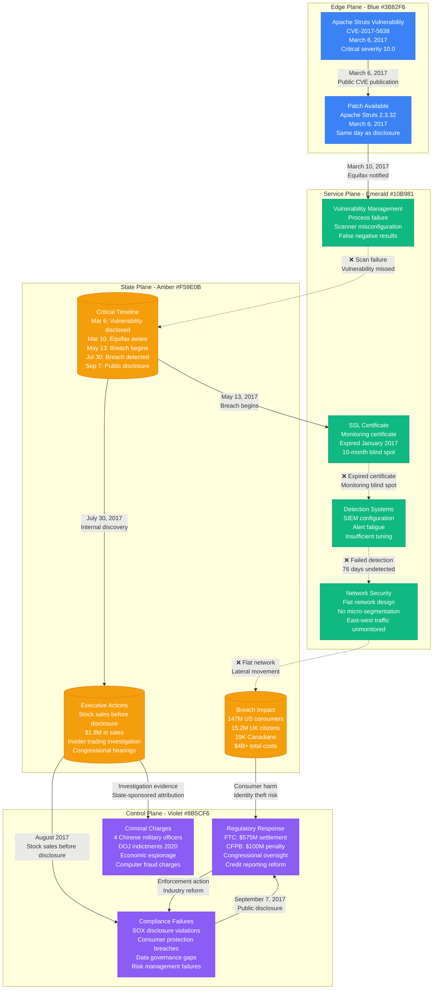

# Equifax September 2017 Data Breach

## Overview

The Equifax data breach of 2017 was one of the most significant cybersecurity incidents in history, compromising personal information of 147 million Americans. This breach exposed critical failures in patch management, network segmentation, and incident response, leading to massive regulatory fines and congressional oversight.

**Impact**: 147 million Americans affected, 15.2 million UK citizens, 19,000 Canadians
**Duration**: Breach occurred May-July 2017, discovered July 2017, disclosed September 2017
**Root Cause**: Unpatched Apache Struts vulnerability (CVE-2017-5638) in web application

## Complete Attack Timeline and Architecture

```mermaid
graph TB
    subgraph EdgePlane[Edge Plane - Blue #3B82F6]
        ATTACKERS[Chinese State Actors<br/>APT Group (PLA Unit 54431)<br/>4 Military Officers<br/>Strategic intelligence operation]
        INTERNET[Public Internet<br/>Attack vector<br/>Web application scanning<br/>Vulnerability exploitation]
        DARK_WEB[Dark Web/Intelligence<br/>Data monetization<br/>Identity theft operations<br/>Strategic intelligence use]
    end

    subgraph ServicePlane[Service Plane - Emerald #10B981]
        WEB_APP[ACIS Web Application<br/>Apache Struts 2.3.5<br/>Consumer portal<br/>CVE-2017-5638 vulnerable]
        APP_SERVER[Application Servers<br/>Java-based services<br/>Credit monitoring tools<br/>Consumer-facing APIs]
        INTERNAL_NET[Internal Network<br/>Flat network architecture<br/>Lateral movement<br/>Privileged escalation]
        ADMIN_SYSTEMS[Administrative Systems<br/>Database administration<br/>Backup management<br/>Network monitoring]
    end

    subgraph StatePlane[State Plane - Amber #F59E0B]
        CONSUMER_DB[(Consumer Database<br/>147M US records<br/>SSN, DOB, addresses<br/>Credit history data)]
        DISPUTE_DB[(Dispute Database<br/>Credit disputes<br/>Supporting documents<br/>Personal identifiers)]
        DRIVERS_LICENSE[(Driver License Data<br/>209K records<br/>License numbers<br/>State identification)]
        CREDIT_CARD[(Credit Card Data<br/>209K records<br/>Payment information<br/>Transaction history)]
    end

    subgraph ControlPlane[Control Plane - Violet #8B5CF6]
        PATCH_MGMT[Patch Management<br/>Failed vulnerability scan<br/>Missed critical update<br/>78-day exposure window]
        MONITORING[Security Monitoring<br/>Certificate expiration<br/>Detection failure<br/>76-day undetected breach]
        INCIDENT_RESPONSE[Incident Response<br/>Delayed disclosure<br/>Insider trading concerns<br/>Executive stock sales]
        COMPLIANCE[Compliance Framework<br/>SOX requirements<br/>PCI DSS standards<br/>Consumer protection laws]
    end

    %% Attack execution
    ATTACKERS -->|1. Vulnerability Scanning<br/>Apache Struts exploit| INTERNET
    INTERNET -->|2. Initial Compromise<br/>CVE-2017-5638 exploitation| WEB_APP
    WEB_APP -->|3. Web Shell Deployment<br/>Persistent access| APP_SERVER
    APP_SERVER -->|4. Privilege Escalation<br/>Local vulnerabilities| INTERNAL_NET

    %% Lateral movement and data access
    INTERNAL_NET -->|5. Network Reconnaissance<br/>Credential harvesting| ADMIN_SYSTEMS
    ADMIN_SYSTEMS -->|6. Database Access<br/>Administrative privileges| CONSUMER_DB
    CONSUMER_DB -->|7. Data Exfiltration<br/>147M records stolen| DISPUTE_DB
    DISPUTE_DB -->|8. Additional Data Sources<br/>Payment and ID data| DRIVERS_LICENSE

    %% Data theft and monetization
    CONSUMER_DB -->|Personal information<br/>Identity data| CREDIT_CARD
    DRIVERS_LICENSE -->|Government IDs<br/>Authentication bypass| DARK_WEB
    CREDIT_CARD -->|Financial data<br/>Transaction capabilities| DARK_WEB

    %% Security control failures
    WEB_APP -.->|❌ Unpatched vulnerability<br/>78 days exposed| PATCH_MGMT
    INTERNAL_NET -.->|❌ Flat network<br/>No segmentation| MONITORING
    ADMIN_SYSTEMS -.->|❌ Certificate expired<br/>Monitoring blind spot| MONITORING
    ATTACKERS -.->|76 days undetected<br/>Massive data theft| INCIDENT_RESPONSE

    %% Compliance and regulatory
    INCIDENT_RESPONSE -.->|Delayed disclosure<br/>SEC violations| COMPLIANCE
    CONSUMER_DB -.->|Consumer protection<br/>Privacy violations| COMPLIANCE

    %% Apply four-plane colors
    classDef edgeStyle fill:#3B82F6,stroke:#2563EB,color:#fff
    classDef serviceStyle fill:#10B981,stroke:#059669,color:#fff
    classDef stateStyle fill:#F59E0B,stroke:#D97706,color:#fff
    classDef controlStyle fill:#8B5CF6,stroke:#7C3AED,color:#fff

    class ATTACKERS,INTERNET,DARK_WEB edgeStyle
    class WEB_APP,APP_SERVER,INTERNAL_NET,ADMIN_SYSTEMS serviceStyle
    class CONSUMER_DB,DISPUTE_DB,DRIVERS_LICENSE,CREDIT_CARD stateStyle
    class PATCH_MGMT,MONITORING,INCIDENT_RESPONSE,COMPLIANCE controlStyle
```

## Security Control Failures and Timeline



## Critical Security Failures

### 1. Patch Management Catastrophe
- **Root Cause**: Vulnerability scanner misconfigured, missed critical Apache Struts vulnerability
- **Timeline**: 78 days between patch availability and breach initiation
- **Impact**: Single unpatched vulnerability led to complete network compromise
- **Lesson**: Vulnerability management must include verification of scan accuracy

### 2. Network Segmentation Failure
- **Root Cause**: Flat network architecture enabled lateral movement
- **Impact**: Single compromised web server provided access to core databases
- **Scope**: Attackers moved freely between network segments for 76 days
- **Lesson**: Zero-trust architecture with micro-segmentation is essential

### 3. Monitoring System Blind Spot
- **Root Cause**: SSL certificate for monitoring system expired in January 2017
- **Impact**: 10-month period with no monitoring of network traffic
- **Detection**: Breach activities went completely undetected for 76 days
- **Lesson**: Infrastructure monitoring requires its own monitoring and alerting

### 4. Incident Response and Disclosure Failures
- **Root Cause**: Delayed disclosure and potential insider trading
- **Impact**: Loss of consumer trust and regulatory violations
- **Timeline**: 6-week delay between discovery and public disclosure
- **Lesson**: Transparent and timely disclosure is both legally required and ethically necessary

## Impact Assessment

### Consumer Impact
- **Personal Information**: Social Security numbers, birth dates, addresses
- **Financial Data**: Credit card numbers, driver license numbers
- **Identity Theft**: Millions of consumers at ongoing risk
- **Credit Monitoring**: Free services provided to affected individuals

### Business Impact
- **Financial Losses**: $4 billion+ in total costs including settlements
- **Regulatory Penalties**: $700M+ in fines and settlements
- **Stock Impact**: 35% stock price decline following disclosure
- **Executive Changes**: CEO, CIO, and CSO departures

### Regulatory and Legal Consequences
- **FTC Settlement**: $575 million for consumer restitution and penalties
- **CFPB Penalty**: $100 million civil money penalty
- **Congressional Oversight**: Multiple hearings and proposed legislation
- **Criminal Charges**: 4 Chinese military officers indicted in 2020

### Systemic Impact
- **Credit Reporting Reform**: Enhanced oversight of credit reporting agencies
- **Cybersecurity Standards**: New requirements for financial services
- **Executive Accountability**: Personal liability for cybersecurity failures
- **Consumer Rights**: Enhanced rights to credit freezes and monitoring

## Technical Remediation and Lessons

### Immediate Response (2017-2018)
1. **System Isolation**: Complete segregation of compromised systems
2. **Forensic Investigation**: Comprehensive analysis with external experts
3. **Consumer Notification**: Direct notification to 147 million individuals
4. **Credit Monitoring**: Free services for all affected consumers

### Security Architecture Overhaul (2018-2020)
1. **Network Segmentation**: Zero-trust architecture implementation
2. **Patch Management**: Automated vulnerability scanning and patching
3. **Monitoring Enhancement**: 24/7 SOC with threat intelligence
4. **Data Minimization**: Reduced data collection and retention

### Ongoing Security Program (2020+)
1. **Cloud Migration**: Move to cloud-native security architecture
2. **Zero Trust**: Complete network access control overhaul
3. **Continuous Monitoring**: Real-time threat detection and response
4. **Compliance Program**: Enhanced regulatory compliance and reporting

## Industry Lessons and Standards

### Vulnerability Management Best Practices
```yaml
# Modern vulnerability management framework
Vulnerability_Management:
  scanning:
    frequency: "continuous"
    coverage: "100_percent_assets"
    validation: "manual_verification"
    false_negative_testing: "monthly"

  patching:
    critical_vulns: "72_hours"
    high_vulns: "7_days"
    medium_vulns: "30_days"
    testing: "automated_regression"

  verification:
    patch_deployment: "automated_verification"
    vulnerability_closure: "rescanning_required"
    compliance_reporting: "real_time_dashboard"
```

### What Works
- **Automated patch management**: Reduces human error and delays
- **Network micro-segmentation**: Limits blast radius of compromises
- **Continuous monitoring**: Real-time detection of anomalous activities
- **Executive accountability**: Personal liability drives security investment

### What Fails
- **Manual vulnerability management**: Human processes miss critical updates
- **Flat network architectures**: Enable lateral movement and data exfiltration
- **Certificate lifecycle management**: Expired certificates create blind spots
- **Delayed breach disclosure**: Violates regulations and damages trust

### Regulatory Evolution
- **Credit Reporting Oversight**: Enhanced CFPB supervision and enforcement
- **Data Protection Standards**: New requirements for sensitive data handling
- **Executive Accountability**: Personal liability for cybersecurity failures
- **Consumer Rights**: Enhanced credit freeze and monitoring rights

### Modern Security Architecture
```yaml
# Current industry standard for financial services
Security_Architecture:
  network_security:
    - zero_trust_architecture
    - micro_segmentation
    - east_west_traffic_inspection
    - network_access_control

  vulnerability_management:
    - continuous_asset_discovery
    - automated_vulnerability_scanning
    - risk_based_patch_prioritization
    - patch_verification_testing

  monitoring_detection:
    - 24x7_security_operations_center
    - behavioral_analytics
    - threat_intelligence_integration
    - automated_incident_response

  data_protection:
    - data_classification_labeling
    - encryption_at_rest_in_transit
    - data_loss_prevention
    - privacy_by_design
```

### Future Prevention Strategies
- **DevSecOps Integration**: Security built into development lifecycle
- **AI-Powered Detection**: Machine learning for anomaly detection
- **Quantum-Safe Cryptography**: Preparation for quantum computing threats
- **Supply Chain Security**: Third-party risk management and validation

**Sources**:
- Department of Justice Criminal Indictment (2020)
- Federal Trade Commission Settlement Agreement (2019)
- House Committee on Oversight and Government Reform Hearing Transcripts (2017)
- Equifax Security Incident Investigation Report (Mandiant, 2017)
- Government Accountability Office Report on Equifax Data Breach (2018)