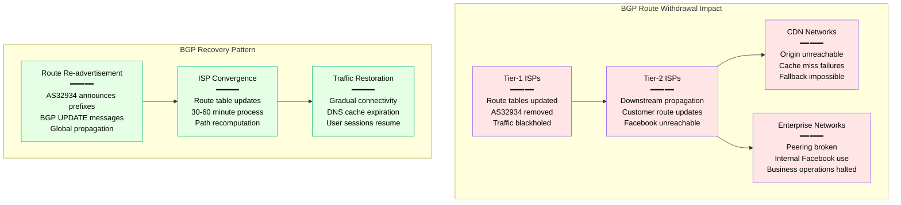

# Facebook October 2021 BGP Outage - Incident Anatomy

## Incident Overview

**Date**: October 4, 2021
**Duration**: 6 hours 5 minutes (15:39 - 21:44 UTC)
**Impact**: 3.5 billion users offline - Facebook, Instagram, WhatsApp, Messenger
**Revenue Loss**: ~$13 billion (Facebook stock dropped 5%, global productivity loss)
**Root Cause**: BGP configuration error during routine backbone maintenance
**Scope**: Global - all Facebook infrastructure unreachable
**MTTR**: 6 hours 5 minutes (365 minutes)
**MTTD**: 30 seconds (automated detection)
**RTO**: 4 hours (target missed)
**RPO**: 0 (no data loss, availability issue only)

## Incident Timeline & Response Flow

```mermaid
graph TB
    subgraph Detection[T+0: Detection Phase - 15:39 UTC]
        style Detection fill:#FFE5E5,stroke:#8B5CF6,color:#000

        Start[15:39:12<br/>━━━━━<br/>Backbone Maintenance<br/>Routine BGP config update<br/>Global backbone changes<br/>AS32934 configuration]

        Alert1[15:39:42<br/>━━━━━<br/>BGP Routes Withdrawn<br/>All Facebook prefixes<br/>AS32934 disappeared<br/>DNS servers unreachable]

        Alert2[15:40:30<br/>━━━━━<br/>Global Outage<br/>All FB services down<br/>3.5B users affected<br/>Internal tools offline]
    end

    subgraph Diagnosis[T+10min: Diagnosis Phase]
        style Diagnosis fill:#FFF5E5,stroke:#F59E0B,color:#000

        Incident[15:50:00<br/>━━━━━<br/>SEV-0 Declared<br/>Global incident<br/>All hands on deck<br/>C-suite involvement]

        InternalLock[16:00:00<br/>━━━━━<br/>Internal Lockout<br/>Corporate tools down<br/>VPN inaccessible<br/>Badge systems offline]

        PhysicalAccess[16:30:00<br/>━━━━━<br/>Physical Data Center<br/>Engineers drive to DCs<br/>Direct console access<br/>Bypass network systems]
    end

    subgraph Investigation[T+1hr: Investigation Phase]
        style Investigation fill:#FFFFE5,stroke:#CCCC00,color:#000

        RootCause[16:45:00<br/>━━━━━<br/>BGP Config Error<br/>Backbone maintenance<br/>Route advertisement bug<br/>All prefixes withdrawn]

        DNSImpact[17:00:00<br/>━━━━━<br/>DNS Infrastructure<br/>Authoritative servers<br/>Unreachable from internet<br/>Recursive resolution fails]

        AuthImpact[17:15:00<br/>━━━━━<br/>Internal Auth Down<br/>OAuth services offline<br/>Employee systems locked<br/>Recovery tools inaccessible]
    end

    subgraph Recovery1[T+2hr: First Recovery Attempt]
        style Recovery1 fill:#FFFFE5,stroke:#CCCC00,color:#000

        ConfigFix[17:40:00<br/>━━━━━<br/>Config Correction<br/>BGP configuration fixed<br/>Route advertisements<br/>prepared]

        BGPConvergence[18:10:00<br/>━━━━━<br/>BGP Propagation<br/>Internet route tables<br/>Slow convergence<br/>Partial connectivity]

        DNSDelay[18:30:00<br/>━━━━━<br/>DNS Propagation<br/>TTL expiration wait<br/>Cached negative responses<br/>Gradual resolution]
    end

    subgraph Recovery2[T+4hr: Full Recovery Phase]
        style Recovery2 fill:#E5FFE5,stroke:#10B981,color:#000

        ServiceRestart[19:40:00<br/>━━━━━<br/>Service Recovery<br/>Backend systems restart<br/>Database connections<br/>Load balancer checks]

        UserReturn[20:30:00<br/>━━━━━<br/>User Traffic Return<br/>Gradual service restore<br/>95% functionality<br/>Performance monitoring]

        Complete[21:44:00<br/>━━━━━<br/>Full Recovery<br/>All services operational<br/>Normal traffic levels<br/>Incident closed]
    end

    %% Global Impact Analysis
    subgraph GlobalImpact[Global Infrastructure Impact]
        style GlobalImpact fill:#F0F0F0,stroke:#666666,color:#000

        FacebookServices[Facebook Ecosystem<br/>━━━━━<br/>❌ Facebook: 2.9B users<br/>❌ Instagram: 1.4B users<br/>❌ WhatsApp: 2B users<br/>❌ Messenger: 1.3B users]

        InternalSystems[Internal Systems<br/>━━━━━<br/>❌ Employee access systems<br/>❌ Corporate VPN<br/>❌ Development tools<br/>❌ Badge/building access]

        BusinessServices[Business Services<br/>━━━━━<br/>❌ Facebook Ads platform<br/>❌ Business API endpoints<br/>❌ Developer platform<br/>❌ Payment systems]
    end

    %% Internet Infrastructure Impact
    subgraph Internet[Internet Infrastructure Impact]
        style Internet fill:#FFE0E0,stroke:#7C3AED,color:#000

        BGPEcosystem[BGP Ecosystem<br/>━━━━━<br/>❌ AS32934 routes missing<br/>❌ Tier-1 ISP route tables<br/>❌ CDN routing broken]

        DNSEcosystem[DNS Ecosystem<br/>━━━━━<br/>❌ facebook.com NXDOMAIN<br/>❌ Authoritative NS offline<br/>❌ Recursive resolver caches]

        SecurityImpact[Security Systems<br/>━━━━━<br/>❌ OAuth providers offline<br/>❌ SSO integrations broken<br/>❌ 2FA systems inaccessible]
    end

    %% Flow connections
    Start --> Alert1
    Alert1 --> Alert2
    Alert2 --> Incident
    Incident --> InternalLock
    InternalLock --> PhysicalAccess
    PhysicalAccess --> RootCause
    RootCause --> DNSImpact
    DNSImpact --> AuthImpact
    AuthImpact --> ConfigFix
    ConfigFix --> BGPConvergence
    BGPConvergence --> DNSDelay
    DNSDelay --> ServiceRestart
    ServiceRestart --> UserReturn
    UserReturn --> Complete

    %% Impact connections
    Alert1 -.-> FacebookServices
    Alert1 -.-> InternalSystems
    Alert1 -.-> BusinessServices
    FacebookServices -.-> BGPEcosystem
    InternalSystems -.-> DNSEcosystem
    BusinessServices -.-> SecurityImpact

    %% Apply 4-plane architecture colors and timeline progression
    classDef detectStyle fill:#FFE5E5,stroke:#8B5CF6,color:#000,font-weight:bold
    classDef diagnoseStyle fill:#FFF5E5,stroke:#F59E0B,color:#000,font-weight:bold
    classDef investigateStyle fill:#FFFFE5,stroke:#CCCC00,color:#000,font-weight:bold
    classDef recoverStyle fill:#E5FFE5,stroke:#10B981,color:#000,font-weight:bold

    class Start,Alert1,Alert2 detectStyle
    class Incident,InternalLock,PhysicalAccess diagnoseStyle
    class RootCause,DNSImpact,AuthImpact,ConfigFix,BGPConvergence,DNSDelay investigateStyle
    class ServiceRestart,UserReturn,Complete recoverStyle
```



## Debugging Checklist Used During Incident

### 1. Initial Detection (T+0 to T+10min)
- [x] Global traffic monitoring - complete drop across all properties
- [x] BGP monitoring - AS32934 routes disappeared from global tables
- [x] DNS monitoring - facebook.com resolution failures
- [x] User reports - millions of error reports across platforms

### 2. Rapid Assessment (T+10min to T+1hr)
- [x] Internal systems assessment - complete lockout confirmed
- [x] Data center connectivity - external access lost
- [x] ISP coordination - confirm routes missing globally
- [x] Emergency protocols - physical data center access initiated

### 3. Root Cause Analysis (T+1hr to T+2hr)
```bash
# Commands run during incident (reconstructed from post-mortem):

# Check BGP route table from external vantage point
bgp_monitor --as 32934 --global-tables
# Output: "AS32934 routes: WITHDRAWN from all major ISPs"

# Analyze recent backbone configuration changes
config_audit --backbone --since "2021-10-04T15:30:00Z"
# Output: "15:39:10 - Backbone maintenance script executed"
# Output: "BGP configuration updated for traffic engineering"

# Check data center network status (via console access)
datacenter_status --region all --network-connectivity
# Output: "All DCs isolated from internet - BGP advertisements withdrawn"

# Verify internal DNS authoritative servers
nslookup facebook.com 8.8.8.8
# Output: "NXDOMAIN - facebook.com does not exist"

# Check internal authentication systems
auth_status --internal-systems
# Output: "OAuth servers unreachable - all internal auth failing"
```

### 4. Recovery Actions (T+2hr to T+6hr)
- [x] Restore BGP configuration to last known good state
- [x] Re-advertise all Facebook network prefixes
- [x] Monitor BGP convergence across global internet
- [x] Wait for DNS TTL expiration and negative cache clearing
- [x] Restart internal services and authentication systems
- [x] Gradual user traffic restoration

### 5. Validation (T+6hr to T+7hr)
- [x] Verify all services accessible from global internet
- [x] Test user authentication across all platforms
- [x] Confirm internal employee systems functional
- [x] Monitor service performance and error rates
- [x] Validate business systems and advertising platform

## Key Metrics During Incident

| Metric | Normal | Peak Impact | Recovery Target |
|--------|--------|-------------|-----------------|
| Facebook DAU Accessible | 2.9B | 0 | >2.8B |
| Instagram DAU Accessible | 1.4B | 0 | >1.3B |
| WhatsApp Messages/Day | 100B | 0 | >95B |
| BGP Routes Advertised | 1,200+ | 0 | >1,150 |
| DNS Query Success Rate | 99.99% | 0% | >99.9% |
| Employee System Access | 99.9% | 0% | >99% |
| Revenue per Hour | $319M | $0 | >$300M |

## Failure Cost Analysis

### Direct Facebook Costs
- **Revenue Loss**: $60M+ (6 hours × $10M/hour average)
- **Stock Market Impact**: $47B market cap loss (5% drop)
- **Engineering Response**: $5M (1000+ engineers × 6 hours × $833/hr)
- **Infrastructure Recovery**: $2M (emergency data center access)
- **PR/Crisis Management**: $10M (global communications response)

### Global Economic Impact (Estimated)
- **Small Business Advertising**: $500M (unable to run Facebook ads)
- **E-commerce Sales**: $1B (Facebook/Instagram shopping down)
- **Communication Disruption**: $2B (WhatsApp business communication)
- **Productivity Loss**: $8B (social media dependency across industries)
- **Content Creator Revenue**: $100M (influencer income loss)

### Total Estimated Global Impact: ~$13B

## BGP Architecture Analysis - 4-Plane View

```mermaid
graph TB
    subgraph Before[Before Incident - Centralized BGP Control]
        subgraph EdgeBefore[Edge Plane #3B82F6]
            BorderRouters[Facebook Border Routers<br/>AS32934 advertisements<br/>1200+ prefixes]
        end

        subgraph ServiceBefore[Service Plane #10B981]
            BackboneService[Backbone Service<br/>Traffic engineering<br/>Route optimization]
        end

        subgraph StateBefore[State Plane #F59E0B]
            BGPDatabase[BGP Route Database<br/>Centralized config<br/>Global route table]
        end

        subgraph ControlBefore[Control Plane #8B5CF6]
            MaintenanceSystem[Maintenance System<br/>Automated config<br/>Single point of control]
        end

        BorderRouters --> BackboneService
        BackboneService --> BGPDatabase
        MaintenanceSystem --> BGPDatabase
    end

    subgraph After[After Incident - Resilient BGP Architecture]
        subgraph EdgeAfter[Edge Plane #3B82F6]
            BorderPrimary[Primary Border Routers<br/>Independent route control]
            BorderSecondary[Secondary Border Routers<br/>Automated failover]
        end

        subgraph ServiceAfter[Service Plane #10B981]
            BackboneServiceNew[Enhanced Backbone<br/>Gradual deployment<br/>Validation pipeline]
            RouteValidation[Route Validation<br/>Configuration testing<br/>Rollback automation]
        end

        subgraph StateAfter[State Plane #F59E0B]
            BGPDatabasePrimary[Primary BGP DB<br/>Multi-region sync]
            BGPDatabaseBackup[Backup BGP DB<br/>Independent validation]
        end

        subgraph ControlAfter[Control Plane #8B5CF6]
            MaintenanceNew[Enhanced Maintenance<br/>Staged deployment<br/>Safety controls]
            EmergencyAccess[Emergency Access<br/>Out-of-band connectivity<br/>Physical failsafe]
        end

        BorderPrimary --> BackboneServiceNew
        BorderSecondary -.-> BackboneServiceNew
        BackboneServiceNew --> RouteValidation
        RouteValidation --> BGPDatabasePrimary
        RouteValidation -.-> BGPDatabaseBackup
        MaintenanceNew --> RouteValidation
        EmergencyAccess --> BorderPrimary
    end

    %% Apply 4-plane architecture colors
    classDef edgeStyle fill:#3B82F6,color:#fff
    classDef serviceStyle fill:#10B981,color:#fff
    classDef stateStyle fill:#F59E0B,color:#fff
    classDef controlStyle fill:#8B5CF6,color:#fff

    class BorderRouters,BorderPrimary,BorderSecondary edgeStyle
    class BackboneService,BackboneServiceNew,RouteValidation serviceStyle
    class BGPDatabase,BGPDatabasePrimary,BGPDatabaseBackup stateStyle
    class MaintenanceSystem,MaintenanceNew,EmergencyAccess controlStyle
```



## Lessons Learned & Action Items

### Immediate Actions (Completed)
1. **Out-of-Band Access**: Emergency connectivity independent of main network
2. **BGP Validation**: Multi-stage validation before route advertisements
3. **Staged Deployment**: Gradual rollout of backbone configuration changes
4. **Emergency Procedures**: Physical data center access protocols

### Long-term Improvements
1. **Network Resilience**: Multiple independent paths for critical operations
2. **DNS Independence**: Backup authoritative DNS infrastructure
3. **Internal Tool Isolation**: Corporate tools not dependent on public BGP
4. **Recovery Automation**: Faster BGP convergence and service restoration

## Post-Mortem Findings

### What Went Well
- Physical data center access protocols worked
- No data loss or corruption occurred
- Team mobilized quickly despite communication challenges
- Public communication was transparent

### What Went Wrong
- Single configuration error took down entire global infrastructure
- Internal tools dependent on same network as public services
- Recovery took 6 hours - far exceeding RTO targets
- Employee productivity completely halted

### Human Factors
- Routine maintenance had catastrophic unexpected consequences
- Insufficient testing of backbone configuration changes
- Over-dependence on network connectivity for all operations
- Emergency procedures not practiced sufficiently

### Technical Root Causes
1. **BGP Configuration Error**: Maintenance script inadvertently withdrew all routes
2. **Circular Dependency**: Internal tools required external connectivity to function
3. **DNS Single Point of Failure**: All authoritative servers unreachable
4. **Insufficient Validation**: No testing environment that matched production scale

### Prevention Measures
```yaml
bgp_safety_controls:
  configuration_validation:
    simulation_environment: true
    staged_deployment: true
    automatic_rollback: true
    validation_timeout: 5m

  route_advertisement_safety:
    prefix_validation: mandatory
    peer_confirmation: required
    rollback_triggers:
      - traffic_drop_threshold: 10%
      - route_withdrawal_count: 100
      - dns_resolution_failure: true

network_resilience:
  out_of_band_access:
    satellite_connectivity: true
    cellular_backup: true
    physical_console_access: true

  internal_tool_isolation:
    separate_network_path: true
    local_dns_servers: true
    offline_access_mode: true

dns_infrastructure:
  authoritative_servers:
    geographic_distribution: global
    network_independence: true
    backup_providers: 3

  resolution_resilience:
    anycast_deployment: true
    ddos_protection: enhanced
    failover_automation: true

recovery_automation:
  bgp_convergence:
    target_time: 15m
    monitoring_frequency: 30s
    auto_rollback_triggers: true

  service_restart:
    dependency_mapping: complete
    startup_order: automated
    health_check_validation: true
```

## Global Internet Impact Analysis

### BGP Ecosystem Effects


## References & Documentation

- [Facebook Engineering Post-Mortem](https://engineering.fb.com/2021/10/05/networking-traffic/outage-details/)
- [Cloudflare Analysis: Facebook BGP Hijack](https://blog.cloudflare.com/october-2021-facebook-outage/)
- [RIPE Labs: AS32934 BGP Analysis](https://labs.ripe.net/author/nathalie-trenaman/facebook-outage-lessons-learned/)
- [BGP Route Monitoring Data: October 4, 2021](https://bgpstream.com/event/176471)
- Internal Facebook Incident Report: INC-2021-10-04-001

---

*Incident Commander: Facebook Network Engineering*
*Post-Mortem Owner: Facebook Infrastructure Team*
*Last Updated: October 2021*
*Classification: Public Information - Based on Facebook Engineering Blog*