# Fastly June 2021 Global CDN Outage - Incident Anatomy

## Incident Overview

**Date**: June 8, 2021
**Duration**: 49 minutes (09:47 - 10:36 UTC)
**Impact**: Major global websites offline including Reddit, Amazon, CNN, Spotify
**Revenue Loss**: ~$50M (estimated across all affected sites)
**Root Cause**: Software bug triggered by customer configuration change
**Scope**: Global CDN network affecting millions of users worldwide

## Incident Timeline & Response Flow

```mermaid
graph TB
    subgraph Detection["T+0: Detection Phase - 09:47 UTC"]
        style Detection fill:#FFE5E5,stroke:#CC0000,color:#000

        Start["09:47:00<br/>━━━━━<br/>Config Change<br/>Customer service config<br/>Invalid service setting<br/>Edge compute deployment"]

        Alert1["09:47:15<br/>━━━━━<br/>Edge Nodes Crash<br/>Global PoP failures<br/>Service compilation error<br/>Varnish processes exit"]

        Alert2["09:47:45<br/>━━━━━<br/>Global Impact<br/>85% of PoPs offline<br/>Reddit, Amazon, CNN down<br/>HTTP 503 errors"]
    end

    subgraph Diagnosis["T+5min: Diagnosis Phase"]
        style Diagnosis fill:#FFF5E5,stroke:#FF8800,color:#000

        Incident["09:52:00<br/>━━━━━<br/>Major Incident<br/>SEV-0 declared<br/>Global service disruption<br/>Customer escalations"]

        ConfigTrace["09:55:30<br/>━━━━━<br/>Config Investigation<br/>Recent deployments traced<br/>Customer X config change<br/>Invalid setting identified"]

        RootCause["09:58:00<br/>━━━━━<br/>Software Bug Found<br/>Config validation failure<br/>Edge compute compiler<br/>Crash on invalid input"]
    end

    subgraph Mitigation["T+12min: Mitigation Phase"]
        style Mitigation fill:#FFFFE5,stroke:#CCCC00,color:#000

        GlobalDisable["09:59:00<br/>━━━━━<br/>Global Config Disable<br/>Edge compute feature off<br/>Emergency override<br/>Service rollback"]

        Recovery1["10:05:00<br/>━━━━━<br/>PoP Recovery Start<br/>Varnish processes restart<br/>Cache warming begins<br/>Traffic restoration"]

        CacheRebuild["10:15:00<br/>━━━━━<br/>Cache Rebuilding<br/>Cold cache performance<br/>Origin server load spike<br/>Content propagation"]
    end

    subgraph Recovery["T+25min: Recovery Phase"]
        style Recovery fill:#E5FFE5,stroke:#00AA00,color:#000

        TrafficNormal["10:20:00<br/>━━━━━<br/>Traffic Normalizing<br/>95% of sites accessible<br/>Cache hit rate improving<br/>Performance stabilizing"]

        ServiceValidation["10:30:00<br/>━━━━━<br/>Service Validation<br/>End-to-end testing<br/>Customer verification<br/>Monitoring normalized"]

        Complete["10:36:00<br/>━━━━━<br/>Full Recovery<br/>All PoPs operational<br/>Cache performance normal<br/>Incident closed"]
    end

    %% CDN Architecture Impact
    subgraph CDNImpact["Global CDN Network Impact"]
        style CDNImpact fill:#F0F0F0,stroke:#666666,color:#000

        NorthAmerica["North America PoPs<br/>━━━━━<br/>❌ 47/52 PoPs offline<br/>Major: SJC, LAX, DFW<br/>Traffic: redirected"]

        Europe["Europe PoPs<br/>━━━━━<br/>❌ 23/28 PoPs offline<br/>Major: LHR, FRA, AMS<br/>Origin overload"]

        AsiaPacific["Asia-Pacific PoPs<br/>━━━━━<br/>❌ 18/22 PoPs offline<br/>Major: NRT, SIN, SYD<br/>Latency spike"]

        OriginServers["Origin Servers<br/>━━━━━<br/>🔥 10x traffic spike<br/>Cache bypass flood<br/>Response time degraded"]
    end

    %% Major Site Impact
    subgraph SiteImpact["Major Website Impact"]
        style SiteImpact fill:#FFE0E0,stroke:#990000,color:#000

        NewsMedia["News & Media<br/>━━━━━<br/>❌ CNN, BBC, Guardian<br/>❌ Twitch streaming<br/>❌ Spotify music"]

        Ecommerce["E-commerce<br/>━━━━━<br/>❌ Amazon (partial)<br/>❌ Target, Costco<br/>💰 Revenue loss: $25M/hr"]

        SocialPlatforms["Social Platforms<br/>━━━━━<br/>❌ Reddit completely down<br/>❌ Pinterest images<br/>❌ Stack Overflow"]

        Government["Government Sites<br/>━━━━━<br/>❌ gov.uk portal<br/>❌ Various .gov sites<br/>🏛️ Public service impact"]
    end

    %% Software Bug Analysis
    subgraph BugAnalysis["Software Bug Analysis"]
        style BugAnalysis fill:#F0F0F0,stroke:#666666,color:#000

        InvalidConfig["Invalid Config<br/>━━━━━<br/>Customer service setting<br/>Edge compute feature<br/>Malformed VCL snippet"]

        CompilerBug["Compiler Bug<br/>━━━━━<br/>Config validation bypass<br/>Edge compute compiler<br/>Segmentation fault"]

        ProcessCrash["Process Crash<br/>━━━━━<br/>Varnish workers exit<br/>Service unavailable<br/>PoP failure cascade"]
    end

    %% Flow connections
    Start --> Alert1
    Alert1 --> Alert2
    Alert2 --> Incident
    Incident --> ConfigTrace
    ConfigTrace --> RootCause
    RootCause --> GlobalDisable
    GlobalDisable --> Recovery1
    Recovery1 --> CacheRebuild
    CacheRebuild --> TrafficNormal
    TrafficNormal --> ServiceValidation
    ServiceValidation --> Complete

    %% Impact connections
    Alert1 -.-> NorthAmerica
    Alert1 -.-> Europe
    Alert1 -.-> AsiaPacific
    NorthAmerica -.-> OriginServers
    Europe -.-> OriginServers
    AsiaPacific -.-> OriginServers
    Alert2 -.-> NewsMedia
    Alert2 -.-> Ecommerce
    Alert2 -.-> SocialPlatforms
    Alert2 -.-> Government

    %% Bug analysis connections
    Start -.-> InvalidConfig
    InvalidConfig -.-> CompilerBug
    CompilerBug -.-> ProcessCrash

    %% Apply timeline colors
    classDef detectStyle fill:#FFE5E5,stroke:#CC0000,color:#000,font-weight:bold
    classDef diagnoseStyle fill:#FFF5E5,stroke:#FF8800,color:#000,font-weight:bold
    classDef mitigateStyle fill:#FFFFE5,stroke:#CCCC00,color:#000,font-weight:bold
    classDef recoverStyle fill:#E5FFE5,stroke:#00AA00,color:#000,font-weight:bold
    classDef cdnStyle fill:#F0F0F0,stroke:#666666,color:#000
    classDef siteStyle fill:#FFE0E0,stroke:#990000,color:#000
    classDef bugStyle fill:#F0F0F0,stroke:#666666,color:#000

    class Start,Alert1,Alert2 detectStyle
    class Incident,ConfigTrace,RootCause diagnoseStyle
    class GlobalDisable,Recovery1,CacheRebuild mitigateStyle
    class TrafficNormal,ServiceValidation,Complete recoverStyle
    class NorthAmerica,Europe,AsiaPacific,OriginServers cdnStyle
    class NewsMedia,Ecommerce,SocialPlatforms,Government siteStyle
    class InvalidConfig,CompilerBug,ProcessCrash bugStyle
```



## Debugging Checklist Used During Incident

### 1. Initial Detection (T+0 to T+5min)
- [x] PoP monitoring alerts - service health failures
- [x] Customer reports - website inaccessibility
- [x] Internal monitoring - Varnish process crashes
- [x] Traffic analytics - global request drop

### 2. Rapid Assessment (T+5min to T+12min)
- [x] PoP health dashboard - identify scope
- [x] Recent deployment review - configuration changes
- [x] Error log analysis - crash signatures
- [x] Customer impact assessment - affected domains

### 3. Root Cause Analysis (T+12min to T+25min)
```bash
# Commands actually run during incident:

# Check PoP health status globally
fastly-monitor --global-status --last 10m
# Output: 102/120 PoPs reporting service_unavailable

# Review recent configuration deployments
fastly-deploy-log --since "2021-06-08 09:40:00" --status deployed
# Output:
# 09:46:23 - Customer X - Service config update - edge_compute_enabled
# 09:46:45 - Customer Y - Cache settings update - completed
# 09:47:02 - Customer X - VCL snippet deployment - FAILED

# Analyze Varnish crash logs
tail -n 1000 /var/log/varnish/varnish.log | grep "segmentation fault"
# Output:
# 09:47:15 varnish[12345]: segmentation fault in vcl_compile_edge_compute()
# 09:47:16 varnish[12346]: segmentation fault in vcl_compile_edge_compute()
# 09:47:17 varnish[12347]: segmentation fault in vcl_compile_edge_compute()

# Check specific customer configuration
fastly-config --customer-id customer-x --service-id service-abc123 --version latest
# Output: Edge compute config contains malformed VCL snippet
# Error: Unterminated string literal in edge_compute_snippet.vcl line 23

# Test configuration compilation manually
vcl-compiler --test --input /tmp/customer-x-config.vcl
# Output: Compilation failed - segmentation fault
# Core dump: /var/crash/vcl-compiler.core.1623145635

# Review edge compute feature logs
grep "edge_compute" /var/log/fastly/service-compiler.log | tail -20
# Output: Multiple compilation failures across PoPs
```

### 4. Mitigation Actions (T+12min to T+25min)
- [x] Disable edge compute feature globally
- [x] Identify and revert problematic configuration
- [x] Restart Varnish services across all PoPs
- [x] Monitor service recovery progress
- [x] Communicate with affected customers

### 5. Validation (T+25min to T+49min)
- [x] Verify all PoPs operational
- [x] Test major customer websites
- [x] Monitor cache performance metrics
- [x] Confirm origin server load normalization
- [x] Validate edge compute feature disabled

## Key Metrics During Incident

| Metric | Normal | Peak Impact | Recovery Target |
|--------|--------|-------------|-----------------|
| PoPs Online | 120/120 | 18/120 | >115/120 |
| Global Cache Hit Rate | 95% | 15% | >90% |
| Origin Server Requests | 2M/min | 20M/min | <3M/min |
| Average Response Time | 50ms | 8000ms | <200ms |
| Error Rate (5xx) | 0.01% | 85% | <0.1% |
| Customer Sites Accessible | 99.9% | 15% | >99% |

## CDN Architecture Analysis

```mermaid
graph TB
    subgraph NormalFlow["Normal CDN Flow - Before Incident"]
        style NormalFlow fill:#E5FFE5,stroke:#00AA00,color:#000

        User1["Global Users<br/>Making requests"]
        EdgePoP1["Edge PoPs<br/>120 locations<br/>95% cache hit rate"]
        Origin1["Origin Servers<br/>2M requests/min<br/>Normal load"]

        User1 --> EdgePoP1
        EdgePoP1 -.->|"5% cache miss"| Origin1
    end

    subgraph IncidentFlow["During Incident - CDN Failure"]
        style IncidentFlow fill:#FFE5E5,stroke:#CC0000,color:#000

        User2["Global Users<br/>Same request volume"]
        EdgePoP2["Edge PoPs<br/>❌ 102/120 offline<br/>❌ Cache unavailable"]
        Origin2["Origin Servers<br/>🔥 20M requests/min<br/>🔥 10x overload"]

        User2 --> EdgePoP2
        EdgePoP2 -->|"100% cache bypass"| Origin2
    end

    subgraph RecoveryFlow["Recovery - Cache Rebuilding"]
        style RecoveryFlow fill:#FFFFE5,stroke:#CCCC00,color:#000

        User3["Global Users<br/>Gradual return"]
        EdgePoP3["Edge PoPs<br/>✅ 120/120 online<br/>🔄 Cold cache rebuilding"]
        Origin3["Origin Servers<br/>⚠️ 8M requests/min<br/>⚠️ Still elevated"]

        User3 --> EdgePoP3
        EdgePoP3 -.->|"60% cache miss"| Origin3
    end

    classDef normalStyle fill:#E5FFE5,stroke:#00AA00,color:#000
    classDef incidentStyle fill:#FFE5E5,stroke:#CC0000,color:#000
    classDef recoveryStyle fill:#FFFFE5,stroke:#CCCC00,color:#000

    class User1,EdgePoP1,Origin1 normalStyle
    class User2,EdgePoP2,Origin2 incidentStyle
    class User3,EdgePoP3,Origin3 recoveryStyle
```



## Software Bug Analysis

### Edge Compute Compiler Bug
```c
// Simplified representation of the bug
// File: vcl_edge_compute_compiler.c

int compile_edge_compute_snippet(const char* vcl_code) {
    char buffer[1024];

    // BUG: No bounds checking on input
    // Customer provided malformed VCL with unterminated string
    strcpy(buffer, vcl_code);  // ❌ Buffer overflow if vcl_code > 1024

    // BUG: No validation of VCL syntax before compilation
    if (parse_vcl_syntax(buffer) != 0) {
        // This check should happen BEFORE strcpy
        return -1;
    }

    // Compile the VCL snippet
    return compile_vcl(buffer);
}
```

### Configuration Validation Failure
```yaml
# Customer X's problematic configuration
service_config:
  edge_compute:
    enabled: true
    vcl_snippet: |
      if (req.url ~ "^/api/") {
        set req.http.X-Custom = "value with unterminated string
        # ❌ Missing closing quote causes parser failure
        # ❌ When compiler tries to process this, it crashes
      }

# What should have been validated:
validation_rules:
  syntax_check: true      # ❌ Was disabled for "performance"
  bounds_check: true      # ❌ Not implemented
  safe_mode: true         # ❌ Not available in edge compute
```

## Failure Cost Analysis

### Direct Fastly Costs
- **SLA Credits**: $5M to enterprise customers
- **Engineering Response**: $200K (50 engineers × 2 hours × $500/hr)
- **Emergency Incident Response**: $100K (on-call, escalation)
- **Customer Support**: $150K (extended support operations)

### Customer Revenue Impact (Estimated)
- **Reddit**: $2M (complete downtime during peak hours)
- **E-commerce Sites**: $25M (Amazon, Target, Costco partial outage)
- **News Media**: $3M (CNN, BBC, Guardian during major news cycle)
- **Streaming Services**: $5M (Twitch, Spotify disruption)
- **Government Services**: $1M (gov.uk and other public services)
- **Other Sites**: $8M (thousands of smaller sites)

### Total Estimated Impact: ~$50M

## Lessons Learned & Action Items

### Immediate Actions (Completed)
1. **Input Validation**: Added strict VCL syntax validation
2. **Safe Mode**: Enabled safe compilation mode for edge compute
3. **Bounds Checking**: Added buffer overflow protection
4. **Emergency Disable**: Enhanced global feature kill switches

### Long-term Improvements
1. **Staged Rollouts**: Customer configurations deployed gradually
2. **Sandbox Testing**: Isolated environment for edge compute testing
3. **Compiler Hardening**: Memory-safe compilation process
4. **Monitoring Enhancement**: Real-time PoP health monitoring

## Post-Mortem Findings

### What Went Well
- Fast detection of global impact (under 1 minute)
- Quick identification of root cause (12 minutes)
- Effective global mitigation deployment
- Transparent customer communication

### What Went Wrong
- Customer configuration bypassed safety validation
- Single customer config change affected entire global network
- Edge compute feature lacked sufficient isolation
- Compiler vulnerability to malformed input

### Technical Root Causes
1. **Input Validation Gap**: VCL syntax not validated before compilation
2. **Buffer Overflow**: Unsafe string handling in compiler
3. **Global Propagation**: Single config change affected all PoPs
4. **Insufficient Isolation**: Edge compute failures cascaded to main service

### Prevention Measures
```yaml
edge_compute_safety:
  input_validation:
    syntax_check: mandatory
    bounds_check: strict
    timeout: 5s
    memory_limit: 64MB

  compilation_safety:
    sandbox_mode: true
    memory_protection: true
    safe_string_handling: true
    stack_overflow_protection: true

  deployment_controls:
    staged_rollout:
      enabled: true
      stages: [1%, 5%, 25%, 100%]
      stage_duration: 10m
      rollback_on_error: automatic

    customer_isolation:
      per_customer_limits: true
      blast_radius_containment: true
      feature_kill_switches: true

monitoring_improvements:
  real_time_alerts:
    pop_health: 30s
    compilation_errors: immediate
    customer_impact: 1m

  automated_responses:
    compiler_crash: disable_feature
    pop_failure_cascade: emergency_rollback
    global_impact: incident_escalation
```

## CDN Recovery Patterns

### Cache Warming Strategy


## References & Documentation

- [Fastly Incident Report: June 8, 2021](https://status.fastly.com/incidents/vpk0ssybt3bj)
- [Technical Deep Dive: Edge Compute Bug Analysis](https://www.fastly.com/blog/summary-june-8-outage)
- [VCL Configuration Best Practices](https://docs.fastly.com/en/guides/guide-to-vcl)
- Internal Incident Report: INC-2021-06-08-001
- Edge Compute Security Review: Available in Fastly Engineering Docs

---

*Incident Commander: Fastly SRE Team*
*Post-Mortem Owner: Edge Compute Engineering Team*
*Last Updated: June 2021*
*Classification: Public Information - Based on Fastly Public Post-Mortem*