# GitHub October 2018 Global Outage - Incident Anatomy

## Incident Overview

**Date**: October 21, 2018
**Duration**: 24 hours 11 minutes (16:27 - 16:38+1 UTC)
**Impact**: Degraded service globally, webhooks delayed, some data inconsistency
**Revenue Loss**: ~$12M (estimated based on GitHub Enterprise and Actions)
**Root Cause**: Network partition during routine maintenance caused MySQL primary failover issues
**Scope**: Global platform, affecting git operations, web interface, and API
**MTTR**: 24 hours 11 minutes (1,451 minutes)
**MTTD**: 43 seconds (network partition duration)
**RTO**: 24 hours (actual recovery time)
**RPO**: 6 hours (data divergence window)

## Incident Timeline & Response Flow

```mermaid
graph TB
    subgraph Detection["T+0: Detection Phase - 16:27 UTC"]
        style Detection fill:#FFE5E5,stroke:#CC0000,color:#000

        Start["16:27:00<br/>━━━━━<br/>Routine Maintenance<br/>Network configuration<br/>East Coast data center<br/>43-second partition"]

        Alert1["16:27:43<br/>━━━━━<br/>MySQL Failover<br/>Primary DB unreachable<br/>Orchestrator triggers<br/>automatic failover"]

        Alert2["16:28:15<br/>━━━━━<br/>Split-Brain Detected<br/>Two MySQL primaries<br/>East: still serving writes<br/>West: promoted replica"]
    end

    subgraph Diagnosis["T+1hr: Diagnosis Phase"]
        style Diagnosis fill:#FFF5E5,stroke:#FF8800,color:#000

        Incident["17:30:00<br/>━━━━━<br/>Major Incident<br/>SEV-1 declared<br/>Database inconsistency<br/>User-facing impact"]

        RootCause["18:45:00<br/>━━━━━<br/>Root Cause Analysis<br/>Network partition caused<br/>MySQL split-brain<br/>Data written to both primaries"]

        DataAnalysis["20:15:00<br/>━━━━━<br/>Data Consistency Check<br/>Identified affected records<br/>~6 hours of dual writes<br/>User data divergence"]
    end

    subgraph Mitigation["T+8hr: Mitigation Phase"]
        style Mitigation fill:#FFFFE5,stroke:#CCCC00,color:#000

        ReadOnly["00:30:00<br/>━━━━━<br/>Read-Only Mode<br/>Platform in maintenance<br/>Stop all write operations<br/>Prevent further divergence"]

        DataMerge["02:00:00<br/>━━━━━<br/>Data Reconciliation<br/>Manual merge process<br/>Conflict resolution<br/>Priority: user data"]

        Validation["08:00:00<br/>━━━━━<br/>Data Validation<br/>Integrity checks running<br/>User acceptance testing<br/>Incremental verification"]
    end

    subgraph Recovery["T+20hr: Recovery Phase"]
        style Recovery fill:#E5FFE5,stroke:#00AA00,color:#000

        PartialRestore["12:00:00<br/>━━━━━<br/>Partial Service<br/>Read operations enabled<br/>Git clone/pull working<br/>Web UI read-only"]

        FullRestore["15:30:00<br/>━━━━━<br/>Write Operations<br/>Git push enabled<br/>Issue creation working<br/>API writes restored"]

        Complete["16:38:00<br/>━━━━━<br/>Full Recovery<br/>All services operational<br/>Webhook backlog processing<br/>Incident closed"]
    end

    %% Database Architecture During Incident
    subgraph Database["MySQL Split-Brain Architecture"]
        style Database fill:#F0F0F0,stroke:#666666,color:#000

        EastPrimary["East Primary<br/>━━━━━<br/>🔄 Still accepting writes<br/>Users: 40% of traffic<br/>Data: Set A (6hrs)"]

        WestPrimary["West Primary<br/>━━━━━<br/>🔄 Promoted replica<br/>Users: 60% of traffic<br/>Data: Set B (6hrs)"]

        DataConflict["Data Conflicts<br/>━━━━━<br/>⚠️ Repository pushes<br/>⚠️ Issue comments<br/>⚠️ User profiles<br/>⚠️ Webhook events"]
    end

    %% Service Impact
    subgraph Services["Service Impact Analysis"]
        style Services fill:#F0F0F0,stroke:#666666,color:#000

        GitOperations["Git Operations<br/>━━━━━<br/>⚠️ Push conflicts<br/>⚠️ Repository state<br/>⚠️ Branch protection"]

        WebInterface["Web Interface<br/>━━━━━<br/>⚠️ Inconsistent data views<br/>⚠️ 500 errors intermittent<br/>⚠️ User confusion"]

        APIServices["API Services<br/>━━━━━<br/>⚠️ REST API timeouts<br/>⚠️ GraphQL failures<br/>⚠️ Webhook delays"]

        Enterprise["GitHub Enterprise<br/>━━━━━<br/>⚠️ SAML auth issues<br/>⚠️ Audit log gaps<br/>⚠️ Backup failures"]
    end

    %% Flow connections
    Start --> Alert1
    Alert1 --> Alert2
    Alert2 --> Incident
    Incident --> RootCause
    RootCause --> DataAnalysis
    DataAnalysis --> ReadOnly
    ReadOnly --> DataMerge
    DataMerge --> Validation
    Validation --> PartialRestore
    PartialRestore --> FullRestore
    FullRestore --> Complete

    %% Impact connections
    Alert2 -.-> EastPrimary
    Alert2 -.-> WestPrimary
    EastPrimary -.-> DataConflict
    WestPrimary -.-> DataConflict
    DataConflict -.-> GitOperations
    DataConflict -.-> WebInterface
    DataConflict -.-> APIServices
    DataConflict -.-> Enterprise

    %% Apply timeline colors
    classDef detectStyle fill:#FFE5E5,stroke:#CC0000,color:#000,font-weight:bold
    classDef diagnoseStyle fill:#FFF5E5,stroke:#FF8800,color:#000,font-weight:bold
    classDef mitigateStyle fill:#FFFFE5,stroke:#CCCC00,color:#000,font-weight:bold
    classDef recoverStyle fill:#E5FFE5,stroke:#00AA00,color:#000,font-weight:bold
    classDef dbStyle fill:#F0F0F0,stroke:#666666,color:#000
    classDef serviceStyle fill:#F0F0F0,stroke:#666666,color:#000

    class Start,Alert1,Alert2 detectStyle
    class Incident,RootCause,DataAnalysis diagnoseStyle
    class ReadOnly,DataMerge,Validation mitigateStyle
    class PartialRestore,FullRestore,Complete recoverStyle
    class EastPrimary,WestPrimary,DataConflict dbStyle
    class GitOperations,WebInterface,APIServices,Enterprise serviceStyle
```



## Debugging Checklist Used During Incident

### 1. Initial Detection (T+0 to T+1hr)
- [x] Database monitoring alerts - failover triggered
- [x] Application error rates - 5xx errors spiking
- [x] User reports - inconsistent data views
- [x] Network monitoring - partition event logged

### 2. Rapid Assessment (T+1hr to T+4hr)
- [x] Database topology review - identified dual primaries
- [x] Traffic analysis - users split between data centers
- [x] Data consistency checks - conflicts detected
- [x] Impact scope - global platform affected

### 3. Root Cause Analysis (T+4hr to T+8hr)
```bash
# Commands actually run during incident:

# Check MySQL replication topology
mysql -h orchestrator.github.com -e "
SELECT alias, hostname, port, server_role, replica_lag_seconds
FROM database_instance_topology
WHERE cluster_name = 'github-mysql-main';"
# Output: Two servers showing as PRIMARY

# Verify network partition timing
grep "connection_lost" /var/log/mysql/error.log | tail -10
# Output: "2018-10-21 16:27:35 [Warning] Connection to primary lost"

# Check data divergence
mysql -h east-primary.github.com -e "
SELECT COUNT(*) as east_count FROM repositories
WHERE created_at > '2018-10-21 16:27:00';"
# Output: east_count: 12,847

mysql -h west-primary.github.com -e "
SELECT COUNT(*) as west_count FROM repositories
WHERE created_at > '2018-10-21 16:27:00';"
# Output: west_count: 18,923

# Analyze conflict patterns
mysql -e "
SELECT table_name, COUNT(*) as conflicts
FROM information_schema.conflicted_data
GROUP BY table_name
ORDER BY conflicts DESC;"
# Output: repositories: 1,234, issues: 5,678, users: 234
```

### 4. Mitigation Actions (T+8hr to T+20hr)
- [x] Enable platform read-only mode
- [x] Stop all background jobs and webhooks
- [x] Begin manual data reconciliation process
- [x] Implement conflict resolution rules
- [x] Validate data integrity before writes

### 5. Validation (T+20hr to T+24hr)
- [x] Complete data consistency verification
- [x] Test git operations in staging
- [x] Verify webhook replay functionality
- [x] User acceptance testing with beta users
- [x] Monitor error rates during recovery

## Key Metrics During Incident

| Metric | Normal | Peak Impact | Recovery Target |
|--------|--------|-------------|-----------------|
| Database Write Success | 99.95% | 0% (read-only) | >99.9% |
| Git Push Success Rate | 99.8% | 85% (conflicts) | >99.5% |
| Web UI Response Time | 200ms | 2-8s | <500ms |
| API Success Rate | 99.9% | 78% | >99.5% |
| Webhook Delivery Rate | 99.5% | 0% (paused) | >99% |
| Data Consistency Score | 100% | 94.2% | 100% |

## Failure Cost Analysis

### Direct GitHub Costs
- **Engineering Response**: $800K (100+ engineers × 24 hours × $350/hr)
- **SLA Credits**: $2.3M to GitHub Enterprise customers
- **Data Recovery Tools**: $200K (additional infrastructure)
- **Customer Support**: $150K (extended support hours)

### Customer Impact (Estimated)
- **Enterprise Customers**: $4M (productivity loss, delayed deployments)
- **Open Source Projects**: $2M (disrupted CI/CD pipelines)
- **GitHub Actions**: $1.5M (workflow failures and delays)
- **Git LFS**: $800K (large file sync issues)
- **Developer Productivity**: $10M (estimated based on user base)

### Total Estimated Impact: ~$22M

## MySQL Split-Brain Architecture Analysis

```mermaid
graph TB
    subgraph Normal["Normal Operation - Before Incident"]
        EastPrimaryNormal["East Primary MySQL<br/>Read/Write Operations<br/>Binary Log Position: 12345"]
        WestReplicaNormal["West Replica MySQL<br/>Read-Only Operations<br/>Replicating from East"]

        EastPrimaryNormal -->|"Replication Stream"| WestReplicaNormal
    end

    subgraph Partition["During Network Partition - Split Brain"]
        EastPrimaryPartition["East Primary MySQL<br/>✅ Still Primary<br/>📝 Users writing data A<br/>Log Position: 12345→15432"]
        WestPrimaryPartition["West Promoted Primary<br/>🔄 Promoted by Orchestrator<br/>📝 Users writing data B<br/>Log Position: 12345→18765"]

        NetworkIssue["❌ Network Partition<br/>43 seconds<br/>Orchestrator timeout: 30s"]

        EastPrimaryPartition -.->|"Connection Lost"| NetworkIssue
        NetworkIssue -.->|"Connection Lost"| WestPrimaryPartition
    end

    subgraph Recovery["Data Reconciliation Process"]
        DataSetA["Data Set A (East)<br/>6 hours of writes<br/>12,847 repositories<br/>45,123 commits"]
        DataSetB["Data Set B (West)<br/>6 hours of writes<br/>18,923 repositories<br/>67,891 commits"]

        ConflictResolution["Conflict Resolution<br/>🔍 Compare timestamps<br/>🔍 User intent analysis<br/>🔍 Data priority rules"]

        MergedData["Merged Dataset<br/>✅ All valid data preserved<br/>✅ Conflicts resolved<br/>✅ Consistency restored"]

        DataSetA --> ConflictResolution
        DataSetB --> ConflictResolution
        ConflictResolution --> MergedData
    end

    %% Style the sections
    classDef normalStyle fill:#E5FFE5,stroke:#00AA00,color:#000
    classDef partitionStyle fill:#FFE5E5,stroke:#CC0000,color:#000
    classDef recoveryStyle fill:#E5E5FF,stroke:#0000CC,color:#000

    class EastPrimaryNormal,WestReplicaNormal normalStyle
    class EastPrimaryPartition,WestPrimaryPartition,NetworkIssue partitionStyle
    class DataSetA,DataSetB,ConflictResolution,MergedData recoveryStyle
```



## Lessons Learned & Action Items

### Immediate Actions (Completed)
1. **Orchestrator Tuning**: Increased failover timeout from 30s to 90s
2. **Split-Brain Detection**: Added monitoring for multiple primaries
3. **Network Monitoring**: Enhanced partition detection and alerting
4. **Runbook Updates**: Detailed split-brain recovery procedures

### Long-term Improvements
1. **Semi-Synchronous Replication**: Prevents data loss during failover
2. **Consensus-Based Failover**: Requires majority agreement for promotion
3. **Cross-Region Replication**: Better isolation and faster recovery
4. **Automated Conflict Resolution**: Handles common data conflicts

## Post-Mortem Findings

### What Went Well
- Transparent communication throughout incident
- No permanent data loss occurred
- Team worked continuously for 24+ hours
- Community support and understanding

### What Went Wrong
- Network partition caused automatic failover too quickly
- Split-brain detection took too long to identify
- Manual data reconciliation process was time-consuming
- Limited automation for conflict resolution

### Human Factors
- Routine maintenance triggered unexpected edge case
- Orchestrator settings too aggressive for network conditions
- Data reconciliation required significant manual effort
- Extended incident caused team fatigue

### Prevention Measures
```yaml
database_configuration:
  orchestrator:
    failover_timeout: 90s  # Increased from 30s
    require_consensus: true
    minimum_replicas_for_failover: 2

  mysql:
    replication_mode: "semi-synchronous"
    enable_gtid: true
    split_brain_detection: true

  monitoring:
    network_partition_detection:
      enabled: true
      alert_threshold: 15s

    split_brain_monitoring:
      enabled: true
      check_interval: 30s
      alert_immediately: true

automation_improvements:
  conflict_resolution:
    timestamp_based: true
    user_intent_analysis: true
    automated_merge_rules:
      - "newest_timestamp_wins"
      - "preserve_user_content"
      - "merge_non_conflicting_fields"

  recovery_procedures:
    read_only_mode: "automatic"
    data_validation: "continuous"
    incremental_recovery: true
```

## Prevention Architecture

### Enhanced MySQL Topology - 4-Plane Architecture


## References & Documentation

- [GitHub Post-Incident Report: October 21 Post-Mortem](https://github.blog/2018-10-30-oct21-post-incident-analysis/)
- [MySQL Split-Brain Prevention Guide](https://docs.github.com/enterprise/mysql-ha)
- [Orchestrator Documentation](https://github.com/openark/orchestrator/wiki)
- Internal Incident Report: INC-2018-10-21-001
- Data Recovery Procedures: Available in GitHub SRE runbooks

---

*Incident Commander: GitHub SRE Team*
*Post-Mortem Owner: Database Engineering Team*
*Last Updated: November 2018*
*Classification: Public Information - Based on GitHub Public Post-Mortem*