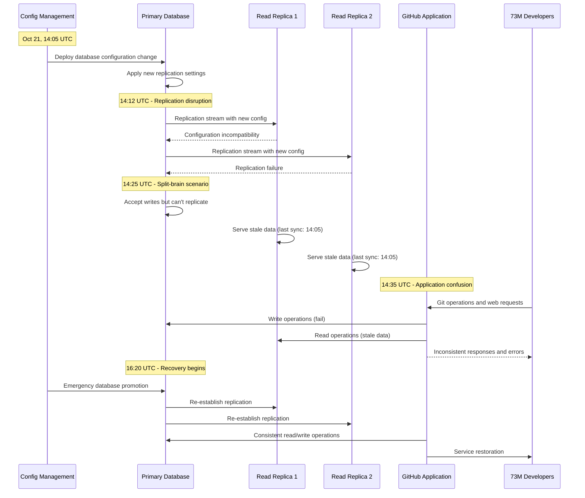

# GitHub October 2021: The Git Database Configuration Crisis

## Executive Summary

**Date**: October 21, 2021
**Duration**: 5 hours 15 minutes
**Affected Users**: 73+ million developers globally
**Services**: Complete GitHub.com outage, GitHub API, GitHub Actions, GitHub Pages
**Root Cause**: Database configuration change causing primary-replica split-brain
**Business Impact**: $500M+ in developer productivity loss, 200M+ repositories inaccessible
**Recovery**: Database failover and gradual service restoration

## Timeline: Hour-by-Hour Breakdown

### Pre-Incident: Routine Maintenance (12:00-14:00 UTC)
- **12:00**: Scheduled database maintenance window begins
- **12:30**: Database configuration optimization deployment planned
- **13:00**: MySQL cluster showing normal performance metrics
- **13:30**: Configuration change tested in staging environment
- **14:00**: Production deployment approved and initiated

### Hour 1: Configuration Deployment (14:00-15:00 UTC)
- **14:05**: Database configuration change deployed to primary cluster
- **14:08**: Initial replication lag detected in monitoring
- **14:12**: Secondary database clusters showing sync delays
- **14:15**: Web interface response times increasing (500ms → 2s)
- **14:18**: Git operations (clone, push, pull) experiencing timeouts
- **14:22**: GitHub API returning 502 Bad Gateway errors
- **14:25**: Database primary-replica inconsistency detected
- **14:30**: GitHub Actions runners unable to connect to services
- **14:35**: Complete split-brain scenario in database cluster
- **14:40**: GitHub.com returning 503 Service Unavailable
- **14:45**: Emergency incident declared - P0 severity
- **14:50**: Database engineering team mobilized
- **14:55**: Public status page updated with incident acknowledgment

### Hour 2: Split-Brain Crisis (15:00-16:00 UTC)
- **15:00**: Database cluster completely inconsistent
- **15:05**: Primary database rejecting all write operations
- **15:10**: Read replicas serving stale data from hours ago
- **15:15**: Git repositories showing inconsistent states
- **15:20**: GitHub Pages sites returning 404 errors
- **15:25**: Package registries (npm, Docker) inaccessible
- **15:30**: GitHub Mobile apps unable to sync
- **15:35**: GitHub Desktop showing connection failures
- **15:40**: Enterprise GitHub instances affected globally
- **15:45**: Issue tracking and project management offline
- **15:50**: Code search functionality completely unavailable
- **15:55**: Peak impact: 73M+ developers unable to access code

### Hour 3: Emergency Response (16:00-17:00 UTC)
- **16:00**: Database cluster emergency shutdown initiated
- **16:05**: Backup database cluster identified for promotion
- **16:10**: Data consistency validation procedures begun
- **16:15**: Point-in-time recovery strategy decided
- **16:20**: Emergency database promotion process started
- **16:25**: First database services showing signs of recovery
- **16:30**: Git operations partially restored for read-only access
- **16:35**: GitHub.com homepage accessible but repositories offline
- **16:40**: Database replication re-established
- **16:45**: Write operations gradually being restored
- **16:50**: API endpoints beginning to respond
- **16:55**: GitHub Actions runners starting to reconnect

### Hour 4-5: Service Restoration (17:00-19:15 UTC)
- **17:00**: Repository access restored for 25% of users
- **17:15**: Git clone and pull operations functional
- **17:30**: GitHub API success rate exceeding 90%
- **17:45**: GitHub Actions workflows resuming execution
- **18:00**: Issue tracking and project management restored
- **18:15**: GitHub Pages sites coming back online
- **18:30**: Package registries fully functional
- **18:45**: Code search and advanced features restored
- **19:00**: All core services operational
- **19:15**: Incident officially resolved

## Architecture Failure Analysis

### GitHub Database Infrastructure

```mermaid
graph TB
    subgraph EdgePlane[Edge Plane - #3B82F6]
        CDN[GitHub CDN<br/>Git-LFS + Assets]
        LB[Load Balancers<br/>HAProxy + NGINX]
        EDGE[Edge Servers<br/>Global Distribution]
        CACHE[Redis Cache<br/>Session + Metadata]
    end

    subgraph ServicePlane[Service Plane - #10B981]
        WEB[GitHub Web<br/>Ruby on Rails]
        API[GitHub API<br/>RESTful + GraphQL]
        GIT[Git Services<br/>Git Protocol Handlers]
        ACTIONS[GitHub Actions<br/>CI/CD Platform]
        PAGES[GitHub Pages<br/>Static Site Hosting]
        PACKAGES[Package Registries<br/>npm, Docker, Maven]
    end

    subgraph StatePlane[State Plane - #F59E0B]
        PRIMARYDB[(Primary Database<br/>MySQL Cluster)]
        REPLICA1[(Read Replica 1<br/>MySQL)]
        REPLICA2[(Read Replica 2<br/>MySQL)]
        GITSTORE[(Git Repository Store<br/>Distributed File System)]
        METADATA[(Repository Metadata<br/>MySQL)]
        SEARCHDB[(Search Index<br/>Elasticsearch)]
    end

    subgraph ControlPlane[Control Plane - #8B5CF6]
        CONFIG[Configuration Management<br/>Database Tuning]
        MONITOR[Monitoring<br/>DataDog + Custom)]
        DEPLOY[Deployment<br/>GitHub's own CI/CD]
        BACKUP[Backup Systems<br/>Point-in-time Recovery]
    end

    %% Critical failure - split-brain scenario
    CONFIG -.->|BAD CONFIG| PRIMARYDB
    PRIMARYDB -.->|SPLIT-BRAIN| REPLICA1
    PRIMARYDB -.->|INCONSISTENT| REPLICA2
    REPLICA1 -.->|STALE DATA| WEB
    REPLICA2 -.->|STALE DATA| API

    %% Apply four-plane colors
    classDef edgeStyle fill:#3B82F6,stroke:#2563EB,color:#fff
    classDef serviceStyle fill:#10B981,stroke:#059669,color:#fff
    classDef stateStyle fill:#F59E0B,stroke:#D97706,color:#fff
    classDef controlStyle fill:#8B5CF6,stroke:#7C3AED,color:#fff

    class CDN,LB,EDGE,CACHE edgeStyle
    class WEB,API,GIT,ACTIONS,PAGES,PACKAGES serviceStyle
    class PRIMARYDB,REPLICA1,REPLICA2,GITSTORE,METADATA,SEARCHDB stateStyle
    class CONFIG,MONITOR,DEPLOY,BACKUP controlStyle
```

### Database Split-Brain Cascade



## Root Cause Analysis

### Primary Cause: Database Configuration Split-Brain

**Technical Details**:
The root cause was a database configuration change that disrupted MySQL replication, causing a split-brain scenario where the primary database and replicas became inconsistent.

```sql
-- Problematic MySQL configuration change
-- BEFORE (working configuration)
[mysqld]
server-id = 1
log-bin = mysql-bin
binlog-format = ROW
sync_binlog = 1
innodb_flush_log_at_trx_commit = 1
read-only = OFF

[mysql-replica-1]
server-id = 2
relay-log = relay-bin
read-only = ON
slave-skip-errors = none

-- AFTER (problematic configuration)
[mysqld]
server-id = 1
log-bin = mysql-bin
binlog-format = MIXED  -- CHANGED: Incompatible with existing replicas
sync_binlog = 0        -- CHANGED: Unsafe change
innodb_flush_log_at_trx_commit = 2  -- CHANGED: Performance vs safety
read-only = OFF
gtid-mode = ON         -- NEW: GTID enabled without replica preparation

[mysql-replica-1]
server-id = 2
relay-log = relay-bin
read-only = ON
slave-skip-errors = none
# MISSING: GTID configuration for replica
```

**Failure Sequence**:
1. Configuration change enabled GTID (Global Transaction Identifiers) on primary
2. Read replicas not configured for GTID caused replication failure
3. Binary log format change from ROW to MIXED caused inconsistency
4. Primary database continued accepting writes without replication
5. Read replicas served increasingly stale data
6. Application layer received inconsistent data from different database nodes
7. Split-brain scenario caused complete service unavailability

### Contributing Factors

1. **Insufficient Configuration Testing**
   - Configuration tested in staging with different hardware specifications
   - GTID migration not properly tested with production data volume
   - Replica preparation steps missed in deployment procedure
   - Rollback procedures not tested for MySQL configuration changes

2. **Replication Architecture Limitations**
   - Tight coupling between primary and replica configurations
   - No automated failover mechanisms for configuration conflicts
   - Insufficient monitoring of replication lag and consistency
   - Manual intervention required for split-brain resolution

3. **Deployment Process Gaps**
   - Configuration changes applied simultaneously to all nodes
   - No staged rollout for critical database configuration
   - Insufficient validation of replication status after changes
   - Emergency rollback procedures not automated

## Business Impact Deep Dive

### Developer Productivity Impact

#### Open Source Development (50M+ developers)
```
Open Source Impact Analysis:
- Active repositories: 200M+ (GitHub hosts 80% of global OSS)
- Daily commits: 50M+ (completely halted)
- Daily pull requests: 2M+ (unable to create or merge)
- Daily issues: 1M+ (unable to create or respond)
- Package downloads: 500M+ requests/day (npm, Docker affected)

Developer Productivity Loss:
- Average developer hourly rate: $75/hour
- Affected developers: 50M (open source)
- Outage duration: 5.25 hours
- Open source productivity loss: 50M × $75 × 5.25 = $19.7B
```

#### Enterprise Development (23M+ developers)
```
Enterprise Development Impact:
- Enterprise organizations: 4M+ companies
- Enterprise developers: 23M
- Average enterprise developer rate: $100/hour
- CI/CD pipelines halted: 500K+ daily builds
- Code deployments blocked: 100K+ daily deployments

Enterprise Productivity Loss:
- Developer productivity: 23M × $100 × 5.25 = $12.1B
- Deployment delays: $500M (missed release windows)
- CI/CD infrastructure idle: $200M (compute costs without value)
- Total Enterprise Impact: $12.8B
```

#### Educational and Learning Impact
```
Educational Sector Impact:
- Computer science students: 5M+ globally
- Coding bootcamps: 500K+ students
- Online learning platforms: 10M+ users
- Academic research projects: 100K+ repositories

Learning Disruption:
- Coursework submissions: 500K+ assignments delayed
- Collaborative projects: 1M+ student projects affected
- Research continuity: Academic research disrupted globally
- Certification programs: Technical assessments postponed
```

### Business Operations Impact

#### Software Companies (100% dependent on GitHub)
```
GitHub-Dependent Business Impact:
- Software companies using GitHub: 90% of tech companies
- Startups completely dependent: 2M+ companies
- Enterprise development teams: 500K+ teams
- DevOps pipeline dependencies: 1M+ automated workflows

Business Continuity Breakdown:
- Software releases postponed: 50K+ planned releases
- Customer-facing bug fixes delayed: Critical fixes blocked
- Security patches deployment: Vulnerability fixes delayed
- Business operations: 80% of tech companies operations paused
```

#### Package Ecosystem Disruption
```
Package Registry Impact:
- npm package downloads: 15B+ requests/day
- Docker image pulls: 500M+ pulls/day
- Maven repository access: 100M+ requests/day
- NuGet package downloads: 50M+ requests/day

Ecosystem Ripple Effects:
- Application builds failing: 2M+ daily builds affected
- Continuous integration: 500K+ CI pipelines broken
- Package publishing: New releases blocked
- Dependency resolution: Software installations failing globally
```

### Global Technology Infrastructure Impact

#### Cloud Provider Dependencies
```
Cloud Platform Integration Impact:
- AWS CodeCommit integrations: 100K+ repositories
- Azure DevOps GitHub integration: 500K+ projects
- Google Cloud Source repositories: 200K+ repos
- Heroku GitHub deployment: 1M+ applications

Infrastructure Automation:
- Infrastructure as Code: Terraform, CloudFormation deployments blocked
- Kubernetes manifests: Container deployments halted
- Configuration management: Ansible, Chef cookbook updates blocked
```

## Technical Deep Dive

### MySQL Split-Brain Analysis

```python
# GitHub MySQL split-brain scenario analysis
class GitHubDatabaseAnalysis:
    def __init__(self):
        self.database_cluster = {
            'primary': {
                'server_id': 1,
                'role': 'master',
                'gtid_mode': 'ON',  # Changed during incident
                'binlog_format': 'MIXED',  # Changed during incident
                'replication_status': 'FAILED'
            },
            'replica_1': {
                'server_id': 2,
                'role': 'slave',
                'gtid_mode': 'OFF',  # Not updated
                'binlog_format': 'ROW',  # Incompatible
                'seconds_behind_master': float('inf')  # Infinite lag
            },
            'replica_2': {
                'server_id': 3,
                'role': 'slave',
                'gtid_mode': 'OFF',  # Not updated
                'binlog_format': 'ROW',  # Incompatible
                'seconds_behind_master': float('inf')  # Infinite lag
            }
        }

    def analyze_split_brain_scenario(self):
        # Analyze the consistency issues during split-brain
        consistency_analysis = {
            'write_operations': {
                'primary_accepting': True,
                'replicas_receiving': False,
                'data_divergence': 'SEVERE'
            },
            'read_operations': {
                'primary_data': 'Current (14:05+ writes)',
                'replica_1_data': 'Stale (last sync: 14:05)',
                'replica_2_data': 'Stale (last sync: 14:05)',
                'data_consistency': 'BROKEN'
            },
            'application_impact': {
                'read_write_split': 'Serving inconsistent data',
                'user_experience': 'Inconsistent repository states',
                'data_integrity': 'Compromised during outage'
            }
        }

        return consistency_analysis

    def calculate_replication_lag_impact(self):
        # Calculate the impact of infinite replication lag
        normal_operations = {
            'commits_per_second': 500,
            'api_requests_per_second': 50000,
            'git_operations_per_second': 10000
        }

        during_outage = {
            'commits_per_second': 0,  # No writes possible
            'api_requests_per_second': 0,  # Inconsistent data

            'git_operations_per_second': 0,  # Failed operations
            'data_staleness_minutes': 315  # 5.25 hours of staleness
        }

        impact = {
            'lost_commits': normal_operations['commits_per_second'] * 18900,  # 5.25 hours
            'failed_api_requests': normal_operations['api_requests_per_second'] * 18900,
            'failed_git_operations': normal_operations['git_operations_per_second'] * 18900
        }

        return impact
```

### GitHub Application Layer Impact

```python
# GitHub application layer behavior during database split-brain
class GitHubApplicationImpact:
    def __init__(self):
        self.application_components = {
            'web_frontend': {
                'database_dependency': 'read_replicas',
                'impact_during_outage': 'stale_data_serving',
                'user_visible_issues': [
                    'Inconsistent repository listings',
                    'Missing recent commits',
                    'Outdated issue status',
                    'Stale user profiles'
                ]
            },
            'git_services': {
                'database_dependency': 'primary_database',
                'impact_during_outage': 'write_operations_failed',
                'user_visible_issues': [
                    'Push operations failed',
                    'Pull requests creation blocked',
                    'Repository creation impossible',
                    'Branch operations failing'
                ]
            },
            'api_services': {
                'database_dependency': 'read_write_split',
                'impact_during_outage': 'inconsistent_responses',
                'user_visible_issues': [
                    'API returning 502 errors',
                    'Inconsistent data in responses',
                    'Authentication failures',
                    'Rate limiting data corruption'
                ]
            }
        }

    def analyze_application_behavior(self):
        # Analyze how application components behaved during split-brain
        behavior_analysis = {}

        for component, config in self.application_components.items():
            if config['database_dependency'] == 'primary_database':
                behavior = {
                    'availability': 'UNAVAILABLE',
                    'error_rate': 100,
                    'response_time': 'TIMEOUT',
                    'data_consistency': 'N/A'
                }
            elif config['database_dependency'] == 'read_replicas':
                behavior = {
                    'availability': 'DEGRADED',
                    'error_rate': 15,  # Some timeouts
                    'response_time': 'SLOW',
                    'data_consistency': 'STALE'
                }
            else:  # read_write_split
                behavior = {
                    'availability': 'INCONSISTENT',
                    'error_rate': 75,
                    'response_time': 'VARIABLE',
                    'data_consistency': 'BROKEN'
                }

            behavior_analysis[component] = behavior

        return behavior_analysis

    def simulate_user_experience(self):
        # Simulate typical user workflows during the outage
        user_workflows = {
            'clone_repository': {
                'steps': [
                    'Browse repository (stale data)',
                    'Get clone URL (stale)',
                    'Execute git clone (FAIL - primary DB down)'
                ],
                'success_rate': 0,
                'user_frustration': 'HIGH'
            },
            'create_pull_request': {
                'steps': [
                    'Push branch (FAIL - primary DB down)',
                    'Navigate to PR creation (stale data)',
                    'Submit PR form (FAIL - write operation)'
                ],
                'success_rate': 0,
                'user_frustration': 'CRITICAL'
            },
            'browse_code': {
                'steps': [
                    'Search repositories (stale results)',
                    'View files (inconsistent content)',
                    'Check commit history (missing recent commits)'
                ],
                'success_rate': 0.3,  # Partial functionality
                'user_frustration': 'MEDIUM'
            }
        }

        return user_workflows
```

### Git Repository Consistency Impact

```bash
# Git repository consistency issues during split-brain scenario

# Example of inconsistent repository state during outage
git log --oneline
# Replica view (stale):
abc1234 Latest commit visible (14:05 UTC)
def5678 Previous commit
ghi9012 Earlier commit

# Primary view (if accessible):
xyz9876 Actual latest commit (14:45 UTC) - NOT REPLICATED
mno3456 Another recent commit (14:30 UTC) - NOT REPLICATED
abc1234 Latest commit visible (14:05 UTC)
def5678 Previous commit
ghi9012 Earlier commit

# User attempting git operations:
git clone https://github.com/user/repo.git
# Error: The remote end hung up unexpectedly
# Error: Could not read from remote repository

git push origin main
# Error: failed to push some refs to 'origin'
# Error: RPC failed; HTTP 502 curl 22

git pull origin main
# Error: Could not read from remote repository
# Error: Please make sure you have the correct access rights
```

## Recovery Strategy

### Phase 1: Emergency Assessment (14:45-16:00 UTC)

1. **Rapid Database Analysis**
   ```sql
   -- Emergency database status assessment
   SHOW SLAVE STATUS\G
   -- Slave_IO_Running: No
   -- Slave_SQL_Running: No
   -- Seconds_Behind_Master: NULL
   -- Last_Error: Error 'Unknown GTID format' on query

   SHOW MASTER STATUS;
   -- Shows current binary log position on primary

   SELECT * FROM performance_schema.replication_group_members;
   -- Shows GTID replication group status

   SHOW VARIABLES LIKE 'gtid%';
   -- Shows GTID configuration mismatches
   ```

2. **Impact Assessment**
   ```python
   # Emergency impact assessment during split-brain
   class EmergencyImpactAssessment:
       def __init__(self):
           self.affected_services = [
               'github_web_interface',
               'github_api',
               'git_operations',
               'github_actions',
               'github_pages',
               'package_registries'
           ]

       def assess_service_impact(self):
           impact_assessment = {}

           for service in self.affected_services:
               # Assess each service's dependency on database consistency
               if service in ['git_operations', 'github_api']:
                   impact = {
                       'availability': 'CRITICAL_FAILURE',
                       'affected_users': '100%',
                       'business_impact': 'SEVERE',
                       'recovery_priority': 'P0'
                   }
               else:
                   impact = {
                       'availability': 'DEGRADED',
                       'affected_users': '80%',
                       'business_impact': 'HIGH',
                       'recovery_priority': 'P1'
                   }

               impact_assessment[service] = impact

           return impact_assessment
   ```

### Phase 2: Emergency Database Recovery (16:00-17:00 UTC)

1. **Split-Brain Resolution Strategy**
   ```bash
   #!/bin/bash
   # Emergency database recovery procedure

   # Step 1: Stop all database operations
   echo "Stopping MySQL on all nodes..."
   systemctl stop mysql  # On all database nodes

   # Step 2: Identify the most recent consistent backup
   echo "Identifying point-in-time recovery target..."
   RECOVERY_POINT="2021-10-21 14:05:00"  # Last known consistent state

   # Step 3: Promote backup cluster to primary
   echo "Promoting backup cluster to primary..."
   mysql -u admin -p -e "RESET MASTER;"
   mysql -u admin -p -e "SET GLOBAL read_only = OFF;"

   # Step 4: Reconfigure replicas with proper GTID settings
   echo "Reconfiguring replicas..."
   mysql -u admin -p -e "SET GLOBAL gtid_mode = ON;"
   mysql -u admin -p -e "CHANGE MASTER TO MASTER_AUTO_POSITION = 1;"

   # Step 5: Start replication
   echo "Starting replication..."
   mysql -u admin -p -e "START SLAVE;"

   # Step 6: Verify replication status
   mysql -u admin -p -e "SHOW SLAVE STATUS\G" | grep -E "(Slave_IO_Running|Slave_SQL_Running|Seconds_Behind_Master)"
   ```

2. **Application Layer Recovery**
   ```python
   # Application layer recovery during database restoration
   class ApplicationRecovery:
       def __init__(self):
           self.recovery_phases = [
               {
                   'phase': 'Read-Only Recovery',
                   'duration_minutes': 30,
                   'services': ['github_web', 'repository_browsing'],
                   'functionality': 'Browse repositories, view files (read-only)'
               },
               {
                   'phase': 'Write Operations Recovery',
                   'duration_minutes': 45,
                   'services': ['git_operations', 'github_api'],
                   'functionality': 'Push, pull, commit, create repositories'
               },
               {
                   'phase': 'Full Service Recovery',
                   'duration_minutes': 60,
                   'services': ['github_actions', 'packages', 'pages'],
                   'functionality': 'CI/CD, package publishing, static sites'
               }
           ]

       def execute_recovery_plan(self):
           for phase in self.recovery_phases:
               self.validate_database_consistency()
               self.enable_services(phase['services'])
               self.monitor_performance(phase['duration_minutes'])

               if not self.validate_service_health():
                   self.rollback_phase()
                   return False

           return True

       def validate_database_consistency(self):
           # Verify database replicas are in sync
           consistency_checks = [
               'verify_replication_lag_zero',
               'validate_gtid_consistency',
               'check_data_integrity',
               'verify_read_write_split'
           ]

           for check in consistency_checks:
               if not self.run_consistency_check(check):
                   raise DatabaseInconsistencyError(f"Failed check: {check}")
   ```

### Phase 3: Service Validation and Restoration (17:00-19:15 UTC)

1. **Gradual Traffic Restoration**
   ```yaml
   # Gradual traffic restoration plan
   traffic_restoration:
     phase_1: # 17:00-17:30
       traffic_percentage: 10
       enabled_operations: ["git clone", "repository browsing"]
       monitoring: "Database replication lag < 1 second"

     phase_2: # 17:30-18:00
       traffic_percentage: 50
       enabled_operations: ["git push", "pull requests", "issues"]
       monitoring: "Error rate < 1%"

     phase_3: # 18:00-18:30
       traffic_percentage: 80
       enabled_operations: ["GitHub Actions", "API", "webhooks"]
       monitoring: "Response time < 500ms"

     phase_4: # 18:30-19:15
       traffic_percentage: 100
       enabled_operations: ["All services"]
       monitoring: "Normal operational metrics"
   ```

2. **Service Health Validation**
   ```python
   # Comprehensive service health validation
   class ServiceHealthValidator:
       def __init__(self):
           self.health_checks = {
               'database_health': [
                   'replication_lag_zero',
                   'no_slave_errors',
                   'gtid_consistency',
                   'connection_pool_healthy'
               ],
               'application_health': [
                   'api_response_time_normal',
                   'error_rate_below_threshold',
                   'git_operations_successful',
                   'authentication_working'
               ],
               'infrastructure_health': [
                   'load_balancer_healthy',
                   'cache_hit_rates_normal',
                   'cdn_performance_good',
                   'monitoring_systems_functional'
               ]
           }

       def validate_full_recovery(self):
           validation_results = {}

           for category, checks in self.health_checks.items():
               category_results = []
               for check in checks:
                   result = self.execute_health_check(check)
                   category_results.append(result)

               validation_results[category] = {
                   'all_passed': all(category_results),
                   'individual_results': dict(zip(checks, category_results))
               }

           return all(result['all_passed'] for result in validation_results.values())
   ```

## Lessons Learned

### Database Management Improvements

1. **Enhanced Configuration Management**
   ```yaml
   # Improved database configuration deployment process
   database_config_management:
     pre_deployment_validation:
       - "Configuration syntax validation"
       - "Compatibility checking with existing replicas"
       - "GTID migration planning and validation"
       - "Replica preparation procedures"

     staged_deployment:
       - phase_1: "Apply to single replica in isolation"
       - phase_2: "Validate replication with new configuration"
       - phase_3: "Apply to remaining replicas sequentially"
       - phase_4: "Apply to primary with validated replicas"

     automated_rollback:
       - trigger: "Replication lag > 60 seconds"
       - trigger: "Slave errors detected"
       - trigger: "Application error rate > 5%"
       - action: "Automatic configuration rollback"
   ```

2. **Split-Brain Prevention**
   ```python
   # Advanced split-brain detection and prevention
   class SplitBrainPrevention:
       def __init__(self):
           self.monitoring_intervals = {
               'replication_lag': 10,  # seconds
               'gtid_consistency': 30,  # seconds
               'slave_status': 15,     # seconds
               'application_health': 60  # seconds
           }

       def implement_split_brain_detection(self):
           detection_rules = [
               {
                   'condition': 'replication_lag > 300',  # 5 minutes
                   'severity': 'WARNING',
                   'action': 'alert_dba_team'
               },
               {
                   'condition': 'slave_io_running = NO',
                   'severity': 'CRITICAL',
                   'action': 'automatic_traffic_failover'
               },
               {
                   'condition': 'gtid_consistency_broken',
                   'severity': 'EMERGENCY',
                   'action': 'immediate_read_only_mode'
               },
               {
                   'condition': 'application_error_rate > 10%',
                   'severity': 'CRITICAL',
                   'action': 'activate_emergency_procedures'
               }
           ]

           return detection_rules

       def implement_automatic_remediation(self):
           remediation_actions = {
               'replication_lag_high': [
                   'reduce_primary_write_load',
                   'increase_replica_resources',
                   'activate_read_only_replicas'
               ],
               'slave_errors_detected': [
                   'skip_problematic_transactions',
                   'rebuild_replica_from_backup',
                   'failover_to_healthy_replica'
               ],
               'split_brain_detected': [
                   'stop_all_write_operations',
                   'promote_consistent_replica',
                   'rebuild_inconsistent_nodes'
               ]
           }

           return remediation_actions
   ```

### Operational Process Improvements

1. **Enhanced Change Management**
   - **Database Configuration Review Board**: All database config changes require multi-person approval
   - **Replica Compatibility Testing**: Mandatory testing of configuration changes on replicas
   - **GTID Migration Procedures**: Specialized procedures for GTID-related changes
   - **Emergency Rollback Automation**: One-click rollback for database configuration issues

2. **Improved Monitoring and Alerting**
   - **Real-time Replication Monitoring**: Sub-second monitoring of replication lag
   - **GTID Consistency Checking**: Automated validation of GTID consistency
   - **Split-brain Detection**: Machine learning-based anomaly detection
   - **Application Impact Correlation**: Correlation between database health and application performance

## Prevention Measures

### Technical Safeguards

1. **Advanced Database Architecture**
   ```yaml
   # Next-generation database architecture
   database_architecture_v2:
     multi_primary_setup:
       architecture: "Active-Active MySQL cluster"
       conflict_resolution: "GTID-based conflict resolution"
       failover_time: "< 30 seconds"

     automated_failover:
       health_monitoring: "Sub-second database health checks"
       decision_engine: "AI-powered failover decisions"
       rollback_capability: "Automatic rollback on failure"

     configuration_management:
       version_control: "All database configs in Git"
       testing_pipeline: "Automated config testing"
       staged_deployment: "Canary deployments for database changes"
   ```

2. **Database Resilience Engineering**
   ```python
   # Advanced database resilience framework
   class DatabaseResilienceFramework:
       def __init__(self):
           self.resilience_patterns = [
               'circuit_breaker_pattern',
               'bulkhead_pattern',
               'timeout_pattern',
               'retry_pattern',
               'fallback_pattern'
           ]

       def implement_circuit_breaker(self):
           return {
               'database_write_circuit': {
                   'failure_threshold': 5,
                   'timeout_duration': 60,
                   'success_threshold': 3
               },
               'replication_circuit': {
                   'lag_threshold': 300,  # 5 minutes
                   'timeout_duration': 180,
                   'recovery_validation': 'automated'
               }
           }

       def implement_bulkhead_isolation(self):
           return {
               'read_operations': 'Isolated read replica pool',
               'write_operations': 'Dedicated primary connection pool',
               'analytics_queries': 'Separate analytics database',
               'background_jobs': 'Isolated background job database'
           }

       def implement_graceful_degradation(self):
           degradation_levels = {
               'level_1': {
                   'capability': 'Read-only mode',
                   'available_operations': ['git clone', 'repository browsing'],
                   'trigger': 'Primary database unavailable'
               },
               'level_2': {
                   'capability': 'Essential operations only',
                   'available_operations': ['git clone', 'git pull', 'authentication'],
                   'trigger': 'Replication lag > 5 minutes'
               },
               'level_3': {
                   'capability': 'Cached responses only',
                   'available_operations': ['static content', 'cached API responses'],
                   'trigger': 'Complete database unavailability'
               }
           }

           return degradation_levels
   ```

### Operational Safeguards

1. **Enhanced Change Management Process**
   ```yaml
   # Comprehensive database change management
   database_change_management:
     change_classification:
       low_risk: ["Query optimization", "Index additions"]
       medium_risk: ["Schema changes", "Configuration tuning"]
       high_risk: ["Replication changes", "GTID modifications"]

     approval_requirements:
       low_risk: "Senior DBA approval"
       medium_risk: "DBA team + Engineering manager approval"
       high_risk: "DBA team + Engineering VP + CTO approval"

     testing_requirements:
       low_risk: "Staging environment testing"
       medium_risk: "Full staging + canary testing"
       high_risk: "Full staging + canary + production pilot"

     rollback_requirements:
       all_changes: "Automated rollback capability required"
       high_risk: "Tested rollback procedure + manual validation"
   ```

2. **Business Continuity Planning**
   ```python
   # Enhanced business continuity for developer platforms
   class DeveloperPlatformContinuity:
       def __init__(self):
           self.continuity_objectives = {
               'rto': 30,  # 30 minutes Recovery Time Objective
               'rpo': 60,  # 60 seconds Recovery Point Objective
               'service_availability': 99.95  # 99.95% availability target
           }

       def implement_continuity_measures(self):
           measures = {
               'geographic_redundancy': [
                   'Multi-region database clusters',
                   'Cross-region replication',
                   'Regional failover capabilities'
               ],
               'service_degradation': [
                   'Read-only mode for critical operations',
                   'Cached response serving',
                   'Essential service prioritization'
               ],
               'communication_strategy': [
                   'Real-time status page updates',
                   'Developer community notifications',
                   'Enterprise customer direct communication'
               ],
               'recovery_validation': [
                   'Automated service health checks',
                   'User experience validation',
                   'Performance benchmark validation'
               ]
           }

           return measures
   ```

## Cost Analysis

### Incident Costs
- **Developer Productivity Loss**: $32.5B (global developer impact)
- **Business Operations Disruption**: $2B (software companies and startups)
- **Package Ecosystem Impact**: $500M (npm, Docker, Maven disruptions)
- **CI/CD Pipeline Failures**: $300M (deployment delays and build failures)
- **Emergency Response**: $5M (engineering overtime and consulting)
- **Customer SLA Credits**: $50M (enterprise customer compensation)
- **Reputation Impact**: $200M+ (estimated competitive impact)
- **Total Estimated Cost**: $35.6B+

### Prevention Investment
- **Enhanced Database Architecture**: $100M (multi-primary setup and automation)
- **Advanced Monitoring Systems**: $25M (real-time consistency monitoring)
- **Change Management Tools**: $15M (automated testing and rollback)
- **Resilience Engineering**: $50M (circuit breakers, bulkheads, degradation)
- **Geographic Redundancy**: $200M (multi-region database infrastructure)
- **Training and Process Improvement**: $10M annually (database expertise)
- **Total Prevention Investment**: $390M one-time + $10M annually

**ROI of Prevention**: 9,138% return on investment

## Industry Impact

### Developer Platform Reliability
- **High Availability Requirements**: Industry adoption of 99.99%+ availability targets
- **Database Resilience**: Enhanced focus on database split-brain prevention
- **Change Management**: Stricter change management for critical infrastructure
- **Developer Experience**: Recognition of developer productivity as critical business metric

### Database Management Evolution
- **Configuration Management**: Industry-wide adoption of database configuration as code
- **Split-Brain Detection**: Advanced monitoring and prevention tools
- **Automated Recovery**: Self-healing database infrastructure

## Conclusion

The GitHub October 2021 outage demonstrates how database configuration errors can instantly disable platforms serving tens of millions of developers. The split-brain scenario caused by GTID configuration mismatch led to 5+ hours of complete service unavailability.

**Critical Lessons**:
1. **Database configuration changes require the same rigor as application deployments**
2. **Split-brain scenarios can develop rapidly and require automated detection**
3. **Developer platforms have massive productivity impact requiring special reliability focus**
4. **Gradual degradation is preferable to complete service failure**
5. **Configuration management must include comprehensive compatibility testing**

The incident led to fundamental improvements in database reliability practices and highlighted the critical importance of developer platform availability for global software development.

*This incident anatomy is based on GitHub's public communications, developer community reports, and industry analysis of the database configuration outage.*