# GitHub October 21, 2018 - Database Failover Cascade

*"A 43-second network partition led to 24 hours of service degradation - the most impactful outage in GitHub's history"*

## Incident Overview

| Attribute | Value |
|-----------|-------|
| **Date** | October 21, 2018 |
| **Duration** | 24 hours, 11 minutes |
| **Trigger Time** | 22:52 UTC |
| **Resolution Time** | 23:03 UTC (October 22) |
| **Impact** | Global service degradation |
| **Users Affected** | ~31 million active users |
| **Data Loss** | None (after manual reconciliation) |
| **Estimated Cost** | $12M+ in lost productivity |
| **Root Cause** | Network partition during optical equipment maintenance |

## The Perfect Storm Timeline

## Architecture Impact Analysis

```mermaid
graph TB
    subgraph EdgePlane[Edge Plane - #0066CC]
        LB[Load Balancer<br/>✅ Operational]
        CDN[Fastly CDN<br/>✅ Operational]
    end

    subgraph ServicePlane[Service Plane - #00AA00]
        WEB[Web Servers<br/>⚠️ Read-Only Mode]
        API[GitHub API<br/>❌ Degraded]
        WH[Webhooks<br/>❌ Failed]
        PAGES[GitHub Pages<br/>❌ Build Failed]
    end

    subgraph StatePlane[State Plane - #FF8800]
        subgraph EastCoast[East Coast DC]
            MySQL_E[MySQL Primary<br/>❌ Isolated]
            REDIS_E[Redis Cache<br/>❌ Stale Data]
        end

        subgraph WestCoast[West Coast DC]
            MySQL_W[MySQL Replica<br/>⚠️ Promoted Primary]
            REDIS_W[Redis Cache<br/>⚠️ Inconsistent]
        end

        subgraph Cloud[Cloud Region]
            MySQL_C[MySQL Replica<br/>⚠️ Lag: 5+ minutes]
        end
    end

    subgraph ControlPlane[Control Plane - #CC0000]
        ORCH[Orchestrator<br/>❌ Wrong Decision]
        MON[Monitoring<br/>❌ Blind Spots]
        DEPLOY[Deployment<br/>❌ Halted]
    end

    %% Network partition indicated by broken lines
    MySQL_E -.->|❌ 43s PARTITION| MySQL_W
    MySQL_E -.->|❌ 43s PARTITION| MySQL_C
    ORCH -.->|❌ CROSS-REGION FAILOVER| MySQL_W

    %% Apply four-plane colors
    classDef edgeStyle fill:#0066CC,stroke:#004499,color:#fff
    classDef serviceStyle fill:#00AA00,stroke:#007700,color:#fff
    classDef stateStyle fill:#FF8800,stroke:#CC6600,color:#fff
    classDef controlStyle fill:#CC0000,stroke:#990000,color:#fff

    class LB,CDN edgeStyle
    class WEB,API,WH,PAGES serviceStyle
    class MySQL_E,MySQL_W,MySQL_C,REDIS_E,REDIS_W stateStyle
    class ORCH,MON,DEPLOY controlStyle
```

## Detailed Failure Sequence

### Phase 1: The Trigger (22:52-22:53 UTC)

```mermaid
sequenceDiagram
    participant Maint as Maintenance Team
    participant Net as Network Hub
    participant East as East Coast DC
    participant Orch as Orchestrator
    participant West as West Coast DC

    Note over Maint,West: 22:52 UTC - Routine Optical Equipment Replacement

    Maint->>Net: Replace 100G optical equipment
    Net--xEast: ❌ NETWORK PARTITION (43 seconds)

    Note over East: East Coast MySQL isolated
    Orch->>Orch: Detect primary unavailable
    Orch->>West: 🚨 EMERGENCY FAILOVER
    Note over West: West Coast promoted to primary

    Note over Maint,West: 22:53 UTC - Network restored, but damage done
```

### Phase 2: The Cascade (22:53-23:30 UTC)

```mermaid
sequenceDiagram
    participant App as Applications
    participant East as East Coast MySQL
    participant West as West Coast MySQL
    participant Orch as Orchestrator

    Note over App,Orch: 22:53 UTC - Network Restored But...

    App->>West: New writes (users, repos, issues)
    East->>East: Still has old data + some writes
    West->>West: Accumulating new writes

    Note over East,West: ⚠️ DATA DIVERGENCE

    Orch->>East: Attempt to rejoin cluster
    East--xWest: ❌ CONFLICT: Overlapping writes

    Note over App,Orch: 23:30 UTC - Realize data consistency issue
    App->>App: 🚨 ENABLE READ-ONLY MODE
```

### Phase 3: The Recovery (October 22, 08:00-23:03 UTC)

## Impact Metrics & Cost Analysis

### Service Availability

### Business Impact Breakdown
| Component | Impact | Duration | Est. Cost |
|-----------|--------|----------|-----------|
| **Developer Productivity** | 31M users unable to push/merge | 24h 11m | $8.2M |
| **CI/CD Pipelines** | 2.1M builds failed | 24h 11m | $1.8M |
| **Enterprise Revenue** | SLA credits issued | 24h 11m | $1.2M |
| **Webhook Delivery** | 5M+ events queued | 24h 11m | $0.8M |
| **GitHub Pages** | Build/deploy failures | 24h 11m | $0.3M |
| **Total Estimated Cost** | | | **$12.3M** |

## Technical Deep Dive

### MySQL Cluster Configuration

### Orchestrator Decision Matrix

```mermaid
graph TD
    A[Network Partition Detected] --> B{Primary Reachable?}
    B -->|No| C{Majority Quorum?}
    C -->|West + Cloud = Yes| D[Promote West Coast]
    D --> E{Original Primary Returns?}
    E -->|Yes| F{Data Conflicts?}
    F -->|Yes| G[❌ SPLIT BRAIN SCENARIO]
    F -->|No| H[✅ Safe Rejoin]

    G --> I[Manual Intervention Required]
    I --> J[Restore from Backup]
    J --> K[Reconcile Conflicting Writes]

    style G fill:#CC0000
    style I fill:#FF8800
    style D fill:#FF8800
```

## Root Cause Analysis

### Contributing Factors
1. **Network Topology**: Single point of failure in optical equipment
2. **Orchestrator Configuration**: Allowed cross-region failover without consensus
3. **Monitoring Gaps**: No detection of data divergence scenarios
4. **Recovery Procedures**: Insufficient testing of multi-TB database restoration

### The Human Factor

## Detailed Remediation Plan

### Immediate Actions (Completed within 30 days)
- [x] **Orchestrator Configuration**: Prevent cross-region promotions without manual approval
- [x] **Monitoring Enhancement**: Add data divergence detection alerts
- [x] **Backup Testing**: Weekly restoration drills for 5TB+ datasets
- [x] **Network Redundancy**: Dual optical paths for critical connections

### Long-term Improvements (6-month timeline)
- [ ] **Multi-DC Active-Active**: N+1 datacenter redundancy project
- [ ] **Chaos Engineering**: Systematic fault injection testing
- [ ] **Automated Reconciliation**: Tools for handling split-brain scenarios
- [ ] **Real-time Replication**: Sub-second cross-region lag targets

## Prevention Strategies

### Pre-Deployment Checklist

### Architectural Evolution

## Lessons for 3 AM Engineers

### 🚨 Critical Warning Signs
1. **Orchestrator Failover Alerts**: Always check data consistency before allowing writes
2. **Cross-Region Lag Spikes**: May indicate network partitions
3. **Sudden Traffic Drops**: Could mask underlying replication issues
4. **Monitoring Blind Spots**: If you can't see it, it's probably broken

### 🛠️ Emergency Procedures

### 💡 Key Takeaways
- **43 seconds** of network partition = **24 hours** of recovery
- **Data consistency** > **service availability** for stateful systems
- **Cross-region failover** without proper safeguards = **disaster**
- **Backup restoration** is only half the story - **reconciliation** is the hard part

---

*"This incident taught us that our assumptions about MySQL's behavior in network partition scenarios were fundamentally flawed. We learned that tighter operational controls or improved response times are insufficient safeguards for site reliability within a system as complicated as ours."* - GitHub Engineering Team

**Impact**: This outage led to GitHub's $500M+ investment in multi-datacenter redundancy and chaos engineering practices, fundamentally changing how they approach distributed system reliability.