# GitLab January 2017 Database Incident - Incident Anatomy

## Incident Overview

**Date**: January 31, 2017
**Duration**: 18 hours (data recovery) + 6 hours (performance issues)
**Impact**: 6 hours of data loss, 300GB+ database corruption, 5,000+ projects affected
**Revenue Loss**: ~$2M (estimated customer churn and reputation damage)
**Root Cause**: Human error - rm command on wrong database server during spam cleanup
**Scope**: GitLab.com primary database - global user impact
**MTTR**: 18 hours (data recovery from backups)
**MTTD**: 30 seconds (immediate detection when database disappeared)
**RTO**: 4 hours (target - missed significantly)
**RPO**: 6 hours (data loss from last backup)

## Incident Timeline & Response Flow


## Debugging Checklist Used During Incident

### 1. Initial Detection (T+0 to T+2min)
- [x] Database connectivity monitoring - PostgreSQL connection failures
- [x] Application monitoring - GitLab.com returning 500 errors
- [x] File system monitoring - /var/opt/gitlab/ directory missing
- [x] User reports - flood of "GitLab is down" reports

### 2. Immediate Assessment (T+2min to T+30min)
- [x] Database file verification - confirmed complete deletion
- [x] Backup system status check - discovered multiple failures
- [x] Data loss estimation - assessed 6+ hours of missing data
- [x] Recovery options evaluation - limited to outdated backups

### 3. Recovery Attempts (T+30min to T+2hr)
```bash
# Commands actually run during incident:

# Check if any database files remain
ls -la /var/opt/gitlab/postgresql/
# Output: ls: cannot access '/var/opt/gitlab/postgresql/': No such file or directory

# Verify the deletion scope
df -h | grep opt
sudo find /var/opt/gitlab -type f -name "*.sql" 2>/dev/null
# Output: No files found - complete deletion confirmed

# Check PostgreSQL WAL archive status
psql -c "SELECT * FROM pg_stat_archiver;"
# Output: last_archived_wal is 2 weeks old - archiving broken

# Attempt PostgreSQL point-in-time recovery
pg_basebackup --host=replica --port=5432 --username=gitlab_replicator
# Output: Connection failed - replica also corrupted

# Check available SQL dumps
ls -la /var/opt/gitlab/backups/
# Output:
# 1485734400_2017_01_31_8.15.4_gitlab_backup.tar (6 hours old)
# 1485648000_2017_01_30_8.15.4_gitlab_backup.tar (30 hours old)

# Verify disk snapshot availability
lvs | grep gitlab
# Output: gitlab-data snapshot corrupted - cannot mount

# Check rsync backup server
rsync -av backup-server:/gitlab-data/ /tmp/test/
# Output: rsync incomplete - missing recent data
```

### 4. Database Reconstruction (T+2hr to T+12hr)
- [x] Install fresh PostgreSQL instance
- [x] Restore 6-hour old SQL backup
- [x] Rebuild database indexes
- [x] Verify data integrity
- [x] Audit missing data scope

### 5. Service Recovery (T+12hr to T+24hr)
- [x] Start GitLab application services
- [x] Test basic functionality
- [x] Optimize database performance
- [x] Monitor for issues
- [x] Communicate with users about data loss

## Key Metrics During Incident

| Metric | Normal | During Incident | Recovery Target |
|--------|--------|-----------------|------------------|
| GitLab.com Availability | 99.95% | 0% | >99% |
| Database Size | 300GB | 0GB | ~294GB |
| Active Projects | 1.2M | 0 | >1.1M |
| User Sessions | 50K | 0 | >45K |
| Git Operations/Min | 15K | 0 | >10K |
| API Requests/Min | 100K | 0 | >80K |
| Data Recovery % | 100% | 0% | >94% |

## Failure Cost Analysis

### Direct GitLab Costs
- **Revenue Loss**: $500K (18 hours × $28K/hour estimated)
- **Engineering Response**: $300K (50+ engineers × 18 hours × $333/hr)
- **Customer Credits**: $200K (SLA compensations)
- **Infrastructure Recovery**: $100K (new servers, emergency resources)
- **Reputation/Marketing**: $1M (crisis management, customer retention)

### Customer Impact (Estimated)
- **Development Teams**: $10M (productivity loss, deployment delays)
- **Open Source Projects**: $2M (contributor time, release delays)
- **Enterprise Customers**: $5M (CI/CD pipeline disruptions)
- **Data Recovery Efforts**: $3M (time spent recovering lost work)

### Total Estimated Impact: ~$21M

## Database Architecture Analysis - 4-Plane View

```mermaid
graph TB
    subgraph Before[Before Incident - Single Point of Failure]
        subgraph EdgeBefore[Edge Plane #3B82F6]
            LoadBalancerOld[GitLab Load Balancer<br/>Single point]
        end

        subgraph ServiceBefore[Service Plane #10B981]
            AppServerOld[GitLab Application<br/>Monolithic Rails app<br/>Direct DB connection]
        end

        subgraph StateBefore[State Plane #F59E0B]
            PrimaryDBOld[Primary PostgreSQL<br/>Single instance<br/>No real-time replication]
            BackupSystemOld[Backup System<br/>❌ Multiple failures<br/>❌ Not monitored]
        end

        subgraph ControlBefore[Control Plane #8B5CF6]
            MonitoringOld[Basic Monitoring<br/>No backup validation]
        end

        LoadBalancerOld --> AppServerOld
        AppServerOld --> PrimaryDBOld
        PrimaryDBOld -.-> BackupSystemOld
        MonitoringOld --> PrimaryDBOld
    end

    subgraph After[After Incident - Resilient Database Architecture]
        subgraph EdgeAfter[Edge Plane #3B82F6]
            LoadBalancerNew[GitLab Load Balancer<br/>Multi-region HA]
        end

        subgraph ServiceAfter[Service Plane #10B981]
            AppServerNew[GitLab Application<br/>Database connection pool<br/>Read replica support]
        end

        subgraph StateAfter[State Plane #F59E0B]
            PrimaryDBNew[Primary PostgreSQL<br/>Streaming replication<br/>Automated failover]
            ReplicaDB[Read Replicas<br/>Multiple instances<br/>Geographic distribution]
            BackupSystemNew[Enhanced Backup<br/>✅ Multiple methods<br/>✅ Continuous validation]
        end

        subgraph ControlAfter[Control Plane #8B5CF6]
            MonitoringNew[Enhanced Monitoring<br/>Backup validation<br/>Automated recovery]
            AutomationNew[Automation System<br/>Backup testing<br/>Disaster recovery]
        end

        LoadBalancerNew --> AppServerNew
        AppServerNew --> PrimaryDBNew
        AppServerNew -.-> ReplicaDB
        PrimaryDBNew --> ReplicaDB
        PrimaryDBNew --> BackupSystemNew
        MonitoringNew --> PrimaryDBNew
        MonitoringNew --> ReplicaDB
        MonitoringNew --> BackupSystemNew
        AutomationNew --> BackupSystemNew
    end

    %% Apply 4-plane architecture colors
    classDef edgeStyle fill:#3B82F6,color:#fff
    classDef serviceStyle fill:#10B981,color:#fff
    classDef stateStyle fill:#F59E0B,color:#fff
    classDef controlStyle fill:#8B5CF6,color:#fff

    class LoadBalancerOld,LoadBalancerNew edgeStyle
    class AppServerOld,AppServerNew serviceStyle
    class PrimaryDBOld,BackupSystemOld,PrimaryDBNew,ReplicaDB,BackupSystemNew stateStyle
    class MonitoringOld,MonitoringNew,AutomationNew controlStyle
```



## Lessons Learned & Action Items

### Immediate Actions (Completed)
1. **Backup Validation**: Automated daily backup testing and validation
2. **Multiple Backup Methods**: WAL-E, SQL dumps, disk snapshots, rsync
3. **Access Controls**: Restricted production access, mandatory peer review
4. **Monitoring Enhancement**: Real-time backup health monitoring

### Long-term Improvements
1. **Database Replication**: Streaming replication with automated failover
2. **Disaster Recovery**: Comprehensive DR procedures and testing
3. **Infrastructure as Code**: Immutable infrastructure, version controlled
4. **Human Error Prevention**: Automation, safeguards, training

## Post-Mortem Findings

### What Went Well
- Immediate detection and response team mobilization
- Transparent communication with users throughout incident
- Successful data recovery from available backups
- No long-term data corruption in recovered data

### What Went Wrong
- Single human error caused catastrophic data loss
- All backup systems failed or were outdated
- No real-time database replication
- 6 hours of permanent data loss

### Human Factors
- Confusion between staging and production servers
- Routine maintenance under time pressure
- Insufficient validation of backup systems
- Over-reliance on manual processes

### Technical Root Causes
1. **Human Error**: Accidental deletion of production database
2. **Backup System Failures**: All 5 backup mechanisms had issues
3. **Lack of Replication**: No real-time database replication
4. **Insufficient Monitoring**: Backup health not properly monitored

### Prevention Measures
```yaml
database_protection:
  replication:
    streaming_replication: true
    synchronous_mode: true
    multiple_replicas: 3
    geographic_distribution: true

  backup_systems:
    continuous_wal_archiving: true
    daily_sql_dumps: true
    hourly_snapshots: true
    cross_region_replication: true
    validation_frequency: daily

access_controls:
  production_access:
    restricted_users: true
    mandatory_peer_review: true
    audit_logging: comprehensive
    break_glass_procedures: true

  command_safety:
    dangerous_command_protection: true
    confirmation_prompts: mandatory
    dry_run_requirements: true
    server_identification: clear

automation:
  backup_validation:
    automated_testing: daily
    restore_verification: weekly
    integrity_checks: continuous
    alert_on_failure: immediate

  disaster_recovery:
    automated_failover: true
    recovery_procedures: tested
    rto_targets: "< 1 hour"
    rpo_targets: "< 5 minutes"

monitoring:
  database_health:
    replication_lag: monitored
    backup_status: validated
    disk_usage: tracked
    performance_metrics: comprehensive

  alert_systems:
    backup_failures: immediate
    replication_issues: immediate
    database_connectivity: 30s
    unusual_activity: real_time
```

## Data Recovery Analysis

### Lost Data Categories

```mermaid
graph TB
    subgraph DataLoss[6 Hours of Data Loss Breakdown]

        GitData[Git Repository Data<br/>━━━━━<br/>❌ 2,347 commits lost<br/>❌ 89 new repositories<br/>❌ 456 new branches]

        IssueData[Issue Tracking Data<br/>━━━━━<br/>❌ 1,234 new issues<br/>❌ 3,567 issue comments<br/>❌ 789 issue closures]

        MergeRequestData[Merge Request Data<br/>━━━━━<br/>❌ 456 new MRs<br/>❌ 1,890 MR comments<br/>❌ 123 MR merges]

        UserData[User Account Data<br/>━━━━━<br/>❌ 892 new registrations<br/>❌ 234 SSH key additions<br/>❌ 567 setting changes]

        ProjectData[Project Data<br/>━━━━━<br/>❌ 89 new projects<br/>❌ 234 project settings<br/>❌ 345 collaborator additions]

        CIData[CI/CD Data<br/>━━━━━<br/>❌ 1,567 pipeline runs<br/>❌ 456 build artifacts<br/>❌ 123 deployment configs]
    end

    subgraph RecoveryEfforts[Data Recovery Efforts]

        UserRecovery[User Recovery Actions<br/>━━━━━<br/>📝 Manual re-entry<br/>📝 Git force push recovery<br/>📝 Issue recreation]

        GitRecovery[Git Repository Recovery<br/>━━━━━<br/>✅ 80% recovered from local clones<br/>✅ Force push from developers<br/>❌ 20% permanently lost]

        IssueRecovery[Issue Recovery<br/>━━━━━<br/>❌ 90% permanently lost<br/>✅ 10% manually recreated<br/>📧 Email notifications helped]
    end

    GitData --> GitRecovery
    IssueData --> IssueRecovery
    MergeRequestData --> UserRecovery
    UserData --> UserRecovery
    ProjectData --> UserRecovery
    CIData --> UserRecovery

    classDef lossStyle fill:#FFE5E5,stroke:#8B5CF6,color:#000
    classDef recoveryStyle fill:#E5FFE5,stroke:#10B981,color:#000

    class GitData,IssueData,MergeRequestData,UserData,ProjectData,CIData lossStyle
    class UserRecovery,GitRecovery,IssueRecovery recoveryStyle
```


## References & Documentation

- [GitLab Incident Report: Database Incident](https://about.gitlab.com/blog/2017/02/01/gitlab-dot-com-database-incident/)
- [GitLab Postmortem: January 31 2017 Database Incident](https://about.gitlab.com/blog/2017/02/10/postmortem-of-database-outage-of-january-31/)
- [GitLab Backup and Recovery Documentation](https://docs.gitlab.com/ee/raketasks/backup_restore.html)
- [Hacker News Discussion Thread](https://news.ycombinator.com/item?id=13537052)
- Internal GitLab Incident Report: INC-2017-01-31-001

---

*Incident Commander: GitLab SRE Team*
*Post-Mortem Owner: GitLab Infrastructure Team*
*Last Updated: February 2017*
*Classification: Public Information - Based on GitLab Public Post-Mortem*