# Google December 2020 Authentication Outage - Incident Anatomy

## Incident Overview

**Date**: December 14, 2020
**Duration**: 45 minutes (10:25 - 11:10 UTC)
**Impact**: Global authentication services down, 4+ billion users affected
**Revenue Loss**: ~$100M (estimated across Google services and dependent platforms)
**Root Cause**: Internal storage quota exceeded in authentication service
**Scope**: Global - all Google OAuth and authentication services
**MTTR**: 45 minutes
**MTTD**: 2 minutes (automated monitoring)
**RTO**: 30 minutes (target missed)
**RPO**: 0 (no data loss, availability issue only)

## Incident Timeline & Response Flow

```mermaid
graph TB
    subgraph Detection[T+0: Detection Phase - 10:25 UTC]
        style Detection fill:#FFE5E5,stroke:#8B5CF6,color:#000

        Start[10:25:14<br/>━━━━━<br/>Storage Quota Hit<br/>Authentication service<br/>Internal storage limit<br/>User ID allocation fails]

        Alert1[10:25:45<br/>━━━━━<br/>OAuth Failures<br/>Google Sign-In broken<br/>YouTube login errors<br/>Gmail authentication fails]

        Alert2[10:27:30<br/>━━━━━<br/>Global Impact<br/>All Google services<br/>Third-party OAuth broken<br/>4B+ users affected]
    end

    subgraph Diagnosis[T+5min: Diagnosis Phase]
        style Diagnosis fill:#FFF5E5,stroke:#F59E0B,color:#000

        Incident[10:30:00<br/>━━━━━<br/>SEV-0 Declared<br/>Global authentication<br/>Critical infrastructure<br/>Emergency response]

        StorageIssue[10:32:15<br/>━━━━━<br/>Storage Quota Issue<br/>Identity service storage<br/>User allocation table<br/>Quota enforcement bug]

        RootCause[10:35:00<br/>━━━━━<br/>Root Cause Found<br/>Storage quota exceeded<br/>Automated quota policy<br/>Service degradation]
    end

    subgraph Mitigation[T+10min: Mitigation Phase]
        style Mitigation fill:#FFFFE5,stroke:#CCCC00,color:#000

        QuotaIncrease[10:37:00<br/>━━━━━<br/>Emergency Quota<br/>Storage limit increased<br/>Service capacity expanded<br/>Immediate relief]

        ServiceRestart[10:42:00<br/>━━━━━<br/>Service Recovery<br/>Authentication restart<br/>OAuth endpoints restored<br/>Token validation working]

        GlobalSync[10:50:00<br/>━━━━━<br/>Global Propagation<br/>Service mesh update<br/>All regions recovered<br/>Load balancer health]
    end

    subgraph Recovery[T+25min: Recovery Phase]
        style Recovery fill:#E5FFE5,stroke:#10B981,color:#000

        TrafficNormal[10:55:00<br/>━━━━━<br/>Traffic Normalizing<br/>User logins resuming<br/>95% functionality<br/>Service metrics stable]

        Complete[11:10:00<br/>━━━━━<br/>Full Recovery<br/>All services operational<br/>Authentication working<br/>Incident closed]

        PostMortem[11:30:00<br/>━━━━━<br/>Post-Mortem<br/>Public status update<br/>Internal investigation<br/>Process review]
    end

    %% Google Service Impact
    subgraph GoogleServices[Google Services Impact]
        style GoogleServices fill:#F0F0F0,stroke:#666666,color:#000

        CoreServices[Core Services<br/>━━━━━<br/>❌ Gmail: Login failures<br/>❌ Google Drive: Access denied<br/>❌ Google Cloud: Auth broken<br/>❌ Android: Account sync]

        ConsumerServices[Consumer Services<br/>━━━━━<br/>❌ YouTube: Cannot sign in<br/>❌ Google Photos: Upload fails<br/>❌ Google Pay: Payment errors<br/>❌ Google Assistant: Sync issues]

        EnterpriseServices[Enterprise Services<br/>━━━━━<br/>❌ Google Workspace: SSO down<br/>❌ Google Cloud Platform: API auth<br/>❌ Firebase: Authentication<br/>❌ Google Ads: Account access]
    end

    %% Third-Party Impact
    subgraph ThirdPartyImpact[Third-Party OAuth Impact]
        style ThirdPartyImpact fill:#FFE0E0,stroke:#7C3AED,color:#000

        WebApps[Web Applications<br/>━━━━━<br/>❌ "Sign in with Google" broken<br/>❌ Millions of websites<br/>❌ Mobile app logins<br/>❌ OAuth 2.0 flows]

        SmartDevices[Smart Devices<br/>━━━━━<br/>❌ Nest thermostats offline<br/>❌ Google Home unresponsive<br/>❌ Chromecast authentication<br/>❌ Android Auto failures]

        DeveloperPlatforms[Developer Platforms<br/>━━━━━<br/>❌ Firebase projects down<br/>❌ Google Cloud APIs<br/>❌ YouTube API failures<br/>❌ Maps API authentication]
    end

    %% Flow connections
    Start --> Alert1
    Alert1 --> Alert2
    Alert2 --> Incident
    Incident --> StorageIssue
    StorageIssue --> RootCause
    RootCause --> QuotaIncrease
    QuotaIncrease --> ServiceRestart
    ServiceRestart --> GlobalSync
    GlobalSync --> TrafficNormal
    TrafficNormal --> Complete
    Complete --> PostMortem

    %% Impact connections
    Alert1 -.-> CoreServices
    Alert1 -.-> ConsumerServices
    Alert1 -.-> EnterpriseServices
    Alert2 -.-> WebApps
    Alert2 -.-> SmartDevices
    Alert2 -.-> DeveloperPlatforms

    %% Apply 4-plane architecture colors and timeline progression
    classDef detectStyle fill:#FFE5E5,stroke:#8B5CF6,color:#000,font-weight:bold
    classDef diagnoseStyle fill:#FFF5E5,stroke:#F59E0B,color:#000,font-weight:bold
    classDef mitigateStyle fill:#FFFFE5,stroke:#CCCC00,color:#000,font-weight:bold
    classDef recoverStyle fill:#E5FFE5,stroke:#10B981,color:#000,font-weight:bold

    class Start,Alert1,Alert2 detectStyle
    class Incident,StorageIssue,RootCause diagnoseStyle
    class QuotaIncrease,ServiceRestart,GlobalSync mitigateStyle
    class TrafficNormal,Complete,PostMortem recoverStyle
```

## Debugging Checklist Used During Incident

### 1. Initial Detection (T+0 to T+5min)
- [x] Authentication service monitoring - sudden spike in 500 errors
- [x] OAuth endpoint monitoring - complete failure across all flows
- [x] User login monitoring - 100% failure rate globally
- [x] Third-party integration alerts - widespread OAuth failures

### 2. Rapid Assessment (T+5min to T+10min)
- [x] Service dependency mapping - authentication as root cause
- [x] Global impact assessment - all Google services affected
- [x] Third-party impact - OAuth integrations broken
- [x] Infrastructure health check - storage and compute systems

### 3. Root Cause Analysis (T+10min to T+15min)
```bash
# Commands actually run during incident (reconstructed):

# Check authentication service health
gcloud auth-service status --global
# Output: "CRITICAL: Storage quota exceeded for user ID allocation"

# Verify OAuth endpoint status
curl -s https://oauth2.googleapis.com/oauth2/v4/token
# Output: HTTP 500 - Internal Server Error

# Check internal storage metrics
storage_monitor --service auth-service --quota-usage
# Output: "Quota usage: 100.1% (1.001TB / 1.000TB limit)"

# Review recent traffic patterns
traffic_analyzer --service auth --last 24h
# Output: "Normal traffic patterns, no unusual spikes detected"

# Check quota enforcement logs
log_analyzer --service quota-enforcement --last 1h --level ERROR
# Output: "10:25:14 - Storage quota exceeded, blocking new allocations"

# Verify service configuration
config_validator --service auth-service --production
# Output: "Storage quota: 1TB (hard limit), Current usage: 1.001TB"
```

### 4. Mitigation Actions (T+15min to T+25min)
- [x] Emergency storage quota increase to 2TB
- [x] Restart authentication service with new quota
- [x] Verify OAuth endpoints responding correctly
- [x] Monitor global service propagation

### 5. Validation (T+25min to T+45min)
- [x] Test Google sign-in across major services
- [x] Verify third-party OAuth integrations working
- [x] Confirm enterprise Workspace authentication
- [x] Monitor for any remaining issues

## Key Metrics During Incident

| Metric | Normal | Peak Impact | Recovery Target |
|--------|--------|-------------|-----------------|
| OAuth Success Rate | 99.99% | 0% | >99.9% |
| Google Login Success | 99.95% | 0% | >99.9% |
| Third-party OAuth Flows | 99.9% | 0% | >99% |
| Authentication Latency | 200ms | N/A | <500ms |
| Global Service Availability | 99.99% | 15% | >99.9% |
| Enterprise SSO Success | 99.95% | 0% | >99.9% |

## Failure Cost Analysis

### Direct Google Costs
- **Revenue Loss**: $40M (45 minutes × $53M/hour average)
- **Google Cloud Credits**: $10M (enterprise customer compensations)
- **Engineering Response**: $2M (200+ engineers × 45 min × $2,667/hr)
- **Infrastructure Emergency**: $1M (emergency quota provisioning)
- **PR/Communications**: $5M (global crisis response)

### Customer/Partner Impact (Estimated)
- **Enterprise Customers**: $25M (productivity loss, system downtime)
- **Third-party Developers**: $10M (OAuth-dependent applications down)
- **E-commerce Sites**: $15M (checkout failures, customer frustration)
- **Content Creators**: $3M (YouTube revenue loss)
- **Smart Home Users**: $2M (device functionality lost)

### Total Estimated Impact: ~$113M

## Authentication Architecture Analysis - 4-Plane View

```mermaid
graph TB
    subgraph Before[Before Incident - Storage Bottleneck]
        subgraph EdgeBefore[Edge Plane #3B82F6]
            LoadBalancerOld[Global Load Balancer<br/>OAuth endpoints<br/>Regional distribution]
        end

        subgraph ServiceBefore[Service Plane #10B981]
            AuthServiceOld[Authentication Service<br/>Centralized user ID<br/>Single storage quota]
        end

        subgraph StateBefore[State Plane #F59E0B]
            UserStorageOld[User ID Storage<br/>1TB quota limit<br/>❌ Hard enforcement]
            TokenStorageOld[Token Storage<br/>Separate system<br/>No quota issues]
        end

        subgraph ControlBefore[Control Plane #8B5CF6]
            QuotaSystemOld[Quota System<br/>Automatic enforcement<br/>No emergency override]
        end

        LoadBalancerOld --> AuthServiceOld
        AuthServiceOld --> UserStorageOld
        AuthServiceOld -.-> TokenStorageOld
        QuotaSystemOld --> UserStorageOld
    end

    subgraph After[After Incident - Resilient Authentication]
        subgraph EdgeAfter[Edge Plane #3B82F6]
            LoadBalancerNew[Global Load Balancer<br/>Enhanced monitoring<br/>Circuit breakers]
        end

        subgraph ServiceAfter[Service Plane #10B981]
            AuthServiceNew[Authentication Service<br/>Distributed architecture<br/>Multiple storage pools]
            QuotaServiceNew[Quota Management<br/>Graceful degradation<br/>Emergency overrides]
        end

        subgraph StateAfter[State Plane #F59E0B]
            UserStoragePrimary[Primary User Storage<br/>2TB quota + buffer<br/>Auto-scaling enabled]
            UserStorageBackup[Backup User Storage<br/>Emergency overflow<br/>Cross-region sync]
            TokenStorageNew[Enhanced Token Storage<br/>Independent scaling<br/>SLA monitoring]
        end

        subgraph ControlAfter[Control Plane #8B5CF6]
            MonitoringNew[Enhanced Monitoring<br/>Quota prediction<br/>Early warning system]
            AutomationNew[Automation System<br/>Auto-scaling quotas<br/>Emergency procedures]
        end

        LoadBalancerNew --> AuthServiceNew
        AuthServiceNew --> QuotaServiceNew
        QuotaServiceNew --> UserStoragePrimary
        QuotaServiceNew -.-> UserStorageBackup
        AuthServiceNew -.-> TokenStorageNew
        MonitoringNew --> UserStoragePrimary
        MonitoringNew --> UserStorageBackup
        AutomationNew --> QuotaServiceNew
    end

    %% Apply 4-plane architecture colors
    classDef edgeStyle fill:#3B82F6,color:#fff
    classDef serviceStyle fill:#10B981,color:#fff
    classDef stateStyle fill:#F59E0B,color:#fff
    classDef controlStyle fill:#8B5CF6,color:#fff

    class LoadBalancerOld,LoadBalancerNew edgeStyle
    class AuthServiceOld,AuthServiceNew,QuotaServiceNew serviceStyle
    class UserStorageOld,TokenStorageOld,UserStoragePrimary,UserStorageBackup,TokenStorageNew stateStyle
    class QuotaSystemOld,MonitoringNew,AutomationNew controlStyle
```



## Lessons Learned & Action Items

### Immediate Actions (Completed)
1. **Storage Quota Buffers**: 50% buffer zones for critical services
2. **Emergency Override**: Manual quota override capabilities
3. **Monitoring Enhancement**: Storage usage prediction and alerting
4. **Graceful Degradation**: Service continues with reduced functionality

### Long-term Improvements
1. **Auto-scaling Quotas**: Dynamic quota adjustment based on usage
2. **Distributed Architecture**: Multiple storage pools to prevent single points
3. **Circuit Breakers**: Prevent cascading failures in authentication flows
4. **Enhanced Testing**: Load testing with quota exhaustion scenarios

## Post-Mortem Findings

### What Went Well
- Fast detection and response (45 minutes total)
- Clear root cause identification
- Effective emergency mitigation
- No data loss or security compromise

### What Went Wrong
- Storage quota too aggressive with no buffer
- No graceful degradation when quota exceeded
- Global impact from single service failure
- Third-party OAuth completely broken

### Technical Root Causes
1. **Storage Quota Bug**: Hard limit with no emergency override
2. **Single Point of Failure**: Centralized user ID allocation service
3. **Cascading Failure**: Authentication failure affected all Google services
4. **Insufficient Monitoring**: No predictive quota usage alerts

### Prevention Measures
```yaml
quota_management:
  storage_quotas:
    buffer_percentage: 50
    soft_limit_threshold: 80
    emergency_override: enabled
    auto_scaling: true

  monitoring:
    usage_prediction: enabled
    trend_analysis: daily
    early_warning: 7_days
    alert_thresholds: [70%, 85%, 95%]

authentication_resilience:
  service_architecture:
    distributed_storage: true
    multiple_regions: true
    independent_pools: 3
    cross_region_sync: enabled

  graceful_degradation:
    read_only_mode: available
    cached_responses: enabled
    reduced_functionality: defined
    emergency_bypass: available

circuit_breakers:
  oauth_endpoints:
    failure_threshold: 10%
    timeout: 30s
    fallback_behavior: cached_tokens
    recovery_time: 300s

  service_dependencies:
    authentication_timeout: 5s
    retry_policy: exponential_backoff
    max_retries: 3
    circuit_open_duration: 60s

monitoring_improvements:
  predictive_analytics:
    quota_usage_forecasting: enabled
    capacity_planning: automated
    growth_trend_analysis: weekly
    anomaly_detection: real_time

  alerting_system:
    quota_warnings: multi_level
    service_health: comprehensive
    third_party_impact: monitored
    escalation_procedures: automated
```

## Third-Party OAuth Impact Analysis

### OAuth Flow Failures
```mermaid
graph TB
    subgraph OAuthFlow[Normal OAuth 2.0 Flow]
        User[User clicks<br/>"Sign in with Google"]
        App[Third-party App<br/>Redirects to Google]
        Google[Google OAuth<br/>User authentication]
        AuthCode[Authorization Code<br/>Returned to app]
        TokenExchange[Token Exchange<br/>Code for access token]
        UserInfo[User Info API<br/>Get user details]

        User --> App
        App --> Google
        Google --> AuthCode
        AuthCode --> TokenExchange
        TokenExchange --> UserInfo
    end

    subgraph FailurePoints[Failure Points During Incident]
        GoogleFail[❌ Google OAuth<br/>Service unavailable<br/>HTTP 500 errors]
        TokenFail[❌ Token Exchange<br/>Cannot validate codes<br/>Authentication failed]
        UserInfoFail[❌ User Info API<br/>Service degraded<br/>Profile data unavailable]
    end

    Google -.->|"10:25-11:10 UTC"| GoogleFail
    TokenExchange -.->|"Complete failure"| TokenFail
    UserInfo -.->|"Service degraded"| UserInfoFail

    classDef normalStyle fill:#E5FFE5,stroke:#10B981,color:#000
    classDef failureStyle fill:#FFE5E5,stroke:#8B5CF6,color:#000

    class User,App,Google,AuthCode,TokenExchange,UserInfo normalStyle
    class GoogleFail,TokenFail,UserInfoFail failureStyle
```

## References & Documentation

- [Google Cloud Status: Authentication System Outage](https://status.cloud.google.com/incident/authentication/20012-12-14)
- [Google Workspace Status: Gmail and Authentication Issues](https://www.google.com/appsstatus/dashboard/summary)
- [OAuth 2.0 Service Incident Report](https://developers.google.com/identity/protocols/oauth2)
- [Third-party Developer Impact Analysis](https://developers.googleblog.com/2020/12/authentication-service-outage-postmortem.html)
- Internal Google Incident Report: INC-2020-12-14-001

---

*Incident Commander: Google SRE Authentication Team*
*Post-Mortem Owner: Google Identity Platform Team*
*Last Updated: December 2020*
*Classification: Public Information - Based on Google Public Status Updates*