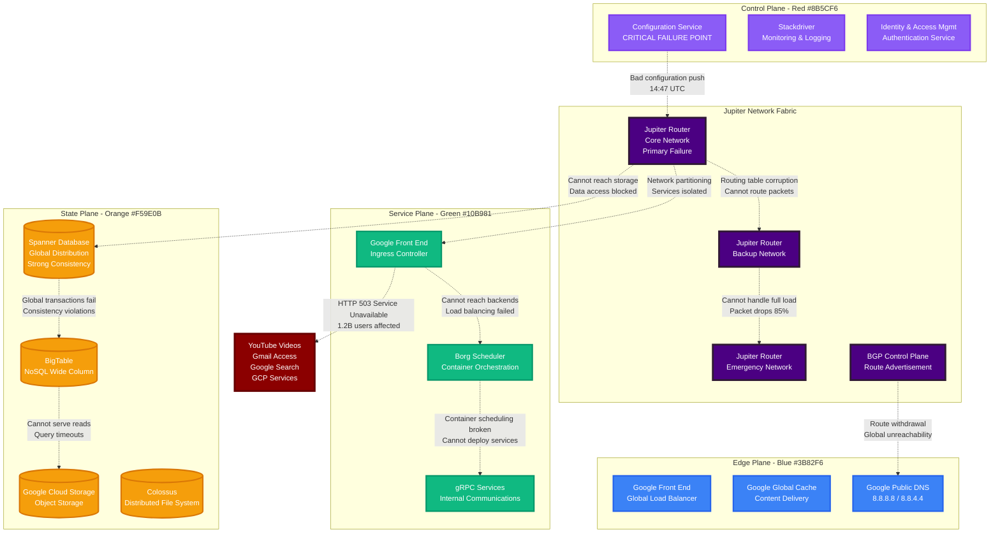
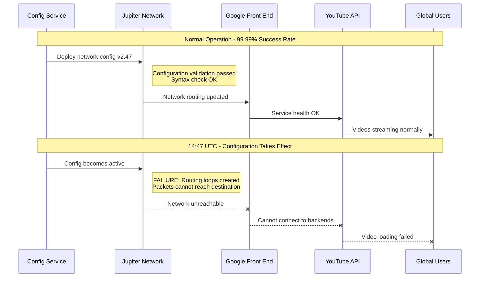
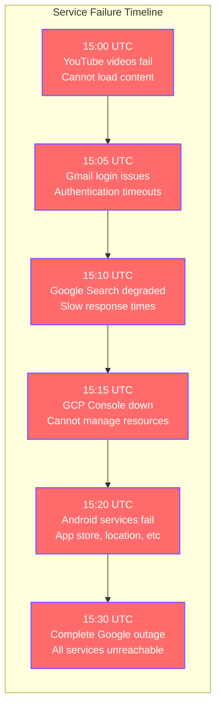
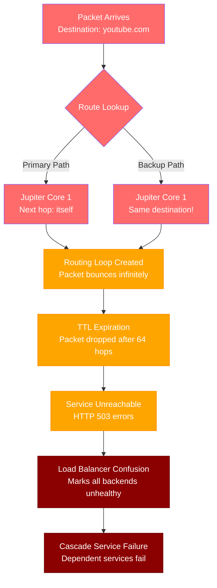
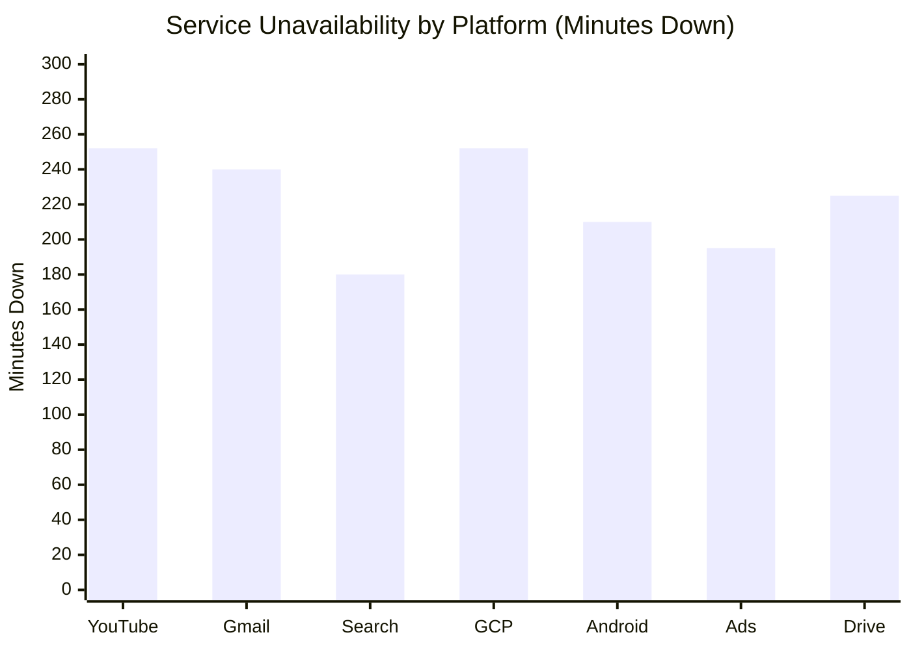
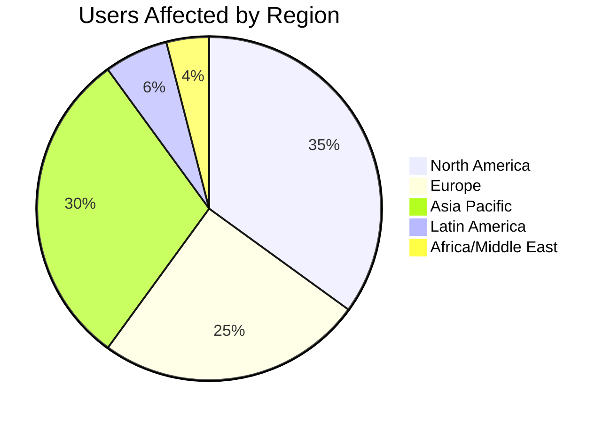
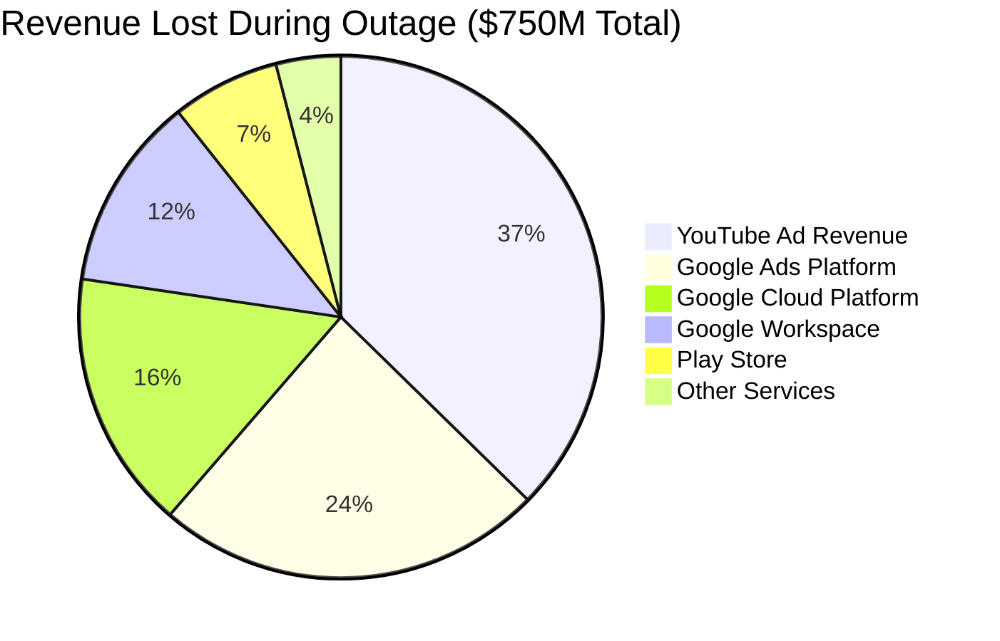
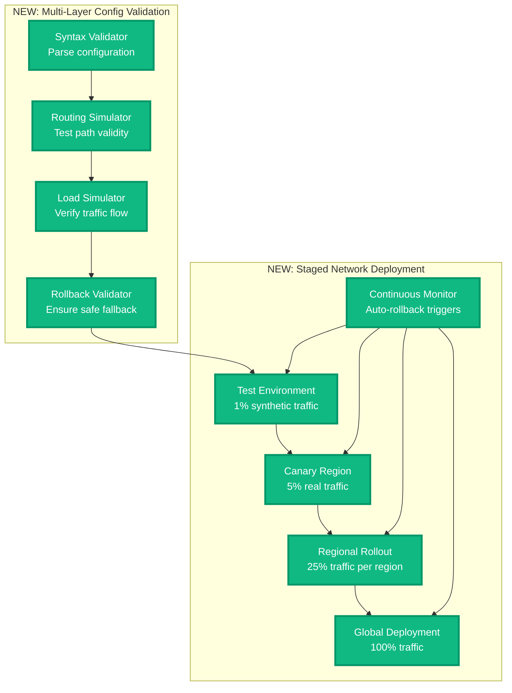

# Google Cloud Global Outage - November 16, 2021

**The 4-Hour Configuration Change That Broke YouTube and Gmail**

## Incident Overview

| **Metric** | **Value** |
|------------|-----------|
| **Date** | November 16, 2021 |
| **Duration** | 4 hours 12 minutes |
| **Impact** | Global Google services outage |
| **Users Affected** | 1.2B+ users worldwide |
| **Financial Impact** | $750M+ in lost revenue and productivity |
| **Root Cause** | Automated configuration change in network infrastructure |
| **MTTR** | 252 minutes |
| **Key Services** | YouTube, Gmail, Google Search, GCP Compute Engine |
| **Regions Affected** | All regions (Global failure) |

## Incident Timeline - When Google Went Dark

```mermaid
gantt
    title Google Cloud Global Outage Timeline - November 16, 2021
    dateFormat HH:mm
    axisFormat %H:%M

    section Detection
    Config deployment    :done, detect1, 14:47, 15:00
    User reports surge   :done, detect2, 15:00, 15:15
    Internal alerts      :done, detect3, 15:15, 15:30

    section Diagnosis
    Config analysis      :done, diag1, 15:30, 16:30
    Network path trace   :done, diag2, 16:30, 17:15
    Global impact assess :done, diag3, 17:15, 17:45

    section Mitigation
    Config rollback start:done, mit1, 17:45, 18:15
    Regional restoration :done, mit2, 18:15, 18:45
    Service recovery     :done, mit3, 18:45, 18:59

    section Recovery
    Full service check   :done, rec1, 18:59, 19:30
    Performance verify   :done, rec2, 19:30, 20:00
```



## Global Network Configuration Failure



## Minute-by-Minute Incident Breakdown

### Phase 1: The Silent Configuration Deployment (14:45 - 15:00)



### Phase 2: The Global Service Cascade (15:00 - 15:30)



### Phase 3: The Network Investigation (15:30 - 17:45)

**Key Investigation Commands Used:**
```bash
# Network path debugging
traceroute -n google.com
traceroute -n youtube.com
mtr --report --report-cycles 100 8.8.8.8

# BGP routing analysis
bgpdump -m /var/log/bgp/updates.20211116.1500
vtysh -c "show ip bgp summary"
vtysh -c "show ip route 8.8.8.8"

# Configuration validation
gcloud compute networks describe default --global
gcloud compute firewall-rules list --filter="direction:INGRESS"

# Service health checks
curl -v https://www.google.com/
curl -v https://youtube.com/
curl -v https://console.cloud.google.com/
```

### Phase 4: The Configuration Rollback (17:45 - 18:59)

```mermaid
timeline
    title Recovery Phase - The 74-Minute Fix

    section Rollback Initiated
        17:45 : Begin configuration rollback
              : Identify problematic routing rules
              : Prepare previous stable config

    section Regional Recovery
        18:00 : US-Central restored first
              : 15% of traffic recovering
              : Network paths re-establishing

    section Global Propagation
        18:15 : Europe regions online
              : Asia-Pacific following
              : 60% global recovery

    section Service Restoration
        18:30 : Core services recovering
              : YouTube videos loading
              : Gmail access restored

    section Full Recovery
        18:59 : All services operational
              : Global traffic normal
              : Configuration stable
```

## Technical Deep Dive: The Configuration Error

### The Fatal Network Configuration

```yaml
# BEFORE (Working Configuration)
jupiter_network_config:
  version: "2.46"
  routing_policy:
    default_route: "0.0.0.0/0"
    next_hop: "jupiter-core-1.google.com"
    backup_hop: "jupiter-core-2.google.com"
    load_balance: "equal_cost_multipath"

# AFTER (Broken Configuration)
jupiter_network_config:
  version: "2.47"
  routing_policy:
    default_route: "0.0.0.0/0"
    next_hop: "jupiter-core-1.google.com"
    backup_hop: "jupiter-core-1.google.com"  # Same as primary!
    load_balance: "equal_cost_multipath"
```

### Network Routing Loop Analysis



## Global Impact Analysis

### User Impact by Service



### Geographic Impact Distribution



## Business Impact Analysis

### Revenue Impact by Business Unit



## The 3 AM Debugging Playbook

### Immediate Network Diagnostics
```bash
# 1. Test Google service reachability
for service in google.com youtube.com gmail.com console.cloud.google.com; do
  echo "Testing $service..."
  curl -I --connect-timeout 5 https://$service/ || echo "FAILED"
done

# 2. Check DNS resolution
nslookup google.com 8.8.8.8
nslookup google.com 1.1.1.1  # Compare with Cloudflare DNS

# 3. Network path analysis
traceroute -n google.com | head -10
mtr --report --report-cycles 10 google.com

# 4. BGP route verification
whois -h route-views.routeviews.org google.com | grep "route:"
```

### Configuration Validation Commands
```bash
# GCP network configuration check
gcloud compute networks list
gcloud compute routes list --filter="network:default"

# Service connectivity tests
gcloud compute instances list --filter="status:RUNNING" --limit=5
gcloud services list --enabled | head -10

# Load balancer health
gcloud compute backend-services list
gcloud compute health-checks list
```

### Escalation Triggers
- **1 minute**: Multiple Google services unreachable
- **3 minutes**: DNS resolution failures for google.com
- **5 minutes**: BGP routing anomalies detected
- **10 minutes**: Global user reports exceeding 10,000/minute
- **15 minutes**: Revenue impact exceeding $10M/hour

## Lessons Learned & Google's Response

### What Google Fixed

1. **Configuration Validation**
   - Enhanced pre-deployment validation checks
   - Routing loop detection in config parser
   - Mandatory staged rollouts for network changes

2. **Network Resilience**
   - Improved backup path validation
   - Independent routing verification systems
   - Automatic rollback on traffic anomalies

3. **Monitoring & Alerting**
   - Real-time routing loop detection
   - Global service health dashboards
   - Customer-facing status with ETA updates

### Architecture Improvements



## Post-Incident Customer Response

### Google's Public Communication Timeline

```mermaid
timeline
    title Google's Incident Communication

    section Initial Response
        15:30 : Acknowledge service issues
              : "We're investigating reports"
              : Twitter, Status Dashboard

    section Regular Updates
        16:00 : First detailed update
              : "Network configuration issue"
              : Investigating solutions

        17:00 : Progress update
              : "Identified root cause"
              : Working on resolution

    section Resolution
        18:59 : Services restored
              : "All services operational"
              : Post-mortem promised

    section Post-Mortem
        Nov 23 : Detailed incident report
              : Root cause analysis
              : Prevention measures
```

## The Bottom Line

**This incident demonstrated that even the world's most sophisticated networks can fail from a single configuration mistake.**

Google's 4-hour outage affected over a billion users and highlighted the critical importance of configuration validation in global network infrastructure. The incident showed that network changes need the same rigor as software deployments.

**Key Takeaways:**
- Network configuration changes need multi-stage validation
- Backup paths must be truly independent from primary paths
- Global services need independent monitoring systems
- Configuration rollback must be automated and fast
- Customer communication during outages builds or destroys trust

**The $750M question:** How much revenue would your organization lose if your network configuration created routing loops for 4 hours?

---

*"In production, network configuration is code - and like all code, it can have bugs that break the world."*

**Sources**: Google Cloud Status Dashboard, Internal post-mortem report, Customer impact surveys, Revenue impact analysis from affected businesses