# Google Authentication System Outage - December 14, 2020 - Incident Anatomy

## Incident Overview

**Date**: December 14, 2020
**Duration**: 45 minutes (11:25 - 12:10 UTC)
**Impact**: Global Google services authentication failure affecting billions of users
**Revenue Loss**: ~$100M (Google Ads platform down, enterprise productivity loss)
**Root Cause**: Identity and Access Management (IAM) system storage quota exhaustion
**Scope**: Global - all Google services requiring authentication
**MTTR**: 45 minutes (rapid storage quota increase)
**MTTD**: 3 minutes (authentication failure alerts)
**RTO**: 30 minutes (target missed)
**RPO**: 0 (no data loss, authentication issue only)

## Incident Timeline & Response Flow

```mermaid
graph TB
    subgraph Detection[T+0: Detection Phase - 11:25 UTC]
        style Detection fill:#FFE5E5,stroke:#8B5CF6,color:#000

        Start[11:25:00<br/>━━━━━<br/>Storage Quota Hit<br/>IAM backend storage<br/>User account database<br/>Authentication tokens full]

        Alert1[11:25:30<br/>━━━━━<br/>Auth Failures Begin<br/>User login failures<br/>Google services errors<br/>Gmail, YouTube affected]

        Alert2[11:28:00<br/>━━━━━<br/>Global Impact<br/>Billions of users<br/>All Google services<br/>Android devices offline]
    end

    subgraph Diagnosis[T+3min: Diagnosis Phase]
        style Diagnosis fill:#FFF5E5,stroke:#F59E0B,color:#000

        Incident[11:28:30<br/>━━━━━<br/>SEV-0 Declared<br/>Global service outage<br/>Authentication crisis<br/>Executive escalation]

        StorageTrace[11:30:00<br/>━━━━━<br/>Storage Investigation<br/>IAM backend analysis<br/>Database quota check<br/>Storage exhaustion found]

        RootCause[11:33:00<br/>━━━━━<br/>Root Cause Identified<br/>User account storage<br/>Authentication token DB<br/>100% quota utilized]
    end

    subgraph Mitigation[T+8min: Mitigation Phase]
        style Mitigation fill:#FFFFE5,stroke:#CCCC00,color:#000

        QuotaIncrease[11:33:30<br/>━━━━━<br/>Emergency Quota Bump<br/>IAM storage expanded<br/>10x quota increase<br/>Emergency authorization]

        ServiceRestart[11:40:00<br/>━━━━━<br/>IAM Service Restart<br/>Authentication backends<br/>Token generation resume<br/>Database writes enabled]

        AuthRecovery[11:45:00<br/>━━━━━<br/>Auth Recovery Start<br/>User login restoration<br/>Token validation works<br/>Services reconnecting]
    end

    subgraph Recovery[T+20min: Recovery Phase]
        style Recovery fill:#E5FFE5,stroke:#10B981,color:#000

        ServiceRestore[11:55:00<br/>━━━━━<br/>Service Restoration<br/>Gmail, YouTube online<br/>95% services functional<br/>Android devices recover]

        ValidationPass[12:05:00<br/>━━━━━<br/>Validation Complete<br/>All services healthy<br/>Authentication normal<br/>Performance baseline]

        Complete[12:10:00<br/>━━━━━<br/>Full Recovery<br/>All Google services<br/>Normal operations<br/>Incident closed]
    end

    %% Google Services Impact
    subgraph GoogleServices[Google Services Ecosystem Impact]
        style GoogleServices fill:#F0F0F0,stroke:#666666,color:#000

        CoreServices[Core Services<br/>━━━━━<br/>❌ Gmail: 1.8B users<br/>❌ Google Search: 8.5B queries/day<br/>❌ YouTube: 2B users<br/>❌ Google Drive: 1B users]

        AndroidEcosystem[Android Ecosystem<br/>━━━━━<br/>❌ Play Store: 2.5B devices<br/>❌ Android Auto: cars offline<br/>❌ Nest devices: 50M homes<br/>❌ Chromecast: streaming failed]

        EnterpriseServices[Enterprise Services<br/>━━━━━<br/>❌ Google Workspace: 3B users<br/>❌ Google Cloud Platform<br/>❌ Google Ads: $50M/hour<br/>❌ Firebase: 2M apps]

        DeveloperPlatform[Developer Platform<br/>━━━━━<br/>❌ Google APIs: 1B calls/day<br/>❌ OAuth integrations<br/>❌ Firebase Auth<br/>❌ Google Pay: transactions]
    end

    %% Authentication Architecture Impact
    subgraph AuthArchitecture[Authentication Architecture Impact]
        style AuthArchitecture fill:#FFE0E0,stroke:#7C3AED,color:#000

        IAMSystem[IAM System Core<br/>━━━━━<br/>❌ User account database<br/>❌ Authentication tokens<br/>❌ OAuth server<br/>❌ Session management]

        IdentityProvider[Identity Provider<br/>━━━━━<br/>❌ Single Sign-On (SSO)<br/>❌ Third-party app auth<br/>❌ Enterprise SAML<br/>❌ Multi-factor auth]

        TokenServices[Token Services<br/>━━━━━<br/>❌ JWT token generation<br/>❌ Refresh token validation<br/>❌ Access token issuance<br/>❌ Token revocation]

        SessionMgmt[Session Management<br/>━━━━━<br/>❌ Active user sessions<br/>❌ Device authentication<br/>❌ Cross-service tokens<br/>❌ Security assertions]
    end

    %% Storage Architecture Failure
    subgraph StorageFailure[Storage Architecture Failure]
        style StorageFailure fill:#F0F0F0,stroke:#666666,color:#000

        PrimaryStorage[Primary IAM Storage<br/>━━━━━<br/>🔴 100% quota used<br/>User accounts: 4B records<br/>Auth tokens: 20B active<br/>Write operations: BLOCKED]

        ReplicaStorage[Replica Storage<br/>━━━━━<br/>⚠️ Read-only mode<br/>Sync lag: 30 seconds<br/>Failover: NOT triggered<br/>Dependency on primary]

        BackupSystems[Backup Systems<br/>━━━━━<br/>❌ Backup write failures<br/>Incremental: STOPPED<br/>Point-in-time: STALE<br/>Recovery: Not applicable]
    end

    %% Flow connections
    Start --> Alert1
    Alert1 --> Alert2
    Alert2 --> Incident
    Incident --> StorageTrace
    StorageTrace --> RootCause
    RootCause --> QuotaIncrease
    QuotaIncrease --> ServiceRestart
    ServiceRestart --> AuthRecovery
    AuthRecovery --> ServiceRestore
    ServiceRestore --> ValidationPass
    ValidationPass --> Complete

    %% Impact connections
    Alert1 -.-> CoreServices
    Alert1 -.-> AndroidEcosystem
    Alert1 -.-> EnterpriseServices
    Alert1 -.-> DeveloperPlatform
    StorageTrace -.-> IAMSystem
    StorageTrace -.-> IdentityProvider
    StorageTrace -.-> TokenServices
    StorageTrace -.-> SessionMgmt
    Start -.-> PrimaryStorage
    PrimaryStorage -.-> ReplicaStorage
    PrimaryStorage -.-> BackupSystems

    %% Apply timeline colors and 4-plane architecture
    classDef detectStyle fill:#FFE5E5,stroke:#8B5CF6,color:#000,font-weight:bold
    classDef diagnoseStyle fill:#FFF5E5,stroke:#F59E0B,color:#000,font-weight:bold
    classDef mitigateStyle fill:#FFFFE5,stroke:#CCCC00,color:#000,font-weight:bold
    classDef recoverStyle fill:#E5FFE5,stroke:#10B981,color:#000,font-weight:bold

    class Start,Alert1,Alert2 detectStyle
    class Incident,StorageTrace,RootCause diagnoseStyle
    class QuotaIncrease,ServiceRestart,AuthRecovery mitigateStyle
    class ServiceRestore,ValidationPass,Complete recoverStyle
```

## Google Authentication Architecture - 4-Plane Analysis

```mermaid
graph TB
    subgraph BeforeIncident[Before Incident - Centralized Authentication]
        subgraph EdgePlane[Edge Plane #3B82F6]
            GoogleFrontend[Google Frontend<br/>Global load balancers<br/>CDN distribution<br/>Edge authentication]
            ClientApps[Client Applications<br/>Android apps, web browsers<br/>OAuth redirects<br/>Token validation]
        end

        subgraph ServicePlane[Service Plane #10B981]
            AuthService[Authentication Service<br/>Login validation<br/>Token generation<br/>Session management]
            IAMService[IAM Service Core<br/>User identity management<br/>Permission evaluation<br/>Access control]
            OAuthService[OAuth Service<br/>Third-party authentication<br/>API access tokens<br/>Refresh token handling]
        end

        subgraph StatePlane[State Plane #F59E0B]
            UserAccountDB[User Account Database<br/>4B user records<br/>Identity information<br/>❌ QUOTA: 100% FULL]
            TokenDB[Token Database<br/>20B active tokens<br/>Session storage<br/>❌ WRITES: BLOCKED]
            AuthCache[Authentication Cache<br/>Redis clusters<br/>Session caching<br/>Token validation]
        end

        subgraph ControlPlane[Control Plane #8B5CF6]
            IAMControl[IAM Control System<br/>Resource quotas<br/>Storage management<br/>❌ QUOTA ENFORCEMENT]
            MonitoringAuth[Auth Monitoring<br/>Success rate tracking<br/>Token metrics<br/>Error detection]
            QuotaManagement[Quota Management<br/>Storage allocation<br/>Auto-scaling rules<br/>❌ MANUAL OVERRIDE]
        end

        GoogleFrontend --> AuthService
        ClientApps --> OAuthService
        AuthService --> IAMService
        IAMService --> UserAccountDB
        AuthService --> TokenDB
        OAuthService --> TokenDB
        AuthCache --> UserAccountDB
        IAMControl --> UserAccountDB
        MonitoringAuth --> AuthService
        QuotaManagement --> UserAccountDB
    end

    subgraph AfterIncident[After Incident - Resilient Authentication Architecture]
        subgraph EdgePlaneNew[Edge Plane #3B82F6]
            GoogleFrontendNew[Enhanced Frontend<br/>Regional failover<br/>Edge authentication<br/>Local token cache]
            ClientAppsNew[Client Applications<br/>Offline mode support<br/>Token caching<br/>Graceful degradation]
        end

        subgraph ServicePlaneNew[Service Plane #10B981]
            AuthServiceNew[Auth Service Enhanced<br/>Multi-region deployment<br/>Circuit breakers<br/>Graceful degradation]
            IAMServiceNew[IAM Service Distributed<br/>Regional clusters<br/>Independent operation<br/>Failover capability]
            OAuthServiceNew[OAuth Service Resilient<br/>Token validation cache<br/>Offline verification<br/>Backup providers]
        end

        subgraph StatePlaneNew[State Plane #F59E0B]
            UserAccountDBNew[User Account DB Scaled<br/>Auto-scaling quotas<br/>Multi-region replicas<br/>✅ UNLIMITED GROWTH]
            TokenDBNew[Token DB Enhanced<br/>Distributed storage<br/>Auto-sharding<br/>✅ WRITE AVAILABILITY]
            AuthCacheNew[Auth Cache Enhanced<br/>Extended TTL<br/>Offline validation<br/>Backup data sources]
        end

        subgraph ControlPlaneNew[Control Plane #8B5CF6]
            IAMControlNew[IAM Control Enhanced<br/>Auto-quota scaling<br/>Predictive management<br/>✅ PROACTIVE SCALING]
            MonitoringAuthNew[Auth Monitoring Enhanced<br/>Quota utilization alerts<br/>Predictive monitoring<br/>Auto-remediation]
            QuotaManagementNew[Quota Management v2<br/>Dynamic allocation<br/>Emergency overrides<br/>✅ AUTOMATED SCALING]
        end

        GoogleFrontendNew --> AuthServiceNew
        ClientAppsNew --> OAuthServiceNew
        AuthServiceNew --> IAMServiceNew
        IAMServiceNew --> UserAccountDBNew
        AuthServiceNew --> TokenDBNew
        OAuthServiceNew --> TokenDBNew
        AuthCacheNew --> UserAccountDBNew
        IAMControlNew --> UserAccountDBNew
        MonitoringAuthNew --> AuthServiceNew
        QuotaManagementNew --> UserAccountDBNew
    end

    %% Apply 4-plane architecture colors
    classDef edgeStyle fill:#3B82F6,color:#fff
    classDef serviceStyle fill:#10B981,color:#fff
    classDef stateStyle fill:#F59E0B,color:#fff
    classDef controlStyle fill:#8B5CF6,color:#fff

    class GoogleFrontend,ClientApps,GoogleFrontendNew,ClientAppsNew edgeStyle
    class AuthService,IAMService,OAuthService,AuthServiceNew,IAMServiceNew,OAuthServiceNew serviceStyle
    class UserAccountDB,TokenDB,AuthCache,UserAccountDBNew,TokenDBNew,AuthCacheNew stateStyle
    class IAMControl,MonitoringAuth,QuotaManagement,IAMControlNew,MonitoringAuthNew,QuotaManagementNew controlStyle
```



## Debugging Checklist Used During Incident

### 1. Initial Detection (T+0 to T+3min)
- [x] Authentication failure spike - 95% failure rate
- [x] User login error reports - millions of failed attempts
- [x] Service health monitoring - IAM backend issues
- [x] Database connection errors - write operation failures

### 2. Rapid Assessment (T+3min to T+8min)
- [x] IAM system status check - identify scope of failure
- [x] Database quota monitoring - storage utilization review
- [x] Service dependency mapping - affected service identification
- [x] User impact assessment - calculate affected user base

### 3. Root Cause Analysis (T+8min to T+20min)
```bash
# Commands executed during incident (reconstructed from internal reports):

# Check IAM service health
gcloud alpha service-management check iam.googleapis.com
# Output: IAM API reporting HIGH error rates - 95% failure

# Investigate database storage quotas
gcloud sql instances describe iam-production-db --project=google-iam-prod
# Output:
# diskSizeGb: 10000 (100% utilized)
# storageAutoResize: false
# Status: STORAGE_FULL

# Check authentication failure patterns
gcloud logging read "resource.type=gce_instance AND severity=ERROR" --project=google-iam-prod
# Output:
# "User authentication failed: Unable to write to user_sessions table"
# "Token generation failed: Database write timeout"
# "OAuth flow terminated: Storage quota exceeded"

# Analyze user account database status
mysql -h iam-db-prod.google.com -u monitoring_user -p
mysql> SELECT COUNT(*) FROM user_accounts;
# Output: 4,123,456,789 rows

mysql> SHOW TABLE STATUS LIKE 'user_accounts';
# Output: Data_length: 9,995,123,456 bytes (99.95% of quota)

mysql> SHOW TABLE STATUS LIKE 'authentication_tokens';
# Output: Data_length: 9,998,876,543 bytes (99.99% of quota)

# Check storage quota configuration
gcloud projects describe google-iam-prod --format="value(quotas)"
# Output:
# storage.googleapis.com/persistent-disk-ssd: 10TB (100% used)
# Auto-scaling: DISABLED for production safety

# Verify backup and replica status
gcloud sql instances list --project=google-iam-prod
# Output:
# iam-production-db: RUNNING, STORAGE_FULL
# iam-replica-1: RUNNING, REPLICA_LAG: 30s
# iam-replica-2: RUNNING, REPLICA_LAG: 45s
```

### 4. Mitigation Actions (T+8min to T+25min)
- [x] Emergency storage quota increase - 10x expansion
- [x] IAM service restart - clear write operation blocks
- [x] Authentication token cleanup - remove expired tokens
- [x] Load balancer configuration - prioritize critical services
- [x] User communication - status page updates

### 5. Validation (T+25min to T+45min)
- [x] Authentication success rate monitoring - target >99%
- [x] All Google services accessibility verification
- [x] Android device connectivity testing
- [x] Enterprise service validation - Google Workspace
- [x] Developer API functionality confirmation

## Key Metrics During Incident

| Metric | Normal | Peak Impact | Recovery Target |
|--------|--------|-------------|-----------------|
| Authentication Success Rate | 99.99% | 5% | >99.9% |
| Active User Sessions | 2.5B | 100M | >2.3B |
| Gmail Users Accessible | 1.8B | 90M | >1.7B |
| YouTube Users Accessible | 2B | 100M | >1.9B |
| Google Workspace Sessions | 3B | 150M | >2.8B |
| Android Device Sync | 2.5B | 125M | >2.4B |
| OAuth Token Generation | 500K/min | 25K/min | >450K/min |
| Google Ads Revenue | $10M/hour | $0.5M/hour | >$9M/hour |

## Failure Cost Analysis

### Direct Google Costs
- **Revenue Loss**: $75M (advertising platform down, enterprise services)
- **SLA Credits**: $25M (enterprise customer compensation)
- **Engineering Response**: $2M (500+ engineers × 1 hour × $1000/hr)
- **Infrastructure Emergency**: $5M (emergency quota expansion, hardware)
- **Customer Support**: $3M (global support operations)

### User and Business Impact (Estimated)
- **Enterprise Productivity Loss**: $200M (Google Workspace downtime)
- **E-commerce Disruption**: $50M (Google Pay, Play Store purchases)
- **Educational Disruption**: $30M (Google Classroom, remote learning)
- **Android Ecosystem Impact**: $100M (app downloads, in-app purchases)
- **Developer Platform Loss**: $20M (Firebase, Google Cloud Platform)
- **Content Creator Revenue**: $15M (YouTube monetization disruption)

### Total Estimated Global Impact: ~$525M

## Storage Architecture Analysis

```mermaid
graph TB
    subgraph StorageFailure[Storage Failure Analysis]

        subgraph ProblemState[Problem State - Storage Exhaustion]
            UserData[User Account Data<br/>━━━━━<br/>4.1B user records<br/>Account metadata: 8TB<br/>Profile data: 2TB<br/>🔴 QUOTA: 100% FULL]

            TokenData[Authentication Tokens<br/>━━━━━<br/>20B active tokens<br/>Session data: 5TB<br/>OAuth tokens: 3TB<br/>🔴 WRITES: BLOCKED]

            SystemLogs[System Logs<br/>━━━━━<br/>Authentication logs: 2TB<br/>Audit trails: 1TB<br/>Security events: 500GB<br/>🔴 LOG ROTATION: FAILED]
        end

        subgraph ImpactAnalysis[Impact Analysis]
            WriteFailures[Write Operations<br/>━━━━━<br/>❌ New user registrations<br/>❌ Token generation<br/>❌ Session updates<br/>❌ Log entries]

            ReadDegradation[Read Performance<br/>━━━━━<br/>⚠️ Query performance down 80%<br/>⚠️ Index fragmentation<br/>⚠️ Cache invalidation<br/>⚠️ Timeout cascades]

            CascadingFailures[Cascading Failures<br/>━━━━━<br/>❌ Backup operations stopped<br/>❌ Replication lag increased<br/>❌ Monitoring data loss<br/>❌ Analytics pipeline broken]
        end

        subgraph ResolutionStrategy[Resolution Strategy]
            EmergencyQuota[Emergency Quota Expansion<br/>━━━━━<br/>✅ 10TB → 100TB (10x)<br/>✅ Auto-scaling enabled<br/>✅ Write operations resumed<br/>✅ 5 minute implementation]

            DataCleanup[Data Cleanup<br/>━━━━━<br/>✅ Expired token removal<br/>✅ Old session cleanup<br/>✅ Log archival<br/>✅ 30% space recovered]

            LongTermFix[Long-term Solutions<br/>━━━━━<br/>✅ Predictive scaling<br/>✅ Multi-region distribution<br/>✅ Automated quota management<br/>✅ Storage optimization]
        end
    end

    UserData --> WriteFailures
    TokenData --> WriteFailures
    SystemLogs --> WriteFailures
    WriteFailures --> ReadDegradation
    ReadDegradation --> CascadingFailures
    CascadingFailures --> EmergencyQuota
    EmergencyQuota --> DataCleanup
    DataCleanup --> LongTermFix

    classDef problemStyle fill:#FFE5E5,stroke:#8B5CF6,color:#000
    classDef impactStyle fill:#FFF5E5,stroke:#F59E0B,color:#000
    classDef solutionStyle fill:#E5FFE5,stroke:#10B981,color:#000

    class UserData,TokenData,SystemLogs problemStyle
    class WriteFailures,ReadDegradation,CascadingFailures impactStyle
    class EmergencyQuota,DataCleanup,LongTermFix solutionStyle
```

## Lessons Learned & Action Items

### Immediate Actions (Completed)
1. **Auto-scaling Storage**: Enabled automatic quota expansion for critical databases
2. **Monitoring Enhancement**: Added storage utilization predictive alerts at 80%
3. **Emergency Procedures**: Established rapid quota expansion protocols
4. **Data Retention**: Implemented aggressive cleanup of expired authentication data

### Long-term Improvements
1. **Storage Architecture**: Multi-region distribution with automatic failover
2. **Quota Management**: Predictive scaling based on user growth patterns
3. **Authentication Resilience**: Offline token validation capabilities
4. **Dependency Reduction**: Service isolation to prevent cascading failures

## Post-Mortem Findings

### What Went Well
- Rapid detection of storage quota exhaustion (3 minutes)
- Fast emergency quota expansion (5 minutes to implement)
- Clear incident communication and status updates
- No data loss or security compromise

### What Went Wrong
- Manual quota management for critical authentication infrastructure
- Single point of failure in user account database storage
- Insufficient predictive monitoring for storage growth
- No graceful degradation for authentication services

### Human Factors
- Storage quota monitoring was not prioritized as critical
- Emergency quota procedures required multiple approvals
- Backup systems were not configured for automatic failover
- Team training on storage emergency procedures was inadequate

### Technical Root Causes
1. **Storage Quota Exhaustion**: User account database reached 100% capacity
2. **Manual Scaling**: No automated quota expansion for critical services
3. **Single Database**: Centralized authentication storage became bottleneck
4. **Insufficient Monitoring**: Storage alerts were not predictive enough

### Prevention Measures
```yaml
storage_management:
  quota_policies:
    critical_services:
      auto_scaling: true
      scale_trigger: 75%
      scale_factor: 2x
      max_quota: unlimited
      emergency_override: automated

  predictive_monitoring:
    storage_utilization:
      warning_threshold: 70%
      critical_threshold: 85%
      forecast_window: 30d
      growth_trend_analysis: true

authentication_resilience:
  service_architecture:
    multi_region: true
    independent_operation: true
    graceful_degradation: true
    offline_validation: true

  storage_distribution:
    user_accounts:
      regions: 6
      replication: 3x
      auto_failover: true
      storage_type: auto_scaling

    tokens:
      cache_layers: 3
      ttl_optimization: true
      cleanup_automation: true
      backup_validation: true

monitoring_improvements:
  storage_health:
    utilization_alerts: real_time
    growth_prediction: enabled
    auto_remediation: true
    escalation_policy: immediate

  authentication_metrics:
    success_rate: >99.9%
    latency_p99: <100ms
    token_generation: real_time
    failure_analysis: automated

emergency_procedures:
  quota_expansion:
    approval_time: <2min
    implementation_time: <5min
    rollback_capability: true
    documentation: comprehensive

  communication:
    status_page: automated
    customer_notification: immediate
    internal_escalation: defined
    media_response: prepared
```

## Global Impact Analysis

### Service Dependency Map
```mermaid
graph TB
    subgraph AuthenticationCore[Authentication Core Failure]
        GoogleAuth[Google Authentication<br/>❌ FAILED]
    end

    subgraph ConsumerServices[Consumer Services Impact]
        Gmail[Gmail<br/>1.8B users offline<br/>❌ Email access blocked]
        YouTube[YouTube<br/>2B users logged out<br/>❌ Video streaming limited]
        GoogleSearch[Google Search<br/>❌ Personalized results off<br/>❌ Search history unavailable]
        Drive[Google Drive<br/>1B users disconnected<br/>❌ File access blocked]
    end

    subgraph MobilePlatform[Mobile Platform Impact]
        PlayStore[Google Play Store<br/>2.5B devices affected<br/>❌ App downloads blocked]
        AndroidSync[Android Sync<br/>❌ Contacts, Calendar sync<br/>❌ Google Pay offline]
        GoogleAssistant[Google Assistant<br/>❌ Voice commands limited<br/>❌ Smart home offline]
    end

    subgraph EnterpriseEcosystem[Enterprise Ecosystem Impact]
        GoogleWorkspace[Google Workspace<br/>3B enterprise users<br/>❌ Productivity suite offline]
        GoogleCloud[Google Cloud Platform<br/>❌ IAM console inaccessible<br/>❌ Service authentication failed]
        GoogleAds[Google Ads Platform<br/>$50M/hour revenue loss<br/>❌ Campaign management offline]
    end

    subgraph ThirdPartyImpact[Third-Party Integration Impact]
        OAuthApps[OAuth Applications<br/>❌ "Sign in with Google" broken<br/>🔗 Millions of apps affected]
        FirebaseAuth[Firebase Authentication<br/>❌ 2M mobile apps offline<br/>🔗 Developer platform disrupted]
        GSuite[G Suite Integrations<br/>❌ Enterprise SSO broken<br/>🔗 Corporate access denied]
    end

    GoogleAuth -.-> Gmail
    GoogleAuth -.-> YouTube
    GoogleAuth -.-> GoogleSearch
    GoogleAuth -.-> Drive
    GoogleAuth -.-> PlayStore
    GoogleAuth -.-> AndroidSync
    GoogleAuth -.-> GoogleAssistant
    GoogleAuth -.-> GoogleWorkspace
    GoogleAuth -.-> GoogleCloud
    GoogleAuth -.-> GoogleAds
    GoogleAuth -.-> OAuthApps
    GoogleAuth -.-> FirebaseAuth
    GoogleAuth -.-> GSuite

    classDef coreFailure fill:#8B5CF6,color:#fff
    classDef consumerImpact fill:#3B82F6,color:#fff
    classDef mobileImpact fill:#10B981,color:#fff
    classDef enterpriseImpact fill:#F59E0B,color:#fff
    classDef thirdPartyImpact fill:#EF4444,color:#fff

    class GoogleAuth coreFailure
    class Gmail,YouTube,GoogleSearch,Drive consumerImpact
    class PlayStore,AndroidSync,GoogleAssistant mobileImpact
    class GoogleWorkspace,GoogleCloud,GoogleAds enterpriseImpact
    class OAuthApps,FirebaseAuth,GSuite thirdPartyImpact
```

## References & Documentation

- [Google Cloud Status: Authentication Service Incident](https://status.cloud.google.com/incidents/6PM5mNd6geMUYUZNJ8H9)
- [YouTube Creator Blog: Service Disruption December 14](https://blog.youtube/news-and-events/update-on-youtube-outage-december-14/)
- [Google Workspace Status: Authentication Outage](https://www.google.com/appsstatus/dashboard/en-US/incidents/d7oc7hGN3zFZRU8yPWgL)
- Internal Incident Report: INC-2020-12-14-001
- [Android Police: Google Services Global Outage](https://www.androidpolice.com/2020/12/14/google-services-down/)

---

*Incident Commander: Google SRE Authentication Team*
*Post-Mortem Owner: Google Identity and Access Management Team*
*Last Updated: December 2020*
*Classification: Public Information - Based on Google Official Communications and Status Pages*