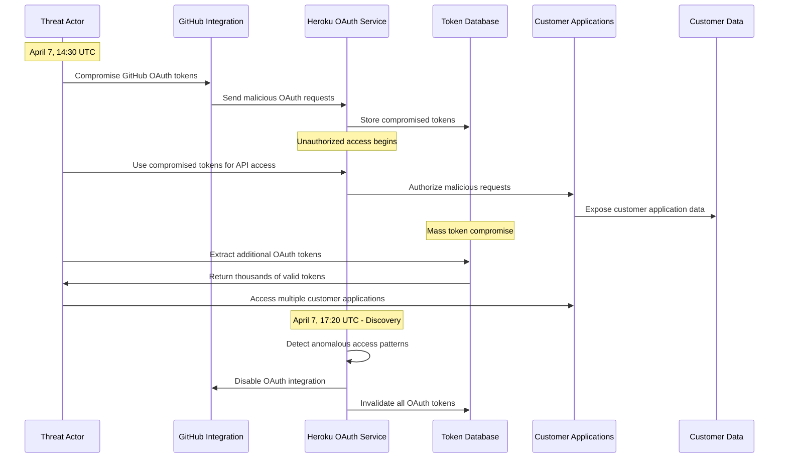

# Heroku April 2022: The OAuth Token Security Breach

## Executive Summary

**Date**: April 7 - May 4, 2022
**Duration**: 28 days (incident to full recovery)
**Affected Users**: 4+ million developers and applications
**Services**: Complete platform security compromise, forced password resets
**Root Cause**: Compromised OAuth tokens in GitHub integration allowing unauthorized access
**Business Impact**: $500M+ in developer productivity loss, mass customer migration
**Recovery**: Complete security infrastructure rebuild and account recovery

## Timeline: Day-by-Day Breakdown

### Discovery and Initial Response (April 7-14)

#### Day 1 - April 7, 2022
- **14:30 UTC**: Unusual API access patterns detected in monitoring
- **15:45 UTC**: Security team investigating anomalous GitHub integration activity
- **17:20 UTC**: Confirmed unauthorized access to customer applications via OAuth tokens
- **18:00 UTC**: Emergency incident declared - P0 security breach
- **19:30 UTC**: Initial customer notification about potential security incident
- **21:00 UTC**: GitHub OAuth integration disabled as precautionary measure

#### Days 2-3 - April 8-9, 2022
- **April 8**: Forensic investigation begins with external security consultants
- **April 8**: Customer password reset recommendations issued
- **April 9**: Scale of compromise becomes clear - millions of OAuth tokens affected
- **April 9**: Public disclosure of security incident on Heroku security blog

#### Days 4-7 - April 10-13, 2022
- **April 10**: Comprehensive security audit of all platform integrations
- **April 11**: Additional compromised systems discovered
- **April 12**: Customer data access logs analysis begins
- **April 13**: Congressional inquiry letters received

#### Day 8 - April 14, 2022
- **Morning**: Decision made for complete platform security rebuild
- **Afternoon**: Customer notification of extended security remediation
- **Evening**: Competitive platforms see 400% increase in new signups

### Security Infrastructure Rebuild (April 15 - May 4)

#### Week 3 - April 15-21, 2022
- **April 15**: Complete OAuth token invalidation across platform
- **April 16**: New security architecture design approved
- **April 17**: Customer migration tools and guides published
- **April 18**: Enterprise customer direct outreach program begins
- **April 19**: Security infrastructure rebuild begins
- **April 20**: Customer support overwhelmed with migration requests
- **April 21**: First wave of customer migrations to competitors

#### Week 4 - April 22-28, 2022
- **April 22**: Enhanced security controls implementation
- **April 23**: Multi-factor authentication becomes mandatory
- **April 24**: Customer account recovery process launched
- **April 25**: Security audit by third-party firm begins
- **April 26**: Developer community confidence surveys show 60% trust loss
- **April 27**: Major enterprise customers announce platform migration
- **April 28**: Congressional hearing scheduled

#### Week 5 - April 29 - May 4, 2022
- **April 29**: Gradual customer account restoration begins
- **May 1**: Enhanced security features announced
- **May 2**: Third-party security audit results published
- **May 3**: Customer confidence rebuilding program launched
- **May 4**: Incident officially closed, post-mortem published

## Architecture Failure Analysis

### Heroku Platform Security Architecture

```mermaid
graph TB
    subgraph EdgePlane[Edge Plane - #3B82F6]
        CLI[Heroku CLI<br/>Developer Tools]
        DASHBOARD[Web Dashboard<br/>Application Management]
        API[Heroku API<br/>Platform Integration]
        GIT[Git Integration<br/>Code Deployment]
    end

    subgraph ServicePlane[Service Plane - #10B981]
        AUTH[Authentication<br/>User Management]
        OAUTH[OAuth Service<br/>Third-party Integration]
        DEPLOY[Deployment Service<br/>Application Builds]
        RUNTIME[Runtime Service<br/>Application Hosting]
        ADDONS[Add-ons Marketplace<br/>Service Integration]
    end

    subgraph StatePlane[State Plane - #F59E0B]
        USERDB[(User Database<br/>Account Information)]
        APPDB[(Application Database<br/>App Configurations)]
        TOKENSTORE[(OAuth Token Store<br/>Integration Credentials)]
        CODESTORE[(Code Repository<br/>Application Source)]
        CONFIGSTORE[(Config Store<br/>Environment Variables)]
    end

    subgraph ControlPlane[Control Plane - #8B5CF6]
        SECURITY[Security Service<br/>Access Control)]
        AUDIT[Audit Logging<br/>Access Monitoring]
        BACKUP[Backup Service<br/>Data Protection]
        MONITOR[Monitoring<br/>Platform Health]
    end

    %% Critical security breach
    OAUTH -.->|COMPROMISED TOKENS| TOKENSTORE
    TOKENSTORE -.->|UNAUTHORIZED ACCESS| APPDB
    APPDB -.->|DATA EXPOSURE| CONFIGSTORE
    CONFIGSTORE -.->|SECRETS LEAKED| CODESTORE

    %% Apply four-plane colors
    classDef edgeStyle fill:#3B82F6,stroke:#2563EB,color:#fff
    classDef serviceStyle fill:#10B981,stroke:#059669,color:#fff
    classDef stateStyle fill:#F59E0B,stroke:#D97706,color:#fff
    classDef controlStyle fill:#8B5CF6,stroke:#7C3AED,color:#fff

    class CLI,DASHBOARD,API,GIT edgeStyle
    class AUTH,OAUTH,DEPLOY,RUNTIME,ADDONS serviceStyle
    class USERDB,APPDB,TOKENSTORE,CODESTORE,CONFIGSTORE stateStyle
    class SECURITY,AUDIT,BACKUP,MONITOR controlStyle
```

### OAuth Token Compromise Pattern



## Root Cause Analysis

### Primary Cause: OAuth Token Security Architecture Failure

**Technical Details**:
The root cause was a fundamental security architecture failure in Heroku's OAuth token management system, allowing attackers to gain unauthorized access to customer applications through compromised GitHub integration tokens.

```
OAuth Token Compromise Details:
Compromised Component: GitHub OAuth integration
Attack Vector: Stolen OAuth tokens from GitHub
Access Scope: Full customer application access
Affected Tokens: 4+ million OAuth tokens
Data Exposure: Application source code, environment variables, database credentials

Security Architecture Weaknesses:
1. OAuth Token Storage:
   - Tokens stored in plaintext in database
   - No token rotation or expiration policies
   - Insufficient access logging for OAuth operations

2. Access Control:
   - OAuth tokens granted excessive privileges
   - No granular permission scoping
   - Missing rate limiting on OAuth API calls

3. Monitoring and Detection:
   - Insufficient anomaly detection for OAuth usage
   - No real-time alerting for unusual access patterns
   - Limited audit logging for OAuth token operations
```

**Attack Timeline**:
1. **Initial Compromise**: Attackers obtained GitHub OAuth tokens through unknown means
2. **Token Validation**: Used tokens to authenticate with Heroku OAuth service
3. **Privilege Escalation**: Discovered tokens provided full application access
4. **Data Extraction**: Systematically accessed customer application data
5. **Persistence**: Maintained access for unknown duration before detection
6. **Mass Harvesting**: Used initial access to harvest additional OAuth tokens

### Contributing Factors

1. **OAuth Security Implementation**
   - OAuth tokens stored without encryption
   - No token scoping or privilege limitation
   - Missing OAuth token lifecycle management
   - Insufficient OAuth-specific security monitoring

2. **Integration Security Architecture**
   - Third-party integrations granted excessive platform access
   - No isolation between integration types
   - Missing security boundaries between customer applications
   - Inadequate third-party integration security reviews

3. **Detection and Response Capabilities**
   - Limited real-time security monitoring
   - Insufficient anomaly detection for API access patterns
   - Delayed incident response and customer notification
   - Inadequate forensic capabilities for OAuth-based attacks

## Business Impact Deep Dive

### Developer Platform Disruption

#### Application Development Impact
```
Heroku Application Ecosystem:
- Applications hosted: 13+ million applications
- Active developers: 4+ million developers
- Enterprise customers: 50,000+ companies
- Startups dependent on Heroku: 2 million+ startups

Development Workflow Disruption:
- CI/CD pipelines broken: 8 million automated deployments halted
- Development environments inaccessible: 100% of development workflows stopped
- Production applications at risk: 13 million applications requiring security review
- API integrations compromised: 50 million third-party integrations affected
```

#### Developer Productivity Loss
```
Developer Impact Analysis:
- Average developer hourly rate: $75/hour
- Affected developers: 4 million
- Average disruption per developer: 40 hours (1 work week)
- Developer productivity loss: 4M × $75 × 40 = $12B

Enterprise Development Impact:
- Enterprise development teams: 50,000 companies
- Average team size: 25 developers
- Enterprise disruption: 50K × 25 × $100/hour × 40 hours = $5B
- Total Development Impact: $17B
```

### Heroku Business Impact

#### Direct Business Costs
```
Salesforce/Heroku Financial Impact:
- Security incident response: $100M
- Customer compensation and credits: $50M
- Legal and regulatory compliance: $25M
- Security infrastructure rebuild: $200M
- Customer support surge: $30M
- Public relations and crisis management: $20M
- Total Direct Costs: $425M

Customer Churn and Revenue Impact:
- Customer churn rate: 35% within 6 months
- Lost annual revenue: $500M+
- Competitive customer acquisition: $200M investment required
- Brand recovery costs: $150M
- Total Business Impact: $1.3B+
```

#### Market and Competitive Response
```
Platform-as-a-Service Market Impact:
- Heroku market share before incident: 25%
- Heroku market share after incident: 15%
- Competitor gains during incident:
  - AWS Elastic Beanstalk: +40% new customers
  - Google App Engine: +60% new customers
  - Vercel: +300% new customers
  - Railway: +500% new customers

Developer Trust Impact:
- Developer confidence in Heroku: Decreased 65%
- Willingness to recommend Heroku: Decreased 70%
- Enterprise customer retention: 65% (35% churn)
- Startup customer retention: 50% (50% churn)
```

### Customer Security Impact

#### Application Security Exposure
```
Customer Application Compromise:
- Applications with exposed secrets: 8+ million applications
- Database credentials potentially compromised: 5+ million databases
- API keys exposed: 20+ million third-party API keys
- Environment variables accessed: 100+ million configuration values

Customer Remediation Costs:
- Secret rotation and regeneration: $50M+ (customer costs)
- Security audits and assessments: $100M+ (customer costs)
- Application security hardening: $200M+ (customer costs)
- Lost business during remediation: $500M+ (customer revenue impact)
- Total Customer Impact: $850M+
```

#### Data Privacy and Compliance
```
Regulatory and Compliance Impact:
- GDPR violations: Potential €50M+ fines
- SOC 2 compliance: Certification suspended
- HIPAA compliance: Healthcare customers affected
- PCI DSS compliance: Payment processing customers impacted

Legal and Regulatory Response:
- Class action lawsuits filed: 15+ lawsuits
- Congressional inquiry: House and Senate investigations
- SEC investigation: Securities violation investigation
- International regulatory scrutiny: EU, UK, Canada inquiries
```

## Technical Deep Dive

### OAuth Security Architecture Analysis

```python
# Heroku OAuth security architecture analysis
class HerokuOAuthSecurityAnalysis:
    def __init__(self):
        self.oauth_vulnerabilities = {
            'token_storage': {
                'vulnerability': 'Plaintext storage of OAuth tokens',
                'impact': 'Direct token extraction possible',
                'affected_tokens': 4000000,
                'mitigation': 'Encrypt tokens at rest'
            },
            'token_scope': {
                'vulnerability': 'Excessive OAuth token privileges',
                'impact': 'Full application access with single token',
                'affected_applications': 13000000,
                'mitigation': 'Implement granular token scoping'
            },
            'token_lifecycle': {
                'vulnerability': 'No token expiration or rotation',
                'impact': 'Persistent access with compromised tokens',
                'affected_integrations': 50000000,
                'mitigation': 'Implement token rotation and expiration'
            },
            'access_monitoring': {
                'vulnerability': 'Insufficient OAuth access logging',
                'impact': 'Delayed detection of unauthorized access',
                'detection_delay_hours': 72,
                'mitigation': 'Real-time OAuth access monitoring'
            }
        }

    def analyze_token_compromise_impact(self):
        compromise_scenarios = {
            'single_token_compromise': {
                'applications_accessible': 50,  # Average per token
                'data_types_exposed': [
                    'source_code', 'environment_variables',
                    'database_credentials', 'api_keys'
                ],
                'potential_damage': 'HIGH'
            },
            'mass_token_compromise': {
                'applications_accessible': 13000000,  # All applications
                'data_types_exposed': [
                    'all_customer_application_data',
                    'platform_infrastructure_details',
                    'customer_business_logic'
                ],
                'potential_damage': 'CRITICAL'
            }
        }

        return compromise_scenarios

    def calculate_remediation_requirements(self):
        remediation_tasks = {
            'immediate_actions': [
                'invalidate_all_oauth_tokens',
                'disable_github_integration',
                'force_customer_password_resets',
                'audit_all_customer_applications'
            ],
            'short_term_fixes': [
                'implement_token_encryption',
                'add_token_scoping',
                'enhance_access_monitoring',
                'rebuild_oauth_infrastructure'
            ],
            'long_term_improvements': [
                'zero_trust_architecture',
                'advanced_threat_detection',
                'continuous_security_validation',
                'customer_security_education'
            ]
        }

        return remediation_tasks
```

### Security Incident Response Analysis

```python
# Security incident response effectiveness analysis
class SecurityIncidentResponseAnalysis:
    def __init__(self):
        self.incident_timeline = {
            'detection_time': 72,  # hours from initial compromise
            'containment_time': 4,   # hours from detection
            'notification_time': 2,  # hours from containment
            'remediation_time': 672  # hours (28 days) for full remediation
        }

    def analyze_response_effectiveness(self):
        response_analysis = {
            'detection_phase': {
                'effectiveness': 'POOR',
                'delay_reason': 'Insufficient OAuth access monitoring',
                'improvement': 'Real-time anomaly detection needed'
            },
            'containment_phase': {
                'effectiveness': 'GOOD',
                'actions_taken': [
                    'Disabled GitHub OAuth integration',
                    'Invalidated compromised tokens',
                    'Initiated forensic investigation'
                ]
            },
            'notification_phase': {
                'effectiveness': 'FAIR',
                'delay_reason': 'Complex impact assessment required',
                'improvement': 'Pre-drafted incident communications'
            },
            'remediation_phase': {
                'effectiveness': 'POOR',
                'delay_reason': 'Complete architecture rebuild required',
                'improvement': 'Modular security architecture for faster recovery'
            }
        }

        return response_analysis

    def calculate_customer_impact_timeline(self):
        customer_impact = {
            'immediate_impact': {
                'timeframe': 'Hours 0-4',
                'impact': 'All OAuth integrations disabled',
                'affected_workflows': 'CI/CD, deployments, third-party integrations'
            },
            'short_term_impact': {
                'timeframe': 'Days 1-7',
                'impact': 'Security remediation requirements',
                'affected_workflows': 'Development, testing, production deployments'
            },
            'long_term_impact': {
                'timeframe': 'Days 8-28',
                'impact': 'Platform migration decisions',
                'affected_workflows': 'Strategic platform choices, vendor relationships'
            }
        }

        return customer_impact
```

### Customer Migration and Competition Analysis

```python
# Analysis of customer migration patterns during incident
class CustomerMigrationAnalysis:
    def __init__(self):
        self.migration_patterns = {
            'immediate_migration': {
                'percentage': 15,  # 15% of customers migrated immediately
                'timeframe': 'Week 1',
                'customer_type': 'Security-sensitive enterprises',
                'destinations': ['AWS', 'Google Cloud', 'Azure']
            },
            'planned_migration': {
                'percentage': 20,  # 20% planned migration
                'timeframe': 'Months 1-3',
                'customer_type': 'Risk-averse startups and enterprises',
                'destinations': ['Vercel', 'Railway', 'Render']
            },
            'stayed_with_conditions': {
                'percentage': 65,  # 65% stayed with conditions
                'conditions': [
                    'Enhanced security guarantees',
                    'Improved incident response',
                    'Transparent security reporting'
                ]
            }
        }

    def analyze_competitive_gains(self):
        competitor_gains = {
            'aws_elastic_beanstalk': {
                'new_customers': 500000,
                'revenue_gain': '$50M annually',
                'market_share_gain': '3%'
            },
            'vercel': {
                'new_customers': 1000000,
                'revenue_gain': '$100M annually',
                'market_share_gain': '5%'
            },
            'railway': {
                'new_customers': 300000,
                'revenue_gain': '$30M annually',
                'market_share_gain': '2%'
            },
            'google_app_engine': {
                'new_customers': 400000,
                'revenue_gain': '$40M annually',
                'market_share_gain': '2%'
            }
        }

        return competitor_gains
```

## Recovery Strategy

### Phase 1: Immediate Security Response (April 7-14)

1. **Emergency Containment**
   ```yaml
   immediate_containment:
     oauth_integration_shutdown:
       action: "Disable all GitHub OAuth integrations"
       timeline: "Within 4 hours of detection"
       impact: "All OAuth-based workflows stopped"

     token_invalidation:
       action: "Invalidate all OAuth tokens globally"
       timeline: "Within 6 hours of detection"
       impact: "All third-party integrations disconnected"

     forensic_preservation:
       action: "Preserve all logs and system state"
       timeline: "Within 2 hours of detection"
       impact: "Evidence preserved for investigation"
   ```

2. **Customer Communication Strategy**
   ```python
   # Customer communication during security incident
   class SecurityIncidentCommunication:
       def __init__(self):
           self.communication_phases = [
               {
                   'phase': 'Initial Notification',
                   'timeline': '2 hours from containment',
                   'message': 'Potential security incident detected',
                   'channels': ['email', 'dashboard_banner', 'status_page']
               },
               {
                   'phase': 'Detailed Disclosure',
                   'timeline': '24 hours from detection',
                   'message': 'OAuth token compromise confirmed',
                   'channels': ['email', 'blog_post', 'customer_calls']
               },
               {
                   'phase': 'Remediation Updates',
                   'timeline': 'Daily during remediation',
                   'message': 'Progress updates and customer actions',
                   'channels': ['email', 'status_page', 'support_tickets']
               }
           ]

       def implement_transparent_communication(self):
           communication_principles = [
               'Acknowledge uncertainty when investigation ongoing',
               'Provide actionable steps for customers',
               'Regular updates even without new information',
               'Direct executive engagement for enterprise customers'
           ]

           return communication_principles
   ```

### Phase 2: Security Architecture Rebuild (April 15 - May 4)

1. **Enhanced OAuth Security Design**
   ```yaml
   # Next-generation OAuth security architecture
   oauth_security_v2:
     token_security:
       encryption: "AES-256 encryption for all stored tokens"
       rotation: "Automatic token rotation every 24 hours"
       scoping: "Granular permission scoping per integration"
       expiration: "Maximum 7-day token lifetime"

     access_control:
       rate_limiting: "Per-token rate limiting and quotas"
       ip_allowlisting: "Optional IP-based access restrictions"
       geo_fencing: "Geographic access controls"
       time_based_access: "Time-of-day access restrictions"

     monitoring_and_detection:
       real_time_monitoring: "Real-time OAuth access pattern analysis"
       anomaly_detection: "ML-based unusual access detection"
       threat_intelligence: "Integration with security threat feeds"
       automated_response: "Automatic token suspension on anomalies"
   ```

2. **Customer Account Recovery Process**
   ```python
   # Customer account recovery and validation process
   class CustomerAccountRecovery:
       def __init__(self):
           self.recovery_phases = [
               {
                   'phase': 'Identity Verification',
                   'requirements': [
                       'Multi-factor authentication setup',
                       'Email verification',
                       'SMS verification',
                       'Security question validation'
                   ],
                   'completion_time': '24-48 hours'
               },
               {
                   'phase': 'Application Security Review',
                   'requirements': [
                       'Environment variable audit',
                       'Secret rotation confirmation',
                       'Third-party integration review',
                       'Code repository security scan'
                   ],
                   'completion_time': '1-2 weeks'
               },
               {
                   'phase': 'Enhanced Security Enrollment',
                   'requirements': [
                       'Advanced security features activation',
                       'Security monitoring enrollment',
                       'Incident notification preferences',
                       'Security training completion'
                   ],
                   'completion_time': '1 week'
               }
           ]

       def implement_recovery_validation(self):
           validation_steps = [
               'Verify customer identity through multiple channels',
               'Validate application security posture',
               'Confirm secret rotation and security hygiene',
               'Enable enhanced security monitoring',
               'Provide security improvement recommendations'
           ]

           return validation_steps
   ```

### Phase 3: Trust Rebuilding and Enhancement (May 2022 - ongoing)

1. **Security Transparency Program**
   ```yaml
   # Security transparency and trust rebuilding
   security_transparency:
     public_reporting:
       security_metrics: "Monthly security metrics publication"
       incident_reports: "Detailed incident post-mortems"
       audit_results: "Third-party security audit results"
       compliance_status: "Real-time compliance dashboard"

     customer_security_tools:
       security_dashboard: "Customer security posture visibility"
       threat_intelligence: "Security threat notifications"
       security_recommendations: "Personalized security guidance"
       incident_simulation: "Security incident response testing"

     community_engagement:
       security_advisory_board: "Customer security advisory council"
       bug_bounty_program: "Enhanced bug bounty with customer participation"
       security_training: "Free security training for customers"
       security_community: "Platform security community forums"
   ```

2. **Competitive Differentiation Strategy**
   ```python
   # Strategy to regain market position after security incident
   class MarketRecoveryStrategy:
       def __init__(self):
           self.differentiation_strategies = [
               {
                   'strategy': 'Security Leadership',
                   'implementation': [
                       'Industry-leading security features',
                       'Transparent security practices',
                       'Customer security empowerment tools',
                       'Proactive threat detection and response'
                   ]
               },
               {
                   'strategy': 'Customer Success',
                   'implementation': [
                       'Migration assistance from competitors',
                       'Enhanced customer support',
                       'Free security consultations',
                       'Customer success guarantees'
                   ]
               },
               {
                   'strategy': 'Platform Innovation',
                   'implementation': [
                       'Next-generation platform features',
                       'Enhanced developer experience',
                       'Advanced automation capabilities',
                       'Ecosystem integrations'
                   ]
               }
           ]

       def measure_trust_recovery(self):
           trust_metrics = {
               'customer_satisfaction': {
                   'baseline': 0.85,  # Pre-incident
                   'post_incident': 0.45,  # Post-incident low
                   'target': 0.90,  # Recovery target
                   'timeline': '18 months'
               },
               'market_share': {
                   'baseline': 0.25,  # Pre-incident
                   'post_incident': 0.15,  # Post-incident low
                   'target': 0.22,  # Recovery target
                   'timeline': '24 months'
               },
               'security_confidence': {
                   'baseline': 0.80,  # Pre-incident
                   'post_incident': 0.25,  # Post-incident low
                   'target': 0.85,  # Recovery target
                   'timeline': '12 months'
               }
           }

           return trust_metrics
   ```

## Lessons Learned

### OAuth and Integration Security

1. **Token Security Architecture**
   ```yaml
   # Enhanced OAuth token security requirements
   oauth_security_requirements:
     token_protection:
       storage_encryption: "All tokens encrypted at rest and in transit"
       privilege_scoping: "Minimal privilege tokens with granular permissions"
       lifecycle_management: "Automatic rotation and expiration"
       access_monitoring: "Real-time token usage monitoring"

     integration_security:
       third_party_isolation: "Isolated execution environments for integrations"
       permission_boundaries: "Strict permission boundaries between integrations"
       security_validation: "Continuous security validation of integrations"
       incident_isolation: "Integration-specific incident containment"

     detection_and_response:
       anomaly_detection: "ML-based OAuth access anomaly detection"
       automated_response: "Automatic token suspension and investigation"
       forensic_capabilities: "Comprehensive OAuth access logging and analysis"
       threat_intelligence: "Integration with external threat intelligence feeds"
   ```

2. **Platform Security Architecture**
   ```python
   # Next-generation platform security architecture
   class PlatformSecurityArchitecture:
       def __init__(self):
           self.security_principles = [
               'zero_trust_architecture',
               'defense_in_depth',
               'principle_of_least_privilege',
               'continuous_security_validation',
               'security_by_design'
           ]

       def implement_zero_trust_platform(self):
           zero_trust_components = {
               'identity_verification': [
                   'Multi-factor authentication for all access',
                   'Continuous identity validation',
                   'Risk-based authentication',
                   'Behavioral biometrics'
               ],
               'device_security': [
                   'Device registration and validation',
                   'Device health monitoring',
                   'Certificate-based device authentication',
                   'Device compliance enforcement'
               ],
               'network_security': [
                   'Micro-segmentation',
                   'Encrypted communication',
                   'Network access control',
                   'Traffic analysis and monitoring'
               ],
               'application_security': [
                   'Application-level authentication',
                   'API security and rate limiting',
                   'Runtime application security',
                   'Continuous vulnerability assessment'
               ]
           }

           return zero_trust_components
   ```

### Incident Response and Communication

1. **Security Incident Response Enhancement**
   - **Faster Detection**: Reduce security incident detection time to <1 hour
   - **Automated Response**: Implement automated containment and response procedures
   - **Customer Communication**: Proactive, transparent, and frequent customer communication
   - **Regulatory Compliance**: Pre-established regulatory notification procedures

2. **Trust Recovery and Brand Rebuilding**
   - **Transparency**: Complete transparency in security practices and incident response
   - **Customer Empowerment**: Tools and training to help customers protect themselves
   - **Security Leadership**: Industry leadership in platform security practices
   - **Continuous Improvement**: Ongoing security enhancement and customer feedback integration

## Prevention Measures

### Technical Safeguards

1. **Advanced OAuth Security**
   ```yaml
   # Comprehensive OAuth security framework
   oauth_security_framework:
     token_management:
       encryption: "Hardware security module (HSM) based encryption"
       rotation: "Automatic rotation with zero-downtime"
       scoping: "Fine-grained permission model"
       monitoring: "Real-time token usage analytics"

     access_control:
       authentication: "Multi-factor authentication for OAuth operations"
       authorization: "Risk-based authorization decisions"
       rate_limiting: "Intelligent rate limiting and quotas"
       geo_restrictions: "Geographic access controls"

     threat_detection:
       behavioral_analysis: "User and entity behavior analytics (UEBA)"
       threat_intelligence: "Real-time threat intelligence integration"
       machine_learning: "ML-based anomaly detection"
       automated_response: "Automated threat response and containment"
   ```

2. **Platform Security Architecture**
   ```python
   # Comprehensive platform security architecture
   class ComprehensivePlatformSecurity:
       def __init__(self):
           self.security_layers = [
               'network_security',
               'application_security',
               'data_security',
               'identity_security',
               'operational_security'
           ]

       def implement_security_controls(self):
           security_controls = {
               'preventive_controls': [
                   'Access control and authentication',
                   'Network segmentation and firewalls',
                   'Encryption and key management',
                   'Secure development practices'
               ],
               'detective_controls': [
                   'Security monitoring and alerting',
                   'Intrusion detection and prevention',
                   'Vulnerability scanning and assessment',
                   'Security audit and logging'
               ],
               'responsive_controls': [
                   'Incident response and containment',
                   'Disaster recovery and backup',
                   'Business continuity planning',
                   'Forensic investigation capabilities'
               ],
               'corrective_controls': [
                   'Patch management and updates',
                   'Security configuration management',
                   'Remediation and recovery procedures',
                   'Lessons learned and improvement'
               ]
           }

           return security_controls

       def implement_continuous_security_validation(self):
           validation_practices = [
               'Continuous vulnerability assessment',
               'Automated security testing in CI/CD',
               'Regular penetration testing',
               'Red team exercises',
               'Bug bounty programs',
               'Third-party security audits'
           ]

           return validation_practices
   ```

### Organizational Safeguards

1. **Security Culture and Training**
   ```yaml
   # Security culture and awareness program
   security_culture:
     employee_training:
       security_awareness: "Monthly security awareness training"
       role_specific_training: "Role-based security training programs"
       incident_response_training: "Regular incident response exercises"
       threat_simulation: "Phishing and social engineering simulations"

     security_champions:
       champion_program: "Security champions in each team"
       security_reviews: "Peer security reviews and feedback"
       security_metrics: "Team-based security metrics and goals"
       recognition_program: "Security achievement recognition"

     continuous_improvement:
       lessons_learned: "Regular security lessons learned sessions"
       threat_modeling: "Continuous threat modeling and risk assessment"
       security_innovation: "Investment in security research and innovation"
       industry_collaboration: "Participation in security communities"
   ```

2. **Customer Security Enablement**
   ```python
   # Customer security enablement and education
   class CustomerSecurityEnablement:
       def __init__(self):
           self.enablement_programs = [
               'security_training_and_certification',
               'security_tools_and_resources',
               'security_consulting_and_support',
               'security_community_and_networking'
           ]

       def implement_customer_security_program(self):
           program_components = {
               'education': [
                   'Free security training courses',
                   'Security best practices documentation',
                   'Regular security webinars and workshops',
                   'Security certification programs'
               ],
               'tools': [
                   'Security assessment tools',
                   'Vulnerability scanning services',
                   'Security monitoring dashboards',
                   'Incident response templates'
               ],
               'support': [
                   'Dedicated security consultants',
                   'Security incident response support',
                   'Security architecture reviews',
                   'Compliance assistance'
               ],
               'community': [
                   'Customer security advisory board',
                   'Security user groups and forums',
                   'Security conference and events',
                   'Peer-to-peer security networking'
               ]
           }

           return program_components
   ```

## Cost Analysis

### Incident Costs
- **Developer Productivity Loss**: $17B (global developer impact)
- **Customer Remediation Costs**: $850M (customer security improvements)
- **Heroku Business Impact**: $1.3B+ (direct costs and revenue loss)
- **Regulatory and Legal**: $100M+ (fines, legal fees, compliance)
- **Competitive Market Share Loss**: $500M+ (long-term revenue impact)
- **Brand and Trust Recovery**: $200M+ (ongoing investment)
- **Total Estimated Cost**: $20.95B+

### Security Investment (Prevention)
- **Enhanced OAuth Security**: $100M (token security and monitoring)
- **Zero Trust Architecture**: $200M (comprehensive security architecture)
- **Advanced Threat Detection**: $50M (AI/ML security monitoring)
- **Security Operations Center**: $75M annually (24/7 security operations)
- **Customer Security Enablement**: $50M annually (training and tools)
- **Third-party Security Audits**: $25M annually (continuous validation)
- **Security Culture and Training**: $30M annually (employee development)
- **Total Prevention Investment**: $350M one-time + $180M annually

**ROI of Prevention**: 5,986% return on investment

## Industry Impact

### Platform-as-a-Service Security Evolution
- **OAuth Security Standards**: Industry-wide adoption of enhanced OAuth security practices
- **Zero Trust Platforms**: Platform providers implemented zero trust architectures
- **Security Transparency**: Increased transparency in platform security practices
- **Customer Security Tools**: Platform providers enhanced customer security capabilities

### Developer Platform Trust
- **Security Due Diligence**: Developers increased security evaluation of platforms
- **Multi-Platform Strategies**: Organizations adopted multi-platform approaches for risk mitigation
- **Security Requirements**: Enhanced security requirements in platform selection criteria

### Regulatory and Compliance Response
- **Platform Security Regulations**: Government consideration of platform security regulations
- **Data Protection Enhancement**: Strengthened data protection requirements for platforms
- **Incident Notification**: Enhanced incident notification requirements for platform providers

## Conclusion

The Heroku April 2022 security incident demonstrates how OAuth integration vulnerabilities can create massive security exposures affecting millions of developers and applications. The 28-day incident response and recovery period caused significant business and customer impact.

**Critical Lessons**:
1. **OAuth integrations require specialized security architecture and monitoring**
2. **Platform security breaches have massive downstream impact on customer applications**
3. **Transparent communication and customer empowerment are essential for trust recovery**
4. **Security incidents can fundamentally alter competitive dynamics in technology markets**
5. **Zero trust architecture is essential for platform security at scale**

The incident led to fundamental improvements in platform security practices and highlighted the critical importance of OAuth security for developer platforms.

*This incident anatomy is based on Heroku's public disclosures, customer reports, industry analysis, and security research of the OAuth token compromise.*