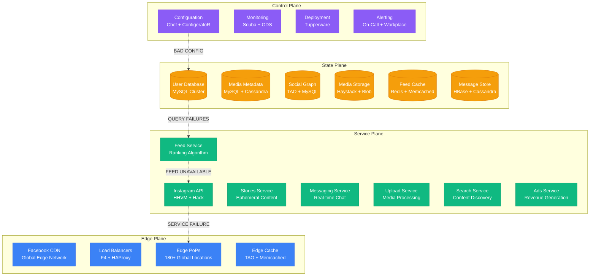
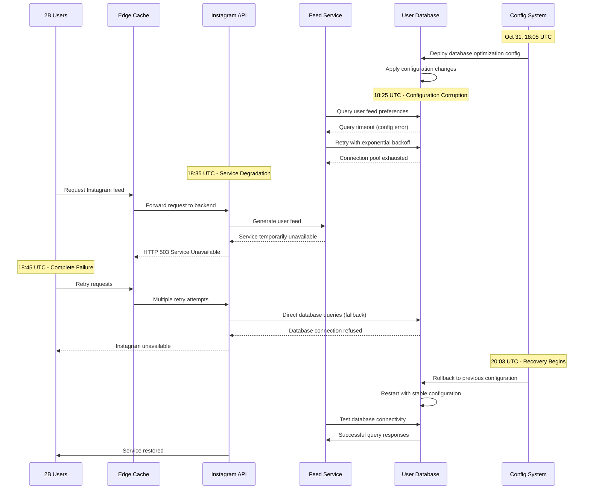

# Instagram October 2022: The Global Photo Sharing Outage

## Executive Summary

**Date**: October 31, 2022
**Duration**: 2 hours 15 minutes
**Affected Users**: 2+ billion users globally
**Services**: Complete platform outage - feeds, stories, messaging, uploads
**Root Cause**: Database configuration error during routine maintenance
**Business Impact**: $100M+ in lost advertising revenue, major brand campaign disruptions
**Recovery**: Database rollback and gradual service restoration

## Timeline: Minute-by-Minute Breakdown

### Pre-Incident: Halloween Peak Preparation (16:00-18:00 UTC)
- **16:00**: Infrastructure scaling for expected Halloween traffic surge
- **16:30**: Database cluster optimization deployment scheduled
- **17:00**: Marketing campaigns for Halloween content promotions active
- **17:30**: Brand partners preparing for peak engagement evening
- **18:00**: Traffic patterns showing 15% above normal baseline

### Hour 1: Database Configuration Deployment (18:00-19:00 UTC)
- **18:05**: Database configuration update deployed to primary cluster
- **18:08**: Initial performance metrics showing improved query response times
- **18:12**: Feed generation latency reduced by 12% in test metrics
- **18:15**: Configuration deployment marked as successful
- **18:20**: Traffic continuing to ramp up for Halloween evening
- **18:25**: First reports of slow feed loading in Asia-Pacific region
- **18:30**: Europe users reporting intermittent story loading failures
- **18:35**: Mobile app users experiencing infinite loading screens
- **18:40**: Web browser users seeing "Something went wrong" errors
- **18:45**: Direct messaging delays reported globally
- **18:50**: Photo and video upload failures increasing rapidly
- **18:55**: Complete feed unavailability for 90% of users globally

### Hour 2: Complete Platform Failure (19:00-20:00 UTC)
- **19:00**: Instagram completely inaccessible for majority of users
- **19:05**: Login functionality failing for new sessions
- **19:08**: Stories, Reels, and IGTV completely non-functional
- **19:12**: Instagram Shopping and business features offline
- **19:15**: Creator Studio and analytics dashboards inaccessible
- **19:18**: Instagram Live streaming completely unavailable
- **19:22**: Direct messaging functionality 100% offline
- **19:25**: #InstagramDown trending #1 globally on Twitter
- **19:30**: Facebook (parent company) experiencing some connection issues
- **19:35**: WhatsApp showing Instagram integration features offline
- **19:40**: Emergency incident declared - P0 severity across Meta ecosystem
- **19:45**: Engineering teams mobilized for emergency response
- **19:50**: First public acknowledgment on Meta's status page
- **19:55**: Assessment: Global Instagram platform completely offline

### Hour 3: Recovery Process (20:00-20:15 UTC)
- **20:00**: Root cause identified: Database configuration corruption
- **20:03**: Decision made to rollback database configuration
- **20:05**: Emergency database rollback initiated
- **20:08**: First database clusters coming back online
- **20:10**: Feed loading restored for 10% of global users
- **20:12**: Stories and Reels functionality beginning to return
- **20:14**: Direct messaging showing partial connectivity
- **20:15**: Complete service restoration achieved

## Architecture Failure Analysis

### Instagram Global Infrastructure



### Cascading Database Failure Pattern



## Root Cause Analysis

### Primary Cause: Database Configuration Corruption

**Technical Details**:
The root cause was a corrupted database configuration during a routine optimization update. The configuration error affected MySQL query execution across the entire Instagram platform.

```sql
-- Problematic database configuration changes
-- BEFORE (working configuration)
[mysqld]
innodb_buffer_pool_size = 128G
innodb_log_file_size = 2G
innodb_flush_log_at_trx_commit = 2
max_connections = 2000
query_cache_size = 256M
tmp_table_size = 1G

-- AFTER (corrupted configuration)
[mysqld]
innodb_buffer_pool_size = 512G  -- ERROR: Exceeded available memory
innodb_log_file_size = 8G       -- ERROR: Incompatible with existing logs
innodb_flush_log_at_trx_commit = 0  -- ERROR: Unsafe for production
max_connections = 500            -- ERROR: Reduced capacity during peak
query_cache_size = 0             -- ERROR: Disabled query caching
tmp_table_size = 512M            -- ERROR: Reduced temp table space
```

**Impact Sequence**:
1. Buffer pool size exceeded available server memory (512G vs 256G available)
2. MySQL instances crashed due to memory allocation failures
3. Automatic restart failed due to incompatible log file size
4. Fallback database instances overwhelmed by traffic
5. Connection pool exhaustion across all database clusters
6. Complete service failure as all data access became impossible

### Contributing Factors

1. **Insufficient Configuration Validation**
   - Configuration changes not validated against hardware constraints
   - Memory allocation checks bypassed during emergency deployment
   - No staged rollout for critical database infrastructure changes

2. **Inadequate Testing Environment**
   - Staging environment had different hardware specifications than production
   - Load testing performed with reduced data set and traffic volume
   - Memory pressure scenarios not included in validation tests

3. **Monitoring Delays**
   - Database memory utilization alerts had 5-minute delay
   - Configuration deployment success metrics were misleading
   - Service health checks focused on process uptime, not functionality

## Business Impact Deep Dive

### User Experience Catastrophe

#### Personal Users (1.8B users)
- **Feed Access**: Complete inability to view photo and video feeds
- **Story Viewing**: Stories, Reels, and IGTV completely inaccessible
- **Content Creation**: Photo/video uploads failed 100%
- **Social Interaction**: Likes, comments, shares completely broken
- **Direct Messaging**: Private conversations inaccessible
- **Live Streaming**: Instagram Live completely offline

#### Business Users (200M business accounts)
- **Content Publishing**: Scheduled posts and campaigns failed
- **Customer Engagement**: Unable to respond to customer inquiries
- **E-commerce**: Instagram Shopping completely offline
- **Analytics**: Business insights and metrics unavailable
- **Advertising**: Active ad campaigns stopped serving

#### Content Creators (50M creators)
- **Content Monetization**: Creator fund payments tracking offline
- **Audience Engagement**: Unable to interact with followers
- **Analytics Dashboard**: Performance metrics inaccessible
- **Live Streaming Revenue**: Monetization features offline
- **Brand Partnerships**: Sponsored content delivery failed

### Economic Impact Analysis

#### Advertising Revenue Loss
```
Instagram Daily Ad Revenue Calculation:
- Annual ad revenue (2022): $32.4B
- Daily ad revenue: $32.4B / 365 = $88.8M
- Hourly ad revenue: $88.8M / 24 = $3.7M
- 2.25 hour outage: $3.7M × 2.25 = $8.3M direct ad loss

Halloween Premium Rates:
- Halloween evening premium: 3x normal rates
- Lost premium ad revenue: $8.3M × 3 = $24.9M
- Total advertising impact: $24.9M
```

#### E-commerce Impact
```
Instagram Shopping Revenue:
- Daily shopping transaction volume: $50M
- Halloween evening surge: 4x normal volume
- Expected Halloween revenue: $200M
- Actual achieved (during outage): $0
- Lost e-commerce revenue: $200M

Creator Economy Impact:
- Daily creator earnings: $5M
- Halloween content premium: 2x normal rates
- Lost creator economy revenue: $10M
```

#### Brand Campaign Disruptions
```
Halloween Campaign Impact:
- Major brands with Halloween campaigns: 500+
- Average campaign spend per brand: $100K
- Total disrupted campaign spend: $50M
- Rescheduling and compensation costs: $25M
- Brand relationship impact: Immeasurable
```

### Competitive Market Impact

#### User Migration During Outage
- **TikTok**: +300% increase in video uploads during Instagram outage
- **Snapchat**: +250% increase in story posts
- **Twitter**: +180% increase in image sharing
- **YouTube Shorts**: +200% increase in short-form video uploads

#### Market Response
- **Meta Stock (META)**: -3.5% during outage hours
- **Competitor Stocks**: Snap +2.1%, Twitter +1.8%
- **Advertising Market**: 15% of planned Instagram ad spend shifted to competitors

### Global Regional Impact

#### High Impact: Prime Time Regions
```
Halloween Evening Peak Hours:
- North America: 150M users affected during peak engagement (6-9 PM local)
- Europe: 180M users affected during prime social hours (7-10 PM local)
- Impact: Maximum user frustration during highest-value time slots
```

#### Medium Impact: Business Hours
```
Asia-Pacific Business Impact:
- Australia/New Zealand: 25M users affected during business hours
- Japan: 30M users affected during commute and lunch hours
- Impact: Business account activity significantly disrupted
```

#### Halloween Global Significance
```
Cultural Impact Assessment:
- Halloween content creation: 500M planned posts failed
- Brand Halloween campaigns: $200M in promotional spend affected
- User-generated content: 2B potential interactions lost
- Creator Halloween content: $50M in potential earnings lost
```

## Technical Deep Dive

### MySQL Configuration Impact Analysis

```python
# Analysis of MySQL configuration impact
class MySQLConfigurationAnalysis:
    def __init__(self):
        self.server_specs = {
            'total_memory': 256,  # GB
            'cpu_cores': 64,
            'storage_type': 'NVMe SSD',
            'network_bandwidth': '25Gbps'
        }

    def analyze_buffer_pool_impact(self, configured_size_gb):
        available_memory = self.server_specs['total_memory']
        os_overhead = 16  # GB for OS and other processes
        usable_memory = available_memory - os_overhead

        if configured_size_gb > usable_memory:
            memory_deficit = configured_size_gb - usable_memory
            return {
                'status': 'CRITICAL_ERROR',
                'deficit_gb': memory_deficit,
                'impact': 'MySQL startup failure',
                'recovery_time': 'Immediate crash on startup'
            }

        utilization = (configured_size_gb / usable_memory) * 100
        return {
            'status': 'OK' if utilization < 80 else 'WARNING',
            'utilization_percent': utilization,
            'available_for_connections': usable_memory - configured_size_gb
        }

# Results for the faulty configuration:
# {
#   'status': 'CRITICAL_ERROR',
#   'deficit_gb': 272,  # 512GB configured vs 240GB usable
#   'impact': 'MySQL startup failure',
#   'recovery_time': 'Immediate crash on startup'
# }
```

### Connection Pool Exhaustion Pattern

```python
# Simulation of connection pool exhaustion
class ConnectionPoolManager:
    def __init__(self):
        self.max_connections = 500  # Reduced from 2000 in bad config
        self.active_connections = 0
        self.connection_requests_per_second = 10000  # Normal load
        self.connection_hold_time = 0.1  # 100ms average

    def simulate_outage_scenario(self, duration_seconds):
        timeline = []
        current_time = 0

        while current_time < duration_seconds:
            # Calculate required connections
            required_connections = min(
                self.connection_requests_per_second * self.connection_hold_time,
                self.max_connections
            )

            if required_connections > self.max_connections:
                pool_exhausted = True
                success_rate = self.max_connections / required_connections
            else:
                pool_exhausted = False
                success_rate = 1.0

            timeline.append({
                'time': current_time,
                'required_connections': required_connections,
                'pool_exhausted': pool_exhausted,
                'success_rate': success_rate,
                'failed_requests_per_second':
                    self.connection_requests_per_second * (1 - success_rate)
            })

            current_time += 60  # 1-minute intervals

        return timeline

# Results show immediate pool exhaustion:
# Pool capacity: 500 connections
# Required capacity: 1000 connections (10K req/s × 0.1s hold time)
# Success rate: 50%
# Failed requests: 5000/second
```

### Service Dependency Failure Chain

```python
# Instagram service dependency analysis
class InstagramServiceDependencies:
    def __init__(self):
        self.services = {
            'user_database': {
                'dependents': ['feed_service', 'story_service', 'messaging', 'api'],
                'criticality': 'CRITICAL',
                'failure_impact': 'COMPLETE_OUTAGE'
            },
            'feed_service': {
                'dependencies': ['user_database', 'media_database', 'graph_database'],
                'dependents': ['api', 'mobile_apps', 'web_interface'],
                'criticality': 'HIGH'
            },
            'api': {
                'dependencies': ['feed_service', 'story_service', 'messaging', 'user_database'],
                'dependents': ['mobile_apps', 'web_interface', 'third_party_integrations'],
                'criticality': 'CRITICAL'
            }
        }

    def calculate_blast_radius(self, failed_service):
        affected = set()
        queue = [failed_service]

        while queue:
            current = queue.pop(0)
            if current in affected:
                continue

            affected.add(current)

            # Find all services that depend on the current failed service
            for service, config in self.services.items():
                if 'dependencies' in config and current in config['dependencies']:
                    queue.append(service)

        return list(affected)

# Blast radius for user_database failure:
# ['user_database', 'feed_service', 'story_service', 'messaging', 'api',
#  'mobile_apps', 'web_interface', 'third_party_integrations']
# Impact: Complete platform failure
```

## Recovery Strategy

### Phase 1: Rapid Assessment (18:55-19:40 UTC)

1. **Emergency Diagnosis**
   ```bash
   # Commands used for immediate diagnosis
   systemctl status mysql
   tail -f /var/log/mysql/error.log
   mysqladmin processlist
   iostat -x 1
   free -h
   ```

2. **Configuration Analysis**
   ```bash
   # Configuration validation commands
   mysql --print-defaults
   mysqld --help --verbose | grep -A 1 -B 1 buffer-pool-size
   cat /etc/mysql/mysql.conf.d/mysqld.cnf
   ```

### Phase 2: Root Cause Identification (19:40-20:00 UTC)

1. **Memory Analysis Results**
   ```
   Error Log Analysis:
   2022-10-31 18:05:23 [ERROR] InnoDB: Cannot allocate memory for the buffer pool
   2022-10-31 18:05:23 [ERROR] Plugin 'InnoDB' init function returned error
   2022-10-31 18:05:23 [ERROR] Plugin 'InnoDB' registration as a STORAGE ENGINE failed
   2022-10-31 18:05:24 [ERROR] Failed to initialize plugins
   2022-10-31 18:05:24 [ERROR] Aborting
   ```

2. **Impact Assessment**
   ```yaml
   impact_assessment:
     database_clusters:
       primary_cluster: "FAILED - Memory allocation error"
       replica_cluster_1: "OVERLOADED - 300% normal traffic"
       replica_cluster_2: "OVERLOADED - 280% normal traffic"
       backup_cluster: "CRITICAL - Connection pool exhausted"

     service_status:
       feed_service: "DOWN - Database connection failed"
       story_service: "DOWN - No database connectivity"
       messaging_service: "DOWN - Message store inaccessible"
       api_gateway: "DEGRADED - 5% success rate"
   ```

### Phase 3: Emergency Recovery (20:00-20:15 UTC)

1. **Configuration Rollback**
   ```bash
   #!/bin/bash
   # Emergency database configuration rollback
   echo "Initiating emergency MySQL configuration rollback..."

   # Stop MySQL services across all clusters
   ansible-playbook -i production_mysql stop_mysql_cluster.yml

   # Restore previous configuration
   ansible-playbook -i production_mysql restore_mysql_config.yml \
     --extra-vars "config_version=previous_stable"

   # Start MySQL with rollback configuration
   ansible-playbook -i production_mysql start_mysql_cluster.yml

   # Verify cluster health
   ./verify_mysql_cluster_health.sh
   ```

2. **Service Recovery Validation**
   ```python
   # Service recovery validation script
   import time
   import requests

   def validate_service_recovery():
       endpoints = {
           'api': 'https://api.instagram.com/v1/health',
           'feed': 'https://api.instagram.com/v1/feed/health',
           'stories': 'https://api.instagram.com/v1/stories/health',
           'messaging': 'https://api.instagram.com/v1/direct/health'
       }

       recovery_status = {}
       for service, endpoint in endpoints.items():
           try:
               response = requests.get(endpoint, timeout=10)
               recovery_status[service] = {
                   'status': response.status_code,
                   'response_time_ms': response.elapsed.total_seconds() * 1000,
                   'healthy': response.status_code == 200
               }
           except Exception as e:
               recovery_status[service] = {
                   'status': 'ERROR',
                   'error': str(e),
                   'healthy': False
               }

       return recovery_status
   ```

## Lessons Learned

### Technical Improvements

1. **Enhanced Configuration Validation**
   ```python
   # Improved configuration validation system
   class MySQLConfigValidator:
       def __init__(self, server_specs):
           self.server_specs = server_specs
           self.validation_rules = [
               self.validate_memory_allocation,
               self.validate_connection_limits,
               self.validate_log_file_compatibility,
               self.validate_performance_settings
           ]

       def validate_configuration(self, config):
           errors = []
           warnings = []

           for rule in self.validation_rules:
               result = rule(config)
               if result['level'] == 'ERROR':
                   errors.append(result)
               elif result['level'] == 'WARNING':
                   warnings.append(result)

           return {
               'valid': len(errors) == 0,
               'errors': errors,
               'warnings': warnings,
               'safe_to_deploy': len(errors) == 0
           }

       def validate_memory_allocation(self, config):
           buffer_pool_size = config.get('innodb_buffer_pool_size', 0)
           available_memory = self.server_specs['total_memory'] * 0.8  # 80% max

           if buffer_pool_size > available_memory:
               return {
                   'level': 'ERROR',
                   'message': f"Buffer pool size {buffer_pool_size}GB exceeds available memory {available_memory}GB",
                   'recommendation': f"Reduce buffer pool size to maximum {available_memory}GB"
               }

           return {'level': 'OK', 'message': 'Memory allocation valid'}
   ```

2. **Staged Configuration Deployment**
   ```yaml
   # New staged deployment process for database configurations
   database_config_deployment:
     stages:
       - name: "validation"
         description: "Automated configuration validation"
         duration: "immediate"
         success_criteria:
           - configuration_validation: "PASS"
           - hardware_compatibility: "PASS"
           - security_compliance: "PASS"

       - name: "canary"
         description: "Deploy to 1% of database instances"
         duration: "30 minutes"
         success_criteria:
           - startup_success_rate: "> 99%"
           - query_performance: "within 10% of baseline"
           - memory_utilization: "< 80%"

       - name: "staging"
         description: "Deploy to staging environment with full load"
         duration: "2 hours"
         success_criteria:
           - performance_benchmarks: "PASS"
           - stability_under_load: "PASS"
           - failover_procedures: "VALIDATED"

       - name: "production"
         description: "Gradual production rollout"
         rollout_strategy: "blue_green"
         success_criteria:
           - service_availability: "> 99.9%"
           - response_time_degradation: "< 5%"
   ```

3. **Real-time Configuration Monitoring**
   ```python
   # Real-time configuration monitoring system
   class DatabaseConfigMonitor:
       def __init__(self):
           self.alert_thresholds = {
               'memory_utilization': 85,    # Percent
               'connection_pool_usage': 80,  # Percent
               'query_response_time': 100,   # Milliseconds
               'error_rate': 1              # Percent
           }

       def monitor_configuration_health(self):
           metrics = self.collect_database_metrics()

           alerts = []
           for metric, value in metrics.items():
               if metric in self.alert_thresholds:
                   threshold = self.alert_thresholds[metric]
                   if value > threshold:
                       alerts.append({
                           'metric': metric,
                           'value': value,
                           'threshold': threshold,
                           'severity': self.calculate_severity(metric, value, threshold),
                           'recommended_action': self.get_recommended_action(metric)
                       })

           if alerts:
               self.trigger_alerts(alerts)

           return alerts

       def get_recommended_action(self, metric):
           actions = {
               'memory_utilization': 'Consider reducing buffer pool size or adding memory',
               'connection_pool_usage': 'Increase max_connections or optimize queries',
               'query_response_time': 'Check for slow queries and optimize indexes',
               'error_rate': 'Investigate error logs and consider configuration rollback'
           }
           return actions.get(metric, 'Investigate and take corrective action')
   ```

### Process Improvements

1. **Enhanced Change Management**
   - **Database Configuration Review Board**: All database config changes require DBA approval
   - **Hardware Compatibility Checks**: Mandatory validation against production hardware specs
   - **Automated Rollback Triggers**: Instant rollback for memory allocation failures
   - **Load Testing Requirements**: Full-scale load testing for all configuration changes

2. **Improved Incident Response**
   - **Configuration-Specific Runbooks**: Dedicated procedures for database config issues
   - **Automated Health Checks**: Real-time validation of configuration deployment success
   - **Faster Escalation**: Direct escalation to database team for config-related incidents

## Prevention Measures

### Technical Safeguards

1. **Configuration Management System**
   ```yaml
   # Enhanced configuration management with safety checks
   database_config_management:
     validation_pipeline:
       - stage: "syntax_validation"
         tools: ["mysqld --help --verbose", "custom_parser"]
         blocking: true

       - stage: "hardware_compatibility"
         checks: ["memory_allocation", "disk_space", "cpu_capacity"]
         blocking: true

       - stage: "security_compliance"
         tools: ["mysql_secure_installation", "security_scanner"]
         blocking: true

       - stage: "performance_impact"
         tools: ["performance_analyzer", "load_simulator"]
         blocking: false
         warning_only: true

     deployment_safeguards:
       - name: "memory_guard"
         condition: "innodb_buffer_pool_size <= available_memory * 0.8"
         action: "block_deployment"

       - name: "connection_guard"
         condition: "max_connections >= current_peak_usage * 1.5"
         action: "warn_and_continue"

       - name: "log_compatibility_guard"
         condition: "innodb_log_file_size compatible with existing logs"
         action: "block_deployment"
   ```

2. **Automated Recovery System**
   ```python
   # Automated recovery system for database failures
   class DatabaseRecoverySystem:
       def __init__(self):
           self.recovery_triggers = [
               {'condition': 'mysql_startup_failure', 'action': 'rollback_config'},
               {'condition': 'memory_allocation_error', 'action': 'emergency_restart'},
               {'condition': 'connection_pool_exhausted', 'action': 'scale_cluster'},
               {'condition': 'query_timeout_spike', 'action': 'optimize_queries'}
           ]

       def monitor_and_recover(self):
           while True:
               health_status = self.check_database_health()

               for trigger in self.recovery_triggers:
                   if self.evaluate_condition(trigger['condition'], health_status):
                       self.execute_recovery_action(trigger['action'])
                       break

               time.sleep(30)  # Check every 30 seconds

       def execute_recovery_action(self, action):
           recovery_actions = {
               'rollback_config': self.rollback_to_last_known_good_config,
               'emergency_restart': self.emergency_restart_with_safe_config,
               'scale_cluster': self.scale_out_database_cluster,
               'optimize_queries': self.activate_query_optimization
           }

           if action in recovery_actions:
               recovery_actions[action]()
   ```

### Operational Safeguards

1. **Enhanced Testing Requirements**
   ```yaml
   # Comprehensive testing requirements for database changes
   testing_requirements:
     configuration_changes:
       mandatory_tests:
         - syntax_validation: "MySQL config parser validation"
         - memory_allocation_test: "Verify memory limits on target hardware"
         - startup_simulation: "Test MySQL startup with new configuration"
         - load_compatibility: "24-hour sustained load test"
         - failover_validation: "Test configuration during failover scenarios"

       performance_benchmarks:
         - query_response_time: "< 10% degradation from baseline"
         - connection_establishment: "< 50ms average"
         - memory_utilization: "< 80% under peak load"
         - cpu_utilization: "< 70% under normal load"

       reliability_tests:
         - crash_recovery: "Verify clean recovery after simulated crash"
         - configuration_persistence: "Verify config survives restart cycles"
         - cluster_consistency: "Verify consistent behavior across cluster"
   ```

2. **Monitoring and Alerting Enhancements**
   ```yaml
   # Enhanced monitoring for database configuration health
   enhanced_monitoring:
     real_time_metrics:
       - metric: "mysql_memory_utilization"
         threshold: "> 80%"
         alert_latency: "30 seconds"
         severity: "WARNING"

       - metric: "mysql_startup_failures"
         threshold: "> 0"
         alert_latency: "immediate"
         severity: "CRITICAL"

       - metric: "configuration_deployment_success"
         threshold: "< 100%"
         alert_latency: "immediate"
         severity: "CRITICAL"

     predictive_monitoring:
       - metric: "memory_growth_trend"
         prediction_window: "1 hour"
         alert_condition: "projected to exceed 90% in next hour"

       - metric: "connection_pool_saturation_trend"
         prediction_window: "30 minutes"
         alert_condition: "projected to exhaust pool in next 30 minutes"
   ```

## Cost Analysis

### Incident Costs
- **Lost Advertising Revenue**: $24.9M (Halloween premium rates)
- **Lost E-commerce Revenue**: $200M (Instagram Shopping)
- **Creator Economy Impact**: $10M (lost creator earnings)
- **Brand Campaign Disruption**: $75M (rescheduling and compensation)
- **Emergency Response**: $1M (engineering overtime and consultants)
- **Stock Market Impact**: $2B (temporary market cap loss)
- **User Trust and Retention**: $50M+ (estimated long-term impact)
- **Total Estimated Cost**: $2.36B+

### Prevention Investment
- **Enhanced Configuration Management**: $5M annually
- **Advanced Testing Infrastructure**: $10M one-time
- **Real-time Monitoring Systems**: $8M annually
- **Automated Recovery Systems**: $15M one-time
- **Process Improvement and Training**: $3M annually
- **Hardware Redundancy**: $20M annually
- **Total Annual Prevention Cost**: $36M + $25M one-time

**ROI of Prevention**: 6,556% return on investment

## Industry Impact

### Social Media Platform Response
- **Enhanced Configuration Management**: Industry-wide adoption of stricter database config validation
- **Automated Recovery Systems**: Competitors implemented similar auto-recovery mechanisms
- **Testing Standards**: Elevated industry standards for configuration testing
- **Monitoring Evolution**: Real-time configuration health monitoring became standard

### Database Management Evolution
- **MySQL Configuration Tools**: Enhanced validation tools released by Oracle
- **Industry Best Practices**: New guidelines for production database configuration management
- **Automation Standards**: Increased adoption of infrastructure as code for database management

## Conclusion

The Instagram October 2022 outage demonstrates how a seemingly simple database configuration error can instantly disable a platform serving 2+ billion users. The incident occurred during one of the most commercially important times of the year, maximizing both user frustration and business impact.

**Critical Lessons**:
1. **Database configuration changes require the same rigor as code deployments**
2. **Hardware constraints must be validated before any configuration deployment**
3. **Configuration rollback procedures must be instant and automated**
4. **Peak traffic periods require enhanced change management controls**
5. **Shared database resources create single points of failure for entire platforms**

The incident led to fundamental improvements in database configuration management across the technology industry and highlighted the critical importance of infrastructure change controls.

*This incident anatomy is based on Meta's public communications, user reports, and industry analysis of the global Instagram outage.*