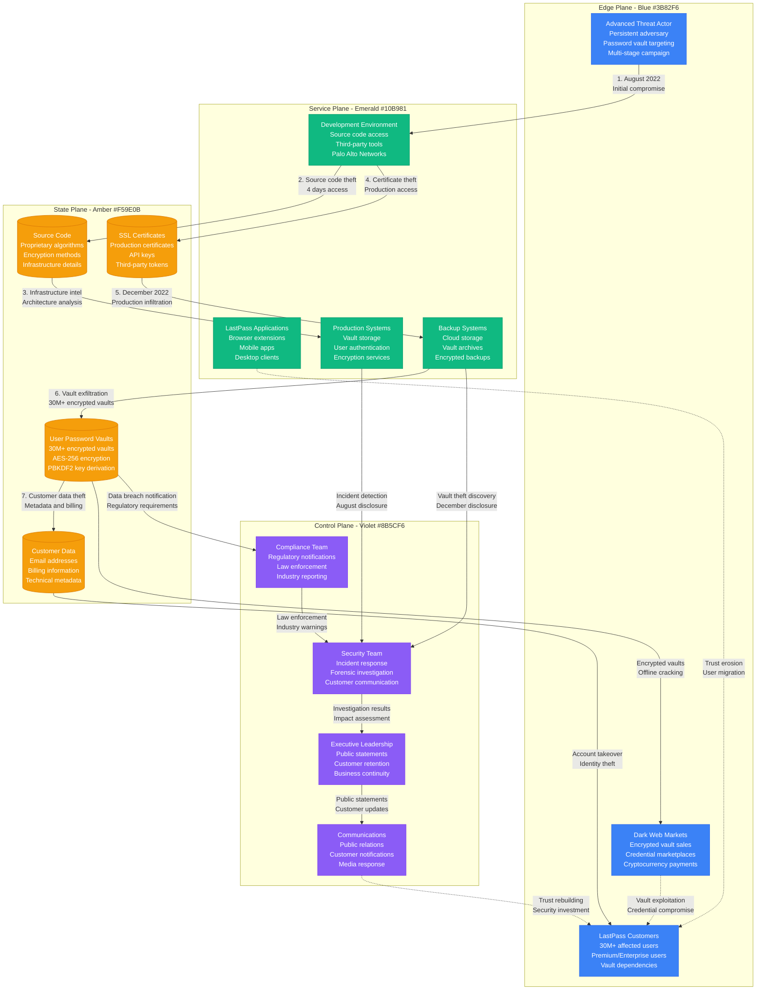
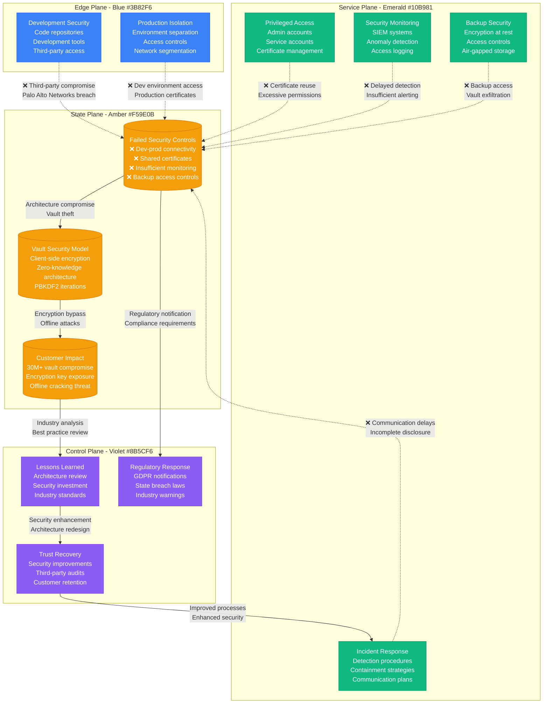

# LastPass August-December 2022 Security Breaches

## Overview

The LastPass security breaches of 2022 represented a catastrophic failure in password manager security, with two separate incidents compromising encrypted user vaults and ultimately exposing over 30 million user accounts. This case study demonstrates critical failures in security architecture, incident response, and customer communication.

**Impact**: 30+ million encrypted password vaults compromised, customer trust destroyed
**Duration**: August 2022 breach led to December 2022 vault theft
**Root Cause**: Development environment compromise leading to production vault access

## Complete Attack Timeline and Architecture



## Security Architecture Failures



## Critical Security Failures

### 1. Development-Production Security Bridge
- **Root Cause**: Development environment had access to production certificates
- **Attack Vector**: Palo Alto Networks development environment compromise
- **Impact**: Production access gained through development infrastructure
- **Lesson**: Complete isolation between development and production environments

### 2. Certificate and Credential Reuse
- **Root Cause**: Same certificates used across development and production
- **Attack Vector**: Stolen certificates provided legitimate production access
- **Impact**: Attackers appeared as authorized systems for months
- **Lesson**: Environment-specific certificates with short lifespans required

### 3. Backup System Access Controls
- **Root Cause**: Insufficient access controls on backup storage systems
- **Attack Vector**: Production credentials provided backup system access
- **Impact**: Historical vault data accessed and exfiltrated
- **Lesson**: Backup systems require independent authentication and authorization

### 4. Inadequate Monitoring and Detection
- **Root Cause**: Insufficient monitoring of privileged access and data movement
- **Attack Vector**: Large-scale data exfiltration went undetected
- **Impact**: 30+ million vaults stolen without real-time detection
- **Lesson**: Comprehensive monitoring must include backup and archive systems

## Impact and Customer Consequences

### Immediate Customer Impact
- **Vault Compromise**: 30+ million encrypted password vaults stolen
- **Data Exposure**: Email addresses, IP addresses, and encrypted data
- **Security Risk**: Offline brute-force attacks against encrypted vaults
- **Service Disruption**: Customer trust and confidence severely damaged

### Long-term Security Risks
- **Password Cracking**: Weak master passwords vulnerable to offline attacks
- **Credential Reuse**: Compromised passwords used across multiple services
- **Identity Theft**: Personal information used for targeted attacks
- **Account Takeovers**: Decrypted credentials used for unauthorized access

### Business Impact
- **Customer Exodus**: Significant user migration to competitors
- **Revenue Loss**: Premium subscriptions canceled en masse
- **Legal Exposure**: Class-action lawsuits and regulatory investigations
- **Brand Damage**: Reputation as secure password manager destroyed

### Industry Impact
- **Password Manager Scrutiny**: Enhanced security requirements for all providers
- **Zero-Knowledge Standards**: Stricter requirements for client-side encryption
- **Backup Security**: Industry-wide review of backup system security
- **Incident Disclosure**: Enhanced requirements for timely and complete disclosure

## Technical Analysis of Vault Security

### LastPass Vault Encryption Model
```
Vault Encryption Process:
1. User Master Password → PBKDF2 (100,100 iterations default) → Master Key
2. Master Key → AES-256 Encryption → Encrypted Vault
3. Encrypted Vault → Server Storage → Zero-Knowledge Architecture

Attack Implications:
- Offline attacks against encrypted vaults possible
- PBKDF2 iterations varied by account age (5,000 to 500,000)
- Weak master passwords vulnerable to dictionary attacks
- Strong passwords (12+ characters) remain secure
```

### Vault Security Recommendations
```yaml
# Recommended vault security improvements
Vault_Security:
  encryption:
    algorithm: "AES-256-GCM"
    key_derivation: "Argon2id"
    iterations: "1000000_minimum"
    salt: "unique_per_user"

  authentication:
    multi_factor: "required"
    biometric: "when_available"
    hardware_tokens: "enterprise_preferred"
    password_complexity: "enforced"

  storage:
    backup_encryption: "separate_keys"
    air_gapped: "required"
    access_controls: "independent_auth"
    monitoring: "real_time_alerts"
```

## Remediation and Recovery

### Immediate Response (August-December 2022)
1. **Environment Isolation**: Complete segregation of compromised systems
2. **Certificate Rotation**: All production certificates invalidated and replaced
3. **Access Review**: Comprehensive audit of all privileged access
4. **Customer Notification**: Staged disclosure as investigation progressed

### Security Architecture Overhaul (2023)
1. **Environment Isolation**: Complete separation of development and production
2. **Zero Trust**: Implementation of comprehensive access controls
3. **Enhanced Monitoring**: Real-time detection of anomalous activities
4. **Backup Security**: Independent authentication for backup systems

### Customer Protection Measures
1. **Master Password Changes**: Forced password changes for affected users
2. **MFA Enforcement**: Multi-factor authentication required for all accounts
3. **Security Monitoring**: Enhanced monitoring for compromised credentials
4. **Migration Tools**: Assisted migration to more secure configurations

## Industry Lessons and Best Practices

### What Works
- **Environment Isolation**: Complete separation prevents lateral movement
- **Certificate Lifecycle**: Short-lived, environment-specific certificates
- **Real-time Monitoring**: Immediate detection of unusual access patterns
- **Zero-Knowledge Architecture**: Client-side encryption protects against server compromise

### What Fails
- **Shared Infrastructure**: Common certificates and access between environments
- **Delayed Detection**: Monthly or quarterly security reviews insufficient
- **Backup Assumptions**: Backup systems need independent security controls
- **Communication Delays**: Delayed disclosure erodes customer trust

### Modern Password Manager Architecture
```yaml
# Current industry standards for password managers
Password_Manager_Security:
  architecture:
    - zero_knowledge_design
    - client_side_encryption
    - environment_isolation
    - certificate_pinning

  encryption:
    - argon2id_key_derivation
    - aes_256_gcm_encryption
    - perfect_forward_secrecy
    - quantum_resistant_algorithms

  access_controls:
    - multi_factor_authentication
    - hardware_security_modules
    - privileged_access_management
    - just_in_time_access

  monitoring:
    - real_time_siem
    - behavioral_analytics
    - data_loss_prevention
    - continuous_compliance
```

### Regulatory and Compliance Evolution
- **GDPR Notifications**: Enhanced requirements for timely breach disclosure
- **State Breach Laws**: Stricter notification timelines and penalties
- **Industry Standards**: Enhanced security requirements for password managers
- **Customer Rights**: Enhanced rights to data portability and deletion

### Future Security Considerations
- **Quantum-Safe Cryptography**: Preparation for quantum computing threats
- **Biometric Authentication**: Hardware-based authentication methods
- **Distributed Architecture**: Decentralized password management systems
- **AI-Powered Detection**: Machine learning for anomaly detection

**Sources**:
- LastPass Security Incident Reports (August 2022, December 2022)
- Independent Security Analysis (GoSecure, 2023)
- Customer Class Action Lawsuit Documents (2023)
- GDPR Breach Notification Records (2022-2023)
- Cybersecurity Industry Incident Response Analysis (2023)