# Netflix December 2023 Global Streaming Outage - Incident Anatomy

## Incident Overview

**Date**: December 23, 2023
**Duration**: 47 minutes (14:23 - 15:10 UTC)
**Impact**: 18% of global users unable to stream
**Revenue Loss**: ~$3.2M
**Root Cause**: EVCache cluster coordination failure during deployment

## Incident Timeline & Response Flow

```mermaid
graph TB
    subgraph Detection[T+0: Detection Phase - 14:23 UTC]
        style Detection fill:#FFE5E5,stroke:#8B5CF6,color:#000

        Start[14:23:00<br/>━━━━━<br/>Deployment Initiated<br/>EVCache v3.2.1<br/>Rolling update across<br/>6 regions]

        Alert1[14:23:45<br/>━━━━━<br/>First Alerts<br/>Atlas: Cache miss rate ↑300%<br/>Mantis: Latency spike<br/>PagerDuty triggered]

        Alert2[14:24:15<br/>━━━━━<br/>Cascade Detected<br/>Playback API timeouts<br/>p99: 50ms → 2000ms<br/>Error rate: 0.01% → 18%]
    end

    subgraph Diagnosis[T+5min: Diagnosis Phase]
        style Diagnosis fill:#FFF5E5,stroke:#F59E0B,color:#000

        Triage[14:28:00<br/>━━━━━<br/>Incident Commander<br/>Severity: SEV-1<br/>War room opened<br/>25 engineers joined]

        RCA1[14:30:00<br/>━━━━━<br/>Initial Hypothesis<br/>EVCache replication lag<br/>Checked: Gossip protocol<br/>Finding: Protocol storm]

        RCA2[14:33:00<br/>━━━━━<br/>Root Cause Found<br/>Version mismatch in<br/>coordination protocol<br/>Old: CRDTv2<br/>New: CRDTv3 incompatible]
    end

    subgraph Mitigation[T+15min: Mitigation Phase]
        style Mitigation fill:#FFFFE5,stroke:#CCCC00,color:#000

        Rollback[14:38:00<br/>━━━━━<br/>Rollback Decision<br/>Spinnaker automated<br/>rollback initiated<br/>6 regions parallel]

        Traffic[14:41:00<br/>━━━━━<br/>Traffic Management<br/>Zuul: Shed 30% traffic<br/>Failover to CloudFront<br/>Degraded to SD quality]

        CacheWarm[14:45:00<br/>━━━━━<br/>Cache Warming<br/>Replay last 4 hours<br/>8M events/sec replay<br/>From Kafka commit log]
    end

    subgraph Recovery[T+35min: Recovery Phase]
        style Recovery fill:#E5FFE5,stroke:#10B981,color:#000

        Stable1[14:58:00<br/>━━━━━<br/>Partial Recovery<br/>Cache hit rate: 75%<br/>Error rate: 18% → 5%<br/>HD streaming resumed]

        Stable2[15:05:00<br/>━━━━━<br/>Full Recovery<br/>Cache hit rate: 95%<br/>All metrics nominal<br/>4K streaming enabled]

        PostMortem[15:10:00<br/>━━━━━<br/>Incident Closed<br/>All clear signal<br/>Post-mortem scheduled<br/>Blameless review]
    end

    %% Service Dependencies During Incident
    subgraph Services[Affected Services & Metrics]
        style Services fill:#F0F0F0,stroke:#666666,color:#000

        EVCacheImpact[EVCache Cluster<br/>━━━━━<br/>❌ 1,800 nodes affected<br/>30T requests failing<br/>Gossip storm: 10Gbps]

        PlayAPIImpact[Playback API<br/>━━━━━<br/>⚠️ 500 instances degraded<br/>2M req/sec → 400K<br/>Timeouts: 2s circuit break]

        CassandraImpact[Cassandra<br/>━━━━━<br/>⚠️ Read amplification 10x<br/>CPU: 95% across fleet<br/>Compaction backlog: 2TB]

        UserImpact[User Experience<br/>━━━━━<br/>❌ 47M users affected<br/>Buffering: 15s average<br/>Fallback to SD: 100%]
    end

    %% Flow connections
    Start --> Alert1
    Alert1 --> Alert2
    Alert2 --> Triage
    Triage --> RCA1
    RCA1 --> RCA2
    RCA2 --> Rollback
    Rollback --> Traffic
    Traffic --> CacheWarm
    CacheWarm --> Stable1
    Stable1 --> Stable2
    Stable2 --> PostMortem

    %% Impact connections
    Alert2 -.-> EVCacheImpact
    EVCacheImpact -.-> PlayAPIImpact
    PlayAPIImpact -.-> CassandraImpact
    CassandraImpact -.-> UserImpact

    %% Apply timeline colors
    classDef detectStyle fill:#FFE5E5,stroke:#8B5CF6,color:#000,font-weight:bold
    classDef diagnoseStyle fill:#FFF5E5,stroke:#F59E0B,color:#000,font-weight:bold
    classDef mitigateStyle fill:#FFFFE5,stroke:#CCCC00,color:#000,font-weight:bold
    classDef recoverStyle fill:#E5FFE5,stroke:#10B981,color:#000,font-weight:bold
    classDef impactStyle fill:#F0F0F0,stroke:#666666,color:#000

    class Start,Alert1,Alert2 detectStyle
    class Triage,RCA1,RCA2 diagnoseStyle
    class Rollback,Traffic,CacheWarm mitigateStyle
    class Stable1,Stable2,PostMortem recoverStyle
    class EVCacheImpact,PlayAPIImpact,CassandraImpact,UserImpact impactStyle
```



## Debugging Checklist Used During Incident

### 1. Initial Detection (T+0 to T+2min)
- [x] Atlas metrics dashboard - cache miss rate alert
- [x] Mantis real-time stream - latency percentiles
- [x] PagerDuty escalation - SEV-1 triggered
- [x] Zuul gateway logs - timeout patterns

### 2. Rapid Assessment (T+2 to T+5min)
- [x] Check deployment timeline - correlate with issue start
- [x] Region health matrix - identify affected regions
- [x] Service dependency graph - trace cascade path
- [x] Customer impact dashboard - user error rates

### 3. Root Cause Analysis (T+5 to T+15min)
```bash
# Commands actually run during incident:
kubectl logs -n evcache evcache-coordinator-abc123 --since=1h | grep ERROR
# Output: "CRDT version mismatch: expected v2, got v3"

aws cloudwatch get-metric-statistics --namespace Netflix/EVCache \
  --metric-name GossipStormPackets --statistics Maximum \
  --start-time 2023-12-23T14:00:00Z --end-time 2023-12-23T15:00:00Z
# Output: 10M packets/sec (normal: 100K)

curl -X GET http://atlas-api.netflix.internal/v1/graph?q=evcache.coordinator.elections
# Output: 1,200 elections/min (normal: 2/min)
```

### 4. Mitigation Actions (T+15 to T+35min)
- [x] Trigger Spinnaker rollback pipeline
- [x] Adjust Zuul traffic weights (shed 30%)
- [x] Enable CloudFront failover
- [x] Initiate cache warming from Kafka
- [x] Downgrade streaming quality tiers

### 5. Validation (T+35 to T+47min)
- [x] Monitor cache hit rate recovery
- [x] Verify error rates declining
- [x] Test stream starts in each region
- [x] Confirm no data corruption

## Key Metrics During Incident

| Metric | Normal | Peak Impact | Recovery Target |
|--------|--------|-------------|-----------------|
| Cache Hit Rate | 95% | 12% | >90% |
| API p99 Latency | 50ms | 2000ms | <100ms |
| Error Rate | 0.01% | 18% | <0.1% |
| Concurrent Streams | 120M | 98M | >115M |
| Gossip Traffic | 100MB/s | 10GB/s | <200MB/s |
| Deployment Time | 15min | N/A (rolled back) | N/A |

## Failure Cost Analysis

### Direct Costs
- **Revenue Loss**: $3.2M (47 min × $4.08M/hour)
- **SLA Credits**: $450K to enterprise customers
- **Emergency Compute**: $85K (scaled up Cassandra)
- **Engineering Time**: $125K (25 engineers × 3 hours × $350/hr)

### Indirect Costs
- **Brand Impact**: Trending on Twitter for 4 hours
- **Customer Churn**: Est. 0.02% increase in monthly churn
- **Stock Impact**: -0.3% in after-hours trading

### Total Incident Cost: ~$4.2M

## Lessons Learned & Action Items

### Immediate Actions (Completed)
1. **Protocol Compatibility Check**: Added to deployment pipeline
2. **Canary Deployment**: Mandatory for EVCache updates
3. **Circuit Breaker Tuning**: Reduced timeout from 2s to 500ms
4. **Rollback Automation**: Reduced rollback time from 15min to 5min

### Long-term Improvements
1. **CRDT Version Registry**: Central compatibility matrix
2. **Chaos Testing**: Added "cache coordinator failure" scenario
3. **Multi-version Support**: EVCache now supports protocol negotiation
4. **Regional Isolation**: Prevent cross-region gossip storms

## Post-Mortem Findings

### What Went Well
- Detection within 45 seconds of issue start
- War room assembled in under 5 minutes
- Rollback decision made quickly (15 min)
- No data loss or corruption

### What Went Wrong
- Deployment validation missed protocol incompatibility
- Canary phase skipped due to "minor version update"
- Gossip storm amplified the problem across regions
- Initial diagnosis focused on wrong component (Kafka)

### Prevention Measures
```yaml
deployment_gates:
  - name: protocol_compatibility_check
    required: true
    timeout: 60s

  - name: canary_deployment
    required: true
    duration: 30m
    success_criteria:
      cache_hit_rate: ">90%"
      gossip_packets: "<200K/sec"
      coordinator_elections: "<10/min"

  - name: regional_progressive_rollout
    required: true
    stages:
      - regions: [us-east-1]
        wait: 1h
      - regions: [us-west-2, eu-west-1]
        wait: 2h
      - regions: [ap-southeast-1, sa-east-1, eu-central-1]
        wait: 4h
```

## References & Documentation

- Internal Incident Report: INC-2023-12-23-001
- [EVCache Protocol Evolution Doc](https://docs.netflix.internal/evcache/protocol-v3)
- [Netflix SRE Playbook - Cache Failures](https://sre.netflix.com/playbooks/cache)
- Post-mortem Recording: Available on internal portal
- Chaos Engineering Test Suite Update: CE-2024-001

---

*Incident Commander: Sarah Chen*
*Post-Mortem Owner: Michael Torres*
*Last Updated: January 2024*
*Classification: Internal Use - Sanitized for Atlas Documentation*