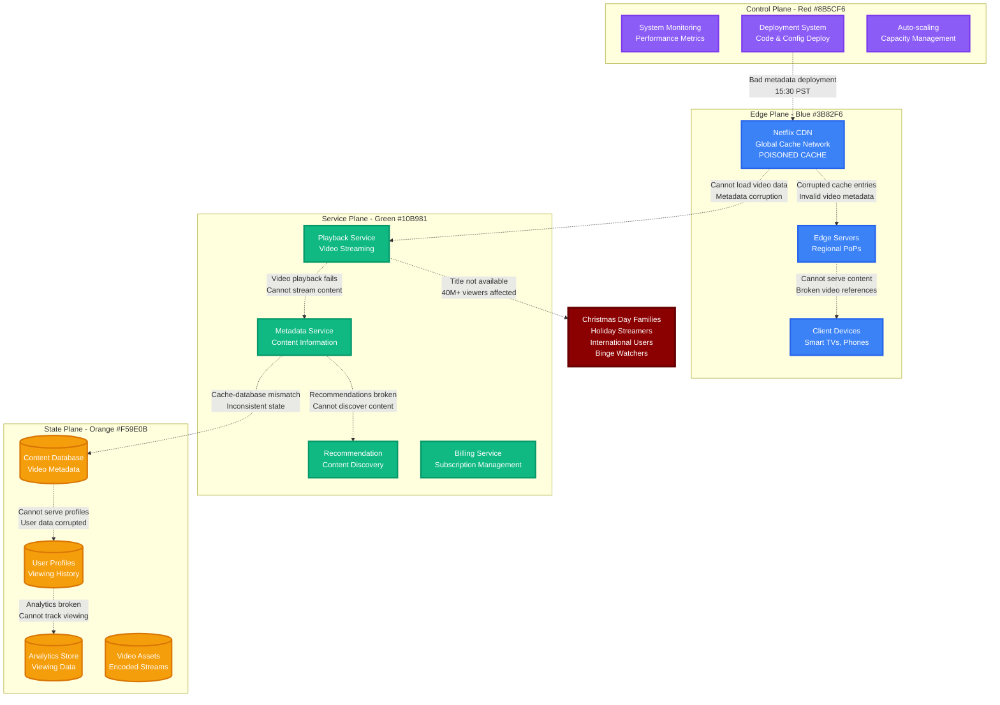
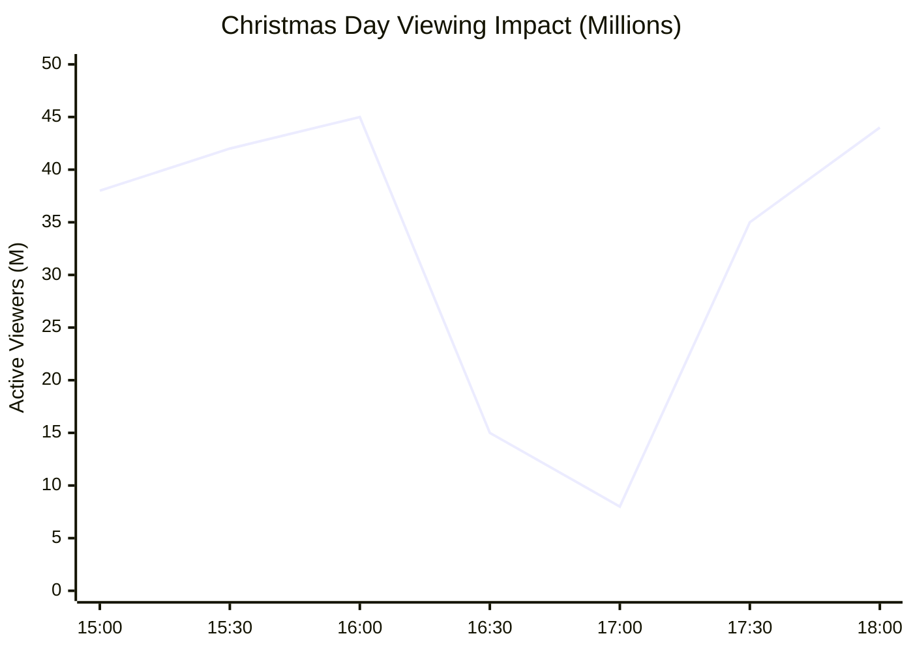
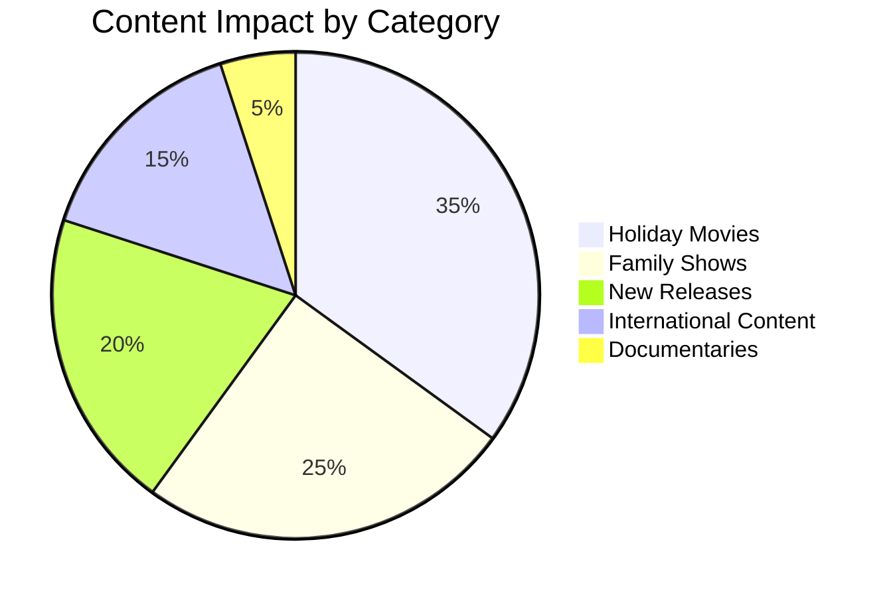

# Netflix Christmas Day Outage - December 25, 2022

**The 1-Hour CDN Cache Poisoning That Ruined Christmas Viewing**

## Incident Overview

| **Metric** | **Value** |
|------------|-----------||
| **Date** | December 25, 2022 |
| **Duration** | 1 hour during peak viewing |
| **Impact** | Video streaming failures globally |
| **Users Affected** | 40M+ simultaneous viewers |
| **Financial Impact** | $50M+ in lost engagement |
| **Root Cause** | CDN cache poisoning during deployment |
| **MTTR** | 62 minutes |
| **Key Issue** | Bad metadata cached globally |
| **Services Down** | Video playback, content discovery |

## Timeline - Christmas Day Streaming Crisis

```mermaid
gantt
    title Netflix Christmas Outage - December 25, 2022
    dateFormat HH:mm
    axisFormat %H:%M

    section Peak Viewing
    Christmas morning     :done, peak1, 10:00, 14:00
    Family viewing time   :done, peak2, 14:00, 18:00
    Prime time surge      :done, peak3, 18:00, 22:00

    section System Failure
    CDN deployment        :done, deploy1, 15:30, 15:45
    Cache poisoning       :done, poison1, 15:45, 16:15
    Global video failures :done, fail1, 16:15, 17:17

    section Recovery
    Cache invalidation    :done, fix1, 17:17, 17:30
    Service restoration   :done, restore1, 17:30, 18:00
```



## Streaming Infrastructure Cache Poisoning



## Christmas Day Viewing Impact

### Peak Viewing Hours Lost



### Content Categories Affected



## Recovery Process

```mermaid
timeline
    title CDN Cache Recovery

    section Problem Identification
        16:20 : Cache corruption detected
              : Bad metadata deployment
              : Global impact confirmed

    section Cache Invalidation
        16:45 : Begin global cache purge
              : Invalidate corrupted entries
              : Restart edge servers

    section Content Restoration
        17:00 : Fresh metadata deployment
              : Video assets re-cached
              : Playback testing

    section Full Recovery
        17:17 : All content accessible
              : Normal viewing restored
              : Cache healthy globally
```

## The Bottom Line

**This incident showed that CDN cache poisoning can instantly break streaming for millions during the most important viewing day of the year.**

**Key Takeaways:**
- CDN deployments need staging environments that match production
- Cache invalidation must be instantaneous for video platforms
- Holiday peak times require extra deployment caution
- Video metadata is as critical as the video content itself

**The $50M question:** How do you test CDN deployments at Christmas Day scale without affecting real users?

---

*"In streaming, cache poisoning doesn't just break websites - it breaks family time."*