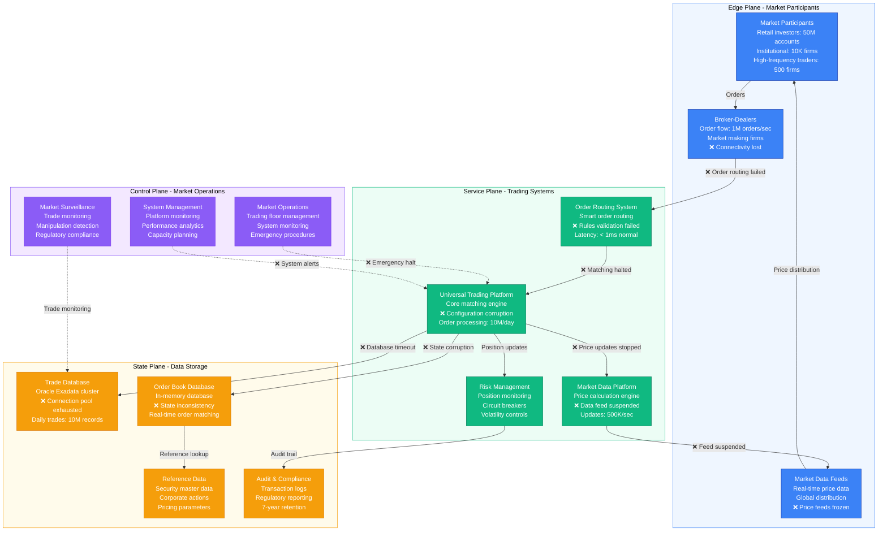
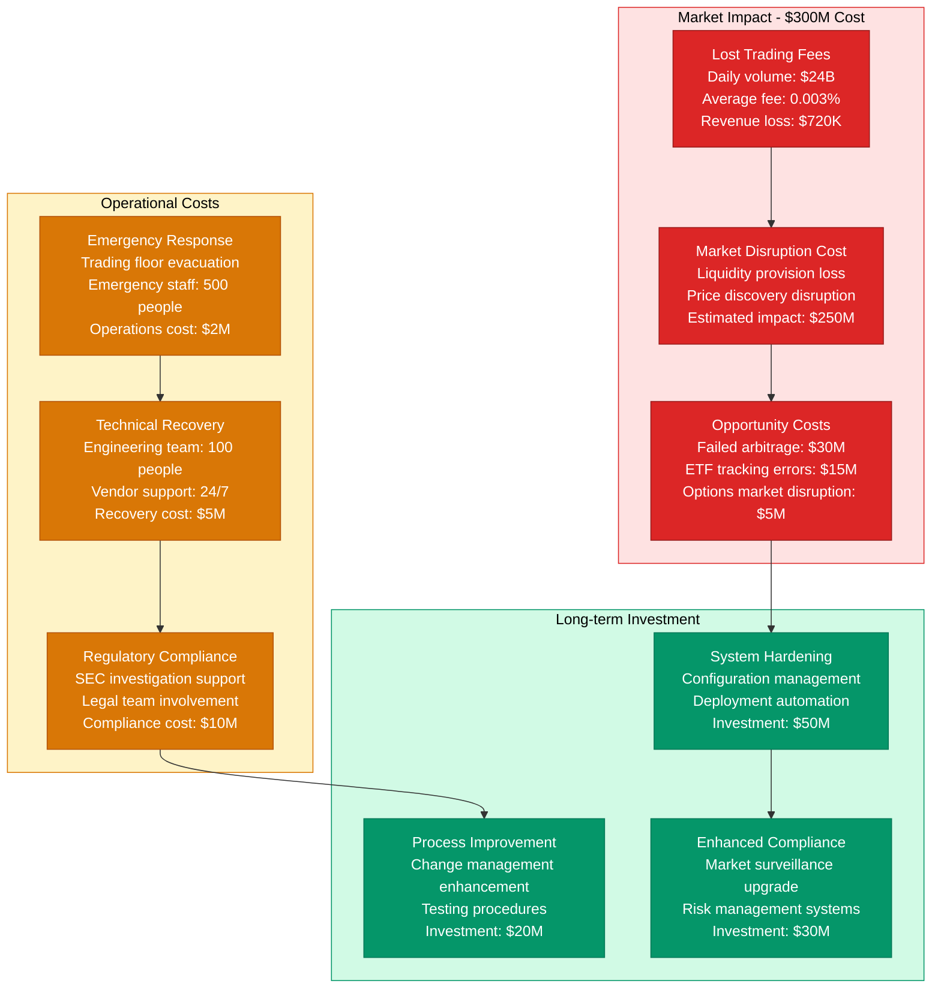

# NYSE July 2015 Trading Halt - Incident Anatomy

## Incident Overview

**Date**: July 8, 2015
**Duration**: 3 hours 38 minutes (11:32 - 15:10 EDT)
**Impact**: Complete trading halt on NYSE, $24B in daily trading volume affected
**Revenue Loss**: ~$300M (estimated market impact and trading fees lost)
**Root Cause**: Software upgrade deployment error affecting the Universal Trading Platform
**Regions Affected**: Global (NYSE is primary US stock exchange)
**MTTR**: 3 hours 38 minutes (218 minutes)
**MTTD**: 2 minutes (immediate detection as trading systems froze)
**RTO**: 4 hours (full trading restoration with market stability)
**RPO**: 0 (no trade data lost, but order book frozen)

## Incident Timeline & Response Flow

```mermaid
graph TB
    subgraph Detection[T+0: Detection Phase - 11:32 EDT]
        style Detection fill:#EFF6FF,stroke:#3B82F6,color:#000

        Start[11:32:00<br/>━━━━━<br/>Software Deployment<br/>Universal Trading Platform<br/>Configuration update pushed<br/>❌ Invalid parameters loaded]

        Alert1[11:34:00<br/>━━━━━<br/>Trading System Freeze<br/>Order matching engine halt<br/>Price discovery stopped<br/>Market makers disconnected]

        Alert2[11:36:00<br/>━━━━━<br/>Trading Halt Declared<br/>SEC notification sent<br/>Market operations suspended<br/>Emergency protocols activated]
    end

    subgraph Diagnosis[T+15min: Diagnosis Phase]
        style Diagnosis fill:#ECFDF5,stroke:#10B981,color:#000

        Incident[11:47:00<br/>━━━━━<br/>Crisis Response<br/>Trading floor evacuation<br/>Market surveillance alert<br/>Regulatory coordination]

        RootCause[12:15:00<br/>━━━━━<br/>Software Configuration Error<br/>Trading platform config corruption<br/>Order routing rules invalid<br/>Database connectivity lost]

        Impact[12:30:00<br/>━━━━━<br/>Market Impact Assessment<br/>$24B daily volume affected<br/>3000+ listed companies<br/>Global market uncertainty]
    end

    subgraph Mitigation[T+1hr: Mitigation Phase]
        style Mitigation fill:#FFFBEB,stroke:#F59E0B,color:#000

        Rollback[12:45:00<br/>━━━━━<br/>Configuration Rollback<br/>Revert to previous config<br/>Database consistency check<br/>System integrity validation]

        SystemTest[13:30:00<br/>━━━━━<br/>System Testing<br/>Order routing verification<br/>Price feed validation<br/>Market maker connectivity]

        LimitedReopen[14:15:00<br/>━━━━━<br/>Limited Reopening<br/>Selected stocks only<br/>Reduced order types<br/>Enhanced monitoring]
    end

    subgraph Recovery[T+3hr: Recovery Phase]
        style Recovery fill:#F3E8FF,stroke:#8B5CF6,color:#000

        FullReopen[14:50:00<br/>━━━━━<br/>Market Reopening<br/>All stocks trading<br/>Full order types active<br/>Normal operations resumed]

        MarketStab[15:05:00<br/>━━━━━<br/>Market Stabilization<br/>Price discovery normal<br/>Volume patterns typical<br/>Volatility contained]

        PostIncident[15:10:00<br/>━━━━━<br/>Operations Normal<br/>SEC debriefing<br/>Market surveillance review<br/>RCA initiated]
    end

    Start --> Alert1 --> Alert2
    Alert2 --> Incident --> RootCause --> Impact
    Impact --> Rollback --> SystemTest --> LimitedReopen
    LimitedReopen --> FullReopen --> MarketStab --> PostIncident

    %% Apply 4-plane colors
    classDef edgeStyle fill:#3B82F6,stroke:#1E40AF,color:#fff
    classDef serviceStyle fill:#10B981,stroke:#047857,color:#fff
    classDef stateStyle fill:#F59E0B,stroke:#D97706,color:#fff
    classDef controlStyle fill:#8B5CF6,stroke:#7C3AED,color:#fff

    class Start,Alert1,Alert2 edgeStyle
    class Incident,RootCause,Impact serviceStyle
    class Rollback,SystemTest,LimitedReopen stateStyle
    class FullReopen,MarketStab,PostIncident controlStyle
```

## Financial Market Infrastructure Analysis

## Trading System Failure Cascade & Recovery

```mermaid
graph TB
    subgraph T1[T+0min: Configuration Deployment]
        style T1 fill:#FEE2E2,stroke:#DC2626,color:#000

        ConfigDeploy[Configuration Deployment<br/>Universal Trading Platform update<br/>❌ Invalid parameters loaded<br/>Order routing rules corrupted]

        SystemFreeze[Trading System Freeze<br/>Order matching engine halt<br/>Price discovery stopped<br/>Database connections lost]
    end

    subgraph T2[T+5min: Market Impact]
        style T2 fill:#FED7AA,stroke:#EA580C,color:#000

        TradingHalt[Trading Halt Declaration<br/>All NYSE trading suspended<br/>Market makers disconnected<br/>Order flow stopped]

        MarketUncertainty[Market Uncertainty<br/>Price discovery halted<br/>Arbitrage opportunities frozen<br/>Global market concern]
    end

    subgraph T3[T+30min: Financial Consequences]
        style T3 fill:#FEF3C7,stroke:#D97706,color:#000

        LiquidityImpact[Liquidity Disruption<br/>$24B daily volume affected<br/>Market making suspended<br/>ETF creation/redemption halted]

        RegulatoryConcern[Regulatory Response<br/>SEC investigation initiated<br/>Market stability monitoring<br/>Systemic risk assessment]

        ReputationalDamage[Reputational Impact<br/>Market confidence shaken<br/>Competitor advantages<br/>International scrutiny]
    end

    subgraph Recovery[T+45min: System Recovery]
        style Recovery fill:#D1FAE5,stroke:#059669,color:#000

        ConfigRollback[Configuration Rollback<br/>Revert to previous version<br/>Database consistency check<br/>System integrity validation]

        TradingSystemTest[Trading System Testing<br/>Order routing verification<br/>Price feed validation<br/>Risk controls testing]

        PhaseReopen[Phased Market Reopening<br/>Selected stocks first<br/>Limited order types<br/>Enhanced monitoring]

        FullOperations[Full Market Operations<br/>All stocks trading<br/>Normal order types<br/>Price discovery restored]
    end

    ConfigDeploy --> SystemFreeze
    SystemFreeze --> TradingHalt
    TradingHalt --> MarketUncertainty
    MarketUncertainty --> LiquidityImpact
    LiquidityImpact --> RegulatoryConcern
    RegulatoryConcern --> ReputationalDamage

    ReputationalDamage --> ConfigRollback
    ConfigRollback --> TradingSystemTest
    TradingSystemTest --> PhaseReopen
    PhaseReopen --> FullOperations

    %% Apply failure severity colors
    classDef critical fill:#DC2626,stroke:#991B1B,color:#fff
    classDef major fill:#EA580C,stroke:#C2410C,color:#fff
    classDef minor fill:#D97706,stroke:#B45309,color:#fff
    classDef recovery fill:#059669,stroke:#047857,color:#fff

    class ConfigDeploy,SystemFreeze critical
    class TradingHalt,MarketUncertainty major
    class LiquidityImpact,RegulatoryConcern,ReputationalDamage minor
    class ConfigRollback,TradingSystemTest,PhaseReopen,FullOperations recovery
```

## Financial & Regulatory Impact Analysis

## Lessons Learned & Prevention

### Root Cause Analysis
- **Configuration Management**: Deployment process lacked proper validation of configuration parameters
- **Testing Inadequacy**: Production deployment occurred without comprehensive testing
- **Rollback Procedures**: No automated rollback mechanism for configuration changes
- **Change Management**: Insufficient change control for critical trading system updates

### Prevention Measures Implemented
- **Enhanced Testing**: Comprehensive pre-production testing environment matching production
- **Configuration Validation**: Automated validation of all configuration parameters before deployment
- **Automated Rollback**: Implemented automatic rollback triggers based on system health metrics
- **Change Control**: Enhanced change management process with multiple approval stages

### 3 AM Debugging Guide
1. **System Status**: Check Universal Trading Platform status dashboard
2. **Configuration Validation**: Verify all trading system configurations against baseline
3. **Database Connectivity**: Test database connections and query performance
4. **Order Flow**: Validate order routing rules and matching engine status
5. **Market Data**: Confirm price feed generation and distribution systems

**Incident Severity**: SEV-1 (Complete market trading halt affecting financial stability)
**Recovery Confidence**: High (configuration rollback + enhanced testing)
**Prevention Confidence**: High (automated validation + improved change control)