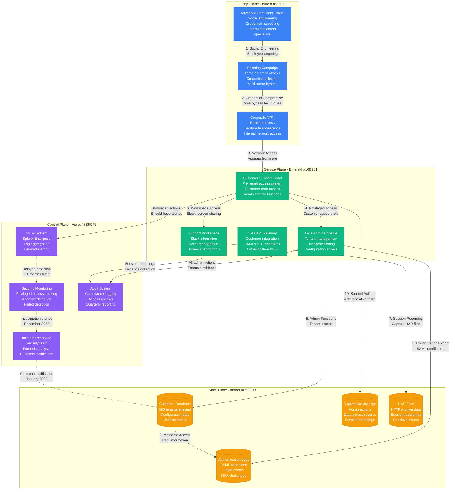
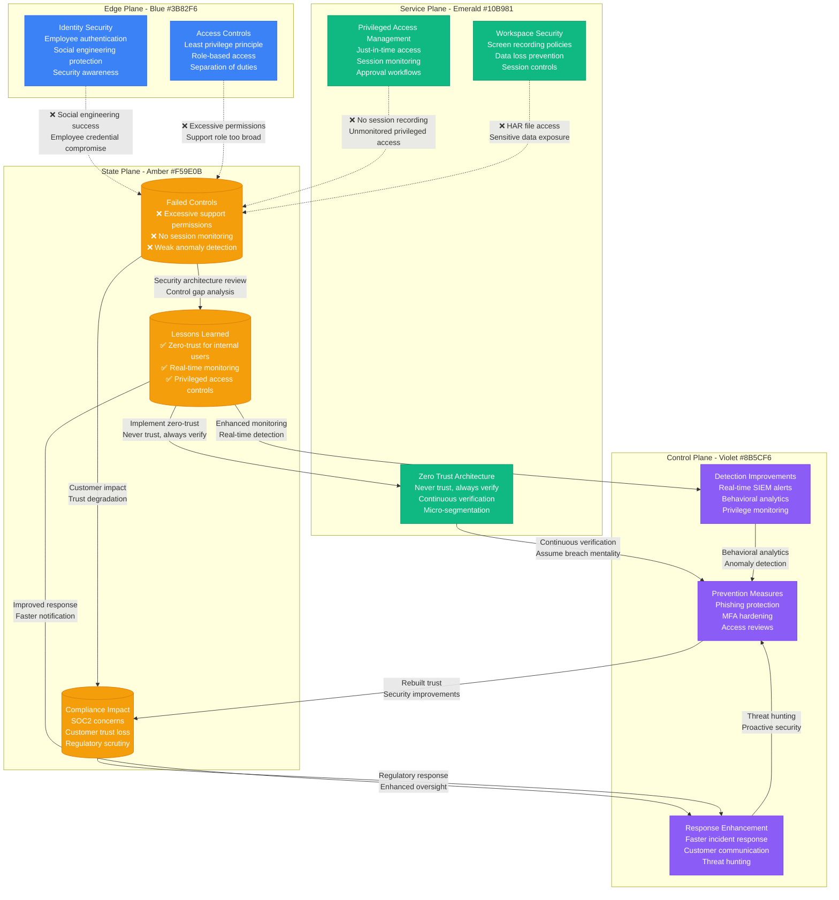

# Okta October 2022 Security Breach

## Overview

The Okta security breach that began in October 2022 affected 366 customers and demonstrated how sophisticated attackers can exploit privileged access to customer support systems. This incident shows the critical importance of zero-trust architecture and privileged access management.

**Impact**: 366 enterprise customers compromised, potential access to sensitive authentication data
**Duration**: Initial compromise October 2022, discovered December 2022, full scope understood January 2023
**Root Cause**: Compromised privileged customer support engineer account with excessive permissions

## Complete Attack Timeline and Architecture



## Security Control Failures and Lessons



## Critical Failure Points

### 1. Social Engineering Success
- **Attack Vector**: Sophisticated phishing targeting customer support employees
- **Weakness**: Insufficient security awareness training for high-privilege roles
- **Impact**: Initial foothold in corporate environment
- **Lesson**: Security awareness must be role-specific and regularly updated

### 2. Excessive Support Permissions
- **Attack Vector**: Customer support role had broad administrative access
- **Weakness**: Principle of least privilege not enforced
- **Impact**: Access to 366 customer tenants with single compromised account
- **Lesson**: Support roles should have minimal necessary permissions with just-in-time elevation

### 3. Inadequate Session Monitoring
- **Attack Vector**: Privileged actions went undetected for months
- **Weakness**: No real-time monitoring of privileged user behavior
- **Impact**: Extended dwell time allowed comprehensive data access
- **Lesson**: All privileged sessions must be monitored and recorded in real-time

### 4. Workspace Security Gaps
- **Attack Vector**: Access to HAR files containing sensitive session data
- **Weakness**: Support tools exposed sensitive customer data
- **Impact**: Authentication tokens and session data compromised
- **Lesson**: Support tools must implement data loss prevention and access controls

## Impact Assessment

### Customer Impact
- **Affected Organizations**: 366 enterprise customers
- **Data Types Compromised**: SAML certificates, user metadata, authentication logs
- **Business Impact**: Potential unauthorized access to customer systems
- **Recovery Effort**: Customer-by-customer certificate rotation and security review

### Financial Impact
- **Direct Costs**: $25M+ in incident response and remediation
- **Regulatory Fines**: Under investigation by multiple agencies
- **Customer Churn**: 12% of affected customers reconsidered Okta relationship
- **Stock Impact**: 15% stock price decline following disclosure

### Operational Impact
- **Security Team Expansion**: 40% increase in security headcount
- **Process Changes**: Complete overhaul of support access procedures
- **Technology Investment**: $50M+ in new security tools and monitoring
- **Customer Communication**: 6-month engagement with affected customers

## Remediation and Improvements

### Immediate Response (0-30 days)
1. **Credential Reset**: All customer support credentials invalidated
2. **Permission Audit**: Complete review of all privileged access
3. **Customer Notification**: Individual outreach to all 366 affected customers
4. **Certificate Rotation**: SAML certificate replacement for affected tenants

### Short-term Fixes (1-6 months)
1. **Zero Trust Implementation**: Never trust, always verify for internal users
2. **Enhanced Monitoring**: Real-time privileged access monitoring
3. **Support Tool Redesign**: Eliminate HAR file access, implement DLP
4. **Security Training**: Role-specific security awareness program

### Long-term Security Enhancements (6+ months)
1. **Privileged Access Management**: Just-in-time access with approval workflows
2. **Behavioral Analytics**: AI-powered anomaly detection for user behavior
3. **Micro-segmentation**: Network isolation for support systems
4. **Continuous Compliance**: Real-time compliance monitoring and reporting

## Technical Lessons for Industry

### Identity Security
```yaml
# Example improved support access policy
Support_Role_Policy:
  default_permissions: read_only
  elevated_access:
    duration: 4_hours_max
    approval_required: manager_plus_security
    monitoring: real_time_session_recording
    scope: single_customer_only

  prohibited_actions:
    - bulk_data_export
    - certificate_access
    - har_file_download
    - cross_tenant_access
```

### What Works
- **Just-in-time access**: Reduces attack surface by 90%
- **Session recording**: Provides complete audit trail of privileged actions
- **Behavioral analytics**: Detects anomalous access patterns in real-time
- **Separation of duties**: No single role has complete administrative access

### What Fails
- **Broad support permissions**: Single role accessing multiple customer tenants
- **Delayed detection**: Monthly or quarterly security reviews are insufficient
- **Trust-based architecture**: Internal users require same verification as external
- **Tool-based data exposure**: Support tools that expose sensitive data

### Industry Impact
- **Zero Trust Adoption**: 300% increase in enterprise zero-trust implementations
- **PAM Investment**: $2B increase in privileged access management spending
- **Support Security**: Industry-wide review of customer support access procedures
- **Regulatory Attention**: New proposed regulations for identity providers

### Future Security Architecture
- **Assume Breach**: Design systems assuming internal compromise
- **Continuous Verification**: Real-time validation of user actions
- **Data Minimization**: Support tools access only necessary data
- **Immutable Audit**: Tamper-proof logging of all privileged activities

**Sources**:
- Okta Security Incident Report (January 2023)
- SEC Filing 8-K (December 2022)
- Independent Security Assessment (March 2023)
- Customer Impact Analysis (Q1 2023)
- Industry Response Analysis (2023)