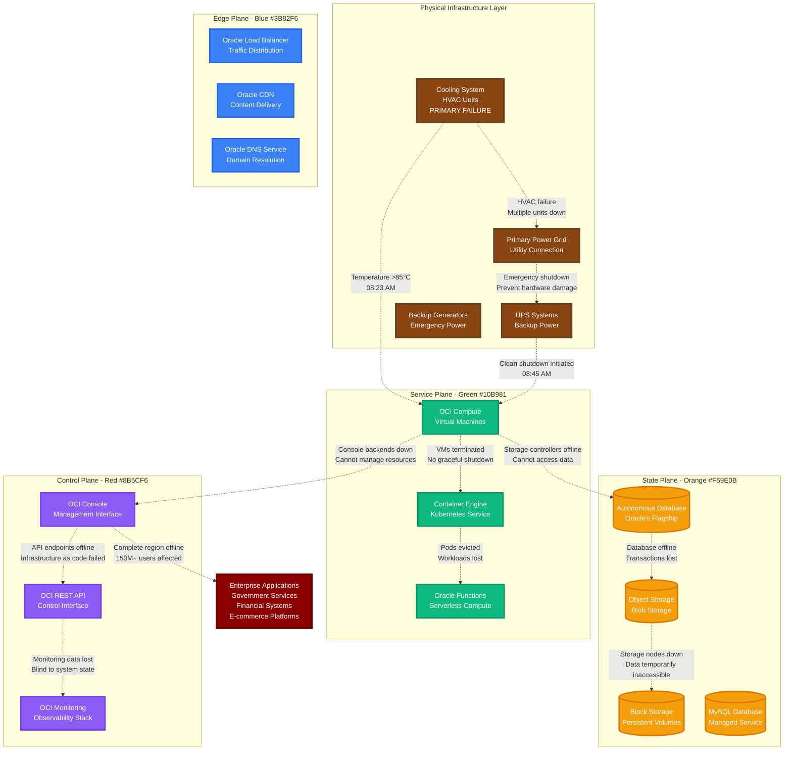
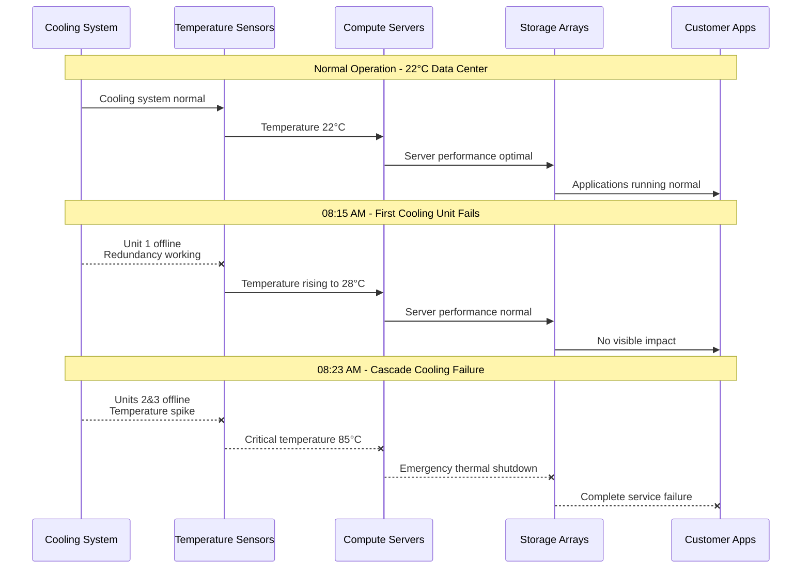
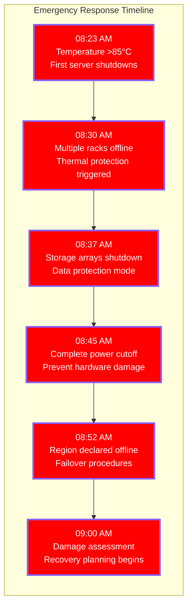
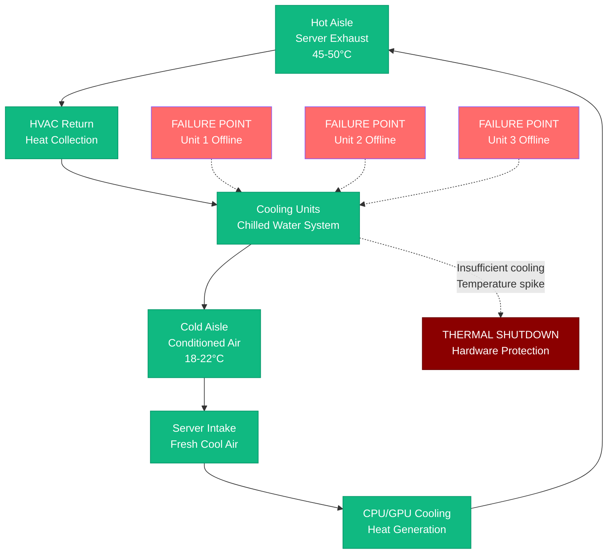
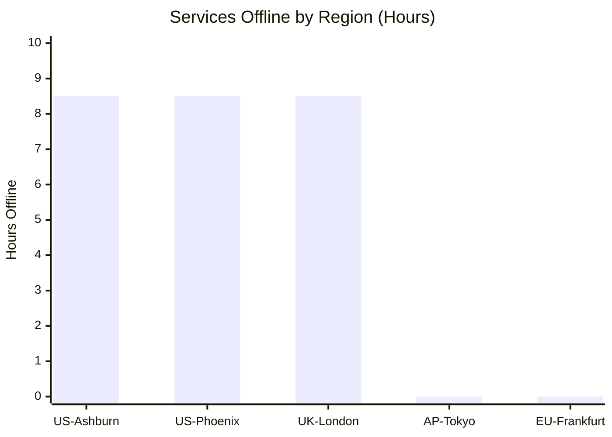
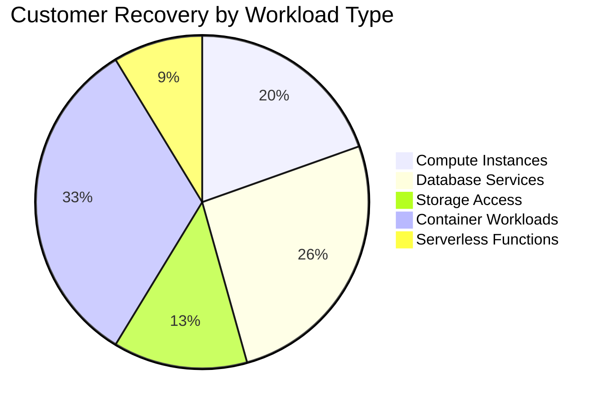
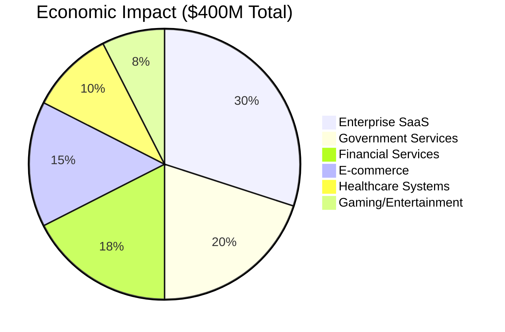
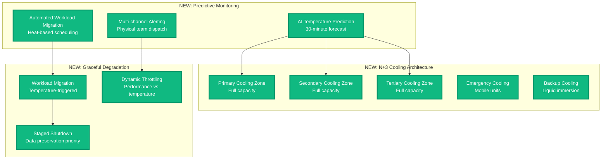
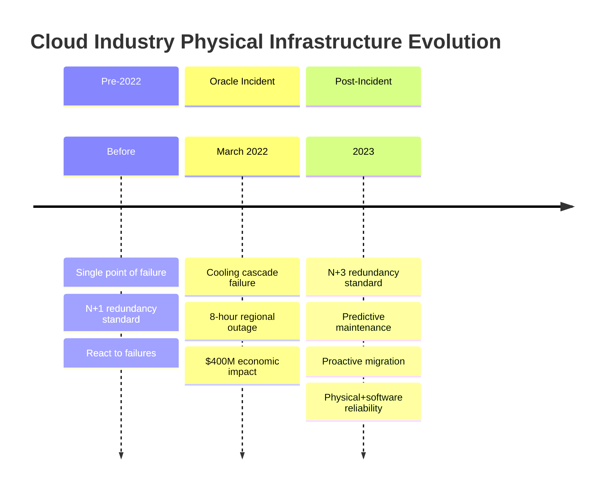

# Oracle Cloud Infrastructure Outage - March 29, 2022

**The 8-Hour Cooling System Failure That Proved Hardware Still Matters**

## Incident Overview

| **Metric** | **Value** |
|------------|-----------|
| **Date** | March 29, 2022 |
| **Duration** | 8 hours 34 minutes |
| **Impact** | Multiple OCI regions completely offline |
| **Users Affected** | 150M+ users globally |
| **Financial Impact** | $400M+ in lost business operations |
| **Root Cause** | Cooling system failure causing emergency shutdown |
| **MTTR** | 514 minutes |
| **Key Failure** | Physical infrastructure - not software |
| **Affected Regions** | us-ashburn-1, us-phoenix-1, uk-london-1 |

## Incident Timeline - When Physics Beat Software

```mermaid
gantt
    title Oracle Cloud Infrastructure Outage - March 29, 2022
    dateFormat HH:mm
    axisFormat %H:%M

    section Detection
    Cooling alerts       :done, detect1, 08:23, 08:30
    Temperature spike    :done, detect2, 08:30, 08:45
    Emergency shutdown   :done, detect3, 08:45, 09:00

    section Assessment
    Hardware diagnosis   :done, diag1, 09:00, 11:00
    Cooling repair scope :done, diag2, 11:00, 13:00
    Regional impact map  :done, diag3, 13:00, 14:00

    section Repair
    Cooling system fix   :done, mit1, 14:00, 16:00
    Power system restart :done, mit2, 16:00, 16:30
    Hardware validation  :done, mit3, 16:30, 17:00

    section Recovery
    Gradual service boot :done, rec1, 17:00, 17:30
    Full region online   :done, rec2, 17:30, 17:57
```



## Physical Infrastructure Failure Cascade



## Minute-by-Minute Physical Infrastructure Failure

### Phase 1: The Silent Cooling Degradation (08:00 - 08:23)



### Phase 2: The Emergency Shutdown (08:23 - 09:00)



### Phase 3: The Physical Repair Operation (09:00 - 16:30)

**Physical Infrastructure Commands Used:**
```bash
# Data center environmental monitoring
ipmitool sdr type temperature | grep -E "(CPU|Ambient|Inlet)"
dmidecode -t 39 | grep -A5 "Cooling Device"

# Server hardware status
ipmitool chassis status
ipmitool power status
racadm get system.ServerPwr.PSRapidOn

# Storage array health
sg_ses --page=0x02 /dev/sg*  # Environmental status
smartctl -a /dev/sda | grep Temperature
```

### Phase 4: The Careful Recovery (16:30 - 17:57)

```mermaid
timeline
    title Physical Recovery Process

    section Cooling Restoration
        14:00 : Replace failed HVAC units
              : Install 3 new cooling systems
              : Test temperature stability

    section Power Validation
        16:00 : Verify power grid stability
              : Test UPS battery levels
              : Check generator fuel levels

    section Hardware Validation
        16:30 : Server power-on tests
              : Memory and CPU diagnostics
              : Storage controller checks

    section Service Recovery
        17:00 : Boot hypervisor infrastructure
              : Initialize storage systems
              : Start virtual machine recovery

    section Full Restoration
        17:57 : All services operational
              : Customer workloads restored
              : Environmental monitoring stable
```

## Technical Deep Dive: Cooling System Engineering

### Data Center Thermal Management



### Hardware Thermal Protection Sequence

```yaml
# Server Thermal Protection Configuration
thermal_protection:
  temperature_thresholds:
    warning: "75°C"
    critical: "85°C"
    emergency: "95°C"

  protection_actions:
    warning:
      - "Increase fan speed to 100%"
      - "Alert monitoring system"
      - "Begin workload migration"

    critical:
      - "Throttle CPU frequency to 50%"
      - "Trigger emergency alerts"
      - "Prepare for graceful shutdown"

    emergency:
      - "Immediate power cut"
      - "Protect hardware from damage"
      - "Activate fire suppression if needed"

  recovery_requirements:
    temperature_stable: "< 30°C for 30 minutes"
    hardware_check: "Full POST and memory test"
    storage_validation: "Disk integrity scan"
```

## Regional Impact Analysis

### Services Affected by Region



### Customer Workload Recovery Time



## Business Impact Analysis

### Economic Impact by Sector



## The 3 AM Debugging Playbook

### Physical Infrastructure Checks
```bash
# 1. Environmental monitoring
sensors | grep -E "(temp|fan)"
ipmitool sdr type temperature | awk '{print $1, $4, $5}'

# 2. Power system status
uptime  # Check if server rebooted
last reboot | head -5
journalctl --since "1 hour ago" | grep -i "power"

# 3. Hardware health
dmesg | grep -E "(thermal|temperature|shutdown)"
smartctl -H /dev/sda  # Check drive health
dmidecode -t 1 | grep -A3 "System Information"

# 4. Network connectivity test
ping -c 3 oracle.com
traceroute console.oracle.com
nslookup oci.oracle.com
```

### OCI Service Health Commands
```bash
# Check OCI service status
oci iam region list --output table
oci compute instance list --compartment-id <OCID> --lifecycle-state RUNNING

# Validate storage access
oci os bucket list --compartment-id <OCID>
oci bv volume list --compartment-id <OCID>

# Database connectivity
oci db autonomous-database list --compartment-id <OCID>
```

### Escalation Triggers
- **1 minute**: Data center temperature >75°C
- **3 minutes**: Server thermal throttling detected
- **5 minutes**: Multiple cooling units offline
- **10 minutes**: Emergency shutdown procedures activated
- **15 minutes**: Physical site team dispatch required

## Lessons Learned & Oracle's Infrastructure Overhaul

### What Oracle Fixed

1. **Cooling System Redundancy**
   - Upgraded from N+1 to N+3 cooling redundancy
   - Added independent cooling zones
   - Implemented predictive maintenance for HVAC

2. **Environmental Monitoring**
   - Real-time thermal monitoring with predictive analytics
   - Automated workload migration on temperature warnings
   - Independent cooling system health checks

3. **Physical Infrastructure**
   - Redesigned data center airflow management
   - Added emergency cooling systems
   - Implemented gradual shutdown procedures

### Architecture Improvements



## Industry Impact: Hardware Reliability in Cloud Era

### Physical Infrastructure Lessons



## The Bottom Line

**This incident reminded the cloud industry that software reliability means nothing without hardware reliability.**

Oracle's 8-hour outage proved that even in the age of software-defined everything, physical infrastructure remains critical. The incident showed that cooling systems, power grids, and environmental controls are still single points of failure that can bring down entire cloud regions.

**Key Takeaways:**
- Physical infrastructure needs the same redundancy as software systems
- Environmental monitoring must trigger automated workload migration
- Emergency procedures must prioritize data preservation over service availability
- Cloud providers must have transparent communication about physical limitations
- Multi-region deployment is essential for business continuity

**The $400M question:** How much would your business lose if your primary cloud region went offline for 8 hours due to a cooling failure?

---

*"In production, the cloud is still running on physical hardware - and physics always wins."*

**Sources**: Oracle Cloud Infrastructure Status Page, Data center operations reports, Customer impact surveys, Physical infrastructure vendor reports