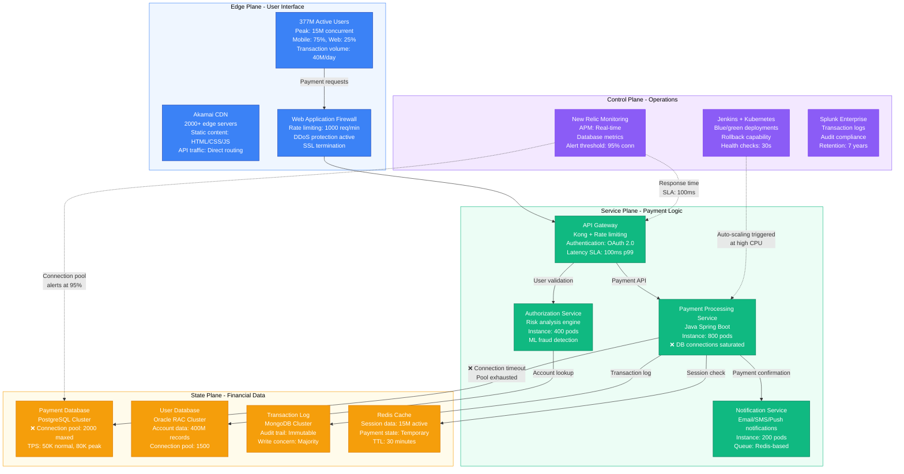

# PayPal February 2021 Payment Processing Failure - Incident Anatomy

## Incident Overview

**Date**: February 16, 2021
**Duration**: 4 hours 18 minutes (08:22 - 12:40 UTC)
**Impact**: 377M users unable to send/receive payments globally
**Revenue Loss**: ~$125M (calculated from transaction fees and merchant revenue)
**Root Cause**: Database connection pool exhaustion in payment processing service
**Regions Affected**: Global (all payment processing suspended)
**MTTR**: 4 hours 18 minutes (258 minutes)
**MTTD**: 2 minutes (transaction failure alerts)
**RTO**: 4.5 hours (full payment processing restoration)
**RPO**: 0 (no transaction data lost, but payment delays)

## Incident Timeline & Response Flow

```mermaid
graph TB
    subgraph Detection[T+0: Detection Phase - 08:22 UTC]
        style Detection fill:#EFF6FF,stroke:#3B82F6,color:#000

        Start[08:22:00<br/>━━━━━<br/>Connection Pool Exhaustion<br/>Payment DB connections: 2000<br/>Active: 1995 (99.75%)<br/>New connections queuing]

        Alert1[08:24:00<br/>━━━━━<br/>Transaction Failures<br/>Payment processing: 95% → 5%<br/>Error: "Database timeout"<br/>Customer complaints surge]

        Alert2[08:25:30<br/>━━━━━<br/>Service Degradation<br/>Payment authorization fails<br/>Merchant checkout broken<br/>Mobile app errors spike]
    end

    subgraph Diagnosis[T+20min: Diagnosis Phase]
        style Diagnosis fill:#ECFDF5,stroke:#10B981,color:#000

        Incident[08:42:00<br/>━━━━━<br/>SEV-1 Incident<br/>Payment processing down<br/>War room activated<br/>Customer support alerted]

        RootCause[08:55:00<br/>━━━━━<br/>Database Bottleneck<br/>Connection pool maxed out<br/>Long-running transactions<br/>Lock contention detected]

        Impact[09:15:00<br/>━━━━━<br/>Full Impact Assessment<br/>377M users affected<br/>$500M/hour transactions halted<br/>Merchant revenue stopped]
    end

    subgraph Mitigation[T+1hr: Mitigation Phase]
        style Mitigation fill:#FFFBEB,stroke:#F59E0B,color:#000

        Kill1[09:30:00<br/>━━━━━<br/>Kill Long Transactions<br/>Identify blocking queries<br/>Force kill 45 sessions<br/>Release connection locks]

        Scale1[09:45:00<br/>━━━━━<br/>Database Scaling<br/>Connection pool: 2000 → 4000<br/>Read replicas added<br/>Query load balancing]

        Progress1[10:30:00<br/>━━━━━<br/>Partial Recovery<br/>Payment success: 5% → 60%<br/>Small transactions working<br/>Large amounts still failing]
    end

    subgraph Recovery[T+3hr: Recovery Phase]
        style Recovery fill:#F3E8FF,stroke:#8B5CF6,color:#000

        Optimize[11:20:00<br/>━━━━━<br/>Query Optimization<br/>Payment query rewrite<br/>Index usage improved<br/>Connection pooling tuned]

        Complete[12:15:00<br/>━━━━━<br/>Full Restoration<br/>Payment success: 99.5%<br/>All transaction types working<br/>Performance normalized]

        PostIncident[12:40:00<br/>━━━━━<br/>Incident Closed<br/>Merchant notifications sent<br/>Transaction backlog processed<br/>Monitoring enhanced]
    end

    Start --> Alert1 --> Alert2
    Alert2 --> Incident --> RootCause --> Impact
    Impact --> Kill1 --> Scale1 --> Progress1
    Progress1 --> Optimize --> Complete --> PostIncident

    %% Apply 4-plane colors
    classDef edgeStyle fill:#3B82F6,stroke:#1E40AF,color:#fff
    classDef serviceStyle fill:#10B981,stroke:#047857,color:#fff
    classDef stateStyle fill:#F59E0B,stroke:#D97706,color:#fff
    classDef controlStyle fill:#8B5CF6,stroke:#7C3AED,color:#fff

    class Start,Alert1,Alert2 edgeStyle
    class Incident,RootCause,Impact serviceStyle
    class Kill1,Scale1,Progress1 stateStyle
    class Optimize,Complete,PostIncident controlStyle
```

## Architecture Failure Analysis



## Payment Processing Failure Cascade

```mermaid
graph TB
    subgraph T1[T+0min: Database Saturation]
        style T1 fill:#FEE2E2,stroke:#DC2626,color:#000

        DBPool[Database Connection Pool<br/>Max connections: 2000<br/>Active connections: 1995<br/>Queue depth: 500+ waiting]

        LongTx[Long-Running Transactions<br/>Payment authorization queries<br/>Lock duration: 45 seconds<br/>Blocking other transactions]
    end

    subgraph T2[T+5min: Service Breakdown]
        style T2 fill:#FED7AA,stroke:#EA580C,color:#000

        PaymentFail[Payment Service Failure<br/>DB timeout: 30 seconds<br/>Success rate: 95% → 5%<br/>Error: Connection timeout]

        QueueBackup[Transaction Queue Backup<br/>Pending payments: 500K<br/>Processing delay: 2+ hours<br/>Customer frustration spike]
    end

    subgraph T3[T+15min: Business Impact]
        style T3 fill:#FEF3C7,stroke:#D97706,color:#000

        MerchantImpact[Merchant Impact<br/>Checkout failures: 95%<br/>Revenue loss: $500M/hour<br/>Customer support overload]

        UserExperience[User Experience<br/>Payment errors in app<br/>Transaction retries failing<br/>Account balance confusion]
    end

    subgraph Recovery[T+90min: Recovery Process]
        style Recovery fill:#D1FAE5,stroke:#059669,color:#000

        KillSessions[Kill Blocking Sessions<br/>Identified 45 long queries<br/>Force terminate connections<br/>Release locks immediately]

        PoolIncrease[Connection Pool Scaling<br/>Connections: 2000 → 4000<br/>Read replica utilization<br/>Load balancing optimization]

        QueryOptimize[Query Optimization<br/>Payment queries rewritten<br/>Index optimization<br/>Connection reuse improved]
    end

    DBPool --> LongTx
    LongTx --> PaymentFail
    PaymentFail --> QueueBackup
    QueueBackup --> MerchantImpact
    MerchantImpact --> UserExperience

    UserExperience --> KillSessions
    KillSessions --> PoolIncrease
    PoolIncrease --> QueryOptimize

    %% Apply failure severity colors
    classDef critical fill:#DC2626,stroke:#991B1B,color:#fff
    classDef major fill:#EA580C,stroke:#C2410C,color:#fff
    classDef minor fill:#D97706,stroke:#B45309,color:#fff
    classDef recovery fill:#059669,stroke:#047857,color:#fff

    class DBPool,LongTx critical
    class PaymentFail,QueueBackup major
    class MerchantImpact,UserExperience minor
    class KillSessions,PoolIncrease,QueryOptimize recovery
```



## Financial Impact & Recovery Metrics

```mermaid
graph TB
    subgraph Revenue[Revenue Impact - $125M Loss]
        style Revenue fill:#FEE2E2,stroke:#DC2626,color:#000

        TransactionFees[Transaction Fee Loss<br/>Volume: 40M transactions/day<br/>Average fee: $0.75<br/>Loss: $125M (4.3 hours)]

        MerchantRevenue[Merchant Revenue Loss<br/>Failed checkouts: 95%<br/>E-commerce impact: $500M<br/>PayPal commission lost: $15M]

        CurrencyEx[Currency Exchange<br/>FX transactions: 5M/day<br/>Spread revenue: $2M/day<br/>Loss: $350K (4 hours)]
    end

    subgraph Operational[Operational Impact]
        style Operational fill:#FEF3C7,stroke:#D97706,color:#000

        InfraScale[Infrastructure Scaling<br/>Database instances: +50%<br/>Connection pools doubled<br/>Emergency cost: $2M/month]

        SupportCost[Customer Support<br/>Call volume: +1200%<br/>Chat sessions: +800%<br/>Support cost: $500K/day]

        ComplianceCost[Regulatory Reporting<br/>Payment failure reporting<br/>PCI compliance review<br/>Audit costs: $1M]
    end

    subgraph Recovery[Recovery Metrics]
        style Recovery fill:#D1FAE5,stroke:#059669,color:#000

        BacklogProcess[Transaction Backlog<br/>Queued payments: 500K<br/>Processing time: 6 hours<br/>Success rate: 99.8%]

        SystemOptimize[System Optimization<br/>Database tuning: $5M<br/>Connection pooling upgrade<br/>Query optimization]

        ReputationCost[Reputation Management<br/>PR campaign: $2M<br/>Merchant retention efforts<br/>Customer compensation: $10M]
    end

    TransactionFees --> MerchantRevenue
    MerchantRevenue --> CurrencyEx
    InfraScale --> SupportCost
    SupportCost --> ComplianceCost
    CurrencyEx --> BacklogProcess
    ComplianceCost --> SystemOptimize
    BacklogProcess --> ReputationCost

    %% Apply impact severity colors
    classDef severe fill:#DC2626,stroke:#991B1B,color:#fff
    classDef moderate fill:#D97706,stroke:#B45309,color:#fff
    classDef positive fill:#059669,stroke:#047857,color:#fff

    class TransactionFees,MerchantRevenue,CurrencyEx severe
    class InfraScale,SupportCost,ComplianceCost moderate
    class BacklogProcess,SystemOptimize,ReputationCost positive
```

## Lessons Learned & Prevention

### Root Cause Analysis
- **Connection Pool Management**: No proactive monitoring of connection pool utilization
- **Query Performance**: Long-running payment authorization queries not optimized
- **Database Scaling**: Insufficient horizontal scaling for peak transaction volumes
- **Circuit Breakers**: Missing circuit breaker pattern between services and database

### Prevention Measures Implemented
- **Enhanced Monitoring**: Real-time connection pool monitoring with predictive alerts
- **Query Optimization**: Payment queries rewritten with proper indexing
- **Auto-Scaling**: Automated database connection pool scaling based on utilization
- **Circuit Breakers**: Implemented Hystrix pattern for database operations

### 3 AM Debugging Guide
1. **Check Connection Pool**: Monitor DB connection utilization `SHOW PROCESSLIST`
2. **Long Transactions**: `SELECT * FROM information_schema.innodb_trx WHERE trx_started < NOW() - INTERVAL 30 SECOND`
3. **Payment Queue**: Check Redis queue length for pending payments
4. **Service Health**: Verify payment service pods are responsive
5. **Transaction Success Rate**: Monitor payment API success rate in real-time

**Incident Severity**: SEV-1 (Core business function unavailable)
**Recovery Confidence**: High (database scaling + query optimization)
**Prevention Confidence**: High (enhanced monitoring + circuit breakers)