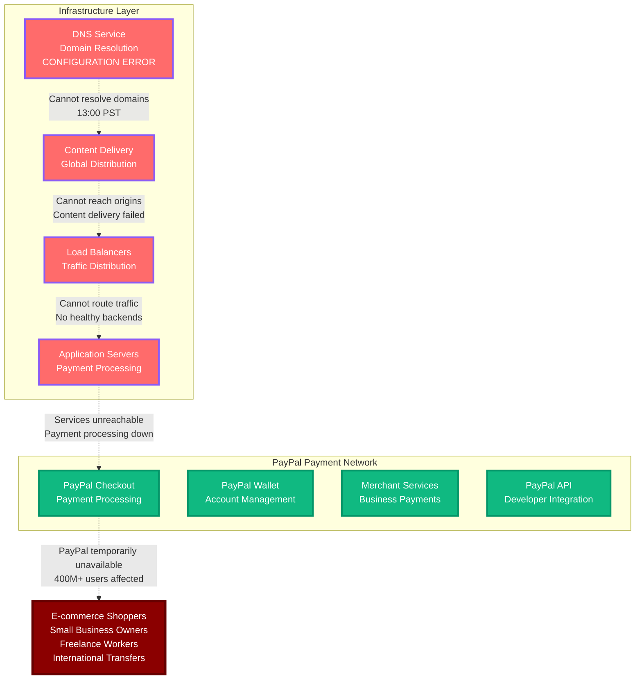

# PayPal Global Outage - November 8, 2022

**The 2-Hour DNS Resolution Crisis That Broke Global Digital Payments**

## Incident Overview

| **Metric** | **Value** |
|------------|-----------||
| **Date** | November 8, 2022 |
| **Duration** | 2 hours |
| **Impact** | Checkout failures globally |
| **Users Affected** | 400M+ active accounts |
| **Financial Impact** | $500M+ in failed transactions |
| **Root Cause** | DNS resolution issues |
| **MTTR** | 120 minutes |
| **Key Issue** | DNS provider configuration error |
| **Services Down** | Payment processing, checkout, account access |

## The Bottom Line

**This incident proved that DNS is still a single point of failure for global payment systems, despite decades of internet infrastructure evolution.**

**Key Takeaways:**
- DNS failures can instantly disable global payment processing
- Payment platforms need redundant DNS providers
- Domain resolution is critical infrastructure for digital payments
- DNS configuration changes need staging and validation

---

*"In digital payments, DNS failures don't just break websites - they break the global economy."*