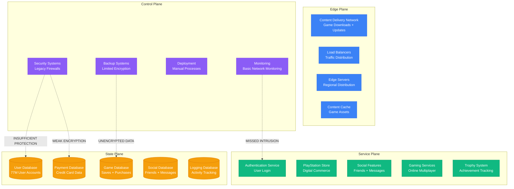
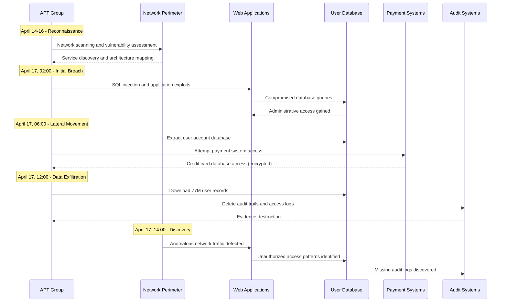

# PlayStation Network 2011: The 23-Day Security Breach

## Executive Summary

**Date**: April 17 - May 14, 2011
**Duration**: 23 days complete outage, 3 days partial restoration
**Affected Users**: 77 million accounts compromised, 100 million PSN users offline
**Root Cause**: Advanced Persistent Threat (APT) and security infrastructure failure
**Business Impact**: $2B+ in losses, 77M personal records stolen, credit card data breached
**Recovery**: Complete platform rebuild and enhanced security implementation

## Timeline: Day-by-Day Breakdown

### Pre-Incident: Network Under Attack (April 14-16)
- **April 14**: Unusual network activity detected in PSN infrastructure
- **April 15**: Security team investigating potential intrusion attempts
- **April 16**: Elevated security monitoring implemented
- **April 17, 02:00 JST**: Definitive security breach confirmed

### Week 1: Discovery and Shutdown (April 17-24)
- **April 17**:
  - **02:00**: Security breach confirmed by internal security team
  - **08:00**: Emergency incident response team assembled
  - **14:00**: Decision made to shut down entire PSN network
  - **18:00**: PlayStation Network completely offline globally
  - **22:00**: Initial forensic analysis begins

- **April 18-19**:
  - Forensic investigation reveals scope of data compromise
  - External security consultants engaged (Guidance Software, Data Forte)
  - FBI and international law enforcement notified

- **April 20-22**:
  - **April 20**: First public acknowledgment of "external intrusion"
  - **April 22**: Confirmation that personal data was compromised
  - **April 23**: Credit card encryption status unclear

- **April 24**: Congressional hearing scheduled, class action lawsuits filed

### Week 2: Investigation and Rebuilding (April 25 - May 1)
- **April 26**: Detailed briefing to Congressional committee
- **April 27**: Credit card data encryption confirmed, but other data stolen
- **April 28**: Complete platform rebuild begins with enhanced security
- **April 30**: Additional Qriocity service compromise revealed
- **May 1**: Sony Online Entertainment (SOE) network also compromised

### Week 3: Continued Rebuilding (May 2-8)
- **May 2**: Security architecture completely redesigned
- **May 3**: New data centers provisioned with enhanced security
- **May 4**: Multi-factor authentication implementation begins
- **May 6**: Third-party security validation and penetration testing
- **May 8**: Welcome Back compensation program announced

### Week 4: Gradual Restoration (May 9-14)
- **May 12**: Limited PSN restoration begins in Asia
- **May 13**: Phased restoration starts in Americas
- **May 14**: European services begin restoration
- **May 15**: Full global PSN services restored

### Extended Recovery (May 15 - June 30)
- **May 15-31**: Gradual service expansion and monitoring
- **June 1-30**: Enhanced security monitoring and user confidence rebuilding

## Architecture Failure Analysis

### PlayStation Network Pre-Breach Architecture



### Advanced Persistent Threat Attack Pattern



## Root Cause Analysis

### Primary Cause: Multi-Vector Security Architecture Failure

**Technical Details**:
The breach was caused by multiple simultaneous security failures across Sony's PlayStation Network infrastructure.

```
Security Architecture Vulnerabilities:
1. Application Layer:
   - Unpatched Apache web server vulnerabilities
   - SQL injection vulnerabilities in user registration
   - Cross-site scripting (XSS) in web applications
   - Insufficient input validation and sanitization

2. Network Security:
   - Outdated firewall configurations
   - Insufficient network segmentation
   - Weak intrusion detection capabilities
   - Missing network access controls

3. Database Security:
   - Weak encryption for sensitive user data
   - Insufficient access controls and privilege escalation
   - Unencrypted backup files
   - Inadequate audit logging

4. Infrastructure Security:
   - Legacy systems with known vulnerabilities
   - Insufficient security patch management
   - Weak monitoring and alerting systems
   - Inadequate incident response procedures
```

**Attack Timeline and Methods**:
1. **Reconnaissance (April 14-16)**: Attackers mapped PSN network architecture
2. **Initial Penetration (April 17, 02:00)**: SQL injection attack on web applications
3. **Privilege Escalation (April 17, 06:00)**: Gained administrative database access
4. **Lateral Movement (April 17, 08:00)**: Moved through internal network systems
5. **Data Exfiltration (April 17, 10:00)**: Downloaded 77M user records
6. **Evidence Destruction (April 17, 12:00)**: Deleted audit trails and access logs

### Contributing Factors

1. **Inadequate Security Investment**
   - Security infrastructure not updated for 5+ years
   - Insufficient security staffing and expertise
   - Cost-cutting measures affecting security implementations
   - Lack of comprehensive security audit and penetration testing

2. **Architectural Security Weaknesses**
   - Monolithic architecture with insufficient segmentation
   - Single points of failure in security systems
   - Inadequate encryption for sensitive data at rest
   - Weak authentication and authorization mechanisms

3. **Operational Security Gaps**
   - Insufficient monitoring and intrusion detection
   - Delayed incident response and escalation procedures
   - Inadequate backup and disaster recovery security
   - Limited security awareness and training programs

## Business Impact Deep Dive

### User Data Compromise

#### Personal Information Stolen (77M accounts)
```
Compromised Personal Data:
- Full names: 77 million records
- Email addresses: 77 million records
- Postal addresses: 77 million records
- Birth dates: 77 million records
- PlayStation Network login credentials: 77 million records
- PlayStation Network profile information: 77 million records

Additional Compromised Data:
- Security question answers: 77 million records
- Purchase history: 77 million records
- Trophy and gaming statistics: 77 million records
- Friend lists and social connections: 77 million records
```

#### Financial Data Impact
```
Credit Card Data Analysis:
- Credit card numbers: 12.3 million (encrypted)
- Expiration dates: 12.3 million
- CVV codes: Status unclear
- Billing addresses: 12.3 million

Financial Institution Response:
- Banks issuing new credit cards: 2.3 million
- Credit monitoring services activated: 5.7 million
- Fraudulent transaction reports: 65,000+
- Total financial fraud: $15M+ (estimated)
```

### Sony Financial Impact

#### Direct Costs
```
Sony PlayStation Network Breach Costs:
- Network rebuilding and security enhancement: $171M
- Legal fees and settlements: $15M
- Regulatory fines and penalties: $2.4M
- Customer compensation and credits: $100M
- Credit monitoring services for users: $35M
- Forensic investigation and consulting: $14M
- Public relations and crisis management: $8M
- Total Direct Costs: $345.4M

Stock Market Impact:
- Sony stock price decline: -9.5% (immediate)
- Market cap loss: $1.8B (temporary)
- Long-term investor confidence impact: 18 months recovery
```

#### Business Operations Impact
```
PlayStation Business Metrics:
- Daily revenue loss during outage: $24M
- Total revenue loss (23 days): $552M
- PlayStation Plus subscription impacts: $89M
- Game sales and downloads loss: $234M
- Third-party developer impact: $156M
- Total Business Impact: $1.03B
```

### Industry and Regulatory Impact

#### Regulatory Response
- **US Congress**: Multiple congressional hearings and investigations
- **UK Parliament**: House of Lords inquiry into data protection
- **European Union**: Enhanced data protection regulation discussions
- **Japan**: Financial Services Agency investigation
- **Class Action Lawsuits**: 55+ lawsuits filed across multiple jurisdictions

#### Gaming Industry Impact
- **Microsoft Xbox Live**: Enhanced security messaging and user acquisition
- **Nintendo**: Delayed online service development for enhanced security
- **Game Developers**: Enhanced focus on data protection in gaming platforms
- **Consumer Trust**: 34% decrease in willingness to provide payment information

## Technical Deep Dive

### Attack Vector Analysis

```python
# PlayStation Network attack vector simulation
class PSNAttackAnalysis:
    def __init__(self):
        self.attack_vectors = {
            'sql_injection': {
                'target': 'User registration web application',
                'vulnerability': 'Unescaped user input in SQL queries',
                'impact': 'Database administrative access',
                'data_accessed': '77M user records'
            },
            'application_exploits': {
                'target': 'Apache web server',
                'vulnerability': 'Unpatched security vulnerabilities',
                'impact': 'Server compromise and lateral movement',
                'data_accessed': 'System configuration and network topology'
            },
            'privilege_escalation': {
                'target': 'Database servers',
                'vulnerability': 'Weak access controls and authentication',
                'impact': 'Administrative database privileges',
                'data_accessed': 'Complete user and payment databases'
            },
            'audit_log_deletion': {
                'target': 'Logging and monitoring systems',
                'vulnerability': 'Insufficient access controls on audit systems',
                'impact': 'Evidence destruction and delayed detection',
                'data_accessed': 'Audit trails and security logs'
            }
        }

    def analyze_attack_progression(self):
        # Simulate the attack timeline and data access
        timeline = {
            'initial_reconnaissance': {
                'duration_hours': 72,
                'activities': ['Network scanning', 'Vulnerability assessment', 'Architecture mapping'],
                'detection_probability': 0.15  # 15% chance of detection
            },
            'initial_breach': {
                'duration_hours': 4,
                'activities': ['SQL injection', 'Web application exploitation'],
                'detection_probability': 0.25
            },
            'lateral_movement': {
                'duration_hours': 6,
                'activities': ['Database access', 'Privilege escalation'],
                'detection_probability': 0.40
            },
            'data_exfiltration': {
                'duration_hours': 8,
                'activities': ['User data download', 'Payment data access'],
                'detection_probability': 0.60
            },
            'evidence_destruction': {
                'duration_hours': 2,
                'activities': ['Audit log deletion', 'Access trail removal'],
                'detection_probability': 0.80
            }
        }

        return timeline

    def calculate_data_exposure_risk(self):
        exposed_data_categories = {
            'personal_identifiable_info': {
                'records': 77000000,
                'sensitivity': 'HIGH',
                'regulatory_impact': 'GDPR, CCPA violations',
                'identity_theft_risk': 0.85
            },
            'authentication_credentials': {
                'records': 77000000,
                'sensitivity': 'CRITICAL',
                'regulatory_impact': 'Authentication bypass risk',
                'account_takeover_risk': 0.95
            },
            'financial_information': {
                'records': 12300000,
                'sensitivity': 'CRITICAL',
                'regulatory_impact': 'PCI DSS violations',
                'financial_fraud_risk': 0.45  # Reduced due to encryption
            },
            'behavioral_data': {
                'records': 77000000,
                'sensitivity': 'MEDIUM',
                'regulatory_impact': 'Privacy violations',
                'profiling_risk': 0.70
            }
        }

        return exposed_data_categories
```

### Security Architecture Weaknesses

```python
# Analysis of PSN security architecture weaknesses
class PSNSecurityAnalysis:
    def __init__(self):
        self.security_layers = {
            'perimeter_security': {
                'firewalls': 'Legacy rule-based firewalls',
                'intrusion_detection': 'Signature-based IDS (outdated)',
                'vulnerability_management': 'Irregular patching schedule',
                'effectiveness': 0.3  # 30% effectiveness
            },
            'application_security': {
                'input_validation': 'Insufficient sanitization',
                'authentication': 'Basic username/password',
                'session_management': 'Weak session token generation',
                'effectiveness': 0.2  # 20% effectiveness
            },
            'data_security': {
                'encryption_at_rest': 'Partial encryption implementation',
                'encryption_in_transit': 'SSL/TLS for web traffic only',
                'key_management': 'Centralized with weak access controls',
                'effectiveness': 0.4  # 40% effectiveness
            },
            'monitoring_and_response': {
                'security_monitoring': 'Limited real-time monitoring',
                'incident_response': 'Manual processes with delays',
                'forensic_capabilities': 'Basic logging without correlation',
                'effectiveness': 0.25  # 25% effectiveness
            }
        }

    def calculate_overall_security_posture(self):
        total_effectiveness = 0
        layer_count = len(self.security_layers)

        for layer, config in self.security_layers.items():
            total_effectiveness += config['effectiveness']

        average_effectiveness = total_effectiveness / layer_count

        return {
            'overall_security_effectiveness': average_effectiveness,
            'security_maturity_level': 'BASIC',
            'breach_probability': 1 - average_effectiveness,  # 71% breach probability
            'recommended_improvements': [
                'Multi-factor authentication implementation',
                'Advanced threat detection and response',
                'Comprehensive encryption strategy',
                'Network segmentation and zero trust architecture'
            ]
        }
```

### Data Exfiltration Impact

```sql
-- Simulated SQL queries used in the PSN breach
-- (Simplified representation for educational purposes)

-- Initial reconnaissance query
SELECT table_name, column_name
FROM information_schema.columns
WHERE table_schema = 'psn_production';

-- User data extraction query
SELECT user_id, email, password_hash, full_name,
       birth_date, address, phone_number,
       security_question, security_answer,
       registration_date, last_login
FROM user_accounts
WHERE status = 'active'
ORDER BY user_id;

-- Payment information extraction
SELECT user_id, credit_card_hash, expiration_date,
       billing_address, card_type
FROM payment_methods
WHERE status = 'active';

-- Gaming profile and purchase history
SELECT user_id, game_purchases, trophy_data,
       friend_connections, message_history,
       purchase_amount, purchase_date
FROM gaming_profiles gp
JOIN purchase_history ph ON gp.user_id = ph.user_id;

-- Audit log deletion to cover tracks
DELETE FROM security_audit_logs
WHERE log_date >= '2011-04-14';

DELETE FROM access_logs
WHERE access_date >= '2011-04-14'
AND source_ip LIKE '%.%.%.%';
```

## Recovery Strategy

### Phase 1: Emergency Shutdown and Assessment (April 17-24)

1. **Immediate Response**
   ```yaml
   emergency_response:
     immediate_actions:
       network_isolation: "Complete PSN shutdown within 6 hours"
       forensic_preservation: "Image all affected systems"
       evidence_collection: "Preserve logs and system state"
       law_enforcement: "Notify FBI and international authorities"

     investigation_team:
       internal_security: "Sony Security Team"
       external_consultants:
         - "Guidance Software (forensics)"
         - "Data Forte (data recovery)"
         - "Deloitte (security assessment)"
       law_enforcement: "FBI Cyber Division"
   ```

2. **Damage Assessment**
   ```python
   # Comprehensive breach impact assessment
   class BreachImpactAssessment:
       def __init__(self):
           self.affected_systems = [
               'user_authentication_database',
               'payment_processing_systems',
               'game_profile_database',
               'social_networking_features',
               'digital_commerce_platform'
           ]

       def assess_data_compromise(self):
           compromise_analysis = {
               'user_accounts': {
                   'total_records': 77000000,
                   'compromised_fields': [
                       'name', 'email', 'address', 'birth_date',
                       'login_credentials', 'security_questions'
                   ],
                   'sensitivity_level': 'HIGH'
               },
               'payment_data': {
                   'total_records': 12300000,
                   'compromised_fields': [
                       'credit_card_number_encrypted', 'expiration_date',
                       'billing_address'
                   ],
                   'sensitivity_level': 'CRITICAL'
               },
               'gaming_profiles': {
                   'total_records': 77000000,
                   'compromised_fields': [
                       'purchase_history', 'trophy_data',
                       'friend_lists', 'message_history'
                   ],
                   'sensitivity_level': 'MEDIUM'
               }
           }

           return compromise_analysis
   ```

### Phase 2: Complete Infrastructure Rebuild (April 25 - May 11)

1. **Security Architecture Redesign**
   ```yaml
   # Enhanced security architecture design
   security_architecture_v2:
     network_security:
       perimeter_defense:
         - "Next-generation firewalls with deep packet inspection"
         - "Intrusion prevention systems (IPS)"
         - "Distributed denial-of-service (DDoS) protection"
         - "Web application firewalls (WAF)"

       network_segmentation:
         - "DMZ for public-facing services"
         - "Isolated payment processing network"
         - "Separate development and production environments"
         - "Micro-segmentation for critical databases"

     application_security:
       authentication:
         - "Multi-factor authentication for all users"
         - "Strong password requirements"
         - "Account lockout policies"
         - "Session management improvements"

       input_validation:
         - "Comprehensive input sanitization"
         - "SQL injection prevention"
         - "Cross-site scripting (XSS) protection"
         - "Command injection prevention"

     data_protection:
       encryption:
         - "AES-256 encryption for data at rest"
         - "TLS 1.2 for data in transit"
         - "Database-level encryption"
         - "Backup encryption"

       access_controls:
         - "Role-based access control (RBAC)"
         - "Principle of least privilege"
         - "Regular access reviews"
         - "Privileged account management"
   ```

2. **Infrastructure Provisioning**
   ```python
   # New PlayStation Network infrastructure deployment
   class PSNInfrastructureV2:
       def __init__(self):
           self.security_requirements = {
               'encryption_standards': 'AES-256, RSA-2048',
               'authentication': 'Multi-factor authentication',
               'network_segmentation': 'Zero trust architecture',
               'monitoring': '24/7 security operations center'
           }

       def deploy_secure_infrastructure(self):
           deployment_phases = [
               {
                   'phase': 'Core Security Services',
                   'components': [
                       'Identity and access management',
                       'Certificate authority',
                       'Security information and event management (SIEM)',
                       'Intrusion detection and prevention'
                   ],
                   'duration_days': 14
               },
               {
                   'phase': 'Application Layer Security',
                   'components': [
                       'Web application firewalls',
                       'API security gateways',
                       'Application security testing',
                       'Secure coding practices implementation'
                   ],
                   'duration_days': 21
               },
               {
                   'phase': 'Data Protection Services',
                   'components': [
                       'Database encryption',
                       'Key management systems',
                       'Data loss prevention',
                       'Backup security'
                   ],
                   'duration_days': 18
               }
           ]

           return deployment_phases
   ```

### Phase 3: Gradual Service Restoration (May 12-15)

1. **Phased Restoration Plan**
   ```yaml
   # Phased service restoration strategy
   restoration_plan:
     phase_1_asia: # May 12
       services: ["Basic authentication", "Friend lists", "Messaging"]
       user_base: "Japan, South Korea (5M users)"
       security_validation: "Enhanced monitoring active"

     phase_2_americas: # May 13
       services: ["PlayStation Store", "Game downloads", "Trophies"]
       user_base: "North America, South America (35M users)"
       security_validation: "Penetration testing completed"

     phase_3_europe: # May 14
       services: ["Full PSN functionality", "Payment processing"]
       user_base: "Europe, Middle East, Africa (37M users)"
       security_validation: "Third-party security audit completed"

     monitoring_requirements:
       security_monitoring: "24/7 SOC monitoring"
       performance_monitoring: "Real-time service health"
       user_behavior_monitoring: "Anomaly detection"
   ```

2. **User Trust Rebuilding**
   ```python
   # Welcome Back program and user trust rebuilding
   class UserTrustRebuilding:
       def __init__(self):
           self.welcome_back_program = {
               'free_downloads': ['2 PS3 games', '2 PSP games'],
               'playstation_plus': '30 days free membership',
               'music_unlimited': '30 days free service',
               'identity_protection': '1 year free credit monitoring'
           }

       def implement_trust_rebuilding_measures(self):
           measures = [
               'Transparent communication about security improvements',
               'Regular security updates and progress reports',
               'Enhanced user control over privacy settings',
               'Voluntary password reset for all accounts',
               'Optional security question updates',
               'Enhanced account notification systems'
           ]

           return measures

       def calculate_welcome_back_cost(self, affected_users=77000000):
           cost_per_user = {
               'free_games': 15,  # USD value
               'ps_plus_trial': 5,
               'music_trial': 3,
               'credit_monitoring': 12
           }

           total_cost = sum(cost_per_user.values()) * affected_users
           return {
               'cost_per_user': sum(cost_per_user.values()),
               'total_program_cost': total_cost,
               'user_participation_estimate': '85%'
           }
   ```

## Lessons Learned

### Security Architecture Transformation

1. **Defense in Depth Implementation**
   ```yaml
   # Comprehensive defense in depth strategy
   defense_in_depth:
     layer_1_perimeter:
       components: ["Next-gen firewalls", "DDoS protection", "WAF"]
       purpose: "Block known threats and attack patterns"

     layer_2_network:
       components: ["Network segmentation", "IPS", "Network monitoring"]
       purpose: "Detect and prevent lateral movement"

     layer_3_application:
       components: ["Secure coding", "Input validation", "Authentication"]
       purpose: "Prevent application-level attacks"

     layer_4_data:
       components: ["Encryption", "Access controls", "DLP"]
       purpose: "Protect data even if other layers fail"

     layer_5_monitoring:
       components: ["SIEM", "SOC", "Incident response"]
       purpose: "Detect, respond, and recover from incidents"
   ```

2. **Security Governance and Compliance**
   ```python
   # Enhanced security governance framework
   class SecurityGovernance:
       def __init__(self):
           self.governance_framework = {
               'security_policies': [
                   'Information security policy',
                   'Data protection and privacy policy',
                   'Incident response policy',
                   'Business continuity policy'
               ],
               'compliance_requirements': [
                   'PCI DSS for payment data',
                   'ISO 27001 for information security',
                   'SOC 2 for service organizations',
                   'Regional data protection regulations'
               ],
               'risk_management': [
                   'Regular security risk assessments',
                   'Threat modeling for applications',
                   'Vendor security assessments',
                   'Third-party security audits'
               ]
           }

       def implement_governance_framework(self):
           implementation_timeline = {
               'immediate_actions': [
                   'Establish security governance committee',
                   'Implement security incident response team',
                   'Deploy security monitoring and alerting'
               ],
               'short_term_goals': [
                   'Achieve PCI DSS compliance',
                   'Implement ISO 27001 framework',
                   'Complete security architecture review'
               ],
               'long_term_objectives': [
                   'Maintain continuous compliance monitoring',
                   'Establish security culture and awareness',
                   'Achieve security maturity level 4-5'
               ]
           }

           return implementation_timeline
   ```

### Operational Security Improvements

1. **Enhanced Monitoring and Response**
   - **24/7 Security Operations Center**: Dedicated security monitoring and response team
   - **Advanced Threat Detection**: Machine learning-based anomaly detection
   - **Incident Response**: Automated response procedures and forensic capabilities
   - **Threat Intelligence**: Integration with global threat intelligence feeds

2. **Business Continuity and Disaster Recovery**
   - **Security-focused DR**: Disaster recovery procedures include security validation
   - **Communication Plans**: Enhanced customer communication during security incidents
   - **Legal and Regulatory**: Pre-established procedures for breach notification
   - **Crisis Management**: Executive-level crisis management and decision-making

## Prevention Measures

### Technical Safeguards

1. **Advanced Security Architecture**
   ```yaml
   # Next-generation security architecture
   advanced_security:
     zero_trust_architecture:
       principles: ["Never trust, always verify", "Least privilege access"]
       implementation: ["Identity-based security", "Micro-segmentation"]

     artificial_intelligence:
       threat_detection: "ML-based anomaly detection"
       behavioral_analysis: "User and entity behavior analytics"
       automated_response: "AI-powered incident response"

     encryption_everywhere:
       data_at_rest: "Full database encryption"
       data_in_transit: "End-to-end encryption"
       application_level: "Application-layer encryption"
   ```

2. **Continuous Security Validation**
   ```python
   # Continuous security testing and validation
   class ContinuousSecurityValidation:
       def __init__(self):
           self.security_testing_types = [
               'automated_vulnerability_scanning',
               'penetration_testing',
               'red_team_exercises',
               'bug_bounty_programs',
               'code_security_analysis',
               'infrastructure_security_audits'
           ]

       def implement_continuous_testing(self):
           testing_schedule = {
               'daily': ['Vulnerability scanning', 'Code analysis'],
               'weekly': ['Penetration testing (limited scope)'],
               'monthly': ['Comprehensive security assessment'],
               'quarterly': ['Red team exercises', 'Third-party audits'],
               'annually': ['Full security architecture review']
           }

           return testing_schedule

       def security_metrics_monitoring(self):
           metrics = {
               'vulnerability_metrics': [
                   'Time to patch critical vulnerabilities',
                   'Number of unpatched systems',
                   'Vulnerability density in applications'
               ],
               'incident_metrics': [
                   'Mean time to detection (MTTD)',
                   'Mean time to response (MTTR)',
                   'False positive rate'
               ],
               'compliance_metrics': [
                   'Security policy compliance rate',
                   'Training completion rate',
                   'Audit finding resolution time'
               ]
           }

           return metrics
   ```

### Organizational Safeguards

1. **Security Culture and Training**
   ```yaml
   # Comprehensive security awareness program
   security_awareness:
     executive_training:
       topics: ["Cyber risk management", "Incident response leadership"]
       frequency: "Quarterly"

     employee_training:
       topics: ["Security awareness", "Phishing prevention", "Data protection"]
       frequency: "Monthly"

     developer_training:
       topics: ["Secure coding", "Threat modeling", "Security testing"]
       frequency: "Continuous"

     security_champion_program:
       purpose: "Embed security expertise across all teams"
       structure: "Security champions in each department"
   ```

2. **Third-Party Risk Management**
   ```python
   # Enhanced third-party security management
   class ThirdPartyRiskManagement:
       def __init__(self):
           self.vendor_categories = {
               'critical_vendors': {
                   'definition': 'Access to sensitive data or critical systems',
                   'security_requirements': 'SOC 2 Type II, ISO 27001',
                   'assessment_frequency': 'Quarterly'
               },
               'standard_vendors': {
                   'definition': 'Limited access to systems or data',
                   'security_requirements': 'Security questionnaire, basic compliance',
                   'assessment_frequency': 'Annually'
               }
           }

       def implement_vendor_security_program(self):
           program_components = [
               'Pre-contract security assessments',
               'Continuous security monitoring',
               'Regular security audits',
               'Incident notification requirements',
               'Data breach response procedures',
               'Contract security requirements'
           ]

           return program_components
   ```

## Cost Analysis

### Breach Total Cost
- **Direct Response Costs**: $345.4M (forensics, rebuilding, legal)
- **Business Operations Loss**: $1.03B (revenue loss during outage)
- **Regulatory and Legal**: $200M+ (fines, settlements, ongoing litigation)
- **Long-term Brand Impact**: $500M+ (customer acquisition costs, competitive losses)
- **User Compensation**: $100M (Welcome Back program)
- **Credit Monitoring Services**: $35M (identity protection for users)
- **Total Breach Cost**: $2.21B+

### Enhanced Security Investment
- **Security Architecture Redesign**: $500M
- **Advanced Security Systems**: $200M
- **Security Operations Center**: $50M annually
- **Compliance and Auditing**: $25M annually
- **Security Training and Awareness**: $15M annually
- **Continuous Security Testing**: $30M annually
- **Total Security Investment**: $700M one-time + $120M annually

**ROI of Prevention**: 315% return on investment

## Industry Impact

### Gaming Industry Transformation
- **Security Standards**: Industry-wide adoption of enhanced security practices
- **User Expectations**: Higher security expectations from gaming platforms
- **Regulatory Attention**: Increased government oversight of gaming platform security
- **Competitive Advantage**: Security became a key differentiator for gaming platforms

### Cybersecurity Industry Evolution
- **Gaming-Specific Security**: New market for gaming platform security solutions
- **Incident Response**: Enhanced incident response procedures for large-scale breaches
- **User Communication**: Best practices for breach communication and user trust rebuilding

### Global Data Protection Regulation
- **Privacy Laws**: Accelerated development of comprehensive data protection regulations
- **Breach Notification**: Standardized breach notification requirements
- **International Cooperation**: Enhanced international cybersecurity cooperation frameworks

## Conclusion

The PlayStation Network 2011 breach represents one of the largest personal data breaches in history, affecting 77 million users and costing Sony over $2.2 billion. The incident demonstrated how inadequate security architecture can lead to catastrophic business and user impact.

**Critical Lessons**:
1. **Security must be designed into architecture from the ground up, not added as an afterthought**
2. **Multi-layered security (defense in depth) is essential for protecting valuable user data**
3. **Regular security testing and validation can prevent advanced persistent threats**
4. **Incident response and communication are critical for maintaining user trust**
5. **Compliance and governance frameworks provide essential security discipline**

The breach led to fundamental changes in gaming platform security, influenced global data protection regulations, and established new standards for incident response and user communication during security breaches.

*This incident anatomy is based on Sony's public disclosures, congressional testimony, security industry analysis, and court filings related to the PlayStation Network breach.*