# Reddit June 2023 API and Protest Outage - Incident Anatomy

## Incident Overview

**Date**: June 12-14, 2023
**Duration**: 48+ hours (multiple rolling blackouts)
**Impact**: 8,000+ subreddits went private, third-party apps broken, platform unusable
**Revenue Loss**: ~$100M (estimated from ad revenue loss and user engagement drop)
**Root Cause**: API pricing policy triggered massive coordinated protest blackout
**Scope**: Global platform - majority of popular subreddits affected
**MTTR**: 48+ hours (ongoing negotiations with moderators)
**MTTD**: Immediate (planned protest, not technical failure)
**RTO**: N/A (policy-driven, not technical incident)
**RPO**: 0 (no data loss, access restriction by design)

## Incident Timeline & Response Flow

```mermaid
graph TB
    subgraph Background[Background: API Policy Change]
        style Background fill:#E5E5FF,stroke:#0000CC,color:#000

        APIAnnouncement[April 18, 2023<br/>━━━━━<br/>API Pricing Announced<br/>$0.24 per 1K requests<br/>July 1 implementation<br/>Third-party apps affected]

        DeveloperReaction[May 2023<br/>━━━━━<br/>Developer Outcry<br/>Apollo: $20M/year cost<br/>RIF, Sync unsustainable<br/>Apps announce shutdown]

        ModeratorOrganizing[June 1-11, 2023<br/>━━━━━<br/>Moderator Coordination<br/>8,000+ subreddits agree<br/>48-hour blackout planned<br/>Protest coordination]
    end

    subgraph Day1[June 12: Blackout Begins]
        style Day1 fill:#FFE5E5,stroke:#8B5CF6,color:#000

        BlackoutStart[00:00 UTC<br/>━━━━━<br/>Blackout Begins<br/>r/funny (52M members)<br/>r/aww (34M members)<br/>r/Music (32M members)]

        MassiveImpact[08:00 UTC<br/>━━━━━<br/>Platform Crippled<br/>8,000+ subreddits private<br/>Top content unavailable<br/>User experience broken]

        RedditResponse[12:00 UTC<br/>━━━━━<br/>Reddit CEO Response<br/>Internal memo leaked<br/>"This will pass" message<br/>No policy changes]
    end

    subgraph Day2[June 13: Escalation]
        style Day2 fill:#FFF5E5,stroke:#F59E0B,color:#000

        ContinuedBlackout[00:00 UTC<br/>━━━━━<br/>Blackout Continues<br/>Many extend indefinitely<br/>User frustration grows<br/>Media coverage intense]

        CEOAmA[14:00 UTC<br/>━━━━━<br/>CEO AMA Disaster<br/>Steve Huffman AMA<br/>Heavily downvoted<br/>Community more angry]

        AppShutdowns[18:00 UTC<br/>━━━━━<br/>App Shutdown News<br/>Apollo announces closure<br/>ReddPlanet shutting down<br/>Official app pushed]
    end

    subgraph Day3[June 14: Partial Resolution]
        style Day3 fill:#E5FFE5,stroke:#10B981,color:#000

        SomeReturn[06:00 UTC<br/>━━━━━<br/>Some Subreddits Return<br/>Gradual reopening<br/>48-hour commitment end<br/>Many stay private]

        NegotiationAttempts[12:00 UTC<br/>━━━━━<br/>Behind-scenes Talks<br/>Reddit reaches out<br/>Moderator negotiations<br/>Limited concessions]

        OngoingProtest[20:00 UTC<br/>━━━━━<br/>Continued Resistance<br/>Major subs stay dark<br/>Alternative platforms<br/>Long-term impact]
    end

    %% Platform Impact Analysis
    subgraph ContentImpact[Content Platform Impact]
        style ContentImpact fill:#F0F0F0,stroke:#666666,color:#000

        MajorSubreddits[Major Subreddits<br/>━━━━━<br/>❌ r/funny: 52M members<br/>❌ r/aww: 34M members<br/>❌ r/gaming: 37M members<br/>❌ r/todayilearned: 31M]

        NicheCommunitites[Niche Communities<br/>━━━━━<br/>❌ Programming subs<br/>❌ Hobby communities<br/>❌ Support groups<br/>❌ Local city subreddits]

        ContentCreation[Content Creation<br/>━━━━━<br/>❌ Daily posts down 80%<br/>❌ Comments down 70%<br/>❌ User engagement collapse<br/>❌ Creator frustration]
    end

    %% User Experience Impact
    subgraph UserImpact[User Experience Impact]
        style UserImpact fill:#FFE0E0,stroke:#7C3AED,color:#000

        CasualUsers[Casual Users<br/>━━━━━<br/>❌ Front page empty<br/>❌ Favorite subs private<br/>❌ Nothing to browse<br/>😤 Confused and angry]

        PowerUsers[Power Users<br/>━━━━━<br/>❌ Third-party apps broken<br/>❌ Moderation tools limited<br/>❌ Workflow disrupted<br/>🔧 Seeking alternatives]

        Moderators[Moderators<br/>━━━━━<br/>⚡ Leading the protest<br/>🛡️ Protecting communities<br/>💪 Coordinated resistance<br/>📢 Amplifying concerns]

        Advertisers[Advertisers<br/>━━━━━<br/>❌ Ad impressions down<br/>❌ Target audience gone<br/>💰 ROI collapsed<br/>📞 Demanding refunds]
    end

    %% Third-party Ecosystem
    subgraph ThirdPartyEcosystem[Third-Party Ecosystem Collapse]
        style ThirdPartyEcosystem fill:#FFE0E0,stroke:#7C3AED,color:#000

        PopularApps[Popular Apps Shutdown<br/>━━━━━<br/>❌ Apollo (1.5M users)<br/>❌ Reddit is Fun<br/>❌ Sync for Reddit<br/>❌ BaconReader]

        ModTools[Moderation Tools<br/>━━━━━<br/>❌ Toolbox extensions<br/>❌ Bot frameworks<br/>❌ Analytics platforms<br/>❌ Automation scripts]

        Accessibility[Accessibility Tools<br/>━━━━━<br/>❌ Screen reader apps<br/>❌ Vision impaired users<br/>❌ Motor disability tools<br/>❌ Inclusive access lost]
    end

    %% Flow connections
    APIAnnouncement --> DeveloperReaction
    DeveloperReaction --> ModeratorOrganizing
    ModeratorOrganizing --> BlackoutStart
    BlackoutStart --> MassiveImpact
    MassiveImpact --> RedditResponse
    RedditResponse --> ContinuedBlackout
    ContinuedBlackout --> CEOAmA
    CEOAmA --> AppShutdowns
    AppShutdowns --> SomeReturn
    SomeReturn --> NegotiationAttempts
    NegotiationAttempts --> OngoingProtest

    %% Impact connections
    BlackoutStart -.-> MajorSubreddits
    BlackoutStart -.-> NicheCommunitites
    BlackoutStart -.-> ContentCreation
    MassiveImpact -.-> CasualUsers
    MassiveImpact -.-> PowerUsers
    MassiveImpact -.-> Moderators
    MassiveImpact -.-> Advertisers
    AppShutdowns -.-> PopularApps
    AppShutdowns -.-> ModTools
    AppShutdowns -.-> Accessibility

    %% Apply colors
    classDef backgroundStyle fill:#E5E5FF,stroke:#0000CC,color:#000
    classDef day1Style fill:#FFE5E5,stroke:#8B5CF6,color:#000,font-weight:bold
    classDef day2Style fill:#FFF5E5,stroke:#F59E0B,color:#000,font-weight:bold
    classDef day3Style fill:#E5FFE5,stroke:#10B981,color:#000,font-weight:bold

    class APIAnnouncement,DeveloperReaction,ModeratorOrganizing backgroundStyle
    class BlackoutStart,MassiveImpact,RedditResponse day1Style
    class ContinuedBlackout,CEOAmA,AppShutdowns day2Style
    class SomeReturn,NegotiationAttempts,OngoingProtest day3Style
```

## Analysis Checklist During Protest

### 1. Impact Assessment (Day 1)
- [x] Subreddit participation count - 8,000+ communities private
- [x] User engagement metrics - 80% drop in daily posts
- [x] Content availability - major subreddits inaccessible
- [x] Revenue impact - ad impressions down 60%

### 2. Platform Health Monitoring (Day 2)
- [x] Server load analysis - actually decreased due to lower usage
- [x] User retention tracking - significant user exodus
- [x] Mobile app usage - power users abandoning platform
- [x] Third-party API usage - complete shutdown preparation

### 3. Community Management Analysis (Day 3)
```bash
# Hypothetical Reddit internal commands during protest:

# Count participating subreddits in blackout
reddit-admin subreddit-status --private --blackout-related
# Output: "8,400 subreddits currently private (blackout-related)"
# Output: "Combined subscriber count: 2.8 billion subscriptions"

# Analyze user engagement impact
reddit-analytics engagement --last 48h --compare-baseline
# Output: "Daily posts: -78% vs baseline"
# Output: "Comments: -72% vs baseline"
# Output: "Unique visitors: -35% vs baseline"
# Output: "Session duration: -45% vs baseline"

# Monitor third-party API usage
api-monitor --usage --breakdown --last 7d
# Output: "Apollo API calls: 150M/day → 0/day (shutdown prep)"
# Output: "RIF API calls: 80M/day → 0/day (shutdown prep)"
# Output: "Total third-party: 500M/day → 50M/day (-90%)"

# Track moderator activity
moderator-analytics --activity --last 48h
# Output: "Active moderators: -60% (participating in blackout)"
# Output: "Moderation actions: -85% (reduced content to moderate)"
# Output: "Mod queue processing: delayed in active subreddits"

# Monitor alternative platform traffic
external-monitor --competitors --signups --last 48h
# Output: "Lemmy instances: +2000% new registrations"
# Output: "Mastodon: +150% Reddit-related signups"
# Output: "Discord servers: +300% Reddit-alternative discussions"
```

### 4. Business Impact Assessment
- [x] Advertiser response monitoring
- [x] Revenue impact calculation
- [x] User acquisition cost analysis
- [x] Long-term retention predictions

### 5. Community Relations Management
- [x] Moderator negotiation tracking
- [x] Public sentiment analysis
- [x] Media coverage monitoring
- [x] Stakeholder communication planning

## Key Metrics During Protest

| Metric | Normal | During Blackout | Impact |
|--------|--------|-----------------|---------|
| Active Subreddits | 130K | 122K (-8K private) | -6% |
| Daily Posts | 2M | 440K | -78% |
| Daily Comments | 25M | 7M | -72% |
| Unique Daily Visitors | 52M | 34M | -35% |
| Ad Impressions | 2.8B | 1.1B | -61% |
| Third-party API Calls | 500M/day | 50M/day | -90% |

## Business Impact Analysis

### Direct Reddit Costs
- **Ad Revenue Loss**: $60M (3 days × 61% reduction × $32M/day)
- **Premium Subscription Cancellations**: $5M (user protest support)
- **Engineering Response**: $2M (crisis management, negotiations)
- **Legal and PR Costs**: $3M (community relations, media management)
- **Long-term User Acquisition**: $10M (rebuilding community trust)

### Third-party Ecosystem Loss
- **Apollo Developer Revenue**: $500K/month lost
- **Other App Developers**: $2M combined monthly revenue
- **Moderation Tool Developers**: $1M in abandoned projects
- **Bot and Automation Services**: $3M in disrupted services

### User Community Impact
- **Content Creator Revenue**: $5M (reduced engagement, awards)
- **Moderator Volunteer Time**: $15M value (based on hours and minimum wage)
- **User Productivity Loss**: $20M (information access, community support)

### Total Estimated Impact: ~$126M

## Platform Architecture During Crisis - 4-Plane View

```mermaid
graph TB
    subgraph Normal[Normal Reddit Operations]
        subgraph EdgeNormal[Edge Plane #3B82F6]
            CDNNormal[CloudFlare CDN<br/>Image/video serving<br/>Global content delivery]
        end

        subgraph ServiceNormal[Service Plane #10B981]
            APIServiceNormal[Reddit API<br/>Third-party access<br/>Mobile app backend]
            WebServiceNormal[Web Application<br/>reddit.com interface<br/>User interactions]
        end

        subgraph StateNormal[State Plane #F59E0B]
            ContentDBNormal[Content Database<br/>Posts, comments<br/>Subreddit data]
            UserDBNormal[User Database<br/>Accounts, preferences<br/>Subscription data]
        end

        subgraph ControlNormal[Control Plane #8B5CF6]
            MonitoringNormal[Monitoring System<br/>User engagement<br/>Content metrics]
        end

        CDNNormal --> WebServiceNormal
        WebServiceNormal --> APIServiceNormal
        APIServiceNormal --> ContentDBNormal
        APIServiceNormal --> UserDBNormal
        MonitoringNormal --> APIServiceNormal
    end

    subgraph Blackout[During Blackout Crisis]
        subgraph EdgeBlackout[Edge Plane #3B82F6]
            CDNBlackout[CloudFlare CDN<br/>⚠️ Reduced traffic<br/>⚠️ Cache efficiency down]
        end

        subgraph ServiceBlackout[Service Plane #10B981]
            APIServiceBlackout[Reddit API<br/>❌ Third-party shutdowns<br/>❌ 90% usage drop]
            WebServiceBlackout[Web Application<br/>❌ Empty front page<br/>❌ Major subs private]
            ModerationBlackout[Moderation System<br/>❌ 8K communities private<br/>❌ Mod tools boycotted]
        end

        subgraph StateBlackout[State Plane #F59E0B]
            ContentDBBlackout[Content Database<br/>📉 78% fewer posts<br/>🔒 Private subreddit data]
            UserDBBlackout[User Database<br/>📉 35% fewer active users<br/>⚠️ Subscription cancellations]
        end

        subgraph ControlBlackout[Control Plane #8B5CF6]
            MonitoringBlackout[Monitoring System<br/>🚨 Engagement collapse<br/>📉 Revenue impact alerts]
        end

        CDNBlackout --> WebServiceBlackout
        WebServiceBlackout --> ModerationBlackout
        ModerationBlackout --> APIServiceBlackout
        APIServiceBlackout --> ContentDBBlackout
        APIServiceBlackout --> UserDBBlackout
        MonitoringBlackout --> ModerationBlackout
    end

    subgraph PostCrisis[Post-Crisis Architecture]
        subgraph EdgePost[Edge Plane #3B82F6]
            CDNPost[CloudFlare CDN<br/>✅ Gradual recovery<br/>⚠️ Reduced third-party]
        end

        subgraph ServicePost[Service Plane #10B981]
            APIServicePost[Reddit API<br/>💰 Paid tiers only<br/>❌ Most third-party gone]
            WebServicePost[Web Application<br/>✅ Official app focus<br/>⚠️ Feature-limited]
            ModerationPost[Moderation System<br/>⚠️ Fewer volunteer mods<br/>⚠️ Tool limitations]
        end

        subgraph StatePost[State Plane #F59E0B]
            ContentDBPost[Content Database<br/>⚠️ Reduced diversity<br/>⚠️ Creator exodus]
            UserDBPost[User Database<br/>⚠️ Power user migration<br/>⚠️ Community fragmentation]
        end

        subgraph ControlPost[Control Plane #8B5CF6]
            MonitoringPost[Monitoring System<br/>⚠️ Changed user patterns<br/>📊 Long-term impact tracking]
        end

        CDNPost --> WebServicePost
        WebServicePost --> APIServicePost
        APIServicePost --> ContentDBPost
        APIServicePost --> UserDBPost
        MonitoringPost --> APIServicePost
        ModerationPost --> ContentDBPost
    end

    %% Apply 4-plane architecture colors
    classDef edgeStyle fill:#3B82F6,color:#fff
    classDef serviceStyle fill:#10B981,color:#fff
    classDef stateStyle fill:#F59E0B,color:#fff
    classDef controlStyle fill:#8B5CF6,color:#fff

    class CDNNormal,CDNBlackout,CDNPost edgeStyle
    class APIServiceNormal,WebServiceNormal,APIServiceBlackout,WebServiceBlackout,ModerationBlackout,APIServicePost,WebServicePost,ModerationPost serviceStyle
    class ContentDBNormal,UserDBNormal,ContentDBBlackout,UserDBBlackout,ContentDBPost,UserDBPost stateStyle
    class MonitoringNormal,MonitoringBlackout,MonitoringPost controlStyle
```



## Lessons Learned & Long-term Consequences

### What Reddit Learned
1. **Community Power**: Moderators have significant leverage over platform value
2. **Ecosystem Dependency**: Third-party apps drove significant user engagement
3. **Communication Strategy**: Heavy-handed approach backfired spectacularly
4. **Revenue Vulnerability**: User-generated content model fragile during protests

### What the Industry Learned
1. **API Pricing Risks**: Sudden policy changes can destroy developer ecosystems
2. **Community Relations**: Volunteer moderators are critical stakeholders
3. **Platform Alternatives**: Distributed platforms (Lemmy) gained traction
4. **User Loyalty Limits**: Even established platforms can face user exodus

## Post-Mortem Findings

### What Went Well (Reddit's Perspective)
- Platform infrastructure remained stable during crisis
- No data loss or security incidents
- Eventually maintained control over platform policies
- Forced migration to official apps

### What Went Wrong (Community Perspective)
- Complete breakdown in community relations
- Destruction of vibrant third-party ecosystem
- Loss of accessibility tools for disabled users
- Exodus of power users and content creators

### Long-term Impact Assessment
1. **Platform Consolidation**: Reddit gained more control but lost diversity
2. **Developer Ecosystem**: Virtually eliminated third-party innovation
3. **User Experience**: Degraded for power users and accessibility needs
4. **Community Trust**: Permanently damaged relationship with volunteers

### Alternative Platform Growth
- **Lemmy**: Federated Reddit alternative saw 1000%+ growth
- **Discord**: Many communities migrated to Discord servers
- **Mastodon**: Gained Reddit refugee users seeking alternatives
- **Specialized Forums**: Return to topic-specific independent forums

### Business Model Changes
```yaml
reddit_post_crisis_model:
  api_access:
    free_tier: severely_limited
    paid_tier: $0.24_per_1000_requests
    enterprise_tier: custom_pricing
    exemptions: minimal

  revenue_focus:
    advertising: primary_focus
    reddit_premium: enhanced_promotion
    reddit_coins: monetization_push
    nft_avatars: continued_experiment

  community_management:
    moderator_relations: improved_communication
    volunteer_tools: basic_official_tools
    third_party_tools: eliminated
    automation: reddit_official_only

ecosystem_consequences:
  third_party_apps:
    apollo: shutdown_june_30
    reddit_is_fun: shutdown_june_30
    sync: shutdown_june_30
    baconreader: shutdown_june_30

  moderation_tools:
    reddit_enhancement_suite: limited_functionality
    moderator_toolbox: reduced_capabilities
    custom_bots: severely_restricted
    automation: official_tools_only

  accessibility:
    screen_readers: official_app_only
    custom_interfaces: eliminated
    disability_accommodations: reduced
    inclusive_design: deprioritized
```

## Community Migration Patterns

### Alternative Platform Adoption
```mermaid
graph TB
    subgraph RedditExodus[Reddit User Migration Patterns]

        subgraph CasualUsers[Casual Users (70%)]
            StayedReddit[Stayed on Reddit<br/>📱 Switched to official app<br/>😤 Reduced engagement<br/>⚠️ Occasional complaints]
        end

        subgraph PowerUsers[Power Users (20%)]
            MultiPlatform[Multi-platform Strategy<br/>🌐 Lemmy for tech content<br/>💬 Discord for communities<br/>📱 Reddit for niche content]
        end

        subgraph Moderators[Moderators (8%)]
            ReducedActivity[Reduced Activity<br/>⏰ Less volunteer time<br/>🛡️ Minimal moderation<br/>🚪 Many resigned roles]
        end

        subgraph Developers[Developers (2%)]
            CompleteExit[Complete Platform Exit<br/>🔧 Moved to alternatives<br/>💡 Building new tools<br/>❌ Never returning]
        end
    end

    subgraph AlternativePlatforms[Growing Alternative Platforms]

        LemmyGrowth[Lemmy/Kbin<br/>━━━━━<br/>📈 1000%+ growth<br/>🤖 Federated model<br/>👨‍💻 Tech-savvy users]

        DiscordExpansion[Discord Expansion<br/>━━━━━<br/>📈 Community servers<br/>💬 Real-time discussion<br/>🎮 Beyond gaming use]

        SpecializedForums[Specialized Forums<br/>━━━━━<br/>📈 Topic-specific sites<br/>🏛️ Back to basics<br/>🔍 Deeper discussions]
    end

    PowerUsers --> MultiPlatform
    Moderators --> ReducedActivity
    Developers --> CompleteExit
    CasualUsers --> StayedReddit

    MultiPlatform -.-> LemmyGrowth
    ReducedActivity -.-> DiscordExpansion
    CompleteExit -.-> SpecializedForums

    classDef redditStyle fill:#FFE5E5,stroke:#8B5CF6,color:#000
    classDef migrationStyle fill:#FFFFE5,stroke:#CCCC00,color:#000
    classDef alternativeStyle fill:#E5FFE5,stroke:#10B981,color:#000

    class StayedReddit,MultiPlatform,ReducedActivity,CompleteExit redditStyle
    class LemmyGrowth,DiscordExpansion,SpecializedForums alternativeStyle
```

## References & Documentation

- [Reddit API Pricing Announcement](https://www.reddit.com/r/reddit/comments/12qwagm/an_update_regarding_reddits_api/)
- [Apollo Developer's Response](https://www.reddit.com/r/apolloapp/comments/144f6xm/apollo_will_close_down_on_june_30th_reddits/)
- [Reddit CEO AMA](https://www.reddit.com/r/reddit/comments/145bram/addressing_the_community_about_changes_to_our_api/)
- [Subreddit Blackout Coordination](https://www.reddit.com/r/ModCoord/comments/1476fkn/reddit_blackout_2023_save_3rd_party_apps/)
- [Lemmy Growth Statistics](https://lemmy.fediverse.observer/stats)

---

*Incident Analysis: Independent Community Assessment*
*Data Sources: Public Reddit Data, Third-party Analytics, Community Reports*
*Last Updated: June 2023*
*Classification: Public Information - Based on Public Statements and Observable Data*