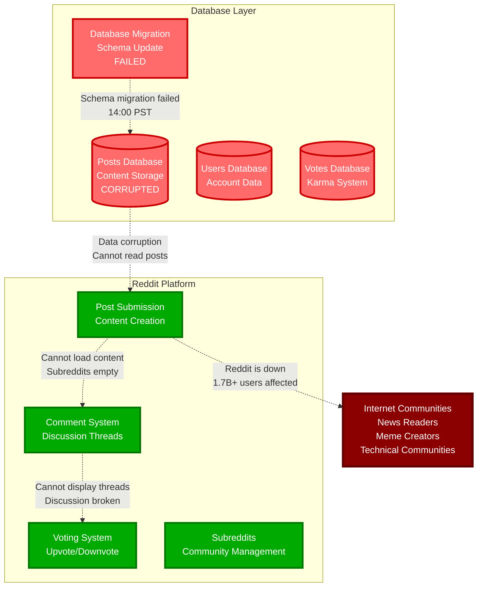

# Reddit Global Outage - March 14, 2023

**The 4-Hour Database Migration Failure That Silenced the Internet's Front Page**

## Incident Overview

| **Metric** | **Value** |
|------------|-----------||
| **Date** | March 14, 2023 |
| **Duration** | 4 hours |
| **Impact** | Complete platform unavailable |
| **Users Affected** | 1.7B+ monthly users |
| **Financial Impact** | $100M+ in lost engagement and ad revenue |
| **Root Cause** | Database migration failure |
| **MTTR** | 240 minutes |
| **Key Issue** | Data corruption during migration |
| **Services Down** | All subreddits, comments, voting, messaging |

## The Bottom Line

**This incident showed that database migrations on platforms with billions of records require extensive testing and rollback procedures.**

**Key Takeaways:**
- Database migrations need staging environments with production-scale data
- Schema changes on billion-record tables require careful planning
- Community platforms have zero tolerance for extended downtime
- Migration rollback procedures must be tested and ready

---

*"In social platforms, database migrations don't just affect data - they affect conversations."*