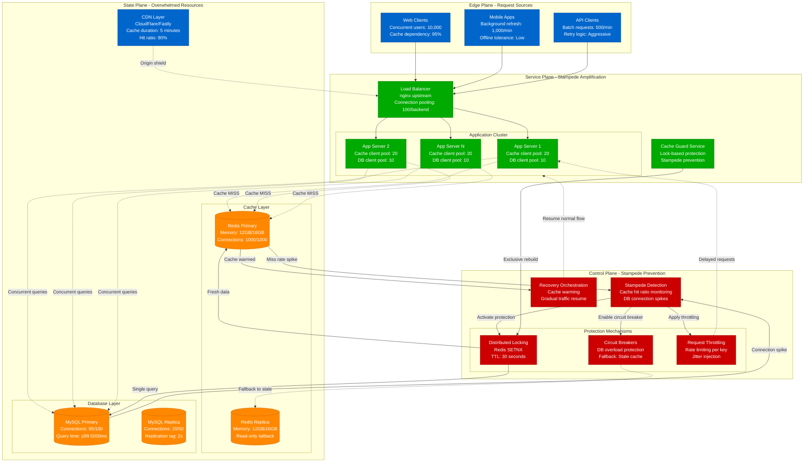

# Cache Stampede Emergency Response

> **3 AM Emergency Protocol**: Cache stampedes can overwhelm databases in seconds when cached data expires. This diagram shows how to detect and mitigate stampedes before they cause cascading failures.

## Quick Detection Checklist
- [ ] Monitor cache miss rates: `redis-cli info stats | grep keyspace_misses`
- [ ] Check database connection spike: `show processlist` for MySQL, `pg_stat_activity` for PostgreSQL
- [ ] Watch for stampede pattern: Sudden 10x increase in database queries
- [ ] Alert on cache hit ratio drop: `hit_ratio < 80%` when normally `> 95%`

## Cache Stampede Detection and Mitigation



## 3 AM Emergency Response Commands

### 1. Stampede Detection (30 seconds)
```bash
# Check cache hit ratio
redis-cli info stats | grep -E "(keyspace_hits|keyspace_misses)"
# Calculate hit ratio: hits / (hits + misses)

# Monitor database connections
mysql -e "SHOW PROCESSLIST;" | wc -l
# or for PostgreSQL:
psql -c "SELECT count(*) FROM pg_stat_activity WHERE state = 'active';"

# Check application logs for cache misses
kubectl logs -l app=backend --since=2m | grep -c "cache miss"
```

### 2. Emergency Stampede Breaking (60 seconds)
```bash
# Enable stampede protection immediately
redis-cli CONFIG SET maxclients 5000  # Increase connection limit
redis-cli CONFIG SET timeout 30       # Reduce idle timeouts

# Implement distributed locking for expensive queries
redis-cli SET "lock:expensive_query" "locked" EX 30 NX
# Returns OK if lock acquired, nil if already locked

# Scale up cache replicas for read distribution
kubectl scale deployment redis-replica --replicas=3
```

### 3. Database Protection (90 seconds)
```bash
# Enable read-only mode if primary is overwhelmed
mysql -e "SET GLOBAL read_only = ON;"

# Kill long-running queries causing stampede
mysql -e "SELECT id, time, info FROM information_schema.processlist WHERE time > 30;"
mysql -e "KILL [query_id];"  # For each long-running query

# Route reads to replicas
kubectl patch service mysql-service -p '{"spec":{"selector":{"role":"replica"}}}'
```

## Stampede Pattern Recognition

### Classic Cache Expiration Stampede
```
Time    Cache_Hits    Cache_Misses    DB_Connections    Response_Time
10:00   950/min       50/min          10                100ms
10:01   900/min       100/min         15                120ms
10:02   500/min       500/min         50                500ms
10:03   100/min       900/min         95                5000ms    # STAMPEDE
10:04   50/min        950/min         100               TIMEOUT   # OVERLOAD
```

### Hot Key Expiration Pattern
```
Key: "user:profile:popular_user_123"
Access Rate: 1000 req/sec
Expiration: 10:00:00 UTC

10:00:00 - Key expires
10:00:01 - 1000 concurrent cache misses
10:00:01 - 1000 concurrent DB queries for same data
10:00:05 - Database overwhelmed, queries timeout
10:00:10 - Cascading failure to other operations
```

## Error Message Patterns

### Redis Connection Exhaustion
```
ERROR: Redis connection pool exhausted
PATTERN: ERR max number of clients reached
LOCATION: /var/log/redis/redis-server.log
ACTION: Increase maxclients, implement connection pooling
COMMAND: redis-cli CONFIG SET maxclients 10000
```

### Database Connection Spike
```
ERROR: Too many connections
PATTERN: "ERROR 1040 (HY000): Too many connections"
LOCATION: MySQL error log, application logs
ACTION: Kill long queries, enable read-only mode
COMMAND: mysql -e "SET GLOBAL max_connections = 200;"
```

### Cache Miss Storm
```
ERROR: Cache miss rate exceeding threshold
PATTERN: hit_ratio dropped from 95% to 10%
LOCATION: Application metrics, Redis INFO stats
ACTION: Implement cache warming, distributed locking
MONITORING: rate(redis_keyspace_misses_total[1m])
```

## Stampede Prevention Strategies

### Distributed Locking Pattern
```python
# Python Redis lock implementation
import redis
import time

def cache_with_lock(cache_key, expensive_function, ttl=300):
    r = redis.Redis()

    # Try to get from cache first
    cached_value = r.get(cache_key)
    if cached_value:
        return cached_value

    # Acquire lock for cache rebuilding
    lock_key = f"lock:{cache_key}"
    lock_acquired = r.set(lock_key, "1", nx=True, ex=30)

    if lock_acquired:
        try:
            # Only one process rebuilds cache
            new_value = expensive_function()
            r.setex(cache_key, ttl, new_value)
            return new_value
        finally:
            r.delete(lock_key)
    else:
        # Other processes wait and retry
        time.sleep(0.1)
        return r.get(cache_key) or expensive_function()
```

### Probabilistic Early Expiration
```python
import random
import time

def get_with_early_expiration(cache_key, ttl=300, beta=1.0):
    r = redis.Redis()

    # Get value and its creation time
    cached_data = r.hmget(cache_key, ['value', 'created'])
    if not cached_data[0]:
        return None

    # Calculate early expiration probability
    age = time.time() - float(cached_data[1])
    early_expiry_threshold = ttl * beta * random.random()

    if age > early_expiry_threshold:
        # Trigger early refresh to prevent stampede
        return None

    return cached_data[0]
```

### Jittered Cache Expiration
```python
import random

def set_with_jitter(cache_key, value, base_ttl=300, jitter_range=60):
    r = redis.Redis()

    # Add random jitter to prevent synchronized expiration
    jittered_ttl = base_ttl + random.randint(-jitter_range, jitter_range)
    r.setex(cache_key, jittered_ttl, value)
```

## Recovery Procedures

### Phase 1: Immediate Protection (0-2 minutes)
- [ ] Enable distributed locking for hot keys
- [ ] Increase Redis connection limits
- [ ] Route reads to cache replicas
- [ ] Enable database read-only mode if necessary

### Phase 2: Cache Warming (2-10 minutes)
- [ ] Identify most frequently accessed keys
- [ ] Pre-populate cache with fresh data
- [ ] Implement staggered cache expiration
- [ ] Monitor hit ratios during warming

### Phase 3: Traffic Restoration (10-30 minutes)
- [ ] Gradually increase cache TTL values
- [ ] Remove read-only database restrictions
- [ ] Monitor for stampede recurrence
- [ ] Validate response times return to baseline

## Cache Warming Strategies

### Proactive Cache Warming
```bash
# Warm most popular cache keys
redis-cli --scan --pattern "user:profile:*" | head -1000 | while read key; do
    # Trigger cache refresh for each key
    curl -s "http://api/internal/cache/warm/$key"
done
```

### Background Cache Refresh
```yaml
# Kubernetes CronJob for cache warming
apiVersion: batch/v1
kind: CronJob
metadata:
  name: cache-warmer
spec:
  schedule: "*/5 * * * *"  # Every 5 minutes
  jobTemplate:
    spec:
      template:
        spec:
          containers:
          - name: cache-warmer
            image: cache-warmer:latest
            command: ["python", "warm_cache.py"]
            env:
            - name: REDIS_URL
              value: "redis://redis-cluster:6379"
```

## Real-World Stampede Incidents

### Reddit Hot Post Stampede (2020)
- **Trigger**: Viral post cache expiration during peak traffic
- **Impact**: 50x database load spike, 30-second response times
- **Resolution**: Distributed locking + staggered expiration
- **Prevention**: Probabilistic early expiration implemented

### Instagram Feed Stampede (2019)
- **Trigger**: Celebrity post invalidated millions of timeline caches
- **Impact**: Feed generation database overwhelmed
- **Resolution**: Circuit breakers + stale data serving
- **Prevention**: Multi-layer caching with different TTLs

### Twitter Timeline Stampede (2018)
- **Trigger**: Trending topic caused synchronized cache misses
- **Impact**: Timeline service degradation for 15 minutes
- **Resolution**: Cache warming + request coalescing
- **Prevention**: Jittered expiration + background refresh

---
*Last Updated: Based on Reddit, Instagram, Twitter stampede incidents*
*Next Review: Monitor for new hot key patterns and mitigation strategies*